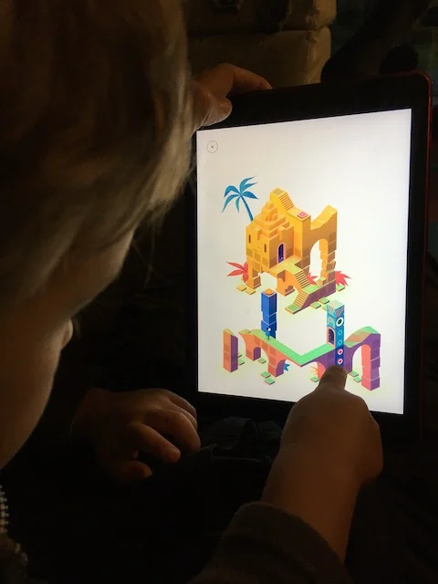

Un'estetica visiva e sonora capolavoro per un videogioco di enigmi visuali che sembrano usciti dai disegni di Escher.  
Una bambina in cerca della sua storia in un mondo affascinante e davvero godibile anche per i più piccoli

(il gioco l'ha finito Bruno a 4 anni (con l'aiuto del fratellone)

> [!tip] Fabio
> rompe le leggi della fisica ed è difficile
