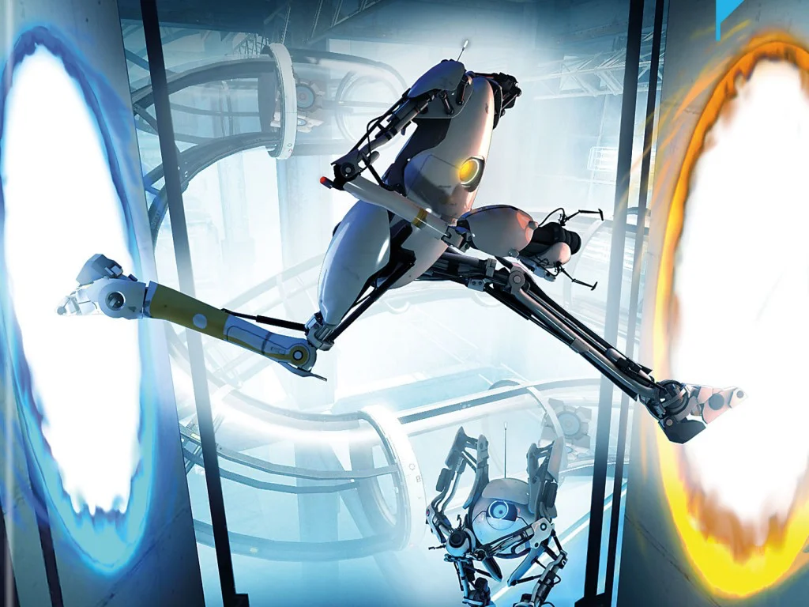

 

Un gioco di 10 anni fa ma che è ancora attualissimo e davvero educativo:
avanzare nella storia (bellissima, tra l'altro, con grafica e musica capolavoro) creando dei "portali" tra pareti e pavimenti.

I ragazzi svilupperanno un senso della spazialità impressionante.

E l'editor di livelli originali potrebbe essere il primo ingresso nel mondo dell'architettura 3D e invenzione di enigmi logici e di percezione

> [!tip] Fabio
> puoi costruire mondi e giocarli. la grafica è bellissima e vorrei tanto avere davvero una pistola a portali

