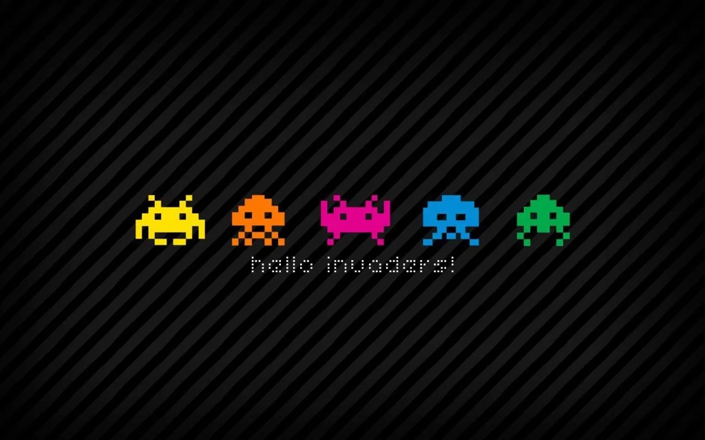

tutti i videogiochi degli anni '80 sono semplici e hanno fatto la storia.
quelli degli anni '90 hanno fatto scuola per tutto quello che è venuto dopo.  

un tuffo nel passato oggi lo si può fare , gratuitamente e da browser, su qualsiasi pc, grazie ai numerosi emulatori.

> [!tip] Fabio
> sono molto semplici rispetto a quelli di oggi, ci sono meno cose, ma forse è il loro bello. e non sono per questo meno difficili.

