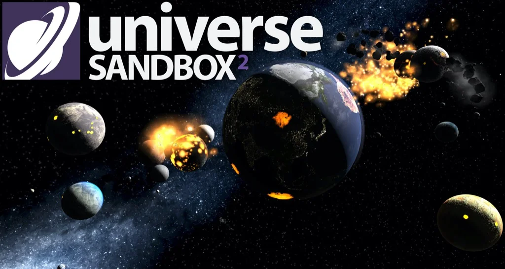

Un simulatore di Universo, dove poter sperimentare con tutte le variabili che regolano l'astrofisica, e vedere cosa succede, ad esempio puoi aggiungere un pianeta, una seconda luna, far entrare in collisione corpi celesti.. addirittura galassie!

> *Fabio:*
> Ho allontanato la terra dal sole!
