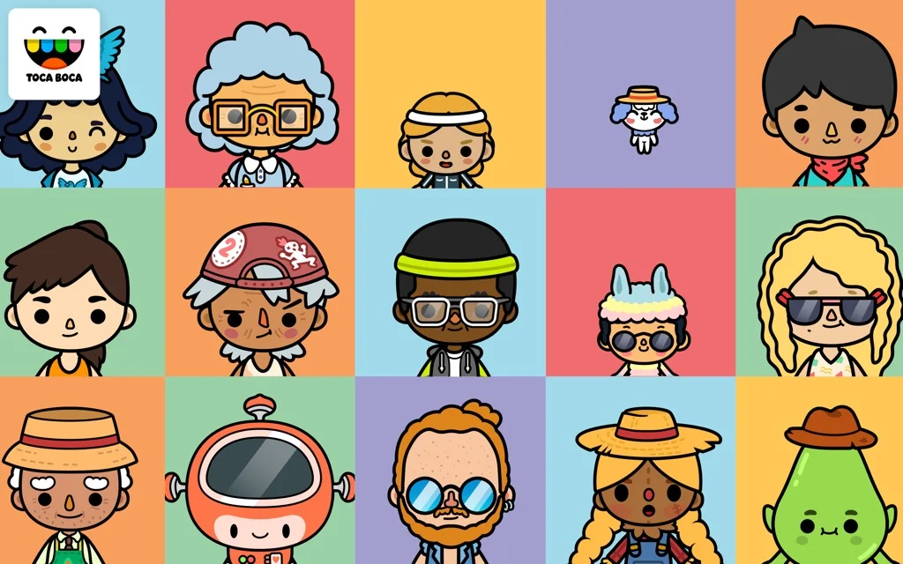
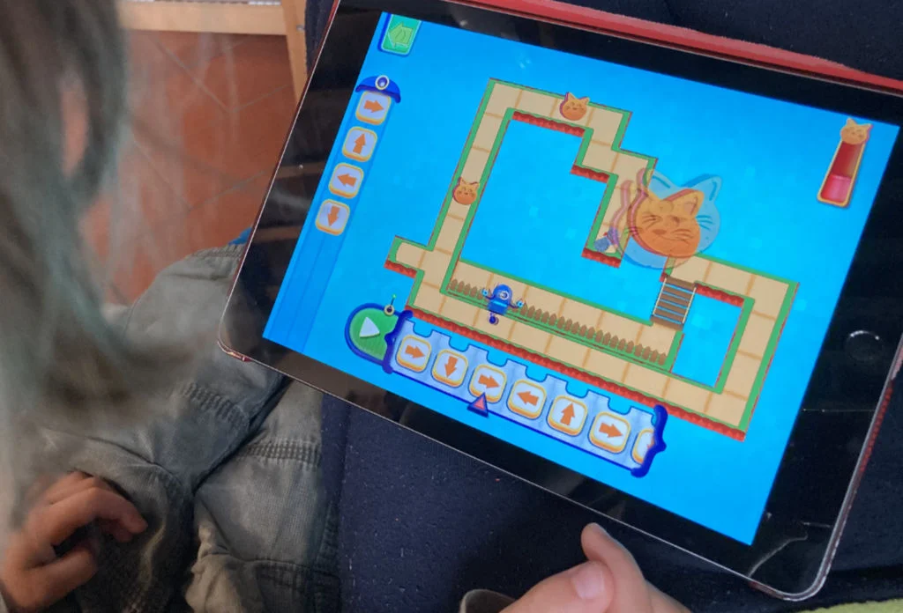
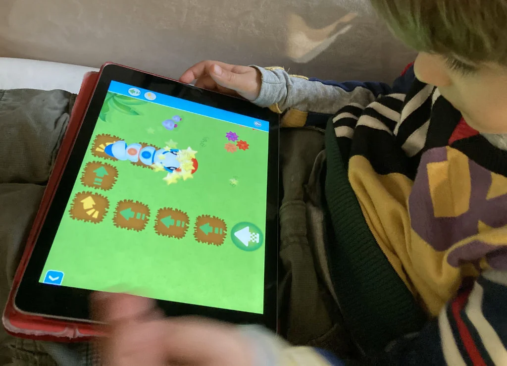
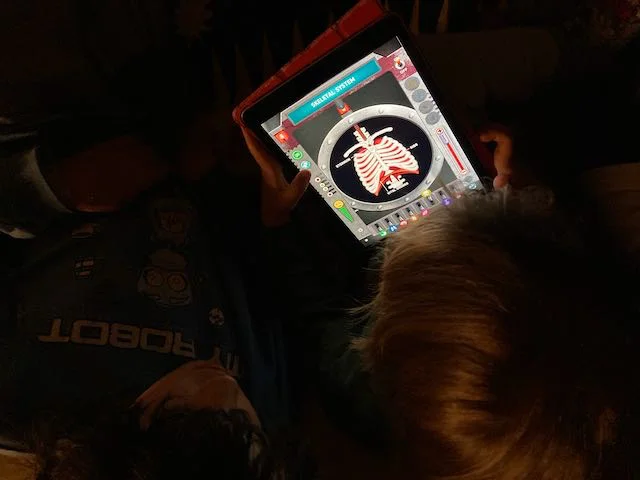

Sono ormai migliaia le app e i giochi che vorrei che mio figlio giocasse il più possibile sul tablet (sia iOs che Android)

Il mio consiglio è di cercare nelle categorie Kids o Education e preferire le app a pagamento (costano in media 4 euro), così che non hanno assolutamente pubblicità né contenuti nascosti.

Ci sono studi che sono specializzati in questo genere di app (consiglio ad esempio tutti i Toca Boca [tocaboca.com](https://tocaboca.com/apps/), Tiny Bop [tinybop.com](https://tinybop.com/apps), i Learny Land

TODO/fix
sul mio sito avevamo iniziato a recensire qualche gioco, potete vedere su [stefanocecere.com/ludosofia/videogiochi/tablet-kids/](https://stefanocecere.com/ludosofia/videogiochi/tablet-kids/)  

> *Fabio:*
> ho imparato a lavare i piatti.  

{: style="height:300px"}

{: style="height:300px"}
Code the Robot - Save the Cat (Learny Land)

{: style="height:300px"}
ThinkLearn - Code a Pillar (Fischer Prize)

{: style="height:300px"}
How does the Human Body work?
