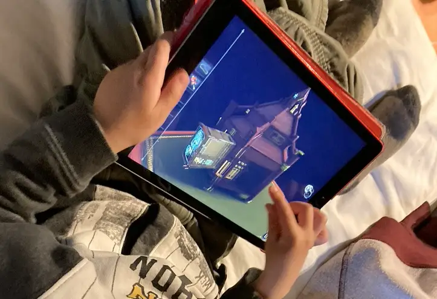

La serie The Room sono 4 titoli, per tablet sopratutto, giocabili anche su smartphone e computer, dove bisogna risolvere delgi enigmi logici, meccanici, ambientali, di vario tipo, per andare avanti nella storia.
Ci sono tanti giochi sul genere, ma questi sono eccellenti per qualità.
magari non tutti gli enigmi sono adatti a tutti i bambini, ma lì è bello collaborare insieme.

> [!tip] Fabio li ho finiti tutti e 4 e ora sto facendo il 5 in VR. bellissimi

> [!info] Stefano imprescindibili a chiunque ami le Escape Rooms
