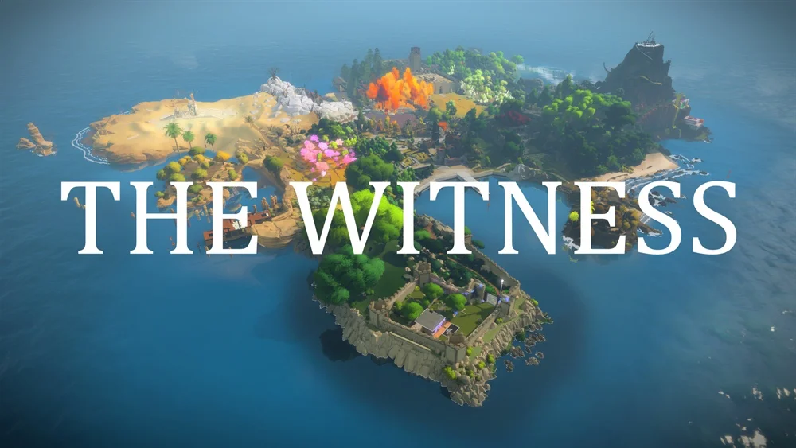
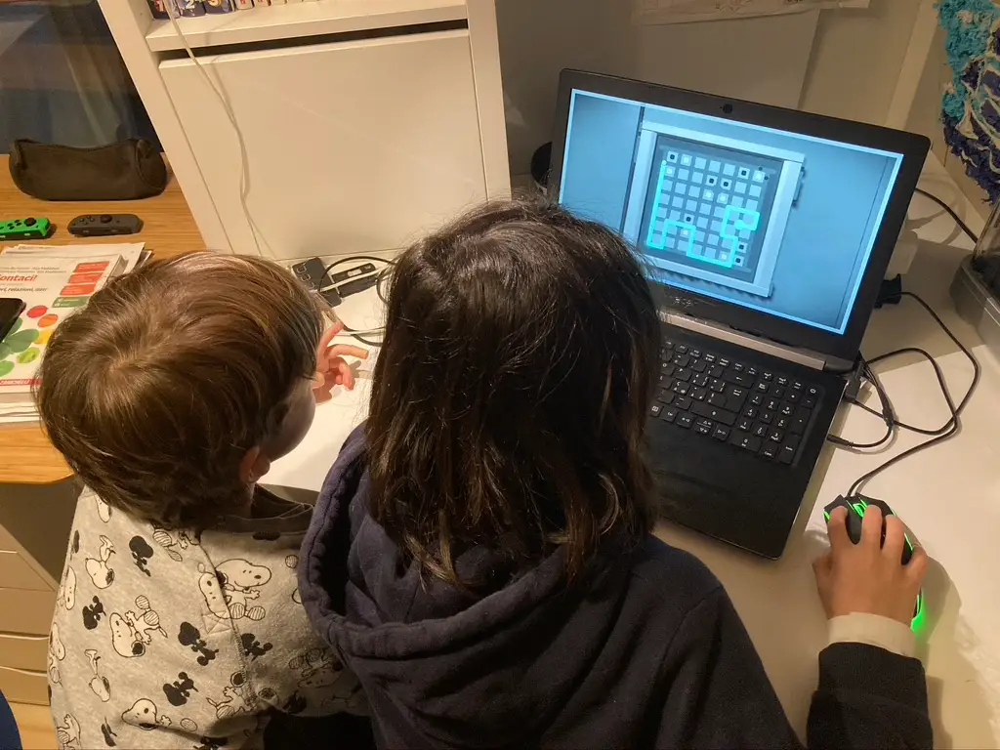
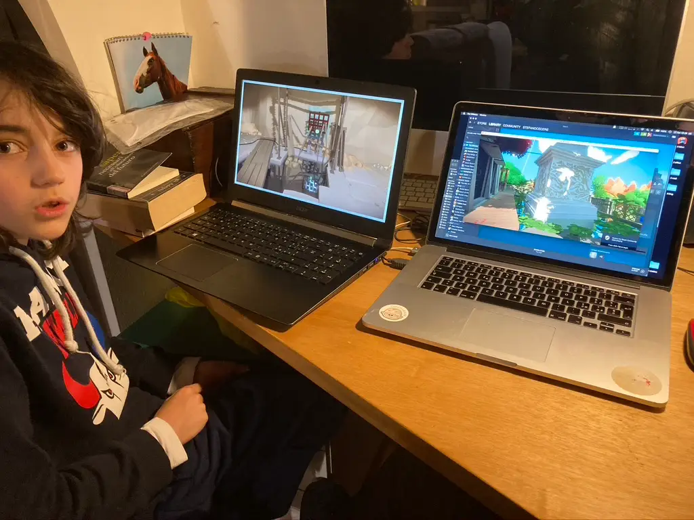

un'avventura tranquillissima, senza una parola scritta.
dove cercare di risolvere i 200 enigmi con la sola forza della mente e della deduzione. e un dito.

> [!tip] Fabio bellissimo. un po' difficile verso la fine

> [!info] Stefano capolavoro. non facilissimo, ma stimola davvero il pensiero laterale, logico, deduttivo
