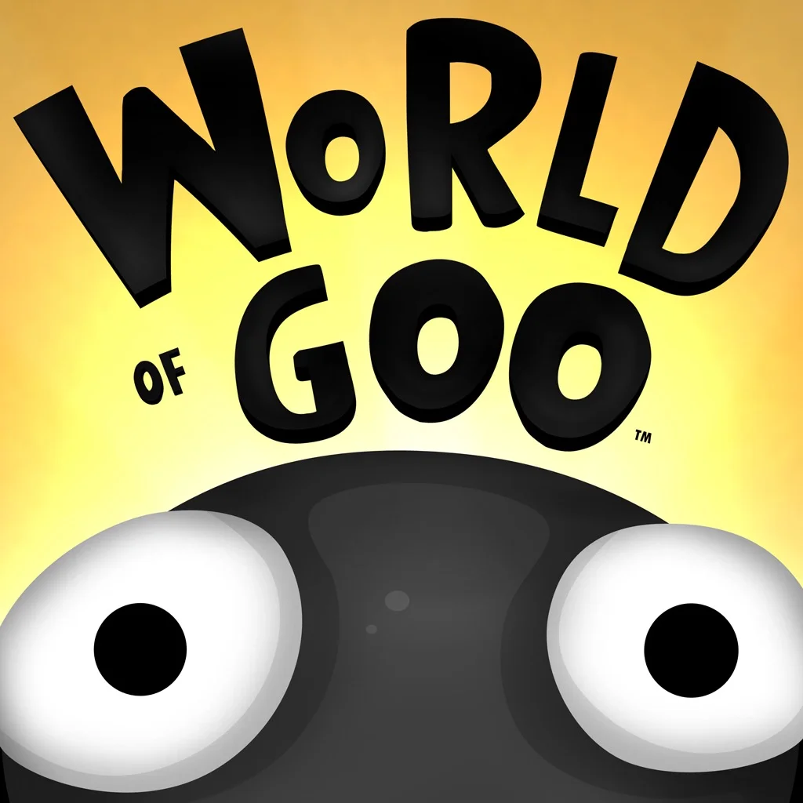
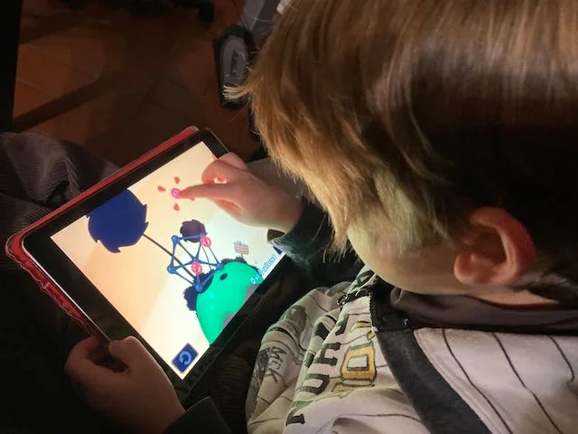

grafica, musica, animazioni, ambientazione e sopratutto livelli crescenti perfetti.

devi inventare il modo di connettere i "goo" per costruire strutture e risolvere i livelli.

> [!info] Stefano ci giocai io, poi Fabio, poi Bruno

