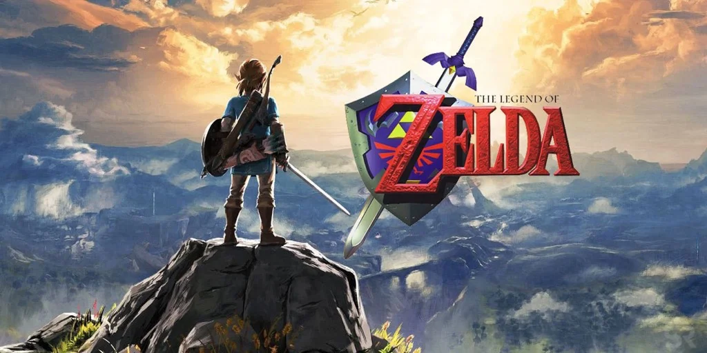

I videogiochi della serie di Zelda hanno accompagnato tre generazioni ormai (il primo titolo è di fine anni '80') diventando di fatto una componente culturale pop davvero universale.

I giochi sono fatti bene, con grandi storie, personaggi, missioni da compiere in mondi infiniti, e colonne sonore che ci fanno i tour mondiali con l'orchestra (siamo andati a sentirne uno! forse l'unico concerto di musica classica che Fabio ha desiderato andarci)

Il bello è che mentre uno gioca, gli altri possono stare a vedere quasi fosse un film fantasy!

E poi ci sono dozzine di libri che si possono leggere intorno.

> *Fabio:*
> mappe infinite, una grande storia (ho letto tutti i fumetti anche) e sopratutto nell'ultimo puoi davvero fare di tutto... anche cucinare! 

> *Stefano:* da giocare insieme. è così ampio che c'è di tutto.
{.boxStefano}
