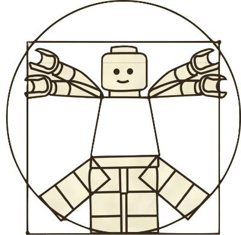
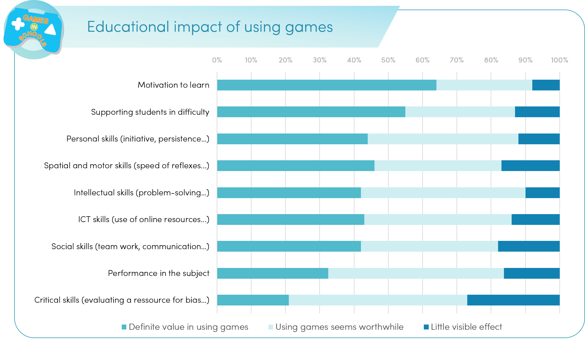

# Digital Game Based Learning
*perché usare i giochi in classe?*

**Obiettivi di apprendimento**
- Definizione di DGBL
- Cos'è il coinvolgimento?
- Come funziona l'apprendimento basato sul gioco
- Quali competenze sviluppa il DGBL?
- I principi di apprendimento della EVG
- Cosa possiamo imparare con la EVG?
- Perché è importante implementare l'EVG?

## ✍️ ATTIVITÀ 1:  Come si insegna e come si impara ad andare in bicicletta?

## 1 - Videogiochi oltre l'entertainment
### Cosa fare oltre l'Entertainment?

- La valorizzazione del **territorio**, sia da un punto di vista turistico che culturale
- L’estensione di esperienze di fruizione di luoghi di **arte, cultura e scienza** (es. musei)
- La **divulgazione di conoscenze** (es. tecniche, specifiche, connesse a valori civici etc)
- L’intervento **psico-pedagogico** per finalità riabilitative, abilitative e di supporto
- L’ambito **educativo** (apprendimento, potenziamento)
- La **formazione e le risorse umane** (es. team building, simulazione e acquisizione di competenze, selezione del personale etc)

## 1 - DGBL

### Che cos'è l'apprendimento basato sui giochi (GBL)?

L'apprendimento basato sui giochi (Game-Based Learning o GBL) è un approccio pedagogico che utilizza giochi o meccaniche di gioco per creare un'esperienza educativa. L'idea è che, attraverso il gioco, gli studenti possano acquisire nuove competenze, esplorare concetti e praticare ciò che hanno imparato in un ambiente che sia coinvolgente e motivante. Ecco alcuni aspetti chiave:

1. **Motivazione:** I giochi sono naturalmente coinvolgenti e possono motivare gli studenti a impegnarsi più profondamente nel materiale didattico.
2. **Pratica Immediata:** I giochi offrono la possibilità di mettere immediatamente in pratica ciò che si apprende, consentendo agli studenti di applicare e testare le nuove conoscenze in un ambiente sicuro.
3. **Feedback Istantaneo:** Molti giochi forniscono feedback immediato sulle decisioni e le azioni del giocatore, aiutando gli studenti a comprendere e correggere gli errori in tempo reale.
4. **Apprendimento Esperienziale:** I giochi possono fornire esperienze simulate che permettono agli studenti di esplorare concetti e situazioni che potrebbero non essere facilmente accessibili nella realtà.
5. **Sviluppo di Competenze Trasversali:** Oltre alla materia specifica, i giochi possono aiutare a sviluppare competenze come il pensiero critico, la pianificazione, la strategia, la collaborazione e la presa di decisioni.
6. **Personalizzazione:** Molti giochi educativi permettono un percorso di apprendimento personalizzato, adattandosi ai bisogni e ai progressi individuali degli studenti.
7. **Incorporazione di Meccaniche di Gioco:** Non tutti gli ambienti di apprendimento basati sui giochi devono essere videogiochi completi. Alcune piattaforme educative possono incorporare meccaniche di gioco, come punteggi, livelli e sfide, per migliorare l'engagement e la motivazione.

📽 

### Che cos'è il DGBL?

Il "Digital Game-Based Learning" (DGBL) è una sottocategoria dell'apprendimento basato sui giochi (GBL) che si concentra specificamente sull'uso di videogiochi digitali per raggiungere obiettivi educativi. Mentre il GBL può includere qualsiasi tipo di gioco, come giochi da tavolo o attività di gioco fisico, il DGBL si concentra esclusivamente su quelli digitali.

Ecco alcune caratteristiche e vantaggi specifiche del DGBL, da aggiungere a quelle già elencate del GBL:

1. **Interattività:** I videogiochi digitali offrono un livello di interattività che può essere difficile da replicare con altri metodi. Gli studenti possono esplorare, sperimentare e interagire direttamente con il materiale di apprendimento.

2. **Adattabilità:** Molti videogiochi educativi digitali possono adattarsi automaticamente al livello di competenza dello studente, offrendo sfide appropriate e fornendo feedback personalizzato.

3. **Immersività:** I videogiochi possono creare mondi e scenari ricchi e dettagliati, permettendo agli studenti di immergersi completamente in un ambiente di apprendimento.

5. **Accessibilità:** Con la crescente diffusione di dispositivi digitali, come tablet, computer e smartphone, l'apprendimento basato su videogiochi digitali può avvenire ovunque e in qualsiasi momento, rendendo l'istruzione più accessibile.

7. **Raccolta di Dati:** I videogiochi digitali possono tracciare e registrare le azioni degli studenti, fornendo dati preziosi agli educatori sulla progressione dell'apprendimento, le aree di difficoltà e i successi.

### Vantaggi del DGBL

il Digital Game-Based Learning ha il potenziale di trasformare l'esperienza educativa, rendendola più coinvolgente, reattiva e adattata alle esigenze individuali degli studenti. Gli insegnanti possono sfruttare questi vantaggi:

1. **Aumento della Motivazione:**
   
   * **Intrinsecamente Gratificante:** Molti videogiochi sono progettati per essere gratificanti, offrendo premi, progressi visibili e riconoscimenti. Questa gratificazione intrinseca può tradursi in un aumento della motivazione degli studenti nell'apprendimento.
   
   * **Ambiente Sicuro per la Sperimentazione:** I videogiochi offrono un ambiente in cui gli errori non hanno ripercussioni reali, permettendo agli studenti di sperimentare, esplorare e prendere rischi, il che può aumentare la loro voglia di apprendere e di provare nuove strategie.
   
   * **Elementi Competitivi e Collaborativi:** Molti giochi incoraggiano la sana competizione o la collaborazione, entrambi fattori che possono aumentare la motivazione attraverso la socialità, l'interazione, la comunicazione e la risoluzione di problemi in gruppo.

2. **Fornire Feedback Immediato:**

   * **Risposte in Tempo Reale:** A differenza delle tradizionali impostazioni didattiche in cui il feedback può essere ritardato, i videogiochi forniscono risposte immediate sulle azioni del giocatore. Questo permette agli studenti di adattare rapidamente le loro strategie e apprendere dai loro errori.

   * **Visualizzazione del Progresso:** Molti videogiochi mostrano chiaramente il progresso dell'utente attraverso punteggi, livelli o altri indicatori. Ciò può aiutare gli studenti a vedere e comprendere il loro percorso di apprendimento.
   
   * **Feedback Differenziato:** A seconda delle scelte e delle azioni del giocatore, i videogiochi possono fornire feedback specifici, aiutando gli studenti a focalizzarsi su aree di miglioramento particolari.

3. **Personalizzazione dell'Apprendimento:**

   * **Percorsi Adattivi:** Molti videogiochi educativi si adattano al livello di competenza dell'utente, offrendo sfide appropriate. Questo significa che ogni studente può progredire al proprio ritmo, ricevendo sfide e supporto ottimizzati per le proprie esigenze.

   * **Scegliere il Proprio Percorso:** Molti giochi offrono percorsi multipli o decisioni che influenzano l'esito del gioco. Questo può permettere agli studenti di esplorare diversi approcci e percorsi di apprendimento, personalizzando la loro esperienza.

   * **Stili di Apprendimento Diversi:** I videogiochi possono offrire diversi modi di presentare informazioni, dal testo, alla voce, alla grafica, soddisfacendo così una varietà di stili di apprendimento.

### Principi di Apprendimento nei Videogiochi
Richard Van Eck, uno degli esperti nel campo del Digital Game-Based Learning (DGBL), ha identificato 16 principi di apprendimento che sono spesso presenti nei videogiochi e che possono essere utilizzati per promuovere l'apprendimento efficace. Questi principi, se incorporati nel design dei giochi educativi, possono rendere il DGBL un'esperienza d'apprendimento particolarmente potente.

1. **Problem-solving:** I giochi spesso presentano ai giocatori problemi complessi da risolvere, promuovendo il pensiero critico.
2. **Modeling:** I giochi possono fornire modelli di comportamento o di processi che gli studenti possono emulare.
3. **Role-playing:** Giocando in diversi ruoli, gli studenti possono esplorare diverse prospettive e contesti.
4. **Feedback immediato:** I giocatori ricevono spesso feedback immediato sulle loro azioni, il che consente un'apprendimento e una correzione rapidi.
5. **Ripetizione e pratica:** I giochi permettono e spesso richiedono pratica ripetuta, che è fondamentale per la padronanza di molte competenze.
6. **Controllo attivo:** I giocatori hanno un controllo diretto sulle loro azioni e decisioni, promuovendo un apprendimento attivo.
7. **Situational learning:** L'apprendimento avviene in un contesto specifico o in un ambiente simulato, rendendolo spesso più rilevante e applicabile.
8. **Progressive learning:** Molte volte, i giochi introducono concetti progressivamente, costruendo su ciò che il giocatore ha già appreso.
9. **Mental modeling:** I giochi possono aiutare gli studenti a costruire e testare modelli mentali di concetti o sistemi.
10. **Goal-oriented learning:** I giochi spesso presentano obiettivi chiari che guidano l'apprendimento e la motivazione.
11. **Adaptive learning:** Alcuni giochi si adattano al livello di competenza del giocatore, fornendo sfide appropriate.
12. **Safe environment:** I giochi offrono un ambiente in cui gli errori non hanno conseguenze reali, incoraggiando la sperimentazione.
13. **Cognitive complexity:** I giochi possono presentare problemi complessi che richiedono diverse forme di pensiero e strategia.
14. **Engagement:** I design ben progettati sono intrinsecamente motivanti e coinvolgenti.
15. **Individual pacing:** Molti giochi permettono ai giocatori di apprendere al proprio ritmo.
16. **Social learning:** Molti giochi includono o incoraggiano la collaborazione e l'apprendimento sociale.

È importante notare che non tutti i videogiochi incorporeranno tutti questi principi, e non tutti i principi saranno rilevanti per ogni contesto educativo. Tuttavia, questi principi evidenziano il potenziale dei videogiochi come strumenti d'apprendimento efficaci quando sono ben progettati e integrati in un curriculum.

### Flusso di apprendimento

Il flusso di apprendimento nel Digital Game-Based Learning può essere concepito come un ciclo continuo di istruzione, apprendimento e valutazione, che si rafforza e si ripete man mano che gli studenti avanzano nel gioco. Ecco come funziona:

#### Istruzione (Instruction)
- **Introduzione al Contesto:** Prima che il gioco inizi veramente, gli studenti vengono introdotti al contesto del gioco, alla sua narrativa e ai suoi obiettivi.
- **Guida e Tutorial:** I giochi spesso includono tutorial o sessioni di formazione che aiutano gli studenti a familiarizzare con le meccaniche del gioco e con le competenze o i concetti che dovranno utilizzare.
- **Obiettivi Chiari:** Gli obiettivi di apprendimento vengono incorporati come missioni o sfide all'interno del gioco, guidando gli studenti su cosa devono fare e su cosa devono imparare.

#### Apprendimento (Learning)
- **Esplorazione Autonoma:** Una volta comprese le basi, gli studenti sono liberi di esplorare, sperimentare e interagire con l'ambiente di gioco. Questo favorisce l'apprendimento autonomo e la scoperta.
- **Feedback Continuo:** Mentre giocano, gli studenti ricevono feedback continuo sulle loro azioni, che può essere immediato (come punti o suoni) o più elaborato (come spiegazioni o suggerimenti).
- **Applicazione Pratica:** I giochi permettono agli studenti di applicare ciò che hanno imparato in scenari realistici, rafforzando la comprensione e la memoria.

#### Valutazione (Assessment)
- **Valutazioni Incorporate:** Molti giochi includono sfide o quiz che testano la comprensione dello studente sui concetti insegnati, fungendo da valutazioni integrate.
 - **Risultati e Progressi:** I progressi dell'alunno possono essere tracciati attraverso i livelli completati, i punti accumulati o altri indicatori di successo nel gioco.
- **Riflessione e Analisi:** Dopo aver completato determinate fasi o il gioco intero, gli studenti possono essere incoraggiati a riflettere sulle loro esperienze, sulle decisioni prese e sulle lezioni apprese.
- **Feedback Docente:** Oltre al feedback incorporato nel gioco, gli insegnanti possono fornire feedback aggiuntivo, discutere degli errori e guidare gli studenti nella comprensione dei concetti più profondi.

Dopo la valutazione, il ciclo può ricominciare con ulteriori istruzioni o con un livello di difficoltà più elevato, guidando gli studenti attraverso cicli ripetuti di istruzione, apprendimento e valutazione all'interno del contesto di gioco. Questa struttura ciclica è progettata per rafforzare la comprensione, promuovere la padronanza e mantenere elevata la motivazione degli studenti.

## 2 - Coinvolgimento

### Coinvolgimento

### Flusso
Lo stato di "flow", anche noto come "esperienza ottimale", è un concetto introdotto dallo psicologo Mihaly Csikszentmihalyi. È uno stato mentale in cui una persona è completamente immersa in ciò che sta facendo, caratterizzata da un senso di energia, pieno coinvolgimento e piacere nell'attività. Durante lo stato di flow, le persone spesso perdono la cognizione del tempo e si sentono disconnesse dalle preoccupazioni esterne.

Csikszentmihalyi ha identificato vari elementi o condizioni che tendono ad accompagnare l'esperienza di flow:

1. **Equilibrio tra abilità e sfida:** Lo stato di flow si verifica spesso quando c'è un equilibrio tra le abilità di una persona e la sfida che sta affrontando. La sfida non deve essere né troppo facile (che può portare a noia) né troppo difficile (che può causare ansia).
2. **Concentrazione intensa sull'attività corrente:** Durante lo stato di flow, l'attenzione è completamente focalizzata sull'attività in corso, escludendo le distrazioni.
3. **Perdita della consapevolezza di sé:** La persona può perdere la consapevolezza di sé come entità separata e sentirsi completamente integrata nell'attività.
4. **Distorsione del senso del tempo:** Molte persone riferiscono che il tempo sembra passare molto velocemente quando sono in uno stato di flow.
5. **Feedback immediato:** La persona sa in ogni momento come sta andando e può regolare le sue azioni di conseguenza.
6. **Senso di controllo:** Anche se l'attività può essere sfidante, durante lo stato di flow, le persone spesso sentono di avere un controllo completo su ciò che stanno facendo.
7. **L'attività è intrinsecamente gratificante:** Anche senza ricompense esterne, l'attività in sé è vista come valevole e soddisfacente.
8. **Senso di chiarezza:** La persona sa esattamente cosa fare e come farlo.

Lo stato di flow è stato osservato in una varietà di attività, dai giochi, alla musica, allo sport, all'arte e al lavoro. Csikszentmihalyi sostiene che coltivare esperienze di flow può aumentare la qualità della vita, poiché questi momenti sono spesso associati a sensazioni di felicità, soddisfazione e realizzazione.

#### Impostare le condizioni per il flusso: trasformazione, non punteggi

Il flusso richiede uno sforzo. Senza apprendimento, pratica e sfida, non c'è flusso.
I giochi sono motori di apprendimento piacevoli che offrono un'esperienza profondamente e intrinsecamente motivante. Con il tempo si imparano e assorbono le regole, si costruiscono le proprie abilità, si affrontano sfide sempre più grandi e nel frattempo ci si trasforma in un modo significativo.

E proprio come la trasformazione del personaggio è la spina dorsale di un grande storia, così la trasformazione personale è la spina dorsale del giocare.

Nei giochi, *noi* siamo il protagonista, la persona dotata di potere, che affronta una serie di scelte e sfide lungo un viaggio verso la maestria.

Le metriche di progresso (punteggio, livelli, classifiche) sono la ciliegina sulla torta dell'apprendimento/padronanza, sono indicatori che aiutano a valutare la propria posizione e i progressi compiuti, ma non hanno senso senza qualcosa in cui migliorare, qualche abilità da sviluppare.

**È questo che rende i giochi veramente coinvolgenti.** 

> Per rendere le sessioni di apprendimento avvincenti a lungo termine, bisogna dimenticare il punteggio e pensare alla trasformazione del personaggio, alla costruzione di abilità e alla padronanza degli elementi in gioco.

### Motivazione

La motivazione è la forza che sta alla base delle prestazioni umane. Può derivare da bisogni fisiologici o psicologici, da pensieri o emozioni. I bisogni fisiologici ci aiutano a preservare un funzionamento fisico ottimale, mentre quelli psicologici ci aiutano a prosperare.

La fonte della motivazione può provenire da noi stessi o essere esterna a noi, ed è importante conoscerla perché sia il gioco che l'apprendimento hanno a che fare con la motivazione.

📽 [The puzzle of motivation | Dan Pink](https://youtu.be/rrkrvAUbU9Y)
#### Motivazione Estrinseca
La motivazione estrinseca si riferisce a comportamenti che sono guidati da ricompense esterne o dall'evitare punizioni. In altre parole, una persona è motivata estrinsecamente quando compie un'azione non perché trova piacevole o significativa l'azione in sé, ma perché è spinta da fattori esterni.

**Esempi di motivazione estrinseca:**

1. **Compiti Scolastici e Voti:** Un studente potrebbe studiare duramente per un esame non perché è veramente interessato all'argomento, ma perché vuole ottenere un buon voto. Il voto, in questo caso, è la ricompensa esterna.
2. **Lavoro e Salario:** Un individuo potrebbe svolgere un lavoro che non gli piace o che non trova particolarmente appagante perché ha bisogno dello stipendio. Il pagamento è il fattore estrinseco che lo motiva a continuare.
3. **Premi e Riconoscimenti:** Un atleta potrebbe partecipare a una competizione con l'obiettivo principale di vincere un trofeo o una medaglia, piuttosto che per il puro amore dello sport.
4. **Evitare Punizioni:** Un bambino potrebbe fare i compiti a casa non perché trova piacevole l'attività, ma perché vuole evitare di essere rimproverato dai genitori o dal docente.
5. **Sconti e Promozioni:** Un cliente potrebbe acquistare un prodotto non perché lo desidera veramente, ma perché è in offerta o perché riceverà un altro prodotto gratuitamente con l'acquisto.
6. **Status e Approvazione Sociale:** Una persona potrebbe acquistare un'auto di lusso o indossare abiti costosi non per un genuino interesse personale, ma per impressionare gli altri e ottenere riconoscimento o status sociale.

#### Motivazione Intrinseca
La motivazione intrinseca si riferisce all'azione o al comportamento che viene eseguito per il piacere o la soddisfazione derivante dall'attività stessa, indipendentemente da fattori esterni.

**Esempi di motivazione intrinseca:**

1. **Passione per un Hobby:** Una persona che dipinge, suona uno strumento musicale o scrive per il puro piacere di farlo, senza aspettarsi una ricompensa finanziaria o l'approvazione degli altri.
2. **Curiosità:** Uno studente che si dedica alla ricerca su un argomento specifico non per un compito scolastico ma perché è genuinamente interessato e vuole saperne di più.
3. **Amore per lo Sport:** Un atleta che pratica uno sport non per vincere medaglie o riconoscimenti, ma perché si diverte e ama la sensazione che gli dà.
4. **Gioia per l'Apprendimento:** Un individuo che segue corsi online o legge libri su nuovi argomenti semplicemente perché trova appagante imparare nuove cose.
5. **Sfida Personale:** Una persona che decide di scalare una montagna o correre una maratona per la sensazione di realizzazione e l'esperienza in sé, piuttosto che per un premio o una medaglia.
6. **Autoespressione:** Qualcuno che scrive poesie, racconti o tiene un diario perché trova appagante esprimere i propri pensieri e sentimenti, senza necessariamente avere l'intenzione di pubblicarli.
7. **Giochi e Puzzles:** Molte persone giocano a giochi da tavolo, risolvono rompicapi o giocano a videogiochi semplicemente per il piacere della sfida e del gioco in sé, senza una ricompensa esterna.

Altri esempi pratici di motivazione intrinseca:   
- **imparare una nuova lingua** perché vi piace sperimentare cose nuove, non perché il vostro lavoro lo richiede
- **passare del tempo con qualcuno** perché vi piace la sua compagnia e non perché può favorire la vostra posizione sociale
- **pulire** perché vi piace avere uno spazio ordinato piuttosto che farlo per non far arrabbiare il vostro coniuge
- fare **esercizio fisico** perché vi piace mettere alla prova il vostro corpo, invece di farlo per perdere peso o per adattarvi a un vestito
- fare **volontariato** perché vi sentite soddisfatti e appagati, invece di doverlo fare per soddisfare un requisito scolastico o lavorativo
- assumere maggiori responsabilità sul **lavoro** perché vi piace essere messi alla prova e sentirvi realizzati, piuttosto che per ottenere un aumento o una promozione

#### Estrinseca vs Intrinseca
La motivazione estrinseca non è necessariamente negativa o meno valida della motivazione intrinseca. In molte situazioni, la motivazione estrinseca può essere un mezzo efficace per incoraggiare comportamenti desiderati o per raggiungere obiettivi specifici. Tuttavia, è spesso considerata meno sostenibile nel lungo termine rispetto alla motivazione intrinseca, che proviene da un interesse o passione genuina per l'attività.
La motivazione intrinseca è spesso associata a una maggiore soddisfazione, apprendimento più profondo e maggiore persistenza nell'attività.

Tuttavia, in molte situazioni, una combinazione di motivazione intrinseca ed estrinseca può essere la più efficace per incoraggiare comportamenti desiderati e raggiungere obiettivi.

| |motivazione|obiettivi|
|---|---|---|
|Intrinseca|si fa un'attività perché è internamente gratificante. Perché è divertente, soddisfacente.|Gli obiettivi vengono da dentro e i risultati soddisfano i bisogni psicologici fondamentali di autonomia, competenza e relazione.|
|Estrinseca|si fa un'attività per ottenere in cambio una ricompensa esterna. la priorità è ottenere quel risultato.|Gli obiettivi si concentrano su un risultato e non soddisfano i bisogni psicologici di base.|

### Teoria dell'Autodeterminazione
Per creare un'esperienza davvero avvincente, attingete a questi elementi di motivazione intrinseca: Autonomia, Padronanza, Relazione e Scopo.

La Teoria dell'Autodeterminazione (Self-Determination Theory, SDT) è una teoria della motivazione sviluppata da Edward L. Deci e Richard M. Ryan negli anni '80. Questa teoria si concentra su come le persone scelgono di agire e su quali sono le motivazioni sottostanti a queste scelte. La SDT suggerisce che le persone hanno bisogni psicologici fondamentali che, quando soddisfatti, portano a una maggiore motivazione e benessere, mentre, se insoddisfatti, portano a una diminuzione della motivazione e del benessere.
La nozione di "Scopo" come uno dei pilastri della motivazione è più comunemente associata al lavoro di Daniel Pink nel suo libro "Drive".

1. **Autonomia:** Si riferisce al bisogno dell'individuo di sentirsi libero di scegliere e di avere un certo grado di controllo sulle proprie azioni. Non significa necessariamente agire da soli o senza guida, ma piuttosto sentirsi agente delle proprie scelte piuttosto che costretto o controllato da forze esterne.
2. **Padronanza (Competenza):** Si riferisce al bisogno di sentirsi competenti e capaci nelle attività che si stanno svolgendo. Le persone sono motivate ad acquisire abilità e a superare sfide, e provano soddisfazione quando sentono di padroneggiare un'abilità o un compito.
3. **Relazione (o Connettività):** Si riferisce al desiderio di sentirsi connessi e appartenenti agli altri, di avere relazioni significative e di sentirsi compresi e curati.
4. **Scopo**: si riferisce alla sensazione che il proprio lavoro abbia un significato e uno scopo più ampio, che vada oltre il semplice compenso o la gratificazione personale.

#### Sostenere il piacere intrinseco con il sostegno estrinseco

Cercare di ottenere un impegno a lungo termine con ricompense estrinseche non funziona. 

I giochi sono costruiti da sistemi e regole che coinvolgono in un micro-mondo, un "cerchio magico" condiviso da tutti coloro che giocano. Questo è il potere e il piacere di un gioco: ci si prende una piccola pausa dalla vita quotidiana e si trascorre del tempo (insieme) in una realtà alternativa e semplificata.

Se le metriche e le ricompense sono gli elementi principali si ottiene un prodotto superficiale e/o manipolativo che non manterrà l'interesse delle persone nel tempo.

> I giochi ben fatti sono un'abile miscela di piacere intrinseco e di sostegno estrinseco.

#### Le ricompense estrinseche possono svalutare i compiti piacevoli

Perché questo è problematico per il coinvolgimento a lungo termine? Numerosi studi dimostrano che le ricompense estrinseche possono svalutare compiti altrimenti piacevoli come la lettura o il disegno. Ad esempio, [questo famoso studio](http://www.spring.org.uk/2009/10/how-rewards-can-backfire-and-reduce-motivation.php) ha preso dei bambini che amavano la lettura e li ha premiati estrinsecamente con punti e denaro per la lettura. Indovinate un po'? I bambini hanno smesso completamente di leggere per piacere.

Qual è la soluzione? Per quanto possibile, progettate il vostro sistema di feedback e di ricompense in base a questi tre principi fondamentali delle motivazioni intrinseche.

## 3 - Gamification

### Uno sguardo d'insieme

### Gamification

La **gamification** e il **Digital Game-Based Learning (DGBL)** sono entrambi approcci che sfruttano gli elementi e le dinamiche dei giochi per raggiungere determinati obiettivi, ma sono utilizzati in contesti diversi e con finalità diverse.

La gamification implica l'uso di meccaniche di gioco in contesti non ludici per incoraggiare determinati comportamenti. L'idea è di sfruttare la naturale predisposizione delle persone verso la competizione, la collaborazione, la realizzazione e altri comportamenti tipici dei giochi per motivarle in attività che altrimenti potrebbero non essere percepite come interessanti o coinvolgenti.

Alcuni esempi di meccaniche di gioco utilizzate nella gamification sono:  

**Punteggi (Points)**
I punti sono spesso utilizzati come sistema di valutazione per monitorare le azioni e i progressi dei partecipanti.
Possono essere assegnati per completare determinate azioni, raggiungere obiettivi o superare sfide. Accumulando punti, gli utenti possono ottenere riconoscimenti o avanzare a livelli superiori.

**Badge (o Medaglie)**
I badge sono simboli o icone che rappresentano risultati o competenze.
Sono spesso utilizzati per riconoscere le realizzazioni degli utenti, come completare un modulo di formazione o raggiungere un certo numero di punti.

**Classifiche (Leaderboards):**
Le classifiche mostrano i punteggi o i progressi di tutti i partecipanti, spesso in ordine decrescente.
Possono incentivare la competizione amichevole tra gli utenti, spingendoli a migliorare le loro prestazioni per salire nella classifica.

**Livelli (Levels):**
I livelli rappresentano tappe progressive o fasi di avanzamento.
Man mano che gli utenti accumulano punti o completano sfide, possono avanzare a livelli successivi che possono presentare sfide più complesse o premi migliori.

**Missioni o Sfide (Quests or Challenges)**
Questi sono compiti o obiettivi specifici che gli utenti devono completare.
Possono variare in complessità e spesso portano a ricompense come punti, badge o altri riconoscimenti.

**Feedback immediato**
Il feedback viene fornito rapidamente in base alle azioni degli utenti.
Ciò può includere notifiche, messaggi o animazioni che informano l'utente sul successo o sul fallimento di un'azione.

**Barre di progresso**
Mostrano quanto è avanzato un utente verso un obiettivo o una sfida.
Questo elemento visivo può motivare gli utenti a continuare un'attività poiché possono vedere chiaramente quanto lontani (o vicini) siano dal completamento.

**Narrativa (Storytelling):**
Alcune applicazioni di gamification utilizzano una storia o una trama per guidare l'esperienza dell'utente.
La narrativa può aumentare l'immersione e il coinvolgimento, fornendo un contesto o una motivazione per le azioni dell'utente.

**Avatars o Personaggi:**
Gli avatar sono rappresentazioni digitali degli utenti.
Gli utenti possono personalizzare gli avatar per rappresentare se stessi nell'ambiente gamificato, aumentando così il senso di appartenenza e immedesimazione.

**Team o Squadre:**
Gli utenti possono collaborare in gruppi o squadre.
Questo può promuovere la collaborazione, la competizione di gruppo e un senso di comunità.

Molti di questi elementi possono essere combinati in vari modi e la chiave del successo è utilizzare questi elementi in modo che siano significativi e motivanti per gli utenti, e non solo come ornamenti superficiali.
### Differenze tra Gamification e DGBL
1. **Focus:** Mentre la gamification si concentra sull'incorporazione di meccaniche di gioco in contesti non ludici, il DGBL si concentra sull'uso di giochi reali o simulazioni per l'apprendimento.
2. **Profondità:** Il DGBL tende ad essere più immersivo e completo rispetto alla gamification, che può essere più superficiale o elementare nel suo approccio.
3. **Applicazione:** La gamification può essere applicata a quasi qualsiasi attività o processo, mentre il DGBL è specificamente progettato per ambienti di apprendimento o formazione.

In sintesi, mentre entrambi gli approcci sfruttano il potere motivazionale e coinvolgente dei giochi, differiscono nel modo in cui vengono applicati e nell'obiettivo finale che cercano di raggiungere.

## 4 - Applicazioni di successo dei videogiochi

## 5 -  Efficacia dei videogiochi didattici

Il videogioco può essere uno strumento utile anche per riavvicinare alla scuola gli studenti con maggiori difficoltà, nei casi in cui i metodi tradizionali non riescano a sbloccare le loro potenzialità. Il videogioco a scuola ha inoltre effetti positivi nell'avvicinare gli studenti, e più nello specifico le studentesse, alle materie STEM. [Secondo una ricerca condotta recentemente dalla Dr. Anesa Hosein, per conto della University of Surrey](https://www.surrey.ac.uk/news/geek-girl-gamers-are-more-likely-study-science-and-technology-degrees), le ragazze appassionate di videogiochi sono 3 volte più propense a intraprendere percorsi di studio legati alle materie STEM rispetto alle ragazze che non giocano.

### Impatti positivi del gioco per gli studenti

- Impatto **motivazionale** - incoraggia un approccio incrementale
- Impatto **Cognitivo** - migliora l'attenzione, la concentrazione e i tempi di reazione
- Impatto **Sociale** - traduce le abilità sociali apprese in relazioni al di fuori dell'ambiente di gioco
- Impatto **Emotivo** - incoraggia gli stati d'animo positivi e la regolazione adattiva delle emozioni

### Efficacia dei videogiochi

Vediamo questo video sul perché i videogiochi sono strumenti di apprendimento così efficaci:

---

## 10 - Abilità cognitive e videogiochi

I processi cognitivi permettono di:
1. Comprendere gli input sensoriali
2. Elaborare le informazioni
3. Ricordare e rievocare le informazioni
4. Contestualizzare le informazioni e risolvere i problemi

Ecco un elenco di abilità cognitive che possono essere sviluppate giocando ai videogiochi, oppure un videogioco può essere progettato per sviluppare un particolare insieme di abilità.

### Attenzione

**Attenzione focalizzata**  
La capacità di concentrare l'attenzione su un singolo stimolo.

**Attenzione divisa**  
La capacità di eseguire più di un'azione alla volta, prestando attenzione a pochi canali di informazione.

**Inibizione**  
La capacità di ignorare stimoli irrilevanti o di sopprimere reazioni irrilevanti durante l'esecuzione di un compito.

**Aggiornamento**  
La capacità di rispondere in modo flessibile e adattivo per stare al passo con i cambiamenti dell'ambiente.

### Memoria

**Memoria a breve termine**  
La capacità di mantenere una piccola quantità di informazioni in uno stato prontamente disponibile per un breve periodo di tempo.

**Nome**  
La capacità di recuperare una parola dal nostro lessico semantico ed è considerata un'abilità di base.

**Memoria di lavoro**  
Si riferisce alla memorizzazione e alla manipolazione temporanea delle informazioni necessarie per svolgere compiti cognitivi complessi.

**Memoria contestuale**  
Richiamo consapevole della fonte e delle circostanze di uno specifico ricordo.

**Memoria visiva a breve termine**  
La capacità di trattenere temporaneamente una piccola quantità di informazioni visive.

**Memoria non verbale  
La capacità di memorizzare e recuperare informazioni di natura non verbale.

**Memoria fonologica a breve termine**  
La capacità di ricordare informazioni fonologiche per un breve periodo di tempo.

### Sensazione e percezione

**Percezione uditiva**  
La percezione uditiva è la capacità di percepire e comprendere la differenza tra i suoni.

**Percezione visiva**  
La capacità di interpretare le informazioni derivanti dagli effetti della luce visibile che raggiunge l'occhio.

**Percezione spaziale**  
La capacità di valutare come le cose sono disposte nello spazio e di indagare le loro relazioni nell'ambiente.

**Scansione visiva**  
La capacità di trovare attivamente informazioni rilevanti nell'ambiente circostante in modo rapido ed efficiente.

**Stima**  
La capacità di stimare la posizione futura di un oggetto in base alla sua velocità e distanza attuale.

**Larghezza del campo visivo**  
Corrisponde alla quantità di informazioni che riceviamo dall'ambiente circostante quando guardiamo dritto davanti a noi.

**Riconoscimento**  
Capacità di recuperare informazioni dal passato e di riconoscere determinati eventi, luoghi o altre informazioni.

### Ragionamento e comprensione

**Velocità di elaborazione**  
Comprende la capacità di eseguire in modo fluente compiti facili o già appresi.

**Pianificazione**  
La capacità di "pensare in anticipo", di anticipare mentalmente il modo corretto di eseguire un compito.

**Spostamenti**  
Capacità di adattare il comportamento e i pensieri a circostanze nuove, mutevoli o inaspettate.

### Coordinazione

**Coordinazione mano-occhio**  
Livello di sensibilità con cui la mano e l'occhio sono sincronizzati.

**Tempo di risposta**  
La capacità di percepire ed elaborare uno stimolo semplice e di rispondere ad esso.

---
## Revisione dell'unità
Discutete, secondo voi, l'importanza di implementare l'apprendimento basato sui giochi.
Potrebbero esserci complicazioni in questo processo? Se sì, quali sarebbero?

Ora che abbiamo stabilito cos'è l'apprendimento basato sui giochi e perché l'uso dei videogiochi educativi è vantaggioso, rispondete alle seguenti domande:

- chi può usare il DGBL? (studenti, tutti, insegnanti, bambini)
- perché il DGBL è così potente? (economico, facile, coinvolgente)
- il coinvolgimento è positivo per gli studenti? (sì, no, non lo sappiamo ancora)
