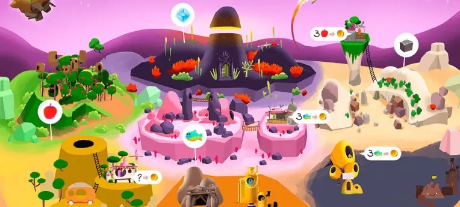

*esempi pratici e risorse di approfondimento*

In questo modulo vediamo diversi strumenti per creare attività ludiche digitali e videogiochi, ed una serie di casi studio e giochi interessanti

## Giochi Educativi
Elenchiamo qui alcuni videogiochi, gratuiti, accessibili facilmente, valutati scientificamente con impatto positivo su apprendimento e le emozioni.

La ricercatrice Karen Schrier ha pubblicato ben 3 volumi (accessibili gratuitamente, vedere nelle risorse), analizzando centinaia di videogiochi utili in ambito didattico.

### STEM

#### DragonBox

progetto DragonBox curriculum completo di matematica e algebra attraverso meccaniche di gioco avvincenti e sfidanti.
Temi: matematica
[sito](https://dragonbox.com/educators)
[video](https://www.dragonbox.no/skole)
#### Game Over Gopher
Temi: Matematica
[Sito](https://mathsnacks.com/game-over-gopher.html)
#### Gran Sasso 🇮🇹
Il progetto del videogioco nasce ai LABORATORI NAZIONALI DEL GRAN SASSO, dell'Istituto Nazionale di Fisica Nucleare (INFN), per far conoscere le ricerche di punta che vi si svolgono e avvicinare i ragazzi alla cultura scientifica-tecnologica.  
[Sito](https://gsvideogame.lngs.infn.it/)  
[Un comunicato stampa del MIUR](https://www.miur.gov.it/-/giocare-imparando-al-via-nelle-scuole-la-sperimentazione-del-gran-sasso-videogame)

#### Paint-a-Long
Temi: Matematica per scuole elementari.
Fa parte di una grande collezione di giochi educativi per bambini: [pbskids.org](https://pbskids.org/peg/games)  
[Sito](https://pbskids.org/peg/games/paint-a-long/)

#### Playground Physics
Temi: Fisica
[Sito](https://playgroundphysicsapp.org/)
#### Function & GO 
Un serious games per l'apprendimento di concetti matematici di base. Il target della formazione sono gli allievi del penultimo e dell'ultimo anno delle scuole superiori.
[Sito](http://seriousmathgames.unict.it/index.html)
#### Alien Rescue
Temi: Risoluzione problemi e ricerca scientifica
[Sito](https://alienrescue.education.utexas.edu/)
### Linguaggio

#### Antura & the Letters 🇮🇹
Temi: Apprendimento delle lingue 
[Sito](https://antura.org)

#### Duolingo
La più famosa e vasta applicazione per imparare ogni lingua
[Video](https://youtu.be/LV2R1vWFg3w)
[Sito](https://www.duolingo.com/)

#### fluentU
[Sito](https://www.fluentu.com/en/)

#### Babbel
[Sito](https://www.babbel.com/)

#### Bravolol
[Sito](https://bravolol.com/)

#### Myst
[Sito](https://cyan.com/games/myst/)

### Giochi Cognitivi

#### Dr Kawashima’s Brain Training
[Sito](https://www.nintendo.co.uk/Games/Nintendo-DS/Dr-Kawashima-s-Brain-Training-How-Old-is-Your-Brain--270627.html)

#### Mangahigh
[Sito](https://www.mangahigh.com/en/)

#### Peak Brain Training
[Sito](https://www.peak.net/)

#### Elevate
minigiochi
[Sito](https://www.elevateapp.com/)

#### Lumosity
minigiochi
[Sito](https://www.lumosity.com/en/)

#### Fit Brains
[Sito](https://five.agency/projects/brain-trainer/)

#### Cognito
[Sito](https://www.youtube.com/watch?v=-lC_dFOoQ_Q)

#### Sudoku
[Sito](https://sudoku.game/)

### Simulazioni

#### Roller Coaster Tycoon Adventures
[Sito](http://www.rollercoastertycoon.com/adventures/)

#### Farming Simulator 19
[Sito](https://www.farming-simulator.com/)

#### Train Simulator
[Sito](https://live.dovetailgames.com/live/train-simulator)

#### Flight Simulator X
[Sito](https://store.steampowered.com/app/314160Microsoft_Flight_Simulator_X_Steam_Edition/)

#### Forestry 2019 – The simulation
[Sito](https://fs19.net/category/farming-simulator-2019-mods/forestry)

#### Football Manager 2019
[Sito](https://store.steampowered.com/app/872790/Football_Manager_2019)

#### Total War: Rome II
[Sito](https://www.totalwar.com/games/rome-ii)

#### Universe Sandbox
[Sito](http://universesandbox.com)

#### Stop Disasters!
[Sito](https://www.stopdisastersgame.org)

### Cultura e territorio

#### IVIPRO
Il sito [https://ivipro.it/it/italia-in-gioco/](https://ivipro.it/it/italia-in-gioco/) raccoglie e presenta centinaia di videogiochi sviluppati intorno ad un territorio italiano.

#### The Great Palermo 🇮🇹

Il gioco viene definito “Una storia di cibo e trasformazione”. Si sviluppa come una visual novel interattiva basata sulla cultura del cibo nella città siciliana, esplorata dal protagonista Gaetano.  
[Sito](https://wearemuesli.itch.io/palermo)
#### Venti Mesi 🇮🇹
Una collezione di storie interattive sulla Resistenza e la Liberazione dal nazifascismo. 20 storie ispirate a fatti realmente accaduti sul territorio di Sesto San Giovanni (Milano) e dintorni durante la Seconda guerra mondiale. Disponibile gratuitamente in lingua italiana e inglese, e in versione PC e Mac.
[Sito](https://wearemuesli.itch.io/ventimesi)

### Movimento

#### Run Keeper
[Sito](https://runkeeper.com/)

#### FitBit
[Sito](https://www.fitbit.com/home)

#### Google Fit
[Sito](https://www.google.com/fit/)

#### Zombies, Run!
[Sito](https://zombiesrungame.com/)

#### Harry Potter Wizzards Unite
[Sito](https://harrypotterwizardsunite.com/)

#### Pokémon Go
[Sito](https://www.pokemongo.com/en-us/)

#### Geocaching
[Sito](https://www.geocaching.com/play)

### Altri

#### Ayiti: The Cost of Life
Temi: Geografia ed economia  
[Guida per l'Insegnante](https://www.tigweb.org/tiged/projects/ayiti/guide.html)|
[Sito](https://www.tigweb.org/tiged/projects/ayiti/)

#### The Evolution of Trust
Temi: Psicologia, sociologia e storia.
[Sito](https://ncase.me/trust/)

#### Food Fight
Temi: Biologia
[Sito](https://www.brainpop.com/games/foodfight/)

#### Honeymoon
Temi: Salute, psicologia, in inglese e spagnolo.
[Sito](https://playhoneymoon.com/)
from _Gaming Against Violence_

#### Mission: Admission
Temi: Preparazione per l’università
[Sito](https://gameinnovationlab.itch.io/mission-admission/)

#### Night of the Living Debt
Temi: Finanza ed economia
[Sito](http://nightofthelivingdebtgame.org/)
Ha guida per insegnanti.

#### Quandary
Temi: Inglese e geografia
[Sito](https://quandarygame.org/)
[scheda su G4C](https://www.gamesforchange.org/games/quandary/)

### Piattaforme di giochi
#### [BrainPop](https://www.brainpop.com/games/game-finder)
moltissimi giochi online, gratuiti, sulle diverse skill, con risorse per insegnanti
vedi ad esempio [https://educators.brainpop.com/bp-game/battleship-numberline/](https://educators.brainpop.com/bp-game/battleship-numberline/)
#### [Primarygamesarena.com](http://primarygamesarena.com/)

#### [Learninggamesforkids.com](https://learninggamesforkids.com/)

## Giochi Commerciali
Una minima selezione di vari giochi commerciali che possono essere utilizzati in classe, insieme ai loro benefici potenziali e al genere d’appartenenza.
Non tutti i giochi elencati sono stati realizzati con intenti educativi, ma includono comunque delle caratteristiche che possono aiutare a sviluppare un’ampia gamma di abilità e conoscenze.
La maggior parte di questi giochi è a pagamento, solo alcuni sono disponibili gratuitamente.

### 1979 Revolution. Black Friday
Temi: Storia, Politica
Genere: Avventura
[Sito](https://www.gamesforchange.org/games/1979-revolution-black-friday/)

### A Closed World

Temi: Inclusività, Sessualità & Identità di genere
Genere: Gioco di Ruolo
[Sito](http://gambit.mit.edu/loadgame/aclosedworld.php)

### A Normal Lost Phone

Temi: Inclusività, Sessualità & Identità di genere
Genere: Avventura, Puzzle game
[Sito](https://anormallostphone.com/)

### Animal Crossing

Temi: Geografia, Biologia, Organizzazione, Gestione del tempo
Genere: Simulazione/Educativo
[Sito](https://animalcrossing.nintendo.com/)

### Assassin’s Creed Discovery Tour

Temi: Storia
Genere: Avventura
[Sito](https://www.ubisoft.com/it-it/game/assassins-creed/discovery-tour)

La celebre saga di Assassin’s Creed ha fatto scoprire, vivendoli in prima persona, diverse culture nella storia. Ubisoft ha creato delle versioni speciali da usare in classe:

- Antico Egitto
- Antica Grecia
- Europa dell'era vichinga

Guida per insegnanti: [Discovery Tour di Ubisoft: Risorse per gli insegnanti](https://www.ubisoft.com/en-gb/game/assassins-creed/discovery-tour/curriculum-guide)

### Bioscopia
Temi: Zoologia, biologia cellulare, biologia umana, botanica e genetica

### Bury Me, My Love
Temi: Etica, Migrazione & Fuga  
Genere: Avventura, Simulazione  
[Sito](http://burymemylove.arte.tv/)

Racconta la storia di Nour, una giovane migrante siriana che intraprende un pericoloso viaggio verso la salvezza aiutata dal marito Majd. 

### Caesar III
Temi: Storia
Genere: Strategia

### Change
Temi: Etica, Inclusività, Sesso e Identità di genere  
Genere: Avventura, Gioco di ruolo, Simulazione

### Civilization
Temi: Storia, Geografia, Economia, Pianificazione  
Genere: Strategia (a turni) 

L'obiettivo del gioco è sviluppare una civiltà e farla diventare potenza mondiale con il passare di diversi millenni e raggiungere una delle diverse condizioni di vittoria, come il dominio militare, la superiorità tecnologica o l'influenza culturale, a discapito delle altre civiltà. I giocatori possono farlo esplorando la mappa, fondando nuove città, ricercando nuove tecnologie, impegnandosi nel commercio, stabilendo alleanze o patti con altri giocatori o conquistando le città degli avversari. 

### Cloud Chasers – Journey of Hope
Temi: Etica, Migrazione & Fuga, Politica  
Genere: Avventura

### Crazy Machines 3
Temi: Fisica  
Genere: Puzzle game,Simulazione, Strategia

### Democracy 4
Temi: Politica  
Genere: Strategia
[Sito](https://positech.co.uk/democracy/)

Si impara: a conoscere i molteplici livelli di funzioni governative come i partiti, i finanziamenti, le tasse, le elezioni, i cambiamenti politici, il capitale politico, i bilanci, i debiti e altro ancora. Inoltre, impareranno a conoscere il compromesso, la causa e l'effetto, la strategia e la risoluzione dei conflitti.

### Der Die Das Rockets
Temi: Lingua (Tedesco)  
Genere: Azione

### ECO
Temi: Clima & Ambiente, Politica, Economia  
Genere: Avventura, Simulazione

### Fable III
Temi: Etica, Studi sociali, Inglese  
Genere: Gioco di ruolo (GDR)

### Fake It To Make It
Temi: Alfabetizzazione mediatica  
Genere: Simulazione

### Fallout Shelter
Temi: Economia e Sociologia  
Genere: Simulazione/Strategia

### Fate of the World
Temi: Clima & Ambiente  
Genere: Simulazione

### Food Force (United Nations)
Temi: Economia, Management  
Genere: Simulazione

### Foldit
Temi: Biologia  
Genere: Puzzle game

### Fortnite
Temi: Abilità collaborative  
Genere: Sparatutto (FPS)  
[Sito](https://www.fortnite.com/?lang=it)

### Imagine Earth
Temi: Clima & Ambiente, Politica  
Genere: Strategia

### Just Dance
Temi: Informatica (Algoritmi), Educazione Fisica  
Genere: Rhythm-game, Musicale

### Keep Cool
Temi: Clima & Ambiente  
Genere: Strategia

### Kerbal Space Program
Temi: Fisica, ingegneria aerospaziale, astro-fisica  
Genere: Simulazione  
[Sito](https://www.kerbalspaceprogram.com)

Kerbal Space Program vi mette al comando di un programma spaziale e vi permette di costruire razzi per orbitare intorno al pianeta, raggiungere la luna ed esplorare altri mondi, sempre che riusciate a risolvere la complicata logistica dei viaggi nello spazio. Probabilmente i giocatori inizieranno a divertirsi costruendo a caso razzi improbabilmente potenti che esplodono inevitabilmente sulla piattaforma di atterraggio, e progredirà fino a lanciare missioni di lavoro su altri pianeti. Lungo il percorso, impareranno tutto sulla gravità, la telemetria, le orbite, la spinta, la potenza, ecc. senza rendersi conto che stanno diventando scienziati missilistici.

### Kingdom Hearts 3
Temi: Lingua inglese  
Genere: Gioco di ruolo

### Ludwig
Temi: Etica, Clima & Ambiente, Fisica  
Genere: Avventura, Simulazione

### Mario Maker
Temi: Informatica, Problem-solving, Percezione spaziale, Matematica  
Genere: Platform

### Minecraft
Temi: Pensiero critico, creativity, problem-solving, collaboration  
Genere: Simulazione/Strategia
[Sito](https://www.minecraft.net/it-it)

### Monkey Swag
Temi: Matematica (Geometria)  
Genere: Avventura, Puzzle
[Sito](https://de.monkeyswag.usm.de/)

### NBA 2K14
Economia, Management, Pensiero critico e Consapevolezza storica  
Genere: Sport

### Nintendo LABO
Tecnologia, Problem-solving, Informatica (Algoritmi), Musica  
Genere: Puzzle game, Azione, Platform

### No Male Heroes
Inclusività, Genere & Diversità
Genere: Gioco di ruolo (GDR)

### Orwell
Etica, Letteratura, Politica, Sicurezza dei dati
Genere: Avventura, Simulazione

### Papers, Please
Etica, Migrazione & Fuga, Politica
Genere: Avventura, Simulazione

### Path Out
Temi: Migrazione & Fuga
Genere: Avventura

### Pokémon Go
Temi: Pensiero critico, Cittadinanza, Geografia
Genere: Avventura (esplorazione)

### Portal 2
Temi: Fisica, Geometria, Problem-solving, Analisi spaziale
Genere: Sparatutto (FPS)
Portal 2 (Valve Corporation, 2011) è il sequel dell'originale Portal, entrambi giochi puzzle-platform in prima persona di enorme popolarità in cui il giocatore si muove nell'ambiente sparando portali iniziali e finali in superfici altrimenti scollegate, creando così un collegamento attraverso il quale il giocatore può muovere gli oggetti, incluso se stesso. Il gioco richiede una **estrema acutezza spaziale** ed è stato rapidamente riconosciuto per il suo potenziale utilizzo per **l'apprendimento della fisica, della risoluzione dei problemi e del pensiero critico**.
> **Collegamenti curriculari:** Fisica, geometria, lingua inglese; apprendimento sociale ed emotivo.
> **Possibili competenze insegnate:** Capacità di comunicazione; lavoro di squadra; risoluzione di problemi; pensiero critico; pensiero logico; analisi spaziale; competenze in materia di occupazione/carriera.
> Come utilizzare Portal 2 in un'aula di STEM/Fisica: [https://www.foundry10.org/programs/games-and-learning/portal-2](https://www.foundry10.org/programs/games-and-learning/portal-2)

### Rabbids
Temi: Coding Basi di programmazione
Genere: Puzzle game, Educativo

### Railroad Tycoon II
Temi: Collaborazione, Strategia, Gestione aziendale, Economia
Genere: Simulazione/Strategia

### SimCity 4
Temi: Urbanistica (Pianificazione e sviluppo)
Genere: Simulazione/Strategia

### SimCity EDU
è una versione educativa del famoso gioco di simulazione urbanistica SimCity. In questa versione, gli studenti devono pianificare e gestire città virtuali, imparando importanti concetti di economia, politica e pianificazione urbana.

### Legend of Zelda: Breath of the Wild
Temi: Organizzazione, Gestione del tempo
Genere: Avventura

### The Sims
Temi: Lingua, Comunicazione, Scienze della comunicazione
Genere: Simulazione

### The Unstoppables
Temi: Inclusività, Genere & Diversità
Genere: Avventura

### This War of Mine
Temi: Etica, Migrazione & Fuga, Politica
Genere: Simulazione

### Through the Darkest of Times
Temi: Etica, Storia, Guerra & Conflitti politici
Genere: Avventura, Strategia, Simulazione

### Tricky Tower
Temi: Fisica, Geometria, Problem-solving, Analisi spaziale
Genere: Strategia, Puzzle game

### Valiant Hearts: The Great War
Temi: Storia, Guerra & Politica, Narrazione
Genere: Avventura, Puzzle game

### Where in Time is Carmen Santiago
Temi: Scoperta e logica

Uscito nel 1985 e ha dato vita a oltre 20 sequel che vanno oltre la geografia per insegnare la matematica, la storia e altre materie.

### World of Warcraft
Temi: Contabilità
Genere: Gioco di ruolo (MMORPG)

## Piattaforme e Strumenti

### Presentazioni interattive e Quiz

#### Mentimeter
Per creare slides interattive
https://www.mentimeter.com/
#### Quizlet
flashcard, i test e i giochi, con migliaia di risorse accessibili creati dalla comunità
https://quizlet.com/it
#### Kahoot!

una piattaforma di giochi quiz in cui gli insegnanti possono creare quiz interattivi per gli studenti. Questo strumento è ampiamente utilizzato per coinvolgere gli studenti e valutare le loro conoscenze in modo divertente. È efficace sia in classe che per l'apprendimento a distanza.
https://kahoot.com/it/

#### Deck Toys
creare avventure con i propri contenuti.
ha un piano insegnanti gratuito  (per 2 classi)
https://deck.toys

#### Genially
piattaforma per creare contenuti interattivi
https://genial.ly/it

### Sviluppo videogiochi

#### CoSpaces
CoSpaces Edu è una piattaforma creativa che consente agli studenti di creare, esplorare e condividere ambienti virtuali e aumentati per scopi educativi.
https://www.cospaces.io/
#### Scratch Ed
Scratch Ed è una risorsa educativa che fornisce agli insegnanti strumenti e attività per insegnare la programmazione e il pensiero computazionale agli studenti utilizzando Scratch
https://scratch.mit.edu/
#### Minecraft Ed

Minecraft è stato utilizzato in molte scuole per insegnare vari concetti, tra cui matematica, storia e scienze. Gli studenti possono costruire strutture, risolvere problemi e collaborare in un ambiente di gioco creativo. Ad esempio, insegnanti hanno creato lezioni su antiche civiltà in cui gli studenti costruiscono riproduzioni digitali di antiche città.
https://education.minecraft.net
#### Unity
Lo strumento più usato al mondo per creare videogiochi
https://unity.com/
Una sezione dedicata alla formazione: https://learn.unity.com

### Mondi Immersivi

#### EdMondo
un ambiente digitale 3D riservato a docenti e studenti in cui si può esplorare, contribuire a costruire, partecipare alle attività e comunicare con altri utenti.
https://edmondo.indire.it/

#### Minetest
Versione OpenSource di Minecraft
Simulazione/Strategia
permette la creazione di veri e propri videogiochi
Esempio: [https://content.minetest.net/packages/Wuzzy/glitch/](https://content.minetest.net/packages/Wuzzy/glitch/)
https://www.minetest.net

## Esempi Attività Didattiche
### Storytelling digitale con Minecraft
**Contesto**
**Soggetto:** Narrare una storia vera
**Tempo di apprendimento programmato:** 2 ore e 30 minuti
**Dimensione della classe:** 20 studenti
**Modalità di esecuzione:** In classe
**Descrizione:** La lezione vuole far conoscere agli studenti la storia di Mohammed Aljaleel, il “gattaro di Aleppo”. La sua storia toccò i cuori di milioni di persone quando il suo santuario apparve in un servizio della BBC nel 2016. L’uomo lasciò fu costretto a lasciare la città quando le forze siriane la conquistarono, per poi tornare – in un’area vicina – con l’unico scopo di per aiutare bambini e animali. Gli studenti proveranno a ricostruire la storia dell’uomo all’interno di Minecraft e cercheranno di ricreare una versione digitale del Rifugio di Ernesto, il rifugio che Aljaleel costruì per i gatti nel bel mezzo di una crisi bellica. Lo scopo della lezione è sensibilizzare gli alunni a temi sociali controversi come le implicazioni della guerra, i rifugiati, gli animali e i bambini vittime della guerra, la solidarietà, il volontariato e il potere dei social media nel 21°XXI secolo. La lezione vuole anche far familiarizzare gli studenti con l’ambiente digitale di Minecraft e al contempo permettere loro di imparare a usare la lingua inglese per narrare una storia (sia in termini di lettura che di scrittura) e migliorare le loro competenze informatiche in materia di TIC.

**OBIETTIVI**
- Scambiarsi le idee e generare opinioni
- Riassumere e categorizzare informazioni in una tabella
- Costruire una storia come un gioco con gli strumenti di Minecraft – Education Edition
- Giocare a giochi digitali
- Valutare i giochi digitali
- Ottenere medaglie digitali per il raggiungimento di un obiettivo
- Comunicare
- Collaborare
- Creare, produrre
- Pubblicare
- Valutare

### Discovery Tour: Antica Grecia
“Discovery Tour: Antica Grecia” (DT Antica Grecia), PEGI 7, è un’espansione rilasciata il 10.09.2019 e fruibile come contenuto gratuito per chi ha il gioco base o acquistabile come contenuto indipendente dal gioco. Il gioco di riferimento è “Assassin’s Creed Odyssey” (AC Odyssey), PEGI 18, undicesimo capitolo della serie Assassin’s Creed (AC), un gioco action RPG stealth con visuale in terza persona, nel quale i giocatori devono completare le diverse missioni proposte in ordine sequenziale per poter progredire all’interno della storia. Il gioco, ambientato tra il 431 e il 422 a.C., narra la storia della Guerra del Peloponneso e il giocatore assume il ruolo di un mercenario che può combattere per Atene e la Lega delio-attica oppure per la Lega peloponnesiaca guidata da Sparta. Durante le diverse missioni il gioco consente di interagire con molti personaggi storici, come Alcibiade, Socrate, Sofocle, Pericle, Erodoto, Ippocrate, Pericle, Fidia, Aspasia ecc.

“DT Antica Grecia” non è un gioco, in quanto utilizza solamente gli elementi strutturali (ambientazioni e personaggi) di AC Odyssey senza le meccaniche ludiche che caratterizzano il videogioco vero e proprio. DT Antica Grecia permette di scegliere tra 8 avatar e interagire con 5 differenti guide (Aspasia, Barnaba, Marco, Erodoto e Leonida I), dando l'opportunità di esplorare più di 300 luoghi d'interesse nel corso di 30 visite (Tours) suddivise in 5 diverse categorie (vita quotidiana; politica e filosofia; arti, religione e mitologia; battaglie e guerre; città importanti) e ambientate in 26 regioni della Grecia Le attività proposte possono essere svolte utilizzando anche l'espansione "Discovery Tour: Viking Age" (DT Viking Age), PEGI 7.

Sebbene si tratti di prodotti PEGI 18, la saga AC è molto conosciuta anche tra i ragazzi della scuola secondaria di primo grado. L'utilizzo didattico di DT in questa fascia di età potrebbe rappresentare l'occasione per affrontare il tema della violenza nei videogiochi e introdurre la conoscenza del sistema PEGI, ma anche per approfondire come gli stimoli violenti fruiti attraverso i diversi media vengono rielaborati dai ragazzi o il loro significato in relazione al contesto storico e culturale di riferimento.

#### Attività 2 - Scuola secondaria di primo grado

**Tempo di apprendimento programmato**: 180 minuti
**Dimensione della classe**: Intera classe suddivisa in coppie di studenti e/o individualmente
**Materie coinvolte**: Trasversale a tutte le discipline
**Materiali**: Computer (console), proiettore, carta/tablet/smartphone, connessione internet (video, audio, immagini), libri/libro di testo
**Ruolo del docente**: Gestisce/coordina, monitora e valuta

**Modalità di esecuzione**
In base alla disponibilità "DT Antica Grecia", l'attività può essere totalmente in classe o a casa. L'attività può essere svolte in quattro fasi consecutive: nella prima fase in classe, gli studenti scelgono un tema presente all'interno "DT Antica Grecia", navigano il tema con la modalità "Tour Guidato" in un'unica sessione di circa 30 minuti e catalogano le informazioni presenti per creare un portfolio attorno a quel tema; nella seconda fase a casa, gli studenti ricercano altre informazioni (video, immagini, audio, testi ecc.) relative al tema selezionato utilizzando fonti diverse, quali il libro di testo, altri libri, Internet ecc.; nella terza fase a casa o in classe, confrontano e integrano le informazioni recuperate dalle varie fonti e creano un portfolio multimediale da presentare ai pari e/o utilizzare come risorsa per il proprio studio; nella quarta e ultima fase, gli studenti valutano la qualità delle informazioni recuperate dai diversi media, indicano la significatività e l'efficacia delle diverse fonti per lo studio personale, definiscono alcuni criteri funzionali per la selezione e la valutazione dei contenuti in relazione alla fonte.

L'attività può essere svolta modificando alcuni aspetti dal modello presentato: il docente può vincolare il tema anziché lasciarlo a libera scelta e può modificare le modalità di svolgimento tra casa e scuola, utilizzando un'alternanza diversa da quella presentata o svolgendo l'intera attività in classe o a casa.

**OBIETTIVI**
- Analizzare e valutare contenuti provenienti da fonti e linguaggi diversi
- Raccogliere e integrare tra loro le informazioni rilevanti provenienti da fonti diverse
- Predisporre un testo multimediale a supporto del proprio apprendimento
- individuare dei criteri per la selezione dei contenuti

#### Attività 2 - Scuola secondaria di secondo grado
CONTESTO
**Tempo di apprendimento programmato**: 120-180 minuti
**Dimensione della classe**: Intera classe suddivisa in piccoli gruppi (3/4 studenti)
**Materie coinvolte:** Trasversale a tutte le discipline
**Materiali**: Computer (console), proiettore, carta/tablet/smartphone, connessione internet (video, audio, immagini), libri/libro di testo
**Ruolo del docente**: Gestisce/coordina, monitora e valuta

Modalità di esecuzione

In base alla disponibilità “DT Antica Grecia”, la fruizione del tema può essere svolta totalmente in classe o a casa. L’attività può essere svolta in due fasi consecutive: nella prima fase, gli studenti navigano i tour guidati di “Battaglie e Guerre”, dove vengono presentati molti contenuti multimediali sugli aspetti, che hanno portato alle battaglie di Maratona, delle Termopili, di Anfipoli e di Pilo e Sfacteria, e mostra quali sono stati gli aspetti salienti delle battaglie stesse e le conseguenze che tali battaglie hanno avuto dell’antica Grecia; nella seconda fase, gli studenti realizzano un testo scritto / audio / video / grafico che narri in modo esplicativo una o una sequenza delle battaglie presentate, avendo l’attenzione di includere dettagli su azioni, pensieri, sentimenti. Il focus delle battaglie presentate, avendo l’attenzione di dell’attività è quello di realizzare un testo sul significato di tali battaglie, sul loro impatto sulla vita quotidiana delle persone, sullo spostamento di potere, ecc.

**OBIETTIVI**
• Analizzare e valutare gli elementi costituenti un fatto storico all’interno di un testo multimediale
• Creare un prodotto che descriva le possibili cause ed effetti di un evento storico

## Videogiochi creati in classe 

#### I luoghi de "I Promessi Sposi"

una classe crea un videogioco / storia digitale usando diversi strumenti (Padlet, Google Docs, Genially, Canva, Cospaces Edu, Thinglink, Google Earth)
[https://sites.google.com/view/iluoghimanzoniani/home](https://sites.google.com/view/iluoghimanzoniani/home)

#### Divina Commedia
**Piano lezione per creare su “Divina Commedia”**

Il professor Giuseppe Schiuma ha prodotto questa guida per far lavorare i ragazzi sulla creazione di un gioco ambientato in un canto della Divina Commedia  
[https://forum.edu.cospaces.io/uploads/short-url/tIwSWmKo6DvdjVVGzVEo4kSxAWd.pdf](https://forum.edu.cospaces.io/uploads/short-url/tIwSWmKo6DvdjVVGzVEo4kSxAWd.pdf)

Scena esempio: [https://edu.cospaces.io/SCX-NZU](https://edu.cospaces.io/SCX-NZU)

#### Un videogioco per imparare

Game Jam
Ideare e costruire insieme un videogame per raccontare e raccontarsi.
[Documento di sintesi](http://www.rivistabricks.it/wp-content/uploads/2018/12/2018_5_06_Roncella.pdf)

#### Escape Us
Piattaforma: CoSpaces
Videogioco realizzato con 12 ragazzi in jam in 4 pomeriggi.

[Play Online]()
#### 7 Frames
Piattaforma: Unity
Questo gioco è stato creato da 7 bambini  (dai 7 ai 12 anni) in jam in due giorni.

È stato dato loro un TEMA: "SE NON CI FOSSERO GLI ALTRI..." ed avevano una giornata per svilupparci un videogioco.
I ragazzi in concertazione tra loro e con la supervisione dei genitori, hanno iniziato a lavorare ognuno con le proprie capacità e particolarità, ma attenti all'insieme e alle diversità.

La storia del progetto è [qui](https://2042ed.org/2042/jam/7-frames/)

[Play online](https://jamurr.itch.io/7frames)

## Risorse e Approfondimenti

### Siti
- Edutopia [www.edutopia.org](https://www.edutopia.org)
- Games 4 Change [www.gamesforchange.org](https://www.gamesforchange.org/)
- Institute of Play https://clalliance.org/institute-of-play/
- [games.ngo](https://games.ngo/)
- [www.gamesandlearning.org](http://www.gamesandlearning.org)
- [50-great-sites-for-serious-educational-games](https://www.onlinecolleges.net/50-great-sites-for-serious-educational-games/)

### Corsi
**Scuola Futura**
[https://scuolafutura.pubblica.istruzione.it/didattica-digitale/tutti-i-percorsi](https://scuolafutura.pubblica.istruzione.it/didattica-digitale/tutti-i-percorsi)

**Games in Schools** 
https://www.europeanschoolnetacademy.eu/courses/course-v1:GiS+GamesCourse+2023/course/

**EdX: Leading Change: Go Beyond Gamification with Gameful Learning**  
[Link](https://courses.edx.org/courses/course-v1:MichiganX+GL101x+3T2018/course/)

**Udemy: Educational Game Design**  
[www.udemy.com/course/baude-egd/](https://www.udemy.com/course/baude-egd/)

**Udemy: Gamification & Behavioral Design: The Octalysis Framework**  
[Link](https://www.udemy.com/course/gamification-behavioral-design-the-octalysis-framework/)

### Libri
- [Digital Games in Schools – A Handbook for Teachers handbook](http://games.eun.org/2009/09/teachers_handbook_on_how_to_us.html)
- I 3 libri (gratuiti) della ricercatrice [Karen Schrier](https://www.karenschrier.com) su Learning, Education and Games: [sito](https://press.etc.cmu.edu/publications/etc-press/book_series/learning-education-games)
- [What we mean by: Learning through play](https://www.legofoundation.com/media/1062/learningthroughplay_leaflet_june2017.pdf), published in 2017 by [The LEGO Foundation](https://www.legofoundation.com/en/)
- Bogost, I. (2007). _Persuasive games: The expressive power of videogames_. MIT Press.
- Gee, J. P. (2003). _What video games have to teach us about literacy and learning_. Palgrave Macmillan
- Prensky, M. (2001). _Digital game-based learning_. McGraw-Hill.
- Schrier, K. (2016). _Knowledge games: How playing games can solve problems, create insight, and make change_. Johns Hopkins University Press.

### Reports
- [Digital Games for Learning – Conclusions and Recommendations from the IMAGINE project - 2010](https://www.academia.edu/8123791/Games_Based_Learning_Digital_Games_for_Learning_Conclusions_and_recommendations_from_the_IMAGINE_project_Author_CONTENTS)

### Articoli

Earl Aguilera and Roberto de Roock
[Digital Game-Based Learning: Foundations, Applications, and Critical Issues](https://oxfordre.com/education/view/10.1093/acrefore/9780190264093.001.0001/acrefore-9780190264093-e-1438#acrefore-9780190264093-e-1438-div2-16)

A Serious Look at Game-Based Learning
[A Serious Look at Game-Based Learning](https://www.edsurge.com/news/2022-10-25-a-serious-look-at-game-based-learning)

Carol Rawlings Miller  
[How to Use Games to Build Community in Distance Learning](https://www.edutopia.org/article/how-use-games-build-community-distance-learning)

Amanda Armstrong  
[Game-Based Learning in Middle School Math ](https://www.edutopia.org/article/game-based-learning-middle-school-math)

Paul Darvasi  
[Exploring Ancient History with Video Games](https://www.edutopia.org/article/exploring-ancient-history-video-games)

Further guidelines on incorporating EVGs:   
[Playability Guidelines for Educational Video Games](https://www.researchgate.net/publication/273210149_Playability_Guidelines_for_Educational_Video_Games)

Amy Jo Kim
[What makes games so engaging?](https://amyjokim.medium.com/what-makes-games-so-engaging-2a06ca3eadf1)
