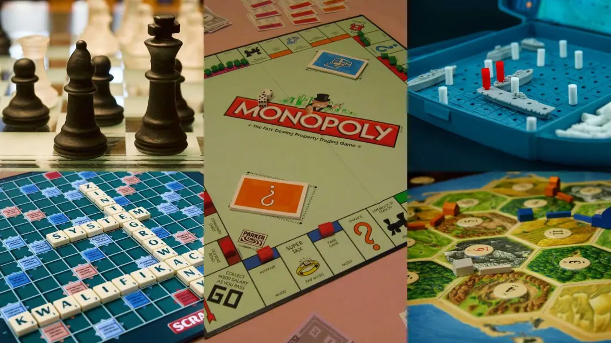
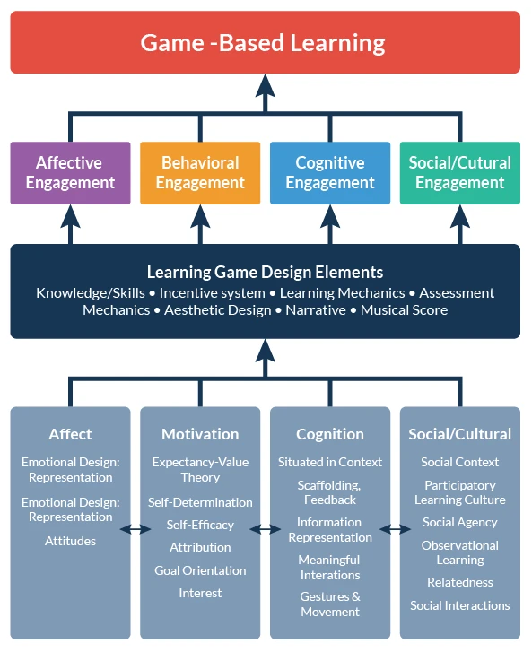

# 1. Che cos'è il DGBL

**Obiettivi di apprendimento**

- Definizione di DGBL
- Cos'è il coinvolgimento?
- Come funziona l'apprendimento basato sul gioco
- Quali competenze sviluppa il DGBL?

## Termini chiave
Per iniziare il nostro viaggio, dobbiamo introdurre alcuni termini comuni:

- Gioco
- Apprendimento
- Apprendimento basato sul gioco digitale (DGBL)
- Impegno

## Che cos'è un gioco?
Per quanto riguarda la discussione su cosa si intende per "gioco" in relazione all'apprendimento, è innanzitutto importante riconoscere che le definizioni variano da una serie di discipline e prospettive. Sintetizzando alcune di queste prospettive su giochi, gioco e cultura, potremmo usare questa definizione:

> Un gioco come sistema in cui i giocatori si impegnano in un conflitto artificiale, definito da regole, che porta a un risultato quantificabile.

Un gioco è un **sistema** perché coinvolge un insieme di cose (regole, oggetti, giocatori, ecc.) che si influenzano a vicenda all'interno di un ambiente per formare un modello più ampio che è diverso da ogni singola parte.
Un gioco coinvolge anche i **giocatori**, partecipanti attivi che interagiscono con il sistema del gioco per sperimentare il gioco stesso. Non tutti i giochi hanno bisogno di un conflitto, di una gara tra giocatori (ad esempio, i giochi in solitario come il solitario o i giochi cooperativi).
Tutti i giochi prevedono **regole** che forniscono la struttura da cui emerge il gioco, delimitando ciò che un giocatore può o non può fare.
Infine, questa definizione afferma che tutti i giochi comportano un qualche tipo di **risultato quantificabile** - nella sua forma più semplice, uno stato di vittoria o di sconfitta. 

## Che cos'è l'apprendimento
La definizione di ciò che costituisce l'_apprendimento basato sul gioco_ nel DGBL richiede il riconoscimento della natura controversa dell'_apprendimento_ stesso come concetto. In generale, esistono due metafore generali che sono state storicamente utilizzate dalla comunità della ricerca educativa per definire e descrivere l'apprendimento.
1. Il primo punto di vista caratterizza l'**apprendimento come acquisizione**, sia essa l'acquisizione di conoscenze, abilità, disposizioni, comportamenti o altri risultati ritenuti desiderabili da educatori e istituzioni. Questa visione è generalmente in linea con quella che gli studiosi chiamano *prospettiva cognitiva sull'apprendimento*, che enfatizza i processi mentali interni come la memoria, il processo decisionale, il pensiero e la costruzione della conoscenza come fondamentali per l'apprendimento. Si tratta anche di una concezione comportamentista dell'apprendimento, che tende a enfatizzare i *comportamenti osservabili come indicatori dell'apprendimento*.
2. La seconda metafora caratterizza l'**apprendimento come partecipazione** e sottolinea i processi di socializzazione, mentorship, partecipazione e pratica sociale. Nel campo dell'educazione, questa metafora informa generalmente la ricerca identificata con una prospettiva socioculturale sull'apprendimento, che tende a sottolineare le pratiche sociali, le identità e le relazioni come elementi centrali dell'apprendimento.

## Che cos'è l'apprendimento basato sui giochi?

L'apprendimento basato sul gioco è un approccio pedagogico che implica **la progettazione di attività di apprendimento attraverso giochi in cui le caratteristiche e i principi del gioco sono presenti nelle attività di apprendimento stesse**.

La progettazione di programmi di studio più coinvolgenti deve includere tecniche che insegnino agli studenti a essere **critici**, **fiduciosi** e **creativi**, nonché abilità di cui avranno bisogno per avere successo nel **lavoro quotidiano della vita futura**. I giochi hanno queste tecniche e caratteristiche.

Il **gioco è intrinsecamente motivante**, il che può consentire agli studenti di acquisire competenze e conoscenze, sfruttando il divertimento e intrecciandolo con gli ambienti di apprendimento. Studi di ricerca indicano che i videogiochi, in particolare, hanno grandi benefici in termini di coinvolgimento e di istruzione. 

📽 [I giochi e il futuro dell'istruzione](https://www.youtube.com/watch?v=BiK2MPeg8k4)
<iframe width="740" height="450" src="https://www.youtube.com/embed/BiK2MPeg8k4" title="Giochi e il futuro dell'educazione | ABUNDANCE" frameborder="0" allowfullscreen></iframe>

## Diversi tipi di GBL

Per comprendere meglio il GBL, si possono esaminare i suoi diversi tipi e prendere in considerazione i seguenti aspetti: il **luogo** in cui si svolge il gioco e l'**ambiente** in cui gli studenti giocano. I tre tipi di GBL sono:

### Giochi da tavolo

I giochi da tavolo sono solitamente giocati da uno o più giocatori attorno a un tavolo (sono anche chiamati giochi da tavolo).
Il Monopoli può essere considerato un gioco educativo. Ha tutti gli elementi necessari: una storia, personaggi, punti, competizione e molti altri aspetti. Esistono molti esempi di giochi simili al Monopoly per le scuole con regole modificate per le diverse materie, come il Monopoly di storia o il Monopoly di matematica. I giochi da tavolo sono utilizzati con grande successo per esplorare e insegnare. Ma non è l'obiettivo di questo corso. 

### Giochi della vita reale

L'ambiente è il **mondo reale**. Questo è probabilmente il tipo di gioco più motivante, ma anche il più stressante. In questo tipo, gli studenti devono muoversi, agire, usare il corpo e la mente per giocare. È il tipo più coinvolgente e provoca gli studenti in quasi tutti gli aspetti del loro apprendimento. Poiché c'è la possibilità di muoversi in un certo spazio, il gioco della vita reale è spesso collegato al **teatro**. È facile trovare attività di **gioco di ruolo**, così come simulazioni o drammi in questo tipo di apprendimento ludico. Gli studenti agiscono "come se fossero" un personaggio del gioco, prendono decisioni in base ai loro obiettivi, all'ambiente e alle regole (Living Role Playing Game). Vedremo che la tecnologia della Realtà Aumentata permette di giocare ai giochi digitali nel mondo reale.

### Giochi digitali
Così come i giochi analogici possono assumere una varietà di forme, anche i giochi digitali possono apparire su una moltitudine di piattaforme elettroniche basate su computer. Tra queste vi sono i giochi installati come software sui personal computer e quelli giocati attraverso console di gioco collegate al televisore, come la Sony PlayStation o la Microsoft Xbox. Le piattaforme di gioco digitali includono anche piattaforme portatili dedicate, come il Nintendo Gameboy e le sue varie incarnazioni, nonché smartphone e tablet. Questi giochi possono essere giocati da un singolo giocatore, da più giocatori in un unico luogo fisico o da giocatori distanti tra loro grazie alle funzionalità di connessione online.

### Giochi digitali vs analogici
Ci sono almeno quattro caratteristiche chiave che distinguono i giochi digitali da quelli non digitali. 
1. Il primo è che i giochi digitali possono offrire esperienze di **interattività** generalmente caratterizzate da immediatezza e concentrazione. Ciò è dovuto in gran parte al fatto che i giochi elettronici sono programmati nei computer. La programmazione offre una maggiore **immediatezza del feedback** perché il sistema è **automatizzato per rispondere agli input del giocatore**. La programmazione offre anche una gamma ristretta di interattività, perché i possibili input e risultati del giocatore sono limitati da ciò che lo sviluppatore del gioco digitale ha programmato nel software.
2. In secondo luogo, i giochi elettronici e i media digitali più in generale fanno uso delle possibilità del computer per **raccogliere, memorizzare, recuperare, manipolare, rivelare o addirittura nascondere informazioni** sotto forma di immagini, testi, animazioni, suoni e persino **dati comportamentali dei giocatori**.
3. In terzo luogo, grazie alla loro natura computazionale, i giochi elettronici hanno il potenziale per **automatizzare sistemi e procedure** che potrebbero essere molto più complessi da simulare per i giochi non digitali. Esempi di questi sistemi complessi sono le caratteristiche ambientali simulate nei giochi di ruolo al computer: interazioni terreno-movimento, linee di vista, cicli meteorologici e persino interazioni con animali o personaggi non giocanti nel mondo virtuale del gioco.
4. Infine, molti (anche se non tutti) i giochi elettronici contemporanei hanno la capacità di **facilitare la comunicazione tra i giocatori** attraverso le reti, come le reti online che collegano i giocatori nei giochi multigiocatore connessi a Internet. Queste funzioni di facilitazione della comunicazione possono includere tecnologie che consentono la chat vocale o testuale tra i giocatori all'interno di un particolare gioco.

## Che cos'è l'apprendimento basato sul gioco digitale?

L'apprendimento basato sul gioco digitale si riferisce all'apprendimento attraverso la risoluzione di problemi o l'esecuzione di compiti tramite computer, telefoni cellulari o tablet. Ci sono diversi elementi nell'apprendimento basato sui giochi digitali, come *divertimento*, *gioco*, *obiettivi*, *competizione* e *soluzione di problemi*.

Alcuni studi hanno analizzato il DGBL in diverse materie, come alfabetizzazione, matematica, scienze e STEAM. I risultati indicano che il DGBL può migliorare la motivazione all'apprendimento e le prestazioni degli studenti, riducendo il loro carico cognitivo e l'ansia.

> L'apprendimento basato sul gioco (**GBL**) è un tipo di _gioco_ che ha _risultati di apprendimento definiti_.  
> Il **Digital** game based learning (**DGBL**) si riferisce all'utilizzo di videogiochi digitali come strumenti di apprendimento.

Una valutazione critica dell'aspetto _giocoso_ del DGBL può aiutare a collocare meglio l'uso di questo concetto nella teoria e nella pratica. Partendo dall'apprendimento come *metafora dell'acquisizione*, un modo per definire l'apprendimento basato sul gioco nel DGBL è l'uso di giochi digitali per promuovere l'acquisizione di una serie di conoscenze, abilità, disposizioni o altri risultati educativi. Secondo questa definizione, l'apprendimento è basato sul gioco quando i giochi digitali, o alcuni elementi dei giochi digitali come il punteggio, sono applicati per raggiungere risultati identificabili definiti da educatori o istituzioni. 

Un altro inquadramento dell'apprendimento del DGBL come metafora della partecipazione, caratterizza l'aspetto "basato sul gioco" del DGBL come parte intrinseca della partecipazione significativa ai giochi, cioè del giocare, indipendentemente dalla loro connessione a qualche risultato educativo esterno.
Secondo questa definizione, **l'apprendimento avviene sempre quando si gioca**. **Risolvere problemi, superare ostacoli o collaborare con altri all'interno e intorno ai giochi sono tutte dimensioni dell'apprendimento**. 
Come ha osservato il game designer e teorico Raph Koster nel libro _A Theory of Fun_, un gioco è "buono" solo nella misura in cui è "divertente", e un gioco è divertente solo nella misura in cui i giocatori sono sfidati a imparare per avere successo in quello spazio di gioco.

### Gamification
La gamification, spesso classificata come un sottoconcetto del DGBL, descrive l'implementazione di alcuni aspetti dei giochi digitali (visualizzazione dei progressi, sistemi di ricompensa automatizzati, classifiche di punteggio, avatar virtuali e altri) in contesti non ludici come l'istruzione, la gestione aziendale, il marketing e persino i programmi di esercizio fisico.

## Coinvolgimento

Coinvolgere gli studenti nei contenuti della classe è sempre un compito difficile, e le forme tradizionali di istruzione sono diventate scontate e in qualche modo ridondanti, tanto che le capacità di apprendimento degli studenti sono molto deboli. Quando gli studenti non sono impegnati, è più probabile che interrompano le lezioni, che accettino meno le sfide, che abbiano voti più bassi e che non siano fiduciosi nelle loro capacità di apprendimento.

Inoltre, un **impegno costante** è molto importante per garantire che lo studente tragga il massimo dall'esperienza di apprendimento e che le sue **abilità cognitive siano sempre stimolate**. Il coinvolgimento attraverso videogiochi educativi costruiti su contenuti didattici si è rivelato un ottimo modo non solo per mantenere gli studenti impegnati, ma anche per **fornire teorie/argomenti complessi in modo interattivo** permettendo agli studenti di avere una **comprensione più profonda dei contenuti**.

## Motivazione
La motivazione è la forza che sta alla base delle prestazioni umane. Può derivare da bisogni fisiologici o psicologici, da pensieri o emozioni. I bisogni fisiologici ci aiutano a preservare un funzionamento fisico ottimale, mentre quelli psicologici ci aiutano a prosperare.
La fonte della motivazione può provenire da noi stessi o essere esterna a noi.
Sia il gioco che l'apprendimento hanno a che fare con la motivazione e analizzeremo questo argomento in modo approfondito nel prossimo capitolo.

---

## Revisione dell'unità
Ora che abbiamo stabilito cos'è l'apprendimento basato sui giochi e perché l'uso dei videogiochi educativi è vantaggioso, rispondete alle seguenti domande:

- chi può usare il DGBL? (studenti, tutti, insegnanti, bambini)
- perché il DGBL è così potente? (economico, facile, coinvolgente)
- il coinvolgimento è positivo per gli studenti? (sì, no, non lo sappiamo ancora)

- Creare la propria definizione di apprendimento basato sul gioco
- Come credete che i videogiochi didattici possano supportare i vostri approcci pedagogici e migliorare i vostri metodi di insegnamento?
- Come introdurreste i videogiochi didattici nella vostra classe?
