# 4. Casi di studio

**Obiettivi di apprendimento**  

- Quali videogiochi esistenti possiamo utilizzare?
- Cosa possiamo imparare usando i videogiochi commerciali?

## Giochi educativi

### Antura e le lettere
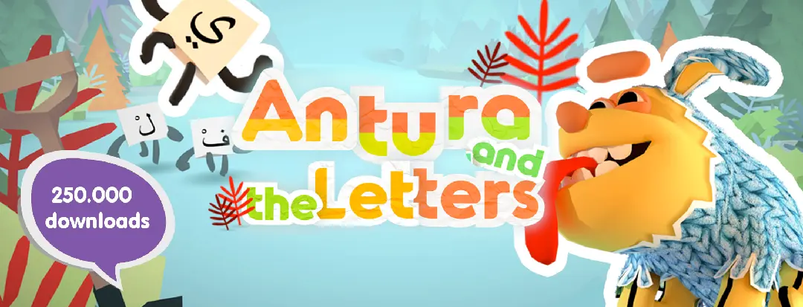

L'obiettivo educativo del gioco è quello di aiutare i giocatori ad acquisire le basi dell'alfabetizzazione araba, comprese le lettere arabe, la comprensione della lettura e alcuni vocaboli. Ma il gioco ha anche un obiettivo di benessere sociale per sostenere il flusso, l'impegno e la motivazione.

> **Collegamenti curriculari**: Apprendimento della lingua; alfabetizzazione araba; apprendimento sociale ed emotivo. 
> **Competenze possibili insegnate**: Riconoscimento delle lettere (forme, nomi, fonemi); sillabe e lettura delle parole; vocabolario.

sito web: [antura.org](https://www.antura.org)

### Dragon Box

Giocando con i manipolatori digitali dei giochi *DragonBox*, gli studenti comprendono a fondo i concetti matematici attraverso un impegno attivo, imparando al proprio ritmo.  Tutti i nostri giochi si basano su "manipolatori digitali".  Questi manipolatori digitali sono stati progettati per essere utilizzati come strumento didattico, insieme all'istruzione e alla discussione in classe.  
Sito web: [dragonbox.com](https://dragonbox.com/)

### Modi stupidi di morire
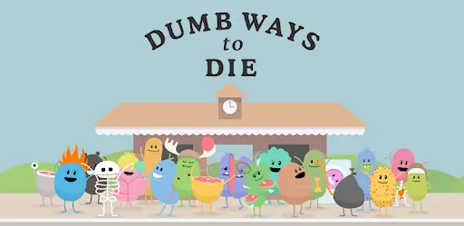

Una campagna pubblica australiana realizzata dalla Metro Trains di Melbourne, Victoria, Australia, per promuovere la sicurezza ferroviaria.   
Sito web: [dumbwaystodie.com](http://www.dumbwaystodie.com)

### iCivics

**iCivics** esiste per coinvolgere gli studenti in un significativo apprendimento civico. Forniamo agli insegnanti risorse gratuite, ben scritte e ricche di inventiva, che migliorano la loro pratica e ispirano le loro classi. **iCivics** ripensa l'educazione civica per la democrazia americana.  
Sito web: [icivics.org](https://www.icivics.org)

### Altri titoli
- [Ludwig](http://www.playludwig.com) - gioco educativo per la fisica
- [80 Days](https://www.inklestudios.com/80days/) - gioco educativo adattivo per la geografia
- [Roma Nova](https://www.irit.fr/~David.Panzoli/romanova.html) - insegnamento della storia con interfacce cerebrali
- [Bionigma](https://www.gcc.tu-darmstadt.de) - gioco scientifico per l'esplorazione delle proteine
- Meister Cody](https://www.meistercody.com) - gioco educativo per la discalculia
- [Orwell: Keeping an Eye on You](https://www.osmoticstudios.com/orwell-keeping-an-eye-on-you/) - imparare la gestione dei dati personali

## Salute

### Il gioco che può darvi 10 anni di vita in più

La game designer Jane McGonigal è fermamente convinta che i videogiochi non servano solo a schiacciare i tasti e a raggiungere il livello successivo. Infatti, durante il suo discorso al TEDGlobal 2012, la McGonigal ha fornito diverse statistiche sorprendenti: che il gioco online può essere più efficace dei farmaci nel trattamento della **depressione clinica** e che solo 30 minuti al giorno sono correlati a un significativo **aumento della felicità**.

📽 #VIDEO [Il gioco che può darti 10 anni di vita in più](https://www.ted.com/talks/jane_mcgonigal_the_game_that_can_give_you_10_extra_years_of_life)
<iframe width="937" height="527" src="https://www.youtube.com/embed/lfBpsV1Hwqs" title="Il gioco che può darti 10 anni di vita in più | Jane McGonigal" frameborder="0" allow="accelerometro; autoplay; clipboard-write; encrypted-media; giroscopio; picture-in-picture" allowfullscreen></iframe>

### Alcuni titoli
- [Re-Mission](https://hopelab.org/case-study/re-mission/) - aiuta i giovani malati di cancro a seguire le terapie
- [Zombie Run](https://zombiesrungame.com) - Correre nel mondo reale. Diventa un eroe in un altro.
- [Play Forward](https://www.play2prevent.org/our-games/playforward-elm-city-stories/) - prevenzione dell'HIV
- Giochi Respir (terapia dell'asma)
- BalanceFit (allenamento dell'equilibrio, della coordinazione e della forza)
- [NEUROvitalis](https://www.headapp.com/en/neurovitalis-en/) - allenamento cognitivo personalizzato
- KickAss (gioco sull'autismo per adolescenti)
- [Zirkus Empathica](https://www.zirkus-empathico.de/) - gioco sull'autismo per bambini
- [SPARX](https://www.sparx.org.nz/home) - gioco di salute mentale per giovani e adolescenti

## Empatia

> La capacità di immedesimarsi o di comprendere la situazione o i sentimenti di un'altra persona.

### Questa mia guerra

This War of Mine è un gioco di sopravvivenza alla guerra che si differenzia dalla maggior parte dei videogiochi a tema bellico perché si concentra sull'esperienza civile della guerra piuttosto che sul combattimento in prima linea. I personaggi devono prendere molte decisioni difficili per sopravvivere ai pericoli quotidiani. Ci sono vari finali per ogni personaggio, a seconda delle decisioni prese nel gioco.  
Sito web: [thiswarofmine.com](http://www.thiswarofmine.com)

### Papers, Please

**Papers, Please** è un "Document Thriller distopico" per giocatore singolo in cui il giocatore si cala nei panni di un ispettore dell'immigrazione nel paese fittizio di Arstotzka nell'anno 1982. Quando il giocatore si trova sulla soglia tra due paesi diversi, dal banale compito di controllare i documenti scaturisce una prospettiva unica sull'immigrazione e sulla sicurezza delle frontiere. Su un secondo livello, il giocatore deve contemporaneamente provvedere al sostentamento della propria famiglia utilizzando lo stipendio guadagnato con il lavoro, che viene pagato in base al numero di persone che vengono fatte passare in un giorno. L'equilibrio tra la sicurezza delle frontiere e le esigenze della famiglia è un aspetto unicamente umano, che crea una giustapposizione nuova e interessante.  

[sito web](https://www.papersplea.se/)

### Bounden

**Bounden** è un gioco di danza per smartphone che spinge i giocatori a usare il proprio corpo. Due persone tengono le estremità opposte di uno smartphone e si muovono insieme per mantenere un cursore sulla palla. Quello che inizia come un modo nuovo di interagire con il gioco incoraggia lentamente i due giocatori a muoversi insieme in modo creativo mentre completano ogni livello.  
[sito web](http://playbounden.com)

## Etica
> L'etica è l'arte e la scienza di analizzare le questioni relative a bene, male, giusto, sbagliato, equo e ingiusto.

### Creatore di pace

Un gioco di simulazione governativa che simula il conflitto israelo-palestinese.   
Sito web [peacemakergame.com](http://peacemakergame.com)

### Storia del telefono

Phone Story è un gioco per smartphone che cerca di provocare una riflessione critica sulla propria piattaforma tecnologica. Sotto la superficie lucida dei nostri gadget elettronici, dietro l'interfaccia levigata, si nasconde il prodotto di una preoccupante catena di approvvigionamento che si estende in tutto il mondo. Phone Story rappresenta questo processo con quattro giochi educativi che rendono il giocatore simbolicamente complice dell'estrazione del coltan in Congo, del lavoro esternalizzato in Cina, dei rifiuti elettronici in Pakistan e del consumismo dei gadget in Occidente.

[sito web](http://phonestory.org)

### Senza pilota

La maggior parte dei videogiochi sparatutto fa sembrare la guerra ricca di azione e di fascino. Unmanned mira a dipingere un ritratto molto più realistico, mettendo i giocatori nei panni di un soldato alle prese con la noia e i sogni traumatici, oltre che con i doveri militari.

[sito web](http://unmanned.molleindustria.org)

### Data Dealer
Data Dealer è un gioco online sulla raccolta e la vendita di dati personali, pieno di ironia e di allegro sarcasmo. È un browser/serio/edu/gioco d'impatto sulla cultura digitale e la sorveglianza e mira a sensibilizzare sulla privacy online in modo nuovo e divertente.

[sito web](https://datadealer.com)

### Movimento Half the Sky
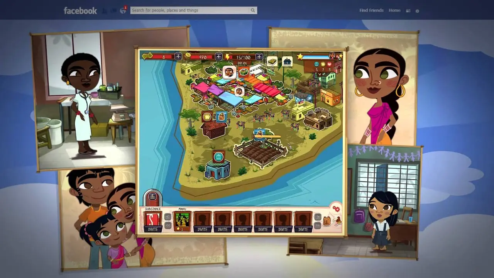
The Game è un'avventura basata su un gioco che mira a raggiungere il pubblico mainstream per raccogliere consapevolezza e donazioni per dare potere alle donne e alle ragazze di tutto il mondo.

<http://www.halftheskymovement.org>

### Il destino del mondo

Fate of the World è un drammatico gioco di strategia globale che mette il nostro futuro nelle vostre mani. Il gioco presenta una serie di scenari drammatici basati sulle ultime scoperte scientifiche che coprono i prossimi due secoli. Dovrete gestire l'equilibrio tra la protezione delle risorse e del clima della Terra e le esigenze di una popolazione mondiale in continua crescita.

<https://www.soothsayergames.com>

## Altri giochi per il bene sociale

**Mondo senza petrolio**  
Anch'esso creato da McGonigal, i giocatori di questo gioco vengono calati in un mondo in cui le risorse petrolifere sono state sfruttate e in cui devono essere creativi per sopravvivere alla massiccia carenza globale. La parte migliore del gioco? Insegna modi semplici per usare meno petrolio nel mondo reale, abitudini che i giocatori riferiscono di aver mantenuto anche quando non giocano.  
[sito web](http://www.worldwithoutoil.org)

**FoldIt**  
FoldIt è un gioco online di ripiegamento delle proteine che permette a un quarto di milione di giocatori di contribuire alla ricerca scientifica stabilizzando stringhe di aminoacidi. Pensate a questo gioco come a un Tetris biologico: FoldIt fa una gara di riconoscimento di schemi biologici, portando a soluzioni innovative a problemi che hanno frustrato le comunità scientifiche per anni.  
[sito web](http://fold.it/portal)

**VIA**   
Comunicare tra lingue e culture diverse non è facile. Ma in questo gioco online, due giocatori anonimi - provenienti da diverse località del mondo - devono imparare a parlarsi mentre superano gli ostacoli. Sviluppato da CoCo & Co, questo gioco ha ottenuto il massimo riconoscimento ai Games for Change Awards di quest'anno.  
[sito web](http://www.makeourway.com/)

**Eroe del bilancio**    
Pensate di essere in grado di far quadrare il bilancio nazionale? Allora vorrete giocare a questo gioco dell'American Public Media, che permette ai giocatori di vedere cosa succede al deficit nazionale quando aumentano i finanziamenti ai programmi o scelgono di fare tagli difficili. "Ogni membro del Congresso dovrebbe essere obbligato a giocare a questo gioco", ha detto uno dei suoi creatori.  
[sito web](http://www.marketplace.org/topics/economy/budget-hero)

**Squadra del dolore**  
Ai bambini e agli adolescenti malati di cancro viene spesso chiesto di tenere un diario del dolore, un documento che non solo è noioso ma che focalizza l'attenzione sul loro disagio. L'app per iOS Pain Squad rende l'intero processo divertente e interattivo, aiutando al contempo i medici a fornire trattamenti migliori ai giovani pazienti.  
[sito web](http://www.campaignpage.ca/sickkidsapp/)

**Spesa**  
Quando il conto in banca è in attivo, è facile pensare che chiunque possa tirarsi fuori dalla povertà con le proprie gambe. Ma in questo gioco online, i giocatori devono cercare lavoro sopravvivendo con 1.000 dollari al mese, evidenziando che la povertà e la disoccupazione sono sistematiche e non solo il risultato di difetti caratteriali.  
[playspent.org](http://playspent.org/)

**Evoca**  
Creato dall'Istituto della Banca Mondiale in collaborazione con McGonigal, questo gioco è un corso accelerato di innovazione sociale della durata di 10 settimane, che propone ai giocatori sfide che vanno dalla "sicurezza alimentare" alla "resilienza urbana", incoraggiandoli a diventare un gruppo di riflessione sulle sfide locali.  
[www.urgentevoke.com](http://www.urgentevoke.com)

## Formazione e simulazione

📽 #VIDEO [Costruire città migliori con i giochi](https://www.ted.com/talks/karoliina_korppoo_how_a_video_game_might_help_us_build_better_cities/)
<iframe width="937" height="527" src="https://www.youtube.com/embed/qYUmI5kGsYk" title="Come un videogioco potrebbe aiutarci a costruire città migliori | Karoliina Korppoo" frameborder="0" allow="accelerometro; autoplay; clipboard-write; encrypted-media; giroscopio; picture-in-picture" allowfullscreen></iframe>

Alcuni titoli:
- [Democracy](https://positech.co.uk/democracy/) - gioco di strategia politica
- [Simulatore di volo](https://www.flightsimulator.com)
- [Lost Earth 2307](https://www.iosb.fraunhofer.de/en/projects-and-products/lost-earth-2307.html) - interpretazione di immagini, militare
- [Simulatore di navi](https://www.shipsim.com) - Ricerca e salvataggio marittimo
- [SchaVIS](https://www.youtube.com/watch?v=xMvV7oOJozw) - Simulazione e prevenzione delle inondazioni
- Sharkworld](https://www.xmediaworks.nl/en/portfolio-items/sharkworld-a-project-management-game/) - Formazione sulla gestione dei progetti
- [Houthoff Buruma](https://annex.fandom.com/wiki/Houthoff_Buruma_The_Game) - reclutamento e valutazione

## Giochi commerciali
Per i giochi selezionati cerchiamo di estrarre le **connessioni curriculari** (argomenti di apprendimento) e le **possibili competenze insegnate**.

## Avventura

### Casa sparita

Un gioco di esplorazione in prima persona in cui il giocatore veste i panni di Kaitlin Greenbriar, una studentessa di ritorno da un viaggio all'estero. La cosa più sconcertante è la scomparsa della sorella minore di Kaitlin, Sam, che è sparita, anche se non senza lasciare traccia. Per determinare cosa sia successo a Sam, il giocatore deve seguire gli indizi e le annotazioni del diario per scoprire i numerosi segreti nascosti nella casa.

> **Collegamenti curriculari:** arti linguistiche inglesi; studi narrativi; apprendimento sociale ed emotivo; alfabetizzazione ai media.  
> **Possibili competenze insegnate:** Narrazione ambientale; sviluppo del personaggio; genere; narrazione lineare vs. non lineare; meccaniche di gioco e narrazione; intertestualità; presa di prospettiva.

### I morti che camminano
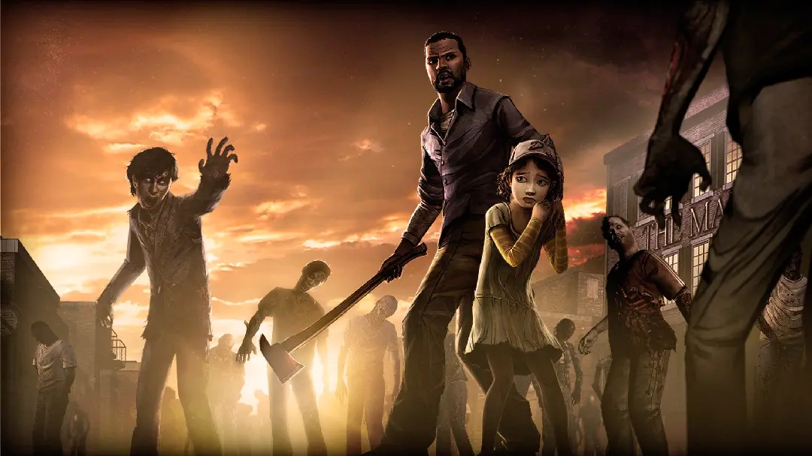

The Walking Dead racconta la storia di Lee Everett, un insegnante di Atlanta che si trova nel bel mezzo di un'apocalisse zombie. Durante il gioco, il giocatore impersona Lee attraverso le prove e le sfide che lui e gli altri sopravvissuti devono superare. Il gameplay è piuttosto semplice e consiste principalmente nel controllare Lee per esplorare l'ambiente circostante e scegliere le sue battute di dialogo nelle conversazioni con gli altri personaggi. Il giocatore deve agire per conto di Lee in difficili e complessi dilemmi morali.

> **Collegamenti curriculari:** Filosofia morale, etica, norme sociali, storia delle idee.  
> **Possibili abilità insegnate:** Processo decisionale; pensiero sistemico; abilità di pensiero di ordine superiore, come causa ed effetto; pensiero critico; riflessione; connessioni tra gioco e sé; connessioni tra gioco e mondo; mindfulness

Suggerimenti:
1. Gli insegnanti dovrebbero giocare all'episodio che utilizzeranno almeno due volte, poiché la conoscenza approfondita del gioco è fondamentale per creare le necessarie connessioni curricolari.
2. Gli insegnanti dovrebbero incoraggiare gli studenti a basare le loro argomentazioni su teorie etiche e non solo sulla loro "sensazione istintiva".

### Life is Strange
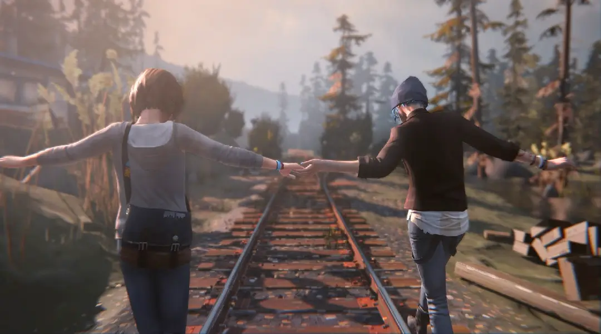

Il giocatore assume il ruolo del personaggio femminile Max Caulfield, una studentessa diciottenne di fotografia, che cerca di salvare gli abitanti della città da un tornado catastrofico che potrebbe abbattersi sulla baia. Giocando in terza persona, il giocatore controlla i movimenti del personaggio di Max per esplorare gli ambienti di gioco, scoprire le storie del gioco attraverso il coinvolgimento di Max in vari eventi e prendere decisioni che cambiano la vita di Max in base alle scelte offerte dalla narrazione ramificata del gioco.

Il giocatore si trova di fronte a diversi dilemmi morali che gli impongono di prendere decisioni che, in ultima analisi, potrebbero giovare a un personaggio ma causare conseguenze devastanti per un altro.

Inoltre, il giocatore può annullare le conseguenze attivando la meccanica di gioco dell'orologio che si riavvolge per viaggiare a punti temporali precedenti e prendendo decisioni diverse che possono plasmare gli eventi futuri.

> **Collegamenti curriculari:** Filosofia; etica; logica; arti linguistiche inglesi; competenze sociali ed emotive.  
> **Possibili abilità insegnate:** Analisi filosofica; analisi etica; progettazione narrativa; pensiero logico; analisi dei dilemmi morali; progettazione narrativa

### Assassin's Creed (serie)

La serie comprende dieci capitoli di gioco standard, ognuno dei quali copre epoche e luoghi cronologici diversi, con un arco narrativo che va dall'Egitto tolemaico alla Terra Santa ai tempi della terza crociata, all'Italia rinascimentale, alle Americhe nell'era coloniale e alla Rivoluzione francese. Il gioco è incentrato sull'esplorazione del mondo aperto, sulla raccolta di indizi e prove e sulla raccolta o consegna di informazioni.

> **Collegamenti curriculari**: Storia del mondo; culture del mondo; arte; apprendimento della lingua inglese; apprendimento delle lingue; storia dell'arte e dell'architettura; storia coloniale; storia dei pirati; musica.  
> **Competenze possibili insegnate**: apprezzamento dell'arte e dell'architettura; apprezzamento della musica; risoluzione di problemi basati su compiti; comprensione di ascolto e lettura (ESL, lingue straniere); processo decisionale etico; argomentazione; empatia; analisi di dilemmi morali.

### The Legend of Zelda: Breath of the Wild

Questo gioco proietta il giocatore in un vasto paesaggio a mondo aperto, dando a Link la completa libertà di esplorare le numerose ambientazioni del gioco, affrontando una pletora di avventure, mostri ed enigmi. Poiché il gioco incoraggia la sperimentazione e l'esplorazione, ogni giocatore può modellare la storia in base al proprio ritmo e alle proprie capacità.

> **Collegamenti curricolari:** Abilità sociali ed emotive; gestione  
> **Competenze possibili insegnate**: Concentrazione, organizzazione, gestione del tempo; memoria di lavoro; funzione esecutiva.

**Suggerimenti 

1. Dopo che gli studenti hanno giocato a Breath of the Wild, gli insegnanti devono assicurarsi che abbiano compreso come le abilità di funzionamento esecutivo sono state utilizzate nel gioco.
2. Un modo in cui gli insegnanti possono sostenere la riflessione sulle abilità utilizzate nel gioco è incoraggiare gli studenti a scrivere esempi specifici di quando il completamento delle missioni ha richiesto l'uso di ciascuna abilità.

## Piattaforma

### Braid

BRAID è un'avventura a scorrimento laterale. Ognuno dei sei mondi del gioco è caratterizzato da una diversa **meccanica di gioco a tempo variabile** che viene utilizzata per decifrare una serie di **enigmi sconvolgenti**. A seconda del livello e della circostanza, il tempo può rallentare, i nemici possono muoversi in avanti o indietro a seconda della direzione in cui il nostro piccolo eroe vestito di blu sta correndo, o l'orologio può fermarsi del tutto. **I giocatori possono riavvolgere il tempo** a piacimento in qualsiasi momento e in qualsiasi livello.

### Mai soli
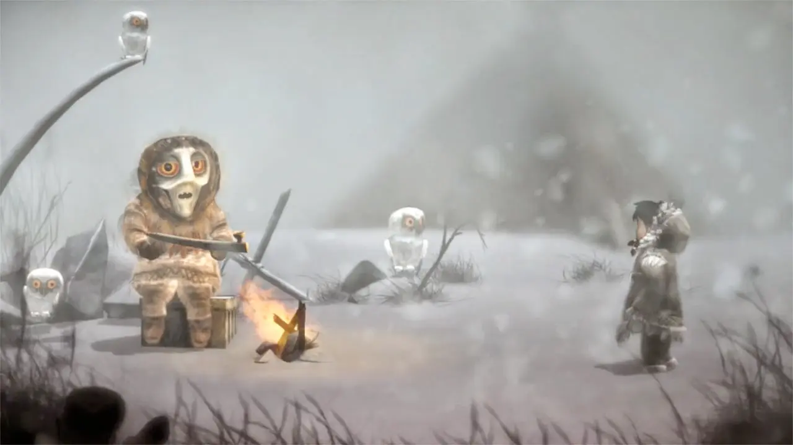

In Never Alone si gioca nei panni di una giovane ragazza Inupiat, Nuna, che parte per un viaggio alla scoperta della fonte di una bufera eterna che minaccia di distruggere il suo villaggio. Lungo la strada incontra una volpe artica e una serie di creature spiritiche che la aiutano nel suo viaggio. Never Alone è un puzzle platform in cui il giocatore può controllare sia Nuna che la sua compagna volpe artica per risolvere una serie di enigmi che richiedono la comprensione del funzionamento di vari strumenti Inupiat, elementi ambientali (ad esempio, animali selvatici e condizioni atmosferiche) e PNG (di solito sotto forma di creature spiritiche Inupiat). 

> **Collegamenti curriculari:** Studi sociali; apprendimento sociale ed emotivo  
> **Possibili abilità insegnate:** Pensiero sistemico; collaborazione; processo decisionale

### Super Mario Maker 2

## Puzzle

### Continua a parlare e nessuno esplode
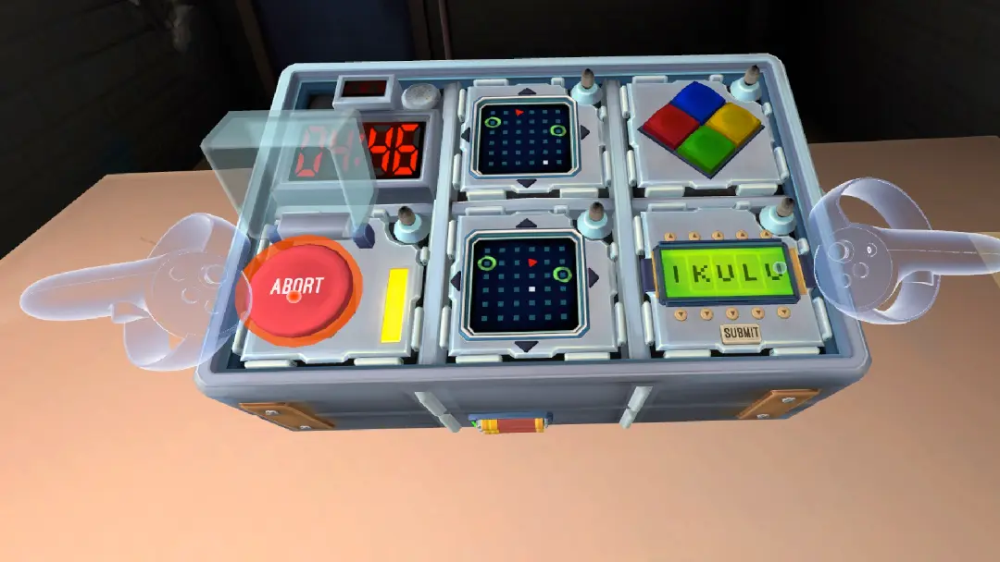
Keep Talking and Nobody Explodes è un gioco cooperativo di puzzle in realtà virtuale (VR), in cui i giocatori devono disinnescare una bomba in un numero specifico di minuti. Il gioco mette i giocatori in uno dei due ruoli, il giocatore VR e l'esperto manuale. Il giocatore VR indossa una cuffia per la realtà virtuale, mentre gli esperti manuali accedono a una risorsa separata chiamata manuale della bomba. Una volta avviato il gioco, il giocatore VR viene trasportato in una stanza senza finestre, in stile esame di polizia, con la bomba e alcuni strumenti. Ogni bomba è composta da un timer e da una serie di moduli contenenti simboli complessi o regole. Il giocatore VR può vedere, manipolare, ruotare e spostare la bomba e gli altri oggetti nella stanza. Al contrario, l'esperto di manuali non può vedere la bomba ma può consultare il manuale della bomba.

**Collegamenti curriculari**: Informatica; comunicazione; arti linguistiche inglesi; lettura. 
**Possibili abilità insegnate**: Logica; risoluzione di problemi; comunicazione verbale; comprensione della lettura; lavoro di squadra.

### Tre!
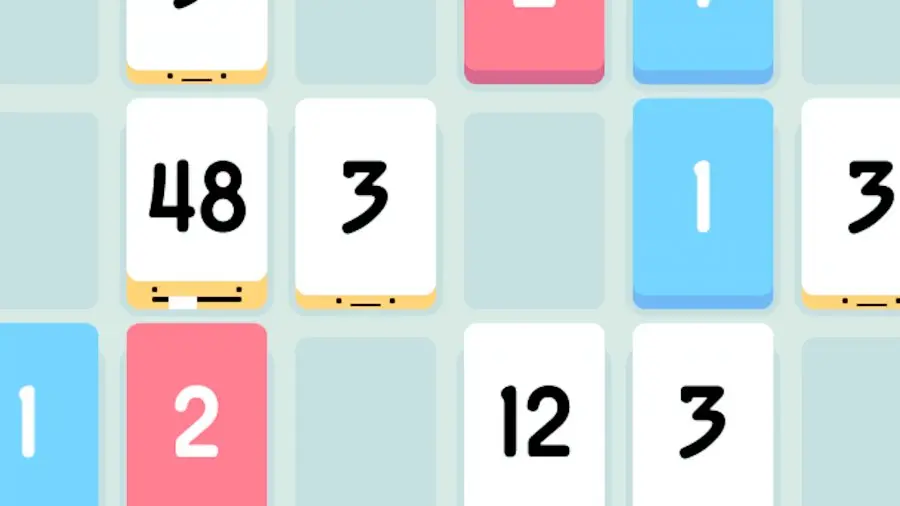
**Collegamenti curriculari**: matematica 
**Possibili abilità insegnate**: Logica; Risoluzione di problemi

### Ruzzle
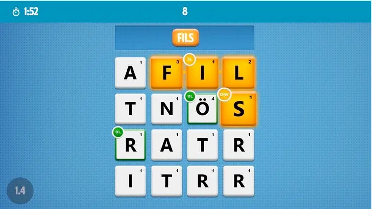
**Collegamenti curriculari**: comunicazione; lettura 
**Competenze possibili insegnate**: Logica; Risoluzione di problemi; Comunicazione verbale; Comprensione della lettura; Lavoro di squadra.

### Monument Valley
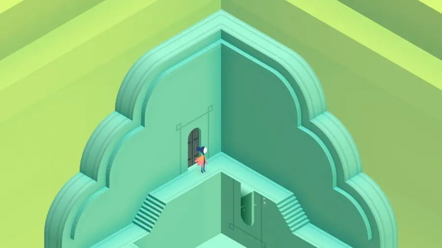
Monument Valley è un puzzle game ispirato a MC Escher che piega l'architettura e segue una principessa silenziosa attraverso un mondo affascinante. 
Ciò che lo rende unico sono i paesaggi del gioco. I giocatori possono trascinare e ruotare parti di alcuni edifici per creare un percorso da un'area all'altra. In altre aree, invece, calpestando i quadrati di attivazione si cambia la gravità e si cammina lungo il lato di un muro. La fisica del gioco si basa sulla percezione, quindi se si riesce a posizionare gli elementi in modo che sembri esserci un percorso, lo si può utilizzare, anche se quel percorso non esisterebbe nel mondo reale.

### La stanza

> **Collegamenti curriculari:** matematica; studi sociali; arte; studi sui media; informatica; psicologia; sociologia; antropologia; biologia; chimica  
> **Possibili competenze insegnate:** alfabetizzazione informativa; ragionamento quantitativo; pensiero critico; alfabetizzazione tecnologica; programmazione

### Portale 2

Portal 2 (Valve Corporation, 2011) è il sequel dell'originale Portal, entrambi giochi puzzle-platform in prima persona di enorme popolarità in cui il giocatore si muove nell'ambiente sparando portali iniziali e finali in superfici altrimenti scollegate, creando così un collegamento attraverso il quale il giocatore può muovere gli oggetti, incluso se stesso. Il gioco richiede una **estrema acutezza spaziale** ed è stato rapidamente riconosciuto per il suo potenziale utilizzo per **l'apprendimento della fisica, della risoluzione dei problemi e del pensiero critico**.

> **Collegamenti curriculari:** Fisica, geometria, arti della lingua inglese; apprendimento sociale ed emotivo.
> **Possibili competenze insegnate:** Capacità di comunicazione; lavoro di squadra; risoluzione di problemi; pensiero critico; pensiero logico; analisi spaziale; competenze in materia di occupazione/carriera.

> Come utilizzare Portal 2 in un'aula di STEM/Fisica: [leggi qui](https://www.foundry10.org/programs/games-and-learning/portal-2)

## Gioco di ruolo

### Serie Final Fantasy

**Collegamenti curriculari:** Letteratura moderna; fantascienza; studi culturali; studi sui media, discipline umanistiche; psicologia; studi urbani.  
**Possibili abilità insegnate:** pensiero critico, creatività, giudizio etico

### World of Warcraft

World of Warcraft (WoW) è uno dei primi e più grandi giochi di ruolo online multigiocatore di massa (MMORPG) su abbonamento. WoW offre ai giocatori due fazioni (Alleanza e Orda) che competono e collaborano per proteggere il loro mondo, Azeroth, dalle minacce esterne e interne. I giocatori possono partecipare a un mix di attività come missioni **individuali** e **collaborative**, professioni di raccolta e crafting, raid, campi di battaglia, arene, chat di testo sociali e private e una casa d'aste combinata con offerte aperte. I giocatori possono anche scegliere se giocare individualmente, unirsi a gruppi fino a 40 giocatori o entrare in gilde con 100 membri.

> **Collegamenti curriculari:** Contabilità; economia; gestione della catena di approvvigionamento  
> **Possibili competenze insegnate:** Ricerche di mercato; bilanci; marketing; fogli di calcolo contabili; trading.

### Deus EX - Human Revolution

Un ambiente cyberpunk immersivo, con una grafica sorprendente, una narrazione ricca di suspense e una caratterizzazione convincente. L'azione si sposta, come nei romanzi cyberpunk, tra megalopoli o centri urbani. La narrazione e il gameplay del gioco ruotano attorno al transumanesimo.

**Collegamenti curriculari:** Letteratura moderna; fantascienza; studi culturali; studi sui media, scienze umane; psicologia; studi urbani.  
**Possibili abilità insegnate:** pensiero critico, creatività, giudizio etico

## Sparatutto

### DOOM
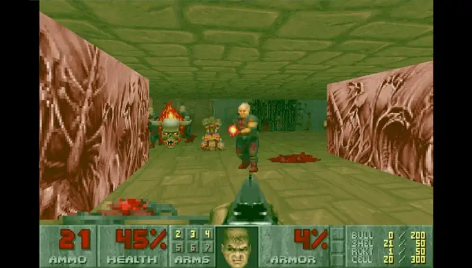

### Call of Duty
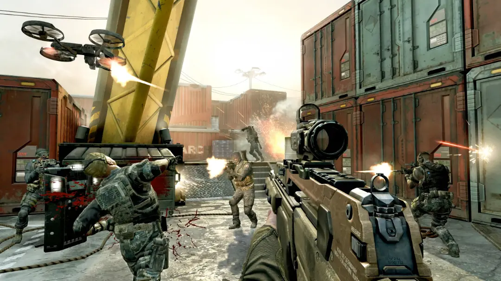
Nella campagna **per singolo giocatore**, il giocatore assume il ruolo di vari personaggi, tra cui un marine degli Stati Uniti e un agente del SAS (Special Air Service) britannico. La prospettiva del giocatore cambia a seconda del personaggio e dell'evolversi della trama attraverso eventi non giocabili e missioni giocabili. Le missioni includono tipicamente obiettivi basati sull'eliminazione di nemici, il superamento di checkpoint, la protezione di obiettivi contro gli aggressori o la distruzione di una postazione nemica. Nella versione **multigiocatore**, la serie utilizza queste meccaniche per varie modalità a squadre e deathmatch in varie mappe.

> **Collegamenti curriculari:** Storia, politica, relazioni internazionali, etica.   
> **Possibili abilità insegnate:** Processo decisionale etico; progettazione etica; analisi di dilemmi morali, progettazione narrativa

### Fortnite

Fortnite è un gioco d'azione online pubblicato da Epic Games nel 2017. È ambientato in un futuro prossimo e adotta una prospettiva in terza persona e un'estetica cartoonesca. Include tre diverse modalità.

- Fortnite: **Battle Royale** imita la formula di PlayerUnknown's Battlegrounds presentando un sistema ludico in cui fino a 100 giocatori si sfidano in modalità uno contro uno o squadra contro squadra.
- Fortnite: **Salva il mondo** è un'esperienza di sopravvivenza cooperativa in cui quattro giocatori sono chiamati a completare diverse missioni contro il gioco. I compiti comprendono l'uccisione di nemici, la raccolta di materiali e la costruzione di rifugi per fermare gli eserciti di zombie.
- Fortnite **Creativo** è una modalità creativa che fornisce diversi strumenti di modifica. I giocatori possono costruire e realizzare diverse strutture e oggetti su isole personalizzate.

> **Collegamenti curriculari:** Teoria critica; culture digitali; tecnologia educativa; apprendimento sociale ed emotivo.  
> **Possibili competenze insegnate:** Pensiero collaborativo; pensiero connettivista; creatività; pensiero critico; alfabetizzazione ai social media.

## Sport

### NBA2K14

**Collegamenti curriculari:** Studi sociali; biomeccanica; economia; biometria; gestione **Abilità possibili insegnate:** Pensiero sistemico; collaborazione; processo decisionale; vocabolario di gioco critico; pensiero critico; consapevolezza storica

## Strategia

### Civiltà 

I giocatori guidano una civiltà dall'età del bronzo al prossimo futuro, in competizione con altri esseri umani o con un computer intelligente artificialmente, guadagnando punti in base alla potenza e all'avanzamento della loro civiltà. Prima di iniziare una partita, i giocatori scelgono una delle diverse civiltà da guidare, ciascuna con abilità di gioco uniche basate sulle circostanze o sui risultati ottenuti dalle loro controparti reali.

> **Collegamenti curriculari:** Storia; geografia; educazione civica; economia; sociologia.  
> **Possibili abilità insegnate:** pensiero critico; sperimentazione; analisi costi-benefici; cooperazione; apprendimento basato sull'indagine

**Suggerimenti
1. Gli insegnanti dovrebbero prendersi del tempo per imparare la struttura, i comandi e le meccaniche del gioco prima di introdurvi gli studenti.
2. Gli studenti potrebbero provare una certa frustrazione iniziale quando imparano a giocare.
3. Gli insegnanti possono esplorare argomenti specifici creando il proprio gioco o scenario personalizzato.
In rete si possono trovare centinaia di mod gratuite create dai giocatori.

### Pandemic
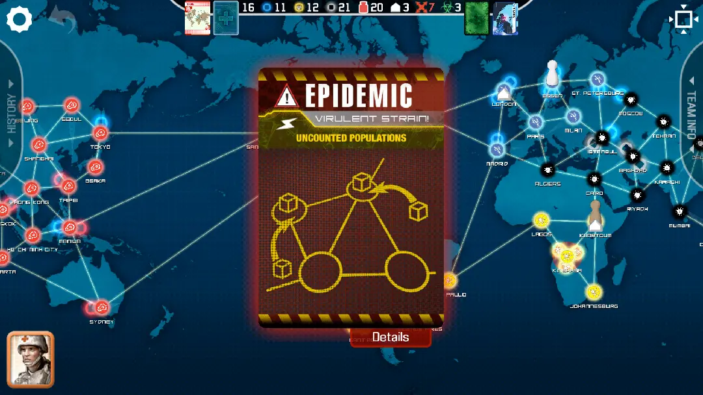
Pandemic è un gioco cooperativo in cui una squadra di giocatori assume ruoli unici (ad esempio, medico, scienziato, ricercatore) come membri di un'organizzazione sanitaria globale incaricata di combattere le epidemie di malattie e, infine, di curare quattro contagi che emergono in tutto il pianeta. I giocatori si trovano a dover scegliere collettivamente come impiegare al meglio le proprie risorse individuali per affrontare le condizioni sanitarie immediate o sviluppare un piano a lungo termine per curare ogni malattia.

**Connessioni curriculari:** Politica pubblica; epidemiologia; salute; biologia; apprendimento sociale ed emotivo; scienze dell'informazione.  

**Possibili competenze insegnate:** Costruzione di algoritmi; previsione basata sulle probabilità; argomentazione; retorica; collaborazione; comunicazione; advocacy; pianificazione; processo decisionale; logica.

### SimCity
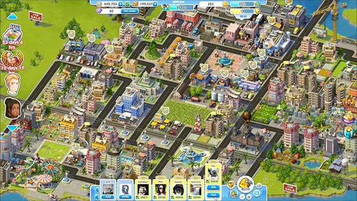

SimCity è un videogioco di simulazione con l'obiettivo principale di sviluppare una città fiorente partendo da una piccola città. I giocatori controllano lo sviluppo della città definendo le zone di sviluppo, installando infrastrutture tecniche (ad esempio, strade e acquedotti) e fornendo servizi (ad esempio, scuole e vigili del fuoco). Il tipo di zona di sviluppo (industriale, commerciale o residenziale) determina i tipi di edifici che vengono costruiti automaticamente nella zona. Durante il gioco, i giocatori devono costantemente garantire condizioni di sviluppo equilibrate, come il rispetto del budget e la soddisfazione dei cittadini.

**Collegamenti curriculari**: pianificazione urbana e regionale, sviluppo urbano, geografia urbana, elaborazione di politiche (governative), infrastrutture tecniche, studi ambientali.

**Possibili competenze insegnate:** pensiero sistemico, pianificazione e controllo del sistema, sviluppo del sistema, concetto di sostenibilità.

### Questa mia guerra

A differenza di un tipico gioco di guerra in cui i giocatori assumono solitamente il ruolo di soldati capaci, questo gioco mette il giocatore nei panni di un gruppo di civili che vivono in una città assediata cercando di sopravvivere, con l'obiettivo di promuovere l'empatia e la consapevolezza dei conflitti armati del mondo reale.

**Connessioni curriculari:** Apprendimento sociale ed emotivo; etica; game design.
**Competenze possibili insegnate:** Empatia; dilemmi morali; processo decisionale; progettazione narrativa
**Suggerimenti
1. Il gioco può estendersi al di fuori della classe per un'esperienza più completa.
2. Per uno studio più avanzato, gli studenti possono iniziare il gioco con un profilo di personaggio più debole per sfidare la moralità e le capacità decisionali del giocatore.

## Giochi casuali

### Fancade

Fancade è un'enorme raccolta di giochi semplici. Giocate immediatamente o create il vostro gioco usando i blocchi di costruzione drag-n-drop!

[www.fancade.com](https://www.fancade.com)

## Sandbox

### Minecraft

Minecraft è un gioco open-world che offre ai giocatori la possibilità di esplorare e creare senza limiti. Il gioco si svolge in un ambiente 3D pixelato che assomiglia a un mondo naturale con molti biomi diversi (ad esempio, foreste, tundra e deserti). Ogni elemento del mondo è costituito da blocchi di materiali corrispondenti. Ad esempio, gli alberi sono costituiti da blocchi di legno e i minerali da blocchi di minerale. I giocatori possono rompere e raccogliere questi blocchi usando le mani o gli strumenti creati nel gioco con i materiali trovati. La sopravvivenza è l'obiettivo principale di Minecraft, che si basa sulla capacità dei giocatori di mantenere la propria salute e il proprio benessere.

**Connessioni curricolari:** Conoscenze fondamentali (arti della lingua inglese, geografia); metaconoscenze (causa ed effetto, esperienza narrativa); conoscenze umanistiche (competenza culturale).   
**Possibili competenze insegnate:** Scrittura; pensiero critico; esplorazione; sperimentazione; causa ed effetto; mappatura; costruzione; progettazione; creatività; gestione delle risorse; comunicazione.

[www.minecraft.net](https://www.minecraft.net)

### Programma Spaziale Kerbal
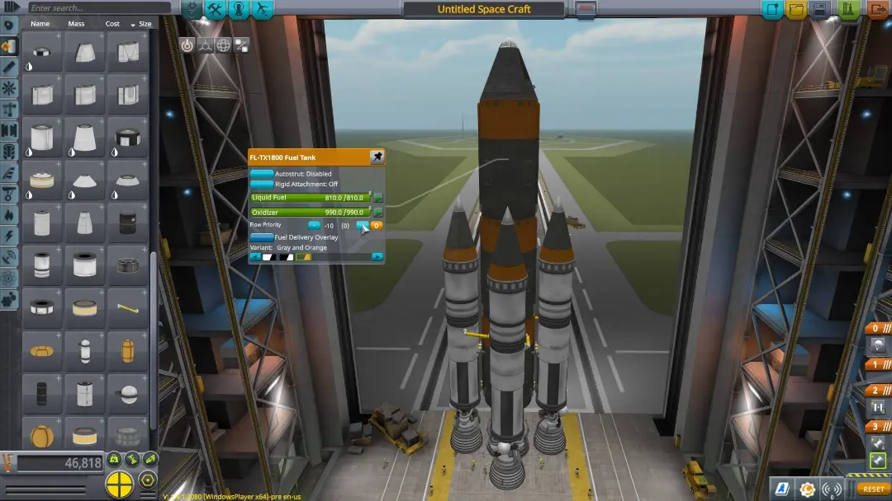

Gestisci il programma spaziale della razza aliena nota come Kerbals. Hai accesso a una serie di parti per assemblare veicoli spaziali completamente funzionanti che volano (o non volano) sulla base di una fisica aerodinamica e orbitale realistica. Lanciate il vostro equipaggio Kerbal in orbita e oltre (mantenendolo in vita) per esplorare lune e pianeti del sistema solare Kerbol, costruendo basi e stazioni spaziali per espandere la portata della vostra spedizione.  

[www.kerbalspaceprogram.com](https://www.kerbalspaceprogram.com)

---
## Revisione dell'unità
- descrivete un videogioco che conoscete e le sue connessioni con il curriculum e le possibili competenze insegnate
