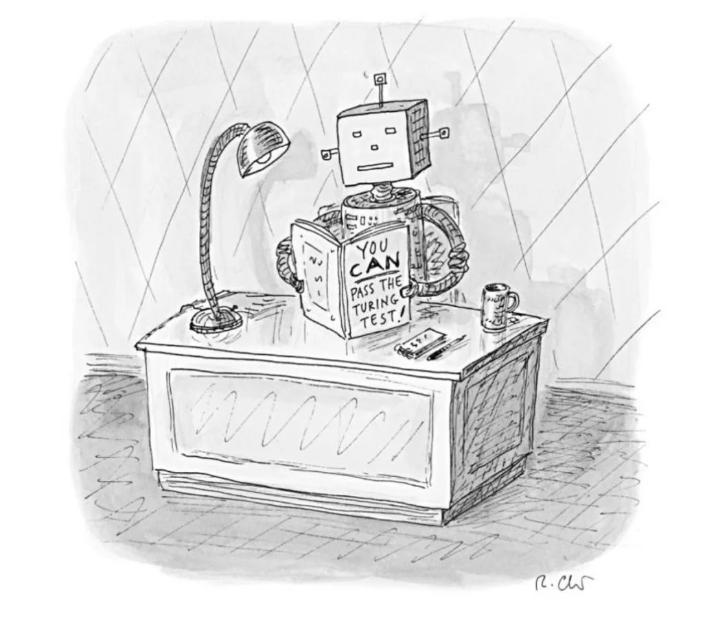
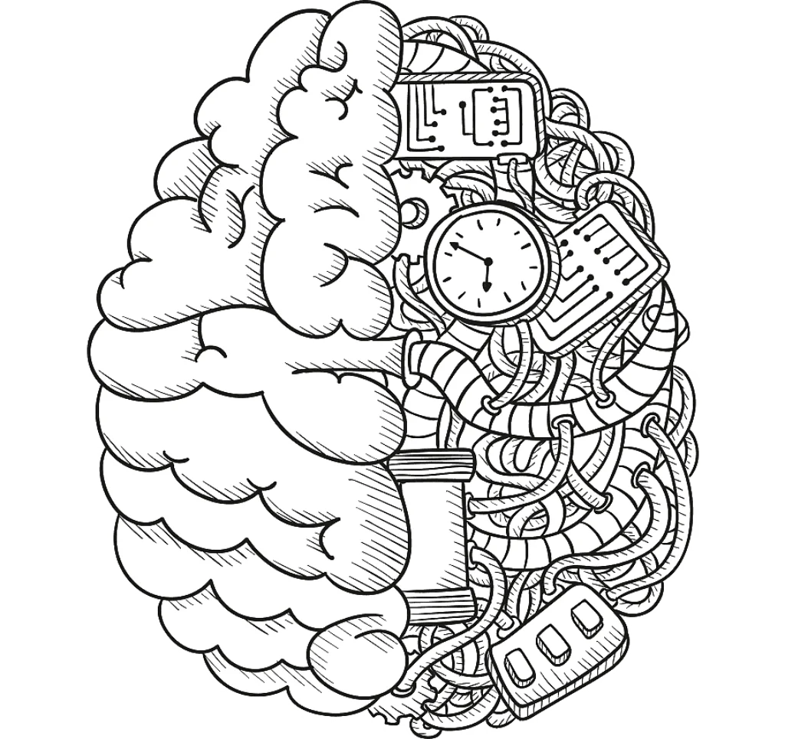

# Introduzione

L'Intelligenza Artificiale (Artificial Intelligence, A.I.) tenta di replicare e simulare l'intelligenza e il comportamento umano imitando come il cervello umano elabora le informazioni (*reverse engineering*). Ad esempio, le **reti neurali artificiali** sono modellate sul modo in cui funziona il cervello umano.

Gli esseri umani hanno un apparato sensitivo composto da **cinque sensi** di base: visivo, uditivo, cinestetico (movimento), olfattivo e gustativo, un apparato di elaborazione dei segnali, e un apparato per esprimere le azioni nel mondo:

- Sentire
- Pensare
- Agire

sono le principali funzioni di un eventuale "Agente Intelligente"

- Ascoltare e parlare
- Comprensione del linguaggio (Natural Language Processing (NLP)
- Vedere (Computer vision)
- Ricordare le cose
- Pensare ( Common sense reasoning and Decision Making)
- Muoversi

## Introduzione alla AI
  - storia: inizio anni 50, Turing per giocare a scacchi senza computer
  - modellare l'intelligenza
  - deterministici
  - Deep Blu fine anni '90
  - Narrow/Weak AI & Strong (true) AI / AGI
  - big data & GPU power -> ML

## AI & Videogames

L'intelligenza artificiale nei giochi riguarda la creazione di giochi più reattivi, adattivi e stimolanti. E anche se gli accademici sostengono che l'intelligenza artificiale dei giochi non è vera intelligenza artificiale, l'entusiasmo intorno alla tecnologia è in continua crescita ed è diventato un concetto importante in molti giochi. 

## Cosa può fare?

Con l'intelligenza artificiale i giochi sono in grado di fornire un'esperienza migliore ai loro giocatori. La creazione di situazioni realistiche per progredire nei giochi aggiunge entusiasmo al gameplay. La crescente complessità nei giochi con l'intelligenza artificiale migliora il coinvolgimento dei giocatori. 

A grandi linee le tree aree di utilizzo della AI nei giochi sono:

- giocare (NPG e player)
- creazione di contenuti
- analizzare il gameplay e modellare il giocatore

### 1. NPCs (non-player characters)

<https://youtu.be/u3j59Z3iXdM>

Qui è dove l'AI viene utilizzata di più nei giochi. Questi sono personaggi del gioco che agiscono in modo intelligente come se fossero controllati da giocatori umani. Il comportamento di questi personaggi è determinato da algoritmi e motori di intelligenza artificiale. Molto spesso vengono usati "alberi decisionali" per guidare il comportamento di questi NPC.
Questi comportamenti possono anche essere ricreati "imitando" giocatori umani.

### 2. Pathfinding

Il pathfinding implica spostarsi da un punto all'altro.
L'intero panorama del gioco è la parte più importante del pathfinding. 

### 3. Decision-making

L'AI consentirà alle decisioni che prendi di avere un impatto maggiore sul gameplay. Ad esempio, in Red Dead Redemption 2, il comportamento degli NPC e la loro interazione con te dipendono da variabili come le macchie di sangue sui tuoi vestiti o il tipo di cappello che indossi. Poiché esiste un'enorme matrice di possibilità, l'intero mondo di gioco potrebbe essere manipolato dalle tue decisioni. Potrebbero esserci relazioni causa-effetto estremamente complicate.

### 4. Game Analytics e Data mining

L'intelligenza artificiale consente ai game designer di eseguire **data mining sul comportamento dei giocatori** per aiutarli a capire come le persone finiscono per giocare, le parti che le persone giocano di più e cosa fa sì che gli utenti smettano di giocare . Ciò consente agli sviluppatori di giochi di migliorare il gioco o identificare opportunità di monetizzazione.

Le AI possono giocare lo stesso gioco su diverse piattaforme per identificare eventuali specifici bug

### 5. Procedural content generation

L'intelligenza artificiale nei giochi può creare automaticamente nuovi contenuti, storie interattive, condizioni ambientali, livelli e persino musica.

### 6. Player experience modeling

L'intelligenza artificiale del gioco può capire l'abilità e lo stato emotivo del giocatore, quindi adattare il gioco in base a quello. Ciò potrebbe anche comportare un bilanciamento dinamico della difficoltà del gioco in cui la difficoltà del gioco viene regolata in tempo reale, a seconda dell'abilità del giocatore. L'intelligenza artificiale nei giochi potrebbe persino aiutare a capire l'intenzione del giocatore.

## Che tipi di AI ci sono nei giochi?

I tipi più comuni di AI nei videogiochi sono:

### Tecniche Deterministiche

Le tecniche deterministiche sono le più utilizzate. Il comportamento deterministico  è molto prevedibile. Non c'è alcun elemento di incertezza. Sono tecniche piuttosto veloci e facili da implementare, comprendere, testare e debuggare. Il problema è che i metodi deterministici costringono gli sviluppatori ad anticipare tutti i possibili scenari e pre-codificare tutto il comportamento. Questi metodi non consentono l'apprendimento o l'evoluzione, il che rende i comportamenti del gioco prevedibili e potenzialmente limitanti la durata del gioco stesso.

### Tecniche Non Deterministiche

Opposto al comportamento deterministico, il comportamento non deterministico ha un certo livello di incertezza (che dipende dal metodo di AI utilizzato). Se vuoi avere un'idea migliore di cosa si tratta, basta guardare un NPC che apprende le mosse e le tattiche di un giocatore e si adatta per contrastarle.
Gli sviluppatori non avranno nemmeno bisogno di anticipare tutti i possibili scenari o comportamenti. Questi metodi possono persino apprendere ed estrapolare da soli e agevolare un comportamento che emerge senza che ci siano istruzioni esplicite.

## I vantaggi dell'AI nei giochi

Alcuni benefici sono

### 1. I giochi diventano più intelligenti e realistici

Usando tecniche come l'apprendimento dei pattern e il **reinforcement learning**, gli NPC nei giochi si evolvono grazie all'autoapprendimento dalle loro azioni. I giochi diventano anche piuttosto realistici perché interpretano e rispondono anche alle azioni del giocatore. Ci sono anche molti programmi che non necessitano di interfacce umane e sono in grado di creare automaticamente mondi virtuali.

### 2. Risparmio di tempo e costi

Normalmente, lo sviluppo di un gioco richiede molto tempo e denaro da investire in esso. E non sei nemmeno sicuro di quanto bene il mercato accetterà il gioco. L'intelligenza artificiale può aiutare a ridurre drasticamente il tempo necessario per creare un gioco e risparmiare molte risorse che verrebbero spese per lo sviluppo del gioco.

### 3. Rendere i giochi più intuitivi

L'uso dell'intelligenza artificiale nei giochi aiuta a rendere i giochi più intuitivi. Inoltre, il gioco può capire l'abilità e l'esperienza del giocatore e regolare il livello di difficoltà del gioco in tempo reale.

### 4. Eliminare la prevedibilità

Il gioco diventa imprevedibile quando viene utilizzato un comportamento non deterministico. Ciò che accade nel gioco non può nemmeno essere previsto dallo sviluppatore del gioco. Questo crea un'esperienza sempre nuova e aumenta la durata del gioco poiché il gioco non diventa prevedibile e noioso dopo averlo giocato alcune volte.

## Vincoli e limitazioni

- Di solito si suppone che il gioco fornisca intrattenimento e sfida piuttosto che sia "ottimale", quindi anche se una AI avesse l'approccio migliore contro gli umani, questo spesso non è ciò che si desidera.
- Spesso è necessario che gli agenti appaiano "realistici", in modo che i giocatori possano sentire che stanno gareggiando contro avversari quasi umani. Il programma AlphaGo è stato in grado di diventare molto migliore degli umani, ma le mosse scelte erano così lontane dalla comprensione tradizionale del gioco che avversari esperti direbbero che "mi sembrava quasi di giocare contro un alieno". Se un gioco sta simulando un avversario umano, questo è in genere indesiderabile, quindi l'algoritmo dovrebbe essere ottimizzato **per prendere decisioni credibili piuttosto che ideali.**
- Deve essere eseguito in "tempo reale", l'algoritmo non può monopolizzare l'utilizzo della CPU per lungo tempo per prendere una decisione. Anche impiegare solo 10 millisecondi per prendere una decisione è troppo perché la maggior parte dei giochi ha solo tra 16 e 33 millisecondi per eseguire tutta l'elaborazione per il fotogramma successivo della grafica.
- È ideale se almeno una parte del sistema sia `data-driven` anziché codificata, in modo che i *non* programmatori possano apportare modifiche e che possano essere apportate più rapidamente.
