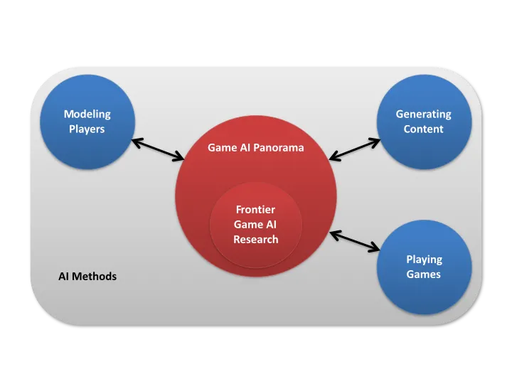

# Introduzione

## Introduzione alla A.I.
  - storia: inizio anni 50, Turing per giocare a scacchi senza computer
  - modellare l'intelligenza
  - deterministici
  - Deep Blu fine anni '90
  - Narrow/Weak AI & Strong (true) AI / AGI
  - AI e Videogiochi
	  - giocare (NPG e player)
	  - creare contenuti
	  - analizzare gameplay e modellare il giocatore
  - big data & GPU power -> ML

- Computer vision
- Natural Language Processing (NLP)
- Common sense reasoning

## AI & Videogames

## What is AI in gaming?

AI in gaming is about creating more responsive, adaptive & challenging games through the use of artificial intelligence. And even though academics argue that game AI is not true AI, the hype around the technology has been continuously growing for quite a while. It has become a major concept in a lot of games. 

## Why does AI matter in gaming?

With AI, games are able to provide a better experience to their gamers. Creating life-like situational developments to progress in the games adds excitement to the gameplay. Increasing complexity in games with AI ensures gamers are hooked to the game. With the rise of different gaming devices gamers expect to have an immersive experience across various devices. Developers can provide a console-like experience across all platforms with AI.

### 1. NPCs (non-player characters)

<https://youtu.be/u3j59Z3iXdM>

NPCs or non-player characters are where Game AI is used the most. These are characters in the game who act intelligently as if they were controlled by human players. These characters’ behavior is determined by artificial intelligence algorithms and engines. Quite often, decision trees are used to guide the behavior of these NPCs.   

### 2. Pathfinding

Pathfinding involves getting from one point to another. The whole gaming landscape is the most important part of pathfinding. The game AI can generate the game landscape or the game world as you go through the game world. The AI can get feedback from your moves, your playing style, in-game decisions, appearance, and techniques, and create the landscape according to that.

### 3. Decision-making

AI will let the decisions that you make have a bigger impact on the gameplay. For example, in Red Dead Redemption 2, the behavior of NPCs and their interaction with you depend on variables like blood stains on your clothes or the type of hat that you are wearing. Since there is an enormous matrix of possibilities, the whole game world could be manipulated by your decisions. There could be extremely complicated cause-and-effect relationships.

NPCs can even learn from player behavior and adapt according to their tactics  

### 4. Data mining

Artificial intelligence allows game designers and studios to perform **data mining on player behavior** to help them get an understanding of how people end up playing the game, the parts that people play the most, and what causes users to stop playing the game. This allows game developers to improve game play or identify monetization opportunities.

Data is mined from player behavior

### 5 Procedural content generation

Artificial intelligence in gaming can create new content, interactive stories, environmental conditions, levels, and even music automatically. 

### 6 Player experience modeling

Game AI can figure out the ability and emotional state of the player, and then tailor the game according to that. This could even involve dynamic game difficulty balancing in which the difficulty of the game is adjusted in real-time, depending on the player's ability. AI in gaming could even aid in figuring out the player’s intent.

### 7 Cheating

The most common type of cheating used by NPCs is when the NPCs make use of information that is not available to the players in that situation. As an example, in a combat game, an NPC might be given human-like senses like seeing and hearing, but they might just cheat by checking the player’s position on the game engine. Other types of cheating include the [AI system](https://www.engati.com/) granting NPCs greater speeds to catch up with players in racing games or allowing them to re-spawn in beneficial positions (eg. giving them the higher ground) in first-person games.   

Cheating is useful in certain games because without cheating, it would be much easier for the human player to beat the system after a few attempts.
  

## What are the kinds of AI in games?

The most common types of AI in gaming techniques are:

### 1 Deterministic AI techniques

Deterministic AI techniques are the most widely used AI in gaming techniques. Deterministic behaviour or performance is specified and is very predictable. There isn’t any element of uncertainty involved in these techniques. They are rather quick and easy to implement, understand, test, and debug. The issue is that deterministic methods force developers to anticipate all the possible scenarios and code all the behaviour themselves. These methods don’t even allow for learning or evolving, which makes the game’s behaviours predictable after a little gameplay and even has a limiting effect on the game’s play-life.

### 2 Nondeterministic AI techniques

This is basically the opposite of deterministic behaviour. Nondeterministic behaviour has some level of uncertainty (which depends on the AI method that is used and how well that AI method is understood). If you want to get a better idea of what this is all about, just look at an NPC that learns the moves and tactics of a player and adapts to counter them. For such learning, a neural network, Bayesian technique, or genetic algorithm could be used.  

The game developers won’t even need to anticipate all the possible scenarios and code behaviours according to them. These methods can even learn and extrapolate on their own and promote emergent behaviour - behaviour that emerges without there being explicit instructions.

## The benefits of AI in games

AI brings an enormous amount of benefits to the gaming industry. Some of these are:

### 1 The games become smarter and more realistic

Using techniques like pattern learning and [reinforcement learning](https://www.engati.com/glossary/reinforcement-learning), the NPCs in the games evolve by self-learning from their actions. The games also become rather realistic because they interpret and respond to the player’s actions as well. There also are a lot of programs that do not need human interfaces and are able to create virtual worlds automatically.

### 2 Saves on costs and time

Normally, developing a game requires a lot of time and money to be invested into it. And you aren’t even sure how well the market will accept the game. AI can help dramatically reduce the time taken to build a game and save a lot of resources that would be spent on developing the game.

### 3 Makes it easier for the user to play

Using AI in games helps make the games more intuitive. In addition to this, the game can use AI to figure out the user’s ability and expertise with the game, and adjust the difficulty level of the game in real-time to match that.

### 4 Eliminates the predictability of the game

The game becomes unpredictable when nondeterministic behaviour is used. This means that what happens in the game can’t even be predicted by the developer of the game. This creates a novel, refreshing experience and increases the game’s play-life since the game does not become predictable and boring after playing it a few times.

