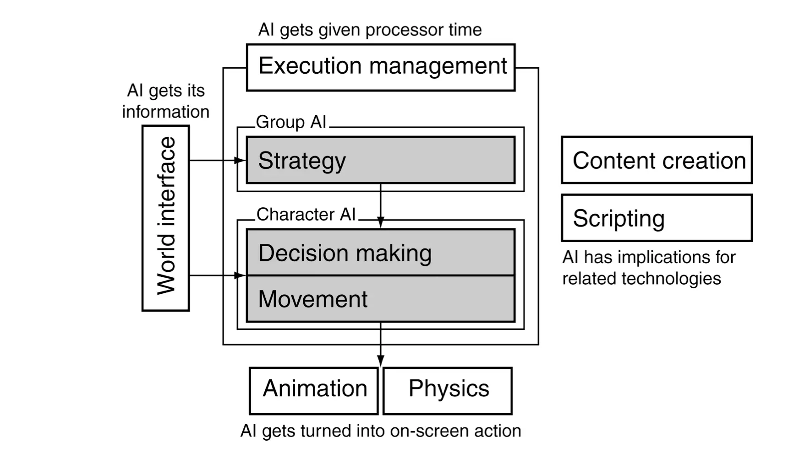
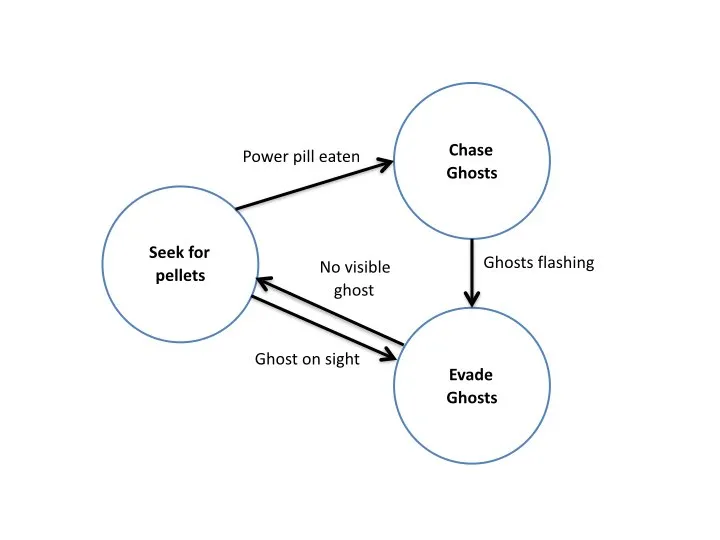
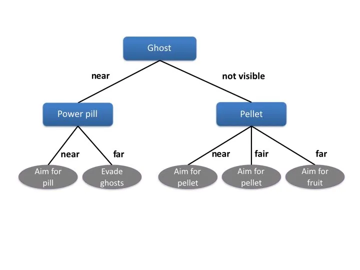
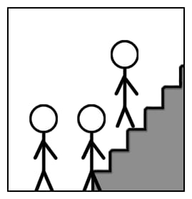
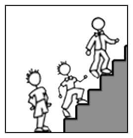
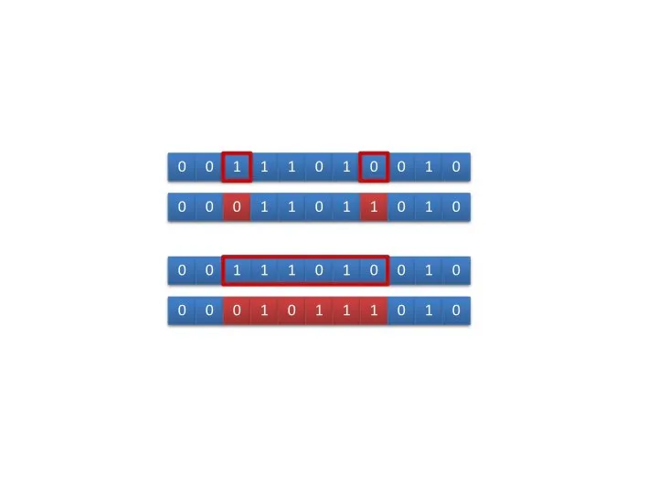

# Metodi AI nei videogiochi

>  Knowing when to be complex and when to stay simple is the most difficult element of the game AI programmer’s art.

## AI Model

## Ad-Hoc Behavior Authoring
Il metodo *classico*, e tutt'ora più usato per controllare gli NPC dei videogiochi: Finite state machines, behavior trees and utility-based AI.

### FSM

3 componenti:
1. **stati**: contiene la descrizione dello stato in cui si trova
2. **transizioni**: condizioni che fanno passare da uno stato all'altro
3. **azioni**: cosa succede durante uno stato

Pro: semplici da progettare, implementare, visualizzare e debuggare.
Cons: complessi da progettare su larga scala. Non facili da estendere, non sono flessibili nè dinamici, impossibile "evolverli" una volta consolidati.
Risultati un po' troppo prevedibili (salvo iniettare fuzzy e probabilità nelle transizioni)

### Behavior Trees

Un Behavior Tree (BT) è un sistema simile al FSM, che modella la transizione tra un numero finito di insiemi di azioni (tasks, o behaviour).

Pros: rispetto agli FSM: modularità. si possono comporre comportamenti molto complessi partendo da semplici tasks.

Sono composti da Behaviour anzichè Stati in una stuttura ad albero con un nodo iniziale e n childs.
L'albero viene attraversato da sinistra a destra con una frequenza (ticks) e ogni nodo può ritornare questi valori:
1. **run** se attivo
2. **success** se completato
3. **failure** se fallisce

I Nodi sono di tre tipi
**sequence**
se figlio *succeds*, continua al seguente. *Succeds* quando finiscono tutti i figli, altrimenti *failure*

**selector**: probability o priority
si seleziona un nodo figlio. se succeds, esso stesso succeds.
se figlio failure, se ne seleziona un altro (by priority) oppure failure (probability).

**decorator**
arricchisce il nodo figlio: ad esempio ne nega il risultato, oppure lo fa andare n volte (repeater)

> [📖 Intro to BT](https://www.gamasutra.com/blogs/ChrisSimpson/20140717/221339/Behavior_trees_for_AI_How_they_work.php)  
> [📽 Intro to BT](https://www.youtube.com/watch?v=uq8hnnkAxsw)  
> [📽 Behavior Designer](https://www.youtube.com/watch?v=T_of4_jRoJA)  

### Utility-based AI

Utility è la funzione che misura la razionalità di una scelta.
Usata per valutare la bontà di un percorso di scelte, "campionando" lo rappresentazione dello spazio.
Ci possono essere poi funzioni euristiche per approssimare e velocizzare il calcolo, loss, cost, or error per minimizzare.

*Learning = Maximize Utility (Representation)*

Serve per creare sistemi di Decision-making
Ogni istanza nel gioco viene dotata di una funziona Utility che ne restituisce l'importanza.
Una funzione può misurare qualsiasi cosa di osservabile (distanza, salute) o deducibile (emozioni / minaccia)

Esempio di Behaviour Ms PacMan

Esempio **scelta arma di un agente NPC**, si misurano: 

**Range** a seconda della distanza dell'avversario si assegna una utility all'arma. 

**Inertia** durata dell'arma corrente, per non cambiarla troppo spesso. 

**Random noise** effetto random così che non seleziona _sempre_ la stessa arma nella stessa situazione. 

**Ammo** livello attuale di munizioni

**Indoors** penalizza alcune arme all'interno di edifici (esempio granate)

L'agente controlla e chiama regolarmente la Utility di tutte le armi disponibili e seleziona la migliore

### Random / Fuzzy / Noise
queste sono versioni base. per renderle meno deterministiche si usano tecniche di random e fuzzy.

### Hybrid / Composition
questi metodi possono essere composti.

## Tree Search 
*Tutta la AI è fondamentalmente una ricerca* di una pianificazione, di un path, di un modello, di una funzione, etc. e gli algoritmi di ricerca sono il cuore.

### Uninformed Search
cercano tutto lo spazio senza un goal preciso
1. Depth-first search
2. Breadth-first search

### Best-First Search
si ha un'idea del goal finale e una funzione che ne misura la distanza

### Pathfinding: **A* star**
esplora i nodi adiacenti, misurandone il costo e la distanza dal goal finale.
Funzioane bene sia in 2D che in 3D.
[intro to A*](https://www.redblobgames.com/pathfinding/a-star/introduction.html)

A* può essere usato anche per navigare negli spazi degli stti di gioco, non solo navigazione fisica. utile per il PLANNING. (vedi Mario A*)

### Decision Tree Learning

### Mini Max

**AI in boardgames**
[📽 How does a Board Game AI Work? (Connect 4, Othello, Chess, Checkers) - Minimax Algorithm Explained](https://www.youtube.com/watch?v=y7AKtWGOPAE)

[📽 Algorithms Explained – minimax and alpha-beta pruning](https://www.youtube.com/watch?v=l-hh51ncgDI)

### Monte Carlo Tree Search
se l'albero ha troppi rami e troppo profondo, mini max non funziona bene.

Giochi deterministici come Go, Scacchi e Dama, a informazione imperfetta come Battaglia Navale, Poker, Bridge o giochi non deterministici quali il backgammon e il Monopoly necessitano di un altro algoritmo: MCTS che si avvicina al Minimax.

Come fa MCTS a gestire forte ramificazione, mancanza di buone funzioni per la valutazioen degli stati, la mancanza di informazione e di determinismo?
1. non cerca tutti i rami, ma solo i più promettenti
2. bypassa la mancanza di funzioni, _giocando casualmente_ una partita fino a quel livello di profondità

MCTS può essere interrotto quando si vuole. necessita solo di due cose. le regole del gioco e una funzioen di valutazione dello stato finale (win, loss, draw, score)

gli steps sono:
1. Selection (si sceglie il nodo da espandere)
2. Expansion (radom si sceglie in figlio non espanso)
3. Simulation (si gioca casualmente fino alla fine)
4. Backpropagation (il reward viene propagato indietro)

## GOAP
vedere [GOAP](12_GOAP.md)

## Navigation Flocking
- **Separation**: Each boid needs to maintain a minimum distance with neighboring boids to avoid hitting them (short-range repulsion) 
- **Alignment**: Each boid needs to align itself with the average direction of its neighbors, and then move in the same velocity with them as a flock 
- **Cohesion**: Each boid is attracted to the group's center of mass (long-range attraction) 

## Locomotion

<https://youtu.be/fQlQQSsC47g?t=279>

## Sensori

## Evolutionary Computation / Genetic algorithm

Un algoritmo genetico è un approccio più sofisticato basato sull'idea di evoluzione naturale. Imita la selezione naturale scegliendo gli individui più forti per produrre la prole della generazione successiva.

I GA sono ampiamente utilizzati per scopi di ottimizzazione. I GA sono stati utilizzati nei giochi da tavolo che utilizzavano varie strategie di ricerca per trovare le mosse migliori in passato. Adattare il comportamento degli NPC con le moderne applicazioni di GA li aiuta a difendersi da tattiche forti ma prevedibili che i giocatori umani potrebbero usare. 

### Ottimizzazione
è necessaria una utility function, evaluation function o fitness function che restituisca la un valore numerico con la bontà (fitness) della soluzione, da massimizzare o minimizzare.
L'ottimizzazione è il procedimento di cercare nello *spazio di ricerca* una soluzione che abbia il massimo o minimo valure di fitness.
Si cerca di rappresentare una soluzione come un array di valori (es. le azioni per uscire da un labirinto) da modificare con tecniche prese dalla genetic evolutiva: si cambia un gene o una seguenza, casualmente

### Local Search
**deterministic** hill climber: si cercano tutti gli adiacenti (solo per piccole variazioni)

1. Init: Se crea una soluzione *s* casuale nello spazio.
2. si generano tutti i vicini a s (un vicino è una soluzione che si discosti un minimo).
3. si valutano tutti i vicini (fitness)
4. se nessuno è migliore, si tiene s
5. Altrimenti si ricomincia con il nuovo s' -> 2

**gradient-based** hill climber: cerca il gradiente minimo o massimo di modifica della utility

1. Init: Se crea una soluzione *s* casuale nello spazio.
2. MUTAZIONE: si genera s' mutandolo
3. VALUTAZIONE di s'
4. se s' è migliore, si tiene s'
5. -> 2

### Evolutionary Algorithms
cercano nello spazio _globale_, non soltanto nella adiacenze della attuale soluzione.

SI generano molte soluzione, si buttano via quelle minori e si tengono le migliori. come nella selezione naturale o evoluzioen Darwiniana.

L'idea è che se troviamo due buon soluzioni, una soluzione che ne sia una combinazione o intermediazione potrebbe essere altrettanto buona se non migliore.

