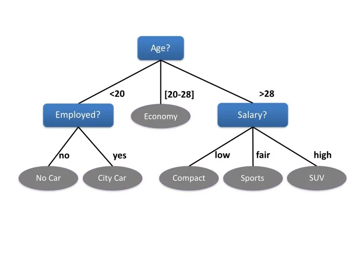
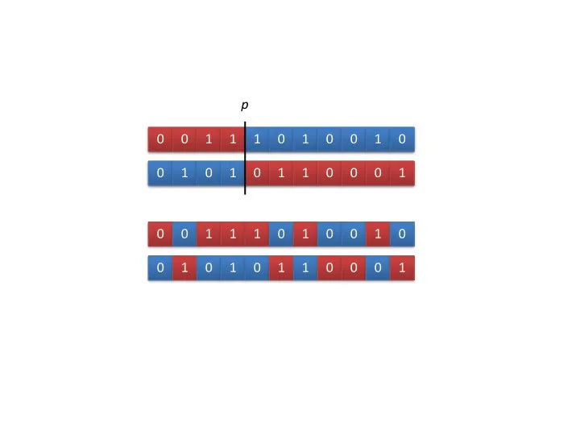

# Metodi AI nei videogiochi

>  Knowing when to be complex and when to stay simple is the most difficult element of the game AI programmer’s art.

## AI Model


## Ad-Hoc Behavior Authoring
Il metodo *classico*, e tutt'ora più usato per controllare gli NPC dei videogiochi: Finite state machines, behavior trees and utility-based AI.

### FSM


3 componenti:
1. **stati**: contiene la descrizione dello stato in cui si trova
2. **transizioni**: condizioni che fanno passare da uno stato all'altro
3. **azioni**: cosa succede durante uno stato

Pro: semplici da progettare, implementare, visualizzare e debuggare.
Cons: complessi da progettare su larga scala. Non facili da estendere, non sono flessibili nè dinamici, impossibile "evolverli" una volta consolidati.
Risultati un po' troppo prevedibili (salvo iniettare fuzzy e probabilità nelle transizioni)

#### H-FSM: un po più complessa


SI possono costruire sistemi di decisione abbastanza complessi, però le transizioni sono collegate allo stato attuale (che è quello che vogliamo, di solito).


### Behavior Trees


Un Behavior Tree (BT) è un sistema simile al FSM ma le cui transizioni non solo collegate allo stato attuale, ma sono più generali.


Ad esempio, se la salute di un agente è scesa al 25%, potresti desiderare che fugga indipendentemente dal fatto che sia attualmente in combattimento, indle, in conversazione o in qualsiasi altro stato, e non vuoi dover ricordare per aggiungere quella condizione a ogni stato che potresti mai aggiungere a un personaggio in futuro. E se il game designer in seguito afferma di voler modificare la soglia dal 25% al 10%, dovresti quindi passare attraverso la transizione pertinente di ogni singolo stato e modificarla.

Sono composti da Behaviour anzichè Stati in una stuttura ad albero con un nodo iniziale e n childs.
L'albero viene attraversato da sinistra a destra con una frequenza (ticks) e ogni **nodo** può ritornare questi valori:
1. **running** se attivo
2. **success** se completato
3. **failure** se fallisce

I Nodi tipo sono:

**Composite:**
**selector**: probability o priority
si seleziona un nodo figlio. se succeds, esso stesso succeds.
se figlio failure, se ne seleziona un altro (by priority) oppure failure (probability).

**sequence**
se figlio *succeds*, continua al seguente. *Succeds* quando finiscono tutti i figli, altrimenti *failure*

**decorator**
arricchisce il nodo figlio: una condizione, oppure lo fa andare n volte (repeater) o lo elabora


**Pros**: rispetto agli FSM: modularità. si possono comporre comportamenti molto complessi partendo da semplici tasks.


> [📖 Intro to BT](https://www.gamasutra.com/blogs/ChrisSimpson/20140717/221339/Behavior_trees_for_AI_How_they_work.php)  
> [📽 Intro to BT](https://www.youtube.com/watch?v=uq8hnnkAxsw)  
> [📽 Behavior Designer](https://www.youtube.com/watch?v=T_of4_jRoJA)  

### Utility-based AI

Utility è la funzione che misura la razionalità di una scelta.
Usata per valutare la bontà di un percorso di scelte, "campionando" lo rappresentazione dello spazio.
Ci possono essere poi funzioni euristiche per approssimare e velocizzare il calcolo, loss, cost, or error per minimizzare.

*Learning = Maximize Utility (Representation)*

```
Utility Calculation

FindingHelp:
If enemy visible and enemy is strong and health low return 100 else return 0

Fleeing:
If enemy visible and health low return 90 else return 0

Attacking:
If enemy visible return 80

Idling:
If currently idling and have done it for 10 seconds already, return 0, else return 50

Patrolling:
If at end of patrol route, return 0, else return 50
```

Serve per creare sistemi di Decision-making
Ogni istanza nel gioco viene dotata di una funziona Utility che ne restituisce l'importanza.
Una funzione può misurare qualsiasi cosa di osservabile (distanza, salute) o deducibile (emozioni / minaccia)

Esempio di Behaviour Ms PacMan


Esempio **scelta arma di un agente NPC**, si misurano: 

**Range** a seconda della distanza dell'avversario si assegna una utility all'arma. 

**Inertia** durata dell'arma corrente, per non cambiarla troppo spesso. 

**Random noise** effetto random così che non seleziona _sempre_ la stessa arma nella stessa situazione. 

**Ammo** livello attuale di munizioni

**Indoors** penalizza alcune arme all'interno di edifici (esempio granate)

L'agente controlla e chiama regolarmente la Utility di tutte le armi disponibili e seleziona la migliore

### Random / Fuzzy / Noise
queste sono versioni base. per renderle meno deterministiche si usano tecniche di random e fuzzy.

#### Markov Models


## N-Grams
Valutiamo l'individuazione di combinazioni di giochi di combattimento? Questa è una situazione simile, in cui vogliamo prevedere uno stato futuro basato sullo stato passato (per decidere come bloccare o eludere un attacco), ma piuttosto che guardare un singolo stato o evento, vogliamo cercare sequenze di eventi che compongono una mossa combinata.

Sequenza di mosse del giocatore:

Kick  
Kick  
_none_  
Punch  
Kick, Punch  
_none_  
Kick  
Kick, Punch, Kick  
Kick, Punch, Kick  
Kick  
Kick, Punch, Kick, Kick  
Punch, Kick, Kick  
**Punch**  
**Kick, Punch, Kick, Kick, Punch**  
**Kick, Kick, Punch**  
Block  
Kick, Punch, Kick, Kick, Punch, Block  
Kick, Punch, Block  
Kick  
Kick, Punch, Kick, Kick, Punch, Block, Kick  
Punch, Block, Kick  
Kick  
Kick, Punch, Kick, Kick, Punch, Block, Kick, Kick  
Block, Kick, Kick  
**Punch**  
**Kick, Punch, Kick, Kick, Punch, Block, Kick, Kick, Punch**  
**Kick, Kick, Punch**  

l'AI può vedere che il giocatore dopo kick + kick fa Punch. (attivando la combo) e quindi poter prendere contromisure.

Queste sequenze di eventi si chiamano: N-Grams
https://en.wikipedia.org/wiki/N-gram


## Tree Search 
*Tutta la AI è fondamentalmente una ricerca* di una pianificazione, di un path, di un modello, di una funzione, etc. e gli algoritmi di ricerca sono il cuore.

### Uninformed Search
cercano tutto lo spazio senza un goal preciso
1. Depth-first search
2. Breadth-first search

### Best-First Search
si ha un'idea del goal finale e una funzione che ne misura la distanza

### Pathfinding: **A* star**
esplora i nodi adiacenti, misurandone il costo e la distanza dal goal finale.
Funzioane bene sia in 2D che in 3D.
[intro to A*](https://www.redblobgames.com/pathfinding/a-star/introduction.html)

A* può essere usato anche per navigare negli spazi degli stti di gioco, non solo navigazione fisica. utile per il PLANNING. (vedi Mario A*)


### Decision Tree Learning



### Mini Max


L'algoritmo minimax è un algoritmo per la ricerca della mossa migliore in un gioco a somma zero che si svolge tra due giocatori. L'algoritmo minimax è utilizzato nella teoria delle decisioni quando i giocatori si trovano in interazione strategica
È finalizzato a minimizzare la massima perdita possibile di ciascun giocatore. L'algoritmo minimax consente di individuare le scelte migliori dei due giocatori nel corso del gioco, analizzando a ritroso l'albero di gioco a partire dai nodi terminali, ossia dalle possibili situazioni in cui può terminare il gioco ( fine gioco ), e risalendo progressivamente fino alla posizione corrente dei giocatori.

**AI in boardgames**
[📽 How does a Board Game AI Work? (Connect 4, Othello, Chess, Checkers) - Minimax Algorithm Explained](https://www.youtube.com/watch?v=y7AKtWGOPAE)


[📽 Algorithms Explained – minimax and alpha-beta pruning](https://www.youtube.com/watch?v=l-hh51ncgDI)

### Monte Carlo Tree Search
se l'albero ha troppi rami e troppo profondo, mini max non funziona bene.

Giochi deterministici come Go, Scacchi e Dama, a informazione imperfetta come Battaglia Navale, Poker, Bridge o giochi non deterministici quali il backgammon e il Monopoly necessitano di un altro algoritmo: MCTS che si avvicina al Minimax.

Come fa MCTS a gestire forte ramificazione, mancanza di buone funzioni per la valutazioen degli stati, la mancanza di informazione e di determinismo?
1. non cerca tutti i rami, ma solo i più promettenti
2. bypassa la mancanza di funzioni, _giocando casualmente_ una partita fino a quel livello di profondità

MCTS può essere interrotto quando si vuole. necessita solo di due cose. le regole del gioco e una funzioen di valutazione dello stato finale (win, loss, draw, score)

gli steps sono:
1. Selection (si sceglie il nodo da espandere)
2. Expansion (radom si sceglie in figlio non espanso)
3. Simulation (si gioca casualmente fino alla fine)
4. Backpropagation (il reward viene propagato indietro)


## GOAP


vedere [GOAP](12_GOAP.md)

## Navigation Flocking / BOIDS
Gestisce l'interzione tra forme di vita artificiale (boid), che si muovono in uno spazio tridimensionale.

Video: <https://www.youtube.com/watch?v=QbUPfMXXQIY>

- **Alignment**: ogni boid deve allinearsi con la direzione media dei suoi vicini, quindi muoversi con loro alla stessa velocità, come in uno stormo 
- **Separation**: ogni boid deve mantenere una distanza minima con i boidi vicini per evitare di colpirli (short-range repulsion) 
- **Cohesion**: ogni boid è attratto dal centro di massa del gruppo (long-range attraction) 

## Movimento e Locomotion
Oltre al movimento in se (animazione) sono importanti due funzioni:

- SEEK (per trovare qualcosa o qualcuno)
- PATH FOLLOW (per seguire un percorso)
si modifica costantemente la propria direzione per seguire dei punti di percorso


<https://youtu.be/fQlQQSsC47g?t=279>


## Sensori

## Evolutionary Computation / Genetic algorithm

Un algoritmo genetico è un approccio più sofisticato basato sull'idea di evoluzione naturale. Imita la selezione naturale scegliendo gli individui più forti per produrre la prole della generazione successiva.

I GA sono ampiamente utilizzati per scopi di ottimizzazione. I GA sono stati utilizzati nei giochi da tavolo che utilizzavano varie strategie di ricerca per trovare le mosse migliori in passato. Adattare il comportamento degli NPC con le moderne applicazioni di GA li aiuta a difendersi da tattiche forti ma prevedibili che i giocatori umani potrebbero usare. 

### Ottimizzazione
è necessaria una utility function, evaluation function o fitness function che restituisca la un valore numerico con la bontà (fitness) della soluzione, da massimizzare o minimizzare.
L'ottimizzazione è il procedimento di cercare nello *spazio di ricerca* una soluzione che abbia il massimo o minimo valure di fitness.
Si cerca di rappresentare una soluzione come un array di valori (es. le azioni per uscire da un labirinto) da modificare con tecniche prese dalla genetic evolutiva: si cambia un gene o una seguenza, casualmente

### Local Search
**deterministic** hill climber: si cercano tutti gli adiacenti (solo per piccole variazioni)

1. Init: Se crea una soluzione *s* casuale nello spazio.
2. si generano tutti i vicini a s (un vicino è una soluzione che si discosti un minimo).
3. si valutano tutti i vicini (fitness)
4. se nessuno è migliore, si tiene s
5. Altrimenti si ricomincia con il nuovo s' -> 2

**gradient-based** hill climber: cerca il gradiente minimo o massimo di modifica della utility

1. Init: Se crea una soluzione *s* casuale nello spazio.
2. MUTAZIONE: si genera s' mutandolo
3. VALUTAZIONE di s'
4. se s' è migliore, si tiene s'
5. -> 2


### Evolutionary Algorithms
cercano nello spazio _globale_, non soltanto nella adiacenze della attuale soluzione.

SI generano molte soluzione, si buttano via quelle minori e si tengono le migliori. come nella selezione naturale o evoluzioen Darwiniana.

L'idea è che se troviamo due buon soluzioni, una soluzione che ne sia una combinazione o intermediazione potrebbe essere altrettanto buona se non migliore.


