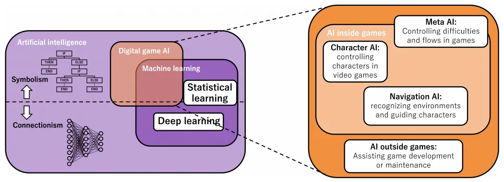
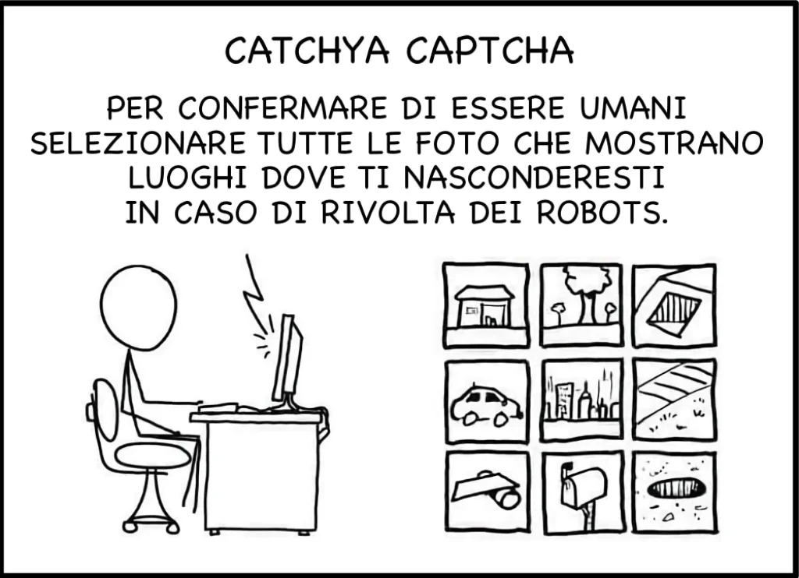
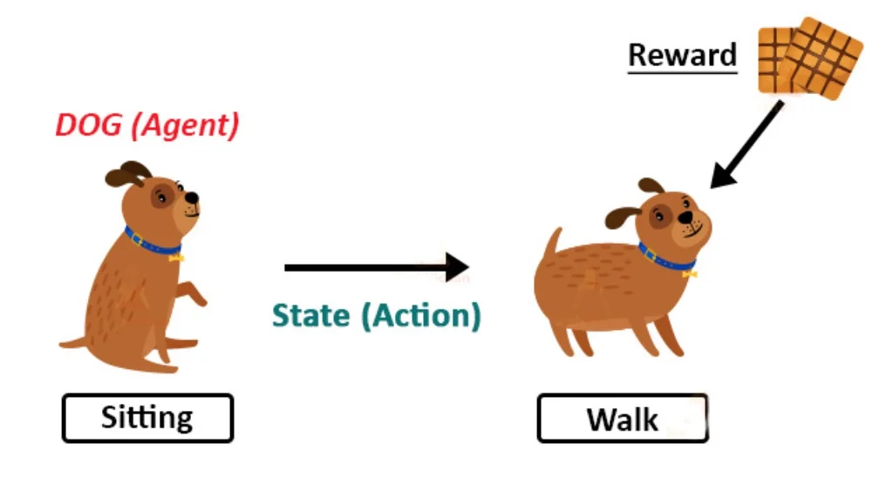
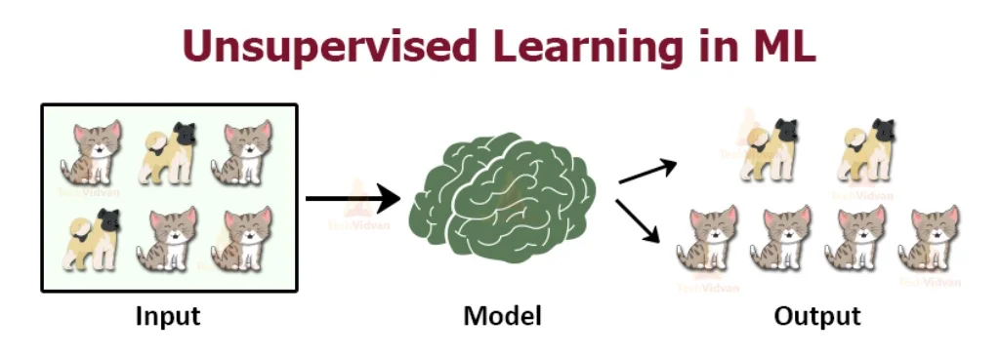

# Machine Learning

> How to construct computer programs that automatically improve with experience. (Tom Mitchell)

> Addestrare le macchine a trovare la soluzione migliore ad un problema imparando dai dati e dai propri errori.

**Come si insegna ad una macchina a riconoscere un gatto?**  
<https://www.youtube.com/watch?v=LrGdHmHkfUk>  
<iframe loading="lazy" title="Come si insegna ad una macchina a riconoscere un gatto?" src="https://www.youtube.com/embed/LrGdHmHkfUk?feature=oembed" allow="accelerometer; autoplay; clipboard-write; encrypted-media; gyroscope; picture-in-picture" allowfullscreen="" width="500" height="281" frameborder="0"></iframe>

---

## Introduzione
Iniziamo con una semplice ma completa introduzione al 

- Machine Learning (ML)
- apprendimento supervisionato (Supervised Learning)
- apprendimento non supervisionato (Unsupervised Learning)
- Reti Neurali / Neural Network (NN)
- Generative Adversial Network (GAN)

Sono concetti che ci porteremo avanti per anni ed è bene conoscerne l'ABC.  

### Slides

{: style="height:200px"}
{: style="height:200px"}
{: style="height:200px"}
{: style="height:200px"}
{: style="height:200px"}
{: style="height:200px"}
{: style="height:200px"}
{: style="height:200px"}
{: style="height:200px"}
{: style="height:200px"}
{: style="height:200px"}
{: style="height:200px"}
{: style="height:200px"}

{: style="height:200px"}

### Machine Learning è divertente
Questi 8 post di "Machine Learning è divertente" sono un ottimo inizio:

- [ML parte 1](https://medium.com/botsupply/il-machine-learning-%C3%A8-divertente-parte-1-97d4bce99a06)
- [ML parte 2](https://medium.com/botsupply/il-machine-learning-%C3%A8-divertente-parte-2-dec556e4855d)
- [ML parte 3](https://medium.com/botsupply/il-machine-learning-%C3%A8-divertente-parte-3-deep-learning-e-convolutional-neural-network-cnns-cc106559ffa9)
- [ML parte 4](https://medium.com/botsupply/il-machine-learning-%C3%A8-divertente-parte-4-c707feee1cf8)
- [ML parte 5](https://medium.com/botsupply/il-machine-learning-%C3%A8-divertente-parte-5-5e9083caf8f3)
- [ML parte 6](https://medium.com/botsupply/il-machine-learning-%C3%A8-divertente-parte-6-86cd682ff71a)
- [ML parte 7](https://medium.com/botsupply/il-machine-learning-%C3%A8-divertente-parte-7-bbd34f905ab8)
- [ML parte 8](https://medium.com/@giovannitoschi/il-machine-learning-%C3%A8-divertente-parte-8-come-imbrogliare-una-rete-neurale-9116075d5df0)

## Reti Neurali

<https://www.youtube.com/watch?v=rEDzUT3ymw4>  
<iframe loading="lazy" title="Explained In A Minute: Neural Networks" src="https://www.youtube.com/embed/rEDzUT3ymw4?feature=oembed" allow="accelerometer; autoplay; clipboard-write; encrypted-media; gyroscope; picture-in-picture" allowfullscreen="" width="500" height="281" frameborder="0"></iframe>

## Supervised Learning

Ricordate che per molti anni sul web, per confermare l'invio di una form, ci chiedevano di leggere una parola o dei numeri dentro una foto (sembravano parole di un libro o i numeri civici delle case)? Ultimamente ci chiedono di riconoscere le strisce pedonali o i semafori, o Facebook ci chiedeva di taggare gli amici nelle foto.  
Sapete cosa abbiamo fatto negli ultimi 15 anni, e stiamo ancora facendo?  
Avete intuito bene: abbiamo creato una mole di dati "etichettati" correttamente, affinché le macchine potessero imparare la corrispondenza tra un'immagine e il suo contenuto. Così oggi le macchine sono bravissime a riconoscere i testi scritti o le auto a guida autonoma sono sempre più precise nel riconoscere quello che vedono, e Facebook ora sa riconoscere chi sono i nostri amici nelle foto.

## Reinforcement Learning (RL)

Prendiamo un "agente" ovvero un'entità dotata di sensori e attuatori e lo mettiamo in un ambiente, ad esempio dentro un campo da tennis virtuale e gli diciamo: questa è una palla e se la fai cadere due volte nel tuo campo, perdi, ma se la fai cadere due volte oltre la rete, vinci. Puoi solo spostarti e colpire la palla per farla rimbalzare. Vai.  
Non diremmo così a nostro figlio, vero? Però se il nostro "agente" virtuale avesse molto tempo per fare qualche milione di partite tentando a caso e ricevendo premi o punizioni e cercando di ripetere quei movimenti che portano con maggiore probabilità ai premi, allora potrebbe imparare.
E il bello è che impara, e anche in modo sorprendente!
(Vi lascerò dei link per vedere qualche esempio pratico)

#### Imitation Learning

A nostro figlio faremmo vedere come si gioca, vero? e gli diremmo: “fai come me. colpisci la palla in questo modo, muoviti così etc.”  
Possiamo quindi programmare le AI per osservare il comportamento umano, registrarlo e analizzarlo insieme all'ambiente e ai risultati, e poi imitarlo.  
Funziona. E molto bene. Osservandoci e imitandoci.

## Unsupervised Learning

## Sintesi

## Approfondimenti
### Video
Car training  
<https://www.youtube.com/watch?v=Aut32pR5PQA>
<https://www.youtube.com/watch?v=5lJuEW-5vr8>

Mario plays  
<https://www.youtube.com/watch?v=qv6UVOQ0F44>

Snake  
<https://www.youtube.com/watch?v=3bhP7zulFfY>

Number recognizion  
<https://www.youtube.com/watch?v=aircAruvnKk>
