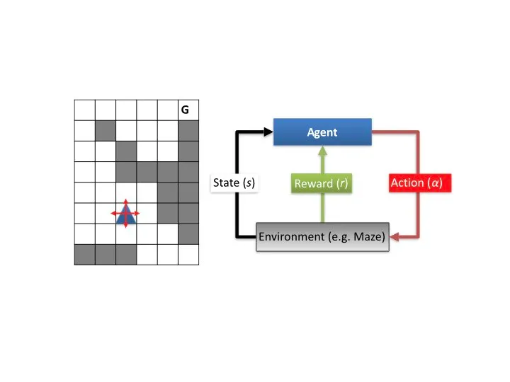

# Machine Learning

> **Resources**
> read `Machine Learning for Designers.pdf`

Tom Mitchell proposed a simple definition of it: "The field of machine learning is concerned with the question of how to construct computer programs that automatically improve with experience."

## Fondamentali
iniziamo con una semplice ma completa introduzione alle NN, ML, GAN. sono concetti che ci porteremo avanti per anni ed è bene conoscere l'ABC, questi 8 post di "Machine Learning è divertente" sono un ottimo inizio.

- [ML parte 1](https://medium.com/botsupply/il-machine-learning-%C3%A8-divertente-parte-1-97d4bce99a06)
- [ML parte 2](https://medium.com/botsupply/il-machine-learning-%C3%A8-divertente-parte-2-dec556e4855d)
- [ML parte 3](https://medium.com/botsupply/il-machine-learning-%C3%A8-divertente-parte-3-deep-learning-e-convolutional-neural-network-cnns-cc106559ffa9)
- [ML parte 4](https://medium.com/botsupply/il-machine-learning-%C3%A8-divertente-parte-4-c707feee1cf8)
- [ML parte 5](https://medium.com/botsupply/il-machine-learning-%C3%A8-divertente-parte-5-5e9083caf8f3)
- [ML parte 6](https://medium.com/botsupply/il-machine-learning-%C3%A8-divertente-parte-6-86cd682ff71a)
- [ML parte 7](https://medium.com/botsupply/il-machine-learning-%C3%A8-divertente-parte-7-bbd34f905ab8)
- [ML parte 8](https://medium.com/@giovannitoschi/il-machine-learning-%C3%A8-divertente-parte-8-come-imbrogliare-una-rete-neurale-9116075d5df0)

## Supervised Learning
### Reti Neurali

Explained In A Minute: Neural Networks
<https://www.youtube.com/watch?v=rEDzUT3ymw4>

Car training  
<https://www.youtube.com/watch?v=Aut32pR5PQA>
<https://www.youtube.com/watch?v=5lJuEW-5vr8>

Mario plays  
<https://www.youtube.com/watch?v=qv6UVOQ0F44>

Snake  
<https://www.youtube.com/watch?v=3bhP7zulFfY>

Number recognizion  
<https://www.youtube.com/watch?v=aircAruvnKk>

### backpropagation

### Decision Tree Learning

## Reinforcement Learning (RL)
si ispira a come imparano gli esseri viventi

A central question in RL problems is the right balance between the exploitation of current learned knowledge versus the exploration of new unseen territories in the search space

## Unsupervised Learning
### Clustering
Good clusters are characterized by two core properties: 
1) high intra-cluster similarity, or else, high compactness
2) low inter-cluster similarity, or else, good separation.

### Frequent Pattern Mining

due tipi sono interessanti
1) frequent itemset mining
2) frequent sequence mining
