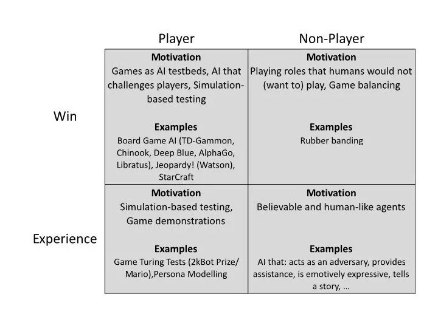

# Play

AI Plays and Improves Your Game.
enhances the experience of the player.

AI può giocare con due obiettivi:
1. play **well** 
	a) il giocatore (play test e valutazione game design)
	b) gli NPC (per bilanciamento difficoltà dinamica)

2. play **believably**
	a) debug e simulazione
	b) credibilità e umanizzazione

## Un buon Player AI
- let the player cheat
- non deve essere troppo prevedibile
- ma neanche deve essere perfetta
- lascia il giocatore "vincere"

## Board Games
## Card Games
## Classic Arcade Games
## Strategy Games
## Racing Games
## Shooters and Other First Person Games
## Serious Games
## Interactive Fiction
## Other Games

---

## Approfondimenti pratici

MarI/O – Machine Learning in Video Games  
<https://youtu.be/qv6UVOQ0F44>

Designing safer cities through simulations  
<https://blogs.unity3d.com/2018/01/23/designing-safer-cities-thr>

<https://blogs.unity3d.com/2020/12/11/automate-your-playtesting-create-virtual-players-for-game-simulation/>

Unity Machine Learning - Reinforcement Learning Demo  
<https://www.youtube.com/watch?v=fiQsmdwEGT8>

Multi-Agent Hide and Seek  
<https://youtu.be/kopoLzvh5jY>
<https://www.youtube.com/watch?v=Lu56xVlZ40M>

AI Learns to Park - Deep Reinforcement Learning  
<https://www.youtube.com/watch?v=VMp6pq6_QjI>

