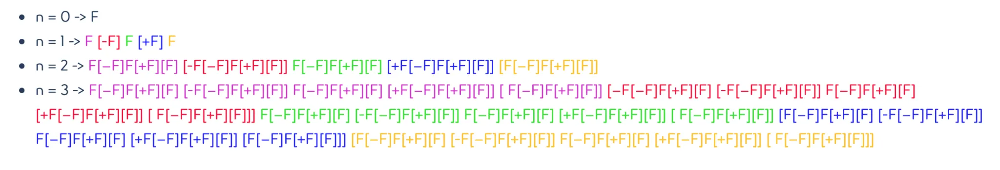

# Generate Content

Perché usare la generazione procedurale?  
I primi videogiochi la usavano per ridurre la dimensione del gioco: creando le textures e i livelli in tempo reale, non era necessario memorizzarle nella cartuccia, ad esempio.

Questo ha permesso di creare giochi che andassero oltre i limiti fisici imposti dalla tecnologia del momento. (vedi Elite)

NB: non tutti i metodi di generazione si basano sull'Intelligenza Artificiale


## Procedural Content Generation (PCG)

cosa si può generare?

### NPC behavior

### Quest / Narrativa

Vedi [The Sims](60_case-studies.md#The%20Sims)

### Audio

### Visual
- ottimizzazione textures
- rimozione dei rumori
- miglioramento qualità video
- hyper-motion

### Modelli
vedi No Man's Sky [No man's sky](60_case-studies.md#No%20man's%20sky)

### Livelli / Mappe / Percorsi

Based on Generate New Infinite Dungeons & Dragons Adventure Possibilities

vedi **AI Dungeon**  
- basato su D&D
- genera infiniti livelli
- <https://play.aidungeon.io>

### Items / Weapons

### Game mechanics / Rules

### Reward schedules

## Vantaggi
- ridurre costi di sviluppo creando automaticamente contenuti sulle regole dei designers?
- possiamo costruire mondi che si adattano ai gusti del giocatore?
- possiamo creare giochi infiniti?
- possono i computer creare nuove forme di gioco e di creatività?

## Limiti
- **Speed**
Real-time o design-time?
- **Reliability**
Catastrophic failures break gameplay
- **Controllability**
Allow specification of constraints and goals
- **Diversity**
Content looks like variations on a theme
- **Creativity**
Content looks "computer-generated

## Metodi di generazione

### Tiles-based approach


### Search-Based
- A search algorithm
- A content representation
- evaluation functions

### Solver-based
Ropossum https://www.youtube.com/watch?v=FM3v0tbdKrs

### Metodi Frattali


Gli approcci frattali prendono il nome dai famosi oggetti matematici poiché hanno alcune proprietà simili. Questi approcci di generazione procedurale si basano su sistemi di strati successivi a scale diverse, un po' come i frattali. Vedremo due tipi di approcci frattali: metodi **Grammar-based** e **Noize Based**

### Grammar-based
o _production rules_, regole di produzione.

Una grammatica formale può essere definita come un insieme di regole che si applicano ad un testo. Le regole grammaticali permettono di trasformare una sequenza di caratteri (stringa) in un'altra. Ad esempio queste due regole:

```
A -> AB
B -> A
```
La prima dice che ogni ogni lettera `A` si deve trasformare in `AB`. La seconda che ogni lettara `B` si deve trasformare in `A`.

Ci sono molti modi di applicare le grammatiche formale in AI, e il Sistemi-L sono uno di essi.

#### L-System / Sistemi-L
Gli L-Systems sono molto usati per la generazione di piante e vegetali. Hanno regole ricorsive, che permettono di creare facilmente forme frattali. In natura molte piante hanno forme frattali, ad esempio questo cavolo:


Un L-System è definito da un alfabeto, da un inseme di regole, da modifiche e da un assioma di partenza (il carattere che consideriamo il punto di partenza).

Ad esempio se abbiamo come **alfabeto** solo le lettere `A` e `B`: `{A,B}` e le due **regole** di prima:
```
A -> AB
B -> A
```
**Assioma di partenza**: `A`

e applichiamo più volte le regole ai risultati precedenti (con _n_ che identifica il numero di volte che la regola è stata applicata, è lo _step_ di avanzamento), ottemiamo questo risultato:

```
n = 0 -> A
n = 1 -> AB
n = 2 -> ABA
n = 3 -> ABAAB
n = 4 -> ABAABABA
n = 5 -> ABAABABAAB
n = 6 -> ABAABABAABABAABABA
n = 7 -> ABAABABAABAABABAABABAABAABAABAAB
```

Ci si potrebbe chiedere dove sia il collegamento tra queste sequenze di caratteri e le piante. L'idea è di associare a ciascuna lettera una determinata azione di disegno grafico, così che una sequenza sia la rappresentazioen  di uan serie di istruzioni.

Ad esempio consideriamo queste istruzioni:

```
F disegna una line di una certa lunghezza (ad esempio 10 pixels)
+ ruota 30° a sinistra
– ruota 30 a destra
: tieni traccia della posizione e rotazione corrente
[ ] ripristano la posizione e rotazione memorizzata

Regola grammaticale:
F=F[-F]F[+F][F]
```
otteniamo questi risultati:


che rappresentati graficamente diventano:


che poi possono diventare


Provate a giocare un po con questi Sistemi-L online:
- <http://www.kevs3d.co.uk/dev/lsystems/>
- <http://www.malsys.cz/Process>
- <https://onlinemathtools.com/l-system-generator>
- L-SYSTEMS GENERATOR** is a 2D/3D modeling tool <http://www.digitalpoiesis.org>
vedi [laboratorio L-Systems](lab/lab_L-Systems.md)

### Noize Based
Proviamo a disegnare un territorio realistico basandosi su una sequenza di numeri casuali.

Quando scegliamo valori veramente casuali, abbiamo il **Rumore bianco**


Ma se scegliamo dei generatori di casualità che mantenga delle caratteristiche "locali", dove ogni punto ha dei collegamenti con quelli adiacenti, abbiamo la **Perlin noise**, che garantisce delle curve localmente più morbide.


Se passiamo da una a due dimensioni, e riempiamo una superficie di rumore, ecco due esempi: rumore bianco a sinistra, Perlin a destra:


Usando l'intensità come elementi di altezza, possiamo costruire una superficie in 3D:


Il problema della Perlin è che tende a ripetere elementi con le stesse altezze. Possiamo risolvere usando diversi livelli, diversi _strati_ di Perlin Noize a diverse ottave, uno macroscopico e poi sempre più dettagliate.

La Perlin è usata molto in Minecraft ad esempio. No man’s sky usa una variazione delle Perlin, la "Uber noise" che combina diversi tipi di Noize.


### Cellular automata
- <https://bitstorm.org/gameoflife/>
- <https://gamedevelopment.tutsplus.com/tutorials/generate-random-cave-levels-using-cellular-automata--gamedev-9664>


## Machine learning
### GAN (Generative Adversial Networks)
Semantic Image Synthesis with Spatially-Adaptive Normalization
<https://nvlabs.github.io/SPADE/>
video <https://www.youtube.com/watch?v=p5U4NgVGAwg>

<https://www.theverge.com/2019/3/6/18222203/video-game-ai-future-procedural-generation-deep-learning>

---

## More Resources
**Videos:**
- Invisible cities <https://www.youtube.com/watch?v=c3ewUbFqIuo>
- Electric Sheep <https://www.youtube.com/watch?v=Va1KBtI81TY>

**Course:**
- Procedural Content Generation <https://canvas.ucsc.edu/courses/7638>
- Unity Art Engine <https://unity.com/products/unity-artengine>

**Esempi:**
- <http://www.mazegenerator.net/>
