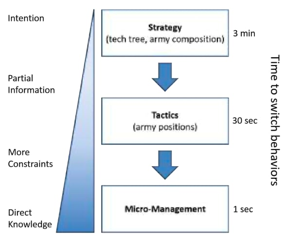

# Case Studies

## Classics

### Pong


1972
[Gioca online](https://www.ponggame.org)

AI:
```
every frame/update while the game is running:

if the ball is to the left of the paddle:
	move the paddle left

else if the ball is to the right of the paddle:
	move the paddle right
```

Come Decision Tree


### Space Invaders
1978 - stored patterns to simulate arbitrary enemy movement


[Gioca online](https://freeinvaders.org/)

### Pac Man
1980


[Gioca online](https://freepacman.org)

Introduzione alle AI dei fantasmini di PacMac
<https://www.youtube.com/watch?v=qwhXIzNrb9w>
<iframe loading="lazy" title="# AI learns to play PACMAN" src="https://www.youtube.com/embed/qwhXIzNrb9w?feature=oembed" allow="accelerometer; autoplay; clipboard-write; encrypted-media; gyroscope; picture-in-picture" allowfullscreen="" width="500" height="281" frameborder="0"></iframe>

### Elite (1984)
Contenuti procedurali.   
Elite aveva centinaia di sistemi planetari in soli pochi KB di memoria.

### The Sims


topic: storie interattive

Ogni interazione apre una serie di possibili evoluzioni.
Tutte le azioni sono progettate per essere in qualche modo casuali, quindi l'AI non inizia mai in modo prevedibile.

## AAA
### Star Craft


Starcraft II è un gioco di strategia in tempo reale (RTS) in cui i giocatori prendono posto in un'arena di battaglia 1 contro 1, 2 contro 2 o 3 contro 3.  L'obiettivo principale dei giocatori è distruggere le basi dei loro avversari. Questo viene fatto creando unità efficaci nello sconfiggere le unità avversarie. I giocatori possono scegliere di giocare contro vari livelli di AI.

L'AI di Starcraft è in grado di imbrogliare per sconfiggere i giocatori umani elaborando informazioni sulle basi dei giocatori umani. Starcraft II come gioco è diventato anche un ambiente popolare per la ricerca sull'AIA. In una spinta congiunta, Blizzard e DeepMind hanno rilasciato un ambiente pubblico di Starcraft II in cui scienziati e appassionati possono testare vari algoritmi di AI.



- [sito gioco](https://starcraft2.com/)
- [studio di come DeepMind gioca a StarCraft](https://www.saagie.com/en/blog/artificial-intelligence-in-video-games/#elementor-toc__heading-anchor-72)

### No man's sky
Open world? Try open universe


Uno degli obiettivi di No Man's Sky, oltre a rimanere in vita, costruire oggetti e acquisire beni, è esplorare gli oltre 18 quintilioni di pianeti generati proceduralmente.

Le uniche cose che non sono generate sono i nomi delle prime cinque galassie!

Questi sono alcuni, ma non tutti, degli oggetti generati proceduralmente nel gioco:

- Tutte le galassie
- Nomi di galassie 6+
- Disposizione e tipologia dei sistemi stellari
- Nomi di sistemi stellari
- Numero di pianeti e lune
- Biomi e dimensioni dei pianeti
- Risorse sulla superficie di un pianeta o di una luna
- Astronavi in stazioni spaziali o postazioni commerciali
- Commerci ai terminali commerciali
- Strutture e luoghi di missione

Anche l'astronave iniziale del giocatore, la Radiant Pillar BC1, è in realtà generata proceduralmente usando sempre con lo stesso IGS (In-Game Seed).

- [sito](https://www.nomanssky.com)
- <https://www.youtube.com/watch?v=AFISmcAigfY>
- <https://nomanssky.fandom.com/wiki/Procedural_generation>

### F.E.A.R.


[F.E.A.R.](https://en.wikipedia.org/wiki/F.E.A.R._(video_game)) è il primo gioco a utilizzare Goal Oriented Action Planning (GOAP). La tecnologia ha permesso agli avversari di eseguire azioni molto simili a quelle umane, risultando in sparatorie eccezionalmente memorabili e divertenti.

La AI genera comportamenti sensibili al contesto. Ad esempio, le cosiddette repliche possono utilizzare l'ambiente di gioco a proprio vantaggio, possono ribaltare i tavoli per fornire copertura, aprire porte, schiantarsi contro le finestre o persino avvisare il resto dei loro pari delle azioni dei giocatori. Inoltre, l'AI del gioco può eseguire un attacco sul fianco, spegnere un incendio e lanciare granate per costringere un giocatore a uscire dalla copertura.

<iframe loading="lazy" title="F.E.A.R. 3 - Cinematic Trailer (Gamescom)" src="https://www.youtube.com/embed/1KpKc-i43p8?feature=oembed" allow="accelerometer; autoplay; clipboard-write; encrypted-media; gyroscope; picture-in-picture" allowfullscreen="" width="500" height="281" frameborder="0"></iframe>

### Forza Horizon Series

Forza Horizon è un gioco di giuda che emula le prestazioni e le caratteristiche di manovrabilità delle auto da corsa del mondo reale. **Forza** utilizza una **rete neurale** di apprendimento nella sua progettazione per controllare i conducenti non umani. Il sistema di AI sviluppato può osservare i conducenti umani e imitare il loro stile di guida. Sotto il nome di _Drivatar_, questo sistema di intelligenza artificiale è stato recentemente connesso ai servizi cloud di Microsoft, da cui ottiene i dati di guida di un vasto numero di piloti umani. Questi dati vengono utilizzati per creare sistemi di AI che imitano altri giocatori di tutto il mondo, non solo i loro punti di forza ma anche i loro punti deboli, per fornire esperienze imprevedibili ai piloti umani in competizione.

### The Last of Us


The Last of Us (2013) è un gioco di sopravvivenza dove l'AI viene usata molto bene. Ogni personaggio ha caratteristiche distinte e le loro reazioni sono diverse a seconda delle decisioni del giocatore. Il gioco contiene un retroscena complesso, quindi sei libero di scegliere dove andare.

Quando si è sotto attacco, i personaggi non giocabili possono chiedere aiuto a te o tendere un'imboscata. Sembrerà una vera battaglia, anche con i tuoi compagni di squadra senza munizioni. I personaggi mostreranno autocoscienza e pensiero indipendente, proprio come nella vita reale. Anche se non la controlli, Ellie ha l'iniziativa di abbattere i nemici. Può rivelare la posizione del nemico e utilizzare oggetti come barriere.

<iframe loading="lazy" title="The Last of Us - Story Trailer" src="https://www.youtube.com/embed/W01L70IGBgE?feature=oembed" allow="accelerometer; autoplay; clipboard-write; encrypted-media; gyroscope; picture-in-picture" allowfullscreen="" width="500" height="281" frameborder="0"></iframe>

### Tom Clancy’s Splinter Cell: Blacklist

Gli obiettivi in tutte le missioni Blacklist sono essenzialmente gli stessi: evitare le guardie L'intelligenza artificiale della guardia è piuttosto eccezionale qui e l'intelligenza artificiale nella serie Splinter Cell è sempre stata interessante.

Entri in una zona, scopri tutte le guardie, capisci la strategia di evasione e prosegui verso il completamento della missione. Ma non è così semplice come sembra. Le guardie sono addestrate a rilevare e reagire anche ai più piccoli cambiamenti, non solo segnali visivi ma anche udibili.

<iframe loading="lazy" title="Splinter Cell Blacklist | First Gameplay Demo" src="https://www.youtube.com/embed/YuhfD48VRGE?feature=oembed" allow="accelerometer; autoplay; clipboard-write; encrypted-media; gyroscope; picture-in-picture" allowfullscreen="" width="500" height="281" frameborder="0"></iframe>

### Alien: Isolation
La AI viene usata per misurare la quantità di stressdel giocatore, misurando tre elementi critici in ogni momento:
1. se lo xenomorfo (alieno) può essere visto dal giocatore
2. la distanza tra lo xenomorfo e il giocatore
3. la vicinanza dello xenomorfo al rilevatore di movimento e la velocità con cui può raggiungere il giocatore.

L'AI utilizza questi tre fattori per determinare il livello di stress che il giocatore sperimenta. Se il livello è troppo basso, ordina allo Xenomorfo di spostarsi in una posizione specifica più vicina al giocatore. Se il livello è troppo alto, allontana lo Xenomorfo dal giocatore. In questo modo, l'IA crea e gestisce la tensione, una vera caratteristica del buon horror.

### XCOM: Enemy Unknown


XCOM è famoso per il suo metodo di movimento limitato che richiede all'AI di calcolare l'azione più efficace per ciascuno dei suoi turni. Considererebbe vari fattori, come quanto sei vicino all'obiettivo più vicino, se sei vicino ad alieni ostili, quanti nemici ci sono, come si comportano e così via.

<iframe loading="lazy" title="XCOM: Enemy Unknown &quot;Last Stand&quot; E3 2012 Trailer" src="https://www.youtube.com/embed/UNyhyzjYCks?feature=oembed" allow="accelerometer; autoplay; clipboard-write; encrypted-media; gyroscope; picture-in-picture" allowfullscreen="" width="500" height="281" frameborder="0"></iframe>

### Halo: Combat Evolved


Il primo gioco della serie Halo, Combat Evolved, è stato un'importante pietra miliare nell'intelligenza artificiale dei videogiochi. I Grunts, i Brutes e altri avversari simili hanno tattiche distinte che usano nel tempo che sono uniche. 

Note sulle AI avversari:
- Abbastanza intelligente da ritirarsi e mettersi al riparo
- Micro-decisioni e strategie a breve termine per evitare risultati ripetitivi
- Registra i combattimenti precedenti per imparare e migliorarsi

Approfondimenti:  
- [Why Halo's Enemy AI Is the Best in Gaming](https://www.cbr.com/halo-enemy-ai-best/)

<iframe loading="lazy" title="Halo: Combat Evolved Anniversary PC | Halo: The Master Chief Collection" src="https://www.youtube.com/embed/dAsX01K75ys?feature=oembed" allow="accelerometer; autoplay; clipboard-write; encrypted-media; gyroscope; picture-in-picture" allowfullscreen="" width="500" height="281" frameborder="0"></iframe>

### Rocket League

Giocare a calcio mentre si guida, usando i veicoli a razzo per calciare e passare la palla.

L'intelligenza artificiale in questo gioco è abbastanza poco appariscente. È particolarmente evidente nelle tattiche con la palla, specialmente quelle che si verificano all'inizio del gioco. 

<iframe loading="lazy" title="Rocket League Season 5 Cinematic Trailer" src="https://www.youtube.com/embed/ekwmvQOgpnY?feature=oembed" allow="accelerometer; autoplay; clipboard-write; encrypted-media; gyroscope; picture-in-picture" allowfullscreen="" width="500" height="281" frameborder="0"></iframe>

### Stockfish

Il gioco di scacchi open source Stockfish ([stockfishchess.org](https://stockfishchess.org)).
È uno dei sistemi di intelligenza artificiale più complessi da sconfiggere e pochissime persone l'hanno fatto.

<iframe loading="lazy" title="Stockfish Chess Engine Explains Most Famous Chess Game" src="https://www.youtube.com/embed/lP36_hLMHIc?feature=oembed" allow="accelerometer; autoplay; clipboard-write; encrypted-media; gyroscope; picture-in-picture" allowfullscreen="" width="500" height="281" frameborder="0"></iframe>

### Google Quick Draw

Questo gioco utilizza l'intelligenza artificiale per identificare i tuoi scarabocchi. Ogni tratto e linea si aggiungeva a ciò che la macchina sa di cose/persone/luoghi. "Quick Draw!" è un gioco gratuito e divertente a cui puoi giocare subito.

<https://quickdraw.withgoogle.com/>

<iframe loading="lazy" title="A.I. Experiments: Quick, Draw!" src="https://www.youtube.com/embed/X8v1GWzZYJ4?feature=oembed" allow="accelerometer; autoplay; clipboard-write; encrypted-media; gyroscope; picture-in-picture" allowfullscreen="" width="500" height="281" frameborder="0"></iframe>


### FIFA

Le ultime versioni di FIFA utilizzano un nuovo sistema basato sull'intelligenza artificiale noto come conoscenza del calcio. L'intelligenza artificiale assicura che il pallone si comporti secondo le leggi scientifiche, proprio come quando creano mondi. I palleggiatori avranno più tempo e spazio in campo, aumentando le loro abilità.
D'altra parte, la strategia dell'AI può essere rilevata anche attraverso i tuoi compagni di squadra, rendendo più semplice (o più difficile, a seconda di come giochi) l'esecuzione del gioco.

AI:
- ottimizzazione squadra
- eventi
- competititvità

<iframe loading="lazy" title="FIFA 22 | Official Gameplay Trailer" src="https://www.youtube.com/embed/vLj-27T-SEQ?feature=oembed" allow="accelerometer; autoplay; clipboard-write; encrypted-media; gyroscope; picture-in-picture" allowfullscreen="" width="500" height="281" frameborder="0"></iframe>

### Red Dead Redemption 2

In Red Dead Redemption 2 i personaggi non giocabili sono controllati dall'intelligenza artificiale. La tecnologia di apprendimento automatico consente a ogni persona di prendere vita. Le reazioni sono quasi reali e ogni azione è una reazione alle tue decisioni. Le tue scelte di guardaroba possono suscitare alcune osservazioni sprezzanti e le tue armi possono danneggiare involontariamente anche il più piccolo degli animali.

Questi sono elementi minori del gioco, ma se presi insieme offrono esperienze di gioco più coinvolgenti grazie alle tecnologie AI.

Approfondimenti:
- [Red Dead Redemption 2 Fan Uses AI to Create Realistic Photo of Arthur](https://gamerant.com/red-dead-redemption-2-arthur-ai-photo-realistic/)

<iframe loading="lazy" title="Red Dead Redemption 2: Official Trailer #3" src="https://www.youtube.com/embed/eaW0tYpxyp0?feature=oembed" allow="accelerometer; autoplay; clipboard-write; encrypted-media; gyroscope; picture-in-picture" allowfullscreen="" width="500" height="281" frameborder="0"></iframe>

### Half-Life

Uno dei videogiochi più innovativi mai creati è Half-Life, pubblicato nel 1998.

I Marines sono, senza dubbio, uno degli aspetti più mozzafiato di Half-Life. Il modo in cui queste truppe hanno tentato di aggirarsi furtivamente e ingannare il giocatore è affascinante ancora oggi.

<iframe loading="lazy" title="Half-Life (1998) - Official Trailer" src="https://www.youtube.com/embed/5Wavn29LMrs?feature=oembed" allow="accelerometer; autoplay; clipboard-write; encrypted-media; gyroscope; picture-in-picture" allowfullscreen="" width="500" height="375" frameborder="0"></iframe>

### Grand Theft Auto 5

Grand Theft Auto 5 è un altro esempio di gioco Rockstar che ha fatto progressi significativi in termini di intelligenza artificiale. È uno dei giochi più importanti per dimostrare quanto può essere brillante un videogioco quando l'AI è quasi perfetta.

I pedoni sono più sofisticati che mai e reagiscono in tutti i tipi di modi fantasiosi all'input del giocatore, specialmente se ha un impatto immediato!

<iframe loading="lazy" title="Grand Theft Auto V Trailer" src="https://www.youtube.com/embed/QkkoHAzjnUs?feature=oembed" allow="accelerometer; autoplay; clipboard-write; encrypted-media; gyroscope; picture-in-picture" allowfullscreen="" width="500" height="281" frameborder="0"></iframe>

### PUBG - PlayerUnknown's Battlegrounds


Il famoso gioco online ha implementato dei sofisticati sistemi per individuare i _cheaters_.

[Approfondimento](https://www.enjoyalgorithms.com/blog/pubg-cheater-detection-system-using-ml)

[sito][pubg.com]

### Middle Earth: Shadow Of Mordor

Il gioco introduce il Nemesis System, che consente all'intelligenza artificiale dei personaggi non giocabili di ricordare le loro precedenti azioni contro il protagonista del gioco e reagire di conseguenza.

Il sistema Nemesis è, senza dubbio, uno degli elementi più significativi del motivo per cui Shadow of Mordor si distingue così tanto.

<iframe loading="lazy" title="Middle-earth: Shadow of Mordor - Game of the Year Edition" src="https://www.youtube.com/embed/BWkKx0GLa5Q?feature=oembed" allow="accelerometer; autoplay; clipboard-write; encrypted-media; gyroscope; picture-in-picture" allowfullscreen="" width="500" height="281" frameborder="0"></iframe>

**How the Nemesis System Creates Stories**
<https://www.youtube.com/watch?v=Lm_AzK27mZY>
<iframe loading="lazy" title="# How the Nemesis System Creates Stories" src="https://www.youtube.com/embed/Lm_AzK27mZY?feature=oembed" allow="accelerometer; autoplay; clipboard-write; encrypted-media; gyroscope; picture-in-picture" allowfullscreen="" width="500" height="281" frameborder="0"></iframe>


### [AlphaGo Zero](#alphago-zero)
<a name="custom_anchor_name"></a>

Le tecniche di base di Go lo rendono un campo di gioco alla pari sia per l'AI che per gli umani, secondo le sue origini come gioco cinese per intrappolare le pietre del tuo avversario. Una partita di Go si conclude quando tutte le mosse possibili sono state fatte, proprio come gli scacchi. Il vincitore è il giocatore che ha catturato il maggior numero di pietre dopo che entrambi i giocatori hanno completato le loro mosse.

AlphaGo Zero utilizza algoritmi avanzati dell'albero di ricerca per prevedere le azioni. In particolare, utilizza approcci di "albero di ricerca avanzato". Detto semplicemente, utilizza una rete per scegliere le mosse successive e un'altra per prevedere il vincitore del gioco. Dopo ogni partita, i tuoi avversari AI miglioreranno grazie all'auto apprendimento. Inoltre, non si stanca di giocare, che è il suo vantaggio rispetto agli umani. L'intelligenza artificiale di AlphaGo ha già battuto i maestri di Go del mondo. 

<iframe loading="lazy" title="AlphaGo Zero: Starting from scratch" src="https://www.youtube.com/embed/tXlM99xPQC8?feature=oembed" allow="accelerometer; autoplay; clipboard-write; encrypted-media; gyroscope; picture-in-picture" allowfullscreen="" width="500" height="281" frameborder="0"></iframe>

## Approfondimenti
- [7 examples of game AI that every developer should study](https://www.gamedeveloper.com/design/7-examples-of-game-ai-that-every-developer-should-study)
- [9 Games with the Best Artificial Intelligence](https://www.gameskinny.com/8zkeq/9-games-with-the-best-artificial-intelligence)

