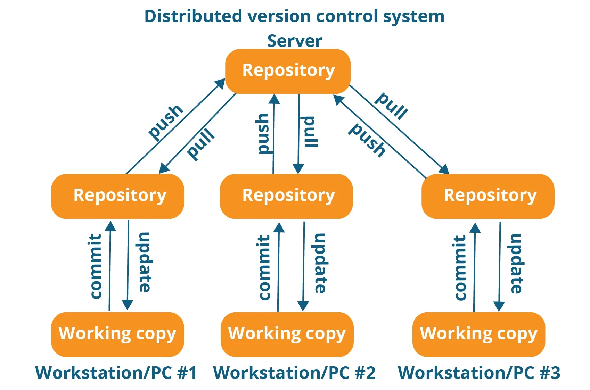

# Piattaforme di sviluppo collaborativo

> Tenere traccia di tutte le modifiche ad un progetto e provare nuove idee insieme ad altri.
> Un potente sistema di "save points"

## Cos'è un version control system?

Un sistema di **Version Control System**, o VCS, tiene traccia della cronologia delle modifiche ad un progetto apportate da tutti gli sviluppatori che collaborano.

Permettono diverse funzioni:

- Quali modifiche sono state apportate? (elenco)
- Chi ha apportato e quando le modifiche? (autori e data)
- Perché sono stati necessari cambiamenti? (documentazione delle modifiche)
- Ripristino di versioni precedenti (revert)
- Creare variazioni del progetto

Solitamente sono sistemi _centralizzati_ con un server che ospita tutto il progetto e gli sviluppatori che vi accedono via rete. Esempio pià famoso: [CVS](https://it.wikipedia.org/wiki/Concurrent_Versions_System) e [Subversion (SVN)](https://it.wikipedia.org/wiki/Subversion).

## Cos'è un *distributed* version control system?

I **Distributed** Version Control System (DVCS) permettono a tutti gli sviluppatori di avere una copia completa e autonoma sul proprio computer di _tutto_ il repository del progetto. Gli sviluppatori possono lavorare ovunque, anche offline, e collaborare in modo asincrono. Esempi sono Git, Mercurial, Plastic SCM, Perforce.

