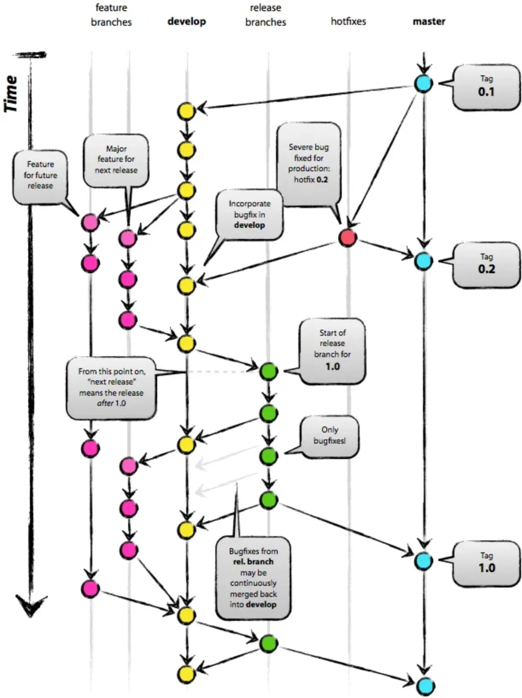

# Git

Git è stato creato da Linus Torvalds (Linux) nel 2005 come strumento per gestire lo sviluppo di Linux.
E' un programma molto piccolo, funziona su ogni tipo di compiter, è estremamente solido e velocissimo, gratuito e open-source, e oggi testato su milioni di progetti da quelli piccolissimi a quelli enormi.

Secondo un sondaggio di [Stack Overflow](https://insights.stackoverflow.com/survey/2021#other-tools), oltre il 93% degli sviluppatori utilizza Git, rendendolo il VCS più utilizzato al mondo.

Git è usato lo sviluppo di **ogni tipo di progetto digitale**, non solo software, sia open source che commerciale.

Git consente agli sviluppatori di vedere l'intera sequenza temporale delle modifiche, delle decisioni e dei progressi di qualsiasi progetto.

La collaborazione può avvenire in qualsiasi momento mantenendo l'integrità del codice sorgente. Utilizzando branch, gli sviluppatori possono proporre in sicurezza modifiche al codice di produzione.

## Concetti chiave

### Client Git
Per interagire con un repository o si usa il programma Git direttamente dalla riga di comando (opzione solo per i più esperti) oppure un programma grafico che fa da interfaccia con Git stesso. Si può cambiare client quando si vuole.
I più usati sono:

- **GitHub Desktop** <https://desktop.github.com>  
  prodotto da GitHub, molto semplice con funzioni base. win/mac, gratuito. la prima scelta per i principianti o per chi usa Git saltuarialemente
- **Fork** <https://fork.dev>  
  win/mac, gratuito con licenza opzionale, veloce, completo, bello
- **Source Tree** <https://www.sourcetreeapp.com>  
  win/mac, gratuito (necessita solo di account Atlassian), molto completo, un po' lento per progetti grossi e UI non perfetta
- **VS Code** il popolare (e ormai universale) editor integra un completo sistema Git e tutte le operazioni più importanti.
- **GitKraken** <https://www.gitkraken.com/>  
  non gratuito per i repo privati, win/mac, completo, si integra con altri prodotti della Axosoft  

Alcuni di questi clients integrano il programma Git stesso, altri no e deve essere installato nel proprio computer

### Installazione Git
Per sapere se si ha Git installato nel proprio computer, basta a aprire una Prompt di comando / Terminale e digitare `git version`. Se restituisce una versione, allora si può iniziare. Altrimenti va [installato](https://git-scm.com/).

### Working Directory
E' la directory / cartella che contiene tutto il progetto a cui stiamo lavorando.

### Repository
Un **repository** Git viene creato dentro una Working Directory, tecnicamente sotto forma di una directory invisibile `.git`.
Conterrà tutta la cronologia delle revisioni di ogni file e ogni tipo di configurazione possibile.
Poiché Git è un DVCS, i repository sono unità autonome e chiunque possieda una copia del repository può accedere all'intero progetto e alla sua cronologia.

Si _inizializza_ un repository con il comando `git init` o via Git Client "Crea Nuovo Repository" o clonando una repository esistente.

### Remote / Origin
Un repository può esistere solo in locale, oppure esistere online, in questo caso di chiama **_remote_** repository e il suo indirizzo principale è **_origin_**.

### Clonazione / Fork
`git clone` effettua una copia locale di un progetto che esiste in remoto.
Questo clone sarà un repo completo e indipendente.

Oppure si può farne un `fork`, ovvero una "variante personale", che sarà sì indipendente, ma tenendo un filo di collegamento con il repository originale (per eventualmente sincronizzare le modifiche effettuate da una o dall'altra parte).

### Stage
`git add` mette in **stage** un cambiamento, ovvero indica quali files andranno ad essere registrati nella prossima modifica ed entrare a far parte dello storico del progetto. Un file può essere messo e tolto dallo stage, vedendone le differenze.

### Commit
E' la registrazione nello storico dello stage, ovvero delle modifiche ad uno o più file. Un commit registra anche codice univoco che lo identifica, la data, l'autore e una descrizione testuale della modifica.

### Revert Commit
Una modifica registrata può essere facilmente annullata facendone _revert_: in pratica inverte tutte le modifiche di un commit e ne crea uno nuovo.

### Diff
Visualizzazione delle modifiche di un commit.
Per i files testuali vengono mostrati tutti i cambiamenti.
Per le immagini di solito si mostrano le due versioni.
Funziona bene con i files testuali, non con i files binari.

### Discard
Un file modificato che non è ancora stato messo in stage / committato, può essere ripristinato al suo stato originario, tecnicamente si "eliminano le modifiche" (Discard Changes)

### Branch
Sono i rami di sviluppo, ognuno è autonomo dagli altri e possono essere riuniti in qualsiasi momento.
Un nuovo progetto inizia con un solo branch: il main (prima era chiamato _master_).
Poi di solito si aggiungono dei branch di sviluppo tipo `dev` o di `release`, o branch specifici per sviluppare o testare nuove `features`.

### Checkout
Selezionare / Cambiare un branch e aggiornare il progetto allo stato di un determinato _commit_.

### Fetch, Pull e Push
Sono operazioni che sincronizzano un repository locale con uno remoto:

- Pull aggiorna il locale applicando tutte le nuove modifiche che si sono accumulate nel remoto
- Push invia tutti i commi locali verso il repository remoto.
- Fetch è una versione ridotta del pull: scarica tutte le modifiche di un remoto, ma non le applica ancora al progetto reale. Serve per vederle in locale, e poi decidere se applicarle.

### Merge
`git merge` serve per unire un branch ad un altro.  
Solitamente si fa da un branch di `dev/feature/bugfix` verso il `main`

### Tag
E' un'eticatta che si applica ad un commit per identificarlo in modo speciale.
Esempi di tags: `v0.1.2`, `release_1`. In questo modo è facile vedere nello storico le versioni particolari. Un tag può essere solo locale oppure condiviso anche nel remote e quindi con gli altri.  
E' poi facile ripristinare il progetto ad una versione taggata, o scaricare tutto il progetto completo di uno specifico tag.

### Stash
E' una memoria temporanea, dove poter registrare tutte le modifiche in corso senza voler creare un commit ad hoc. Uno stash si può nominare e riapplicare quando si vuole.

### .gitignore
Si può dire a Git di ignorare alcuni files specifici, o una directory o alcuni tipi di files. Di solito sono file temporanei, o creati in automatico dal compilatore del progetto, o che si vogliono tenere riservati.
Un esempio di `.gitignore` di un progetto Unity è [questo](https://github.com/github/gitignore/blob/main/Unity.gitignore)

### Patch
Un gruppo di modifiche può essere salvato sotto forma di file speciale, da condividere con altri che possono riapplicarlo allo stesso progetto.
Contiene i nomi dei files modificati e le relative modifiche.

### Git LFS
Git è stato sviluppato pensando sopratutto a files di testo.
Se si usano invece files binary molto grandi (ad esempio .pdf, .tiff, wav, .mov) che non permettono di salvare le singole modifiche, ma devono essere sostituiti completamente, c'è il rischio di "ingolfare" lo storico del repository con diversi Gigabyte di dati poco utili. Per questo si abilita il "Large File Storage" che dice a Git di salvare determinati tipi di files binary non nel repository stesso, ma su uno storage separato (ad esempio S3 o DropBox)

### Submodules
Una directory di un progetto Git può essere un altro progetto Git, separato e indipendente. ad esempio una libreria condivisa tra più progetti.

### Revisione storica e funzioni avanzate
Con comandi particolari si può intervenire sullo storico dei commit, ad esempio eliminando un determinato tipo di file (ad esempio contenente un dato privato) o troppo grande.

## Dormite tranquilli, ma avvertenza
E' molto difficile "rompere" un repository, potete stare tranquilli che non farete mai danni.
Mal che vada si butta via tutto il repository locale e lo si clona di nuovo dal remoto.
Una sola avvertenza: prima di committare un file, pensateci molto bene se davvero vi serve memorizzarlo per il futuro, sopratutto se il file è molto grande (che quindi va a ingrossare l'archivio dello storico).
Ricordate che una volta che un commit è pushato nel remote, andrà poi distribuito a TUTTI gli altri developers.. se avete un file .psd da 100Mb pensateci bene se committarlo.

## Alternative a Git
Hg, Perforce, SVN sono solo alcuni, ma Git sta diventando lo standard

## Per approfondire

- Git Pro book: <https://git-scm.com/book/en/v2>
- Laboratori: <https://lab.github.com/courses>
- Gioco Online su Git: <https://learngitbranching.js.org/?locale=it_IT>
