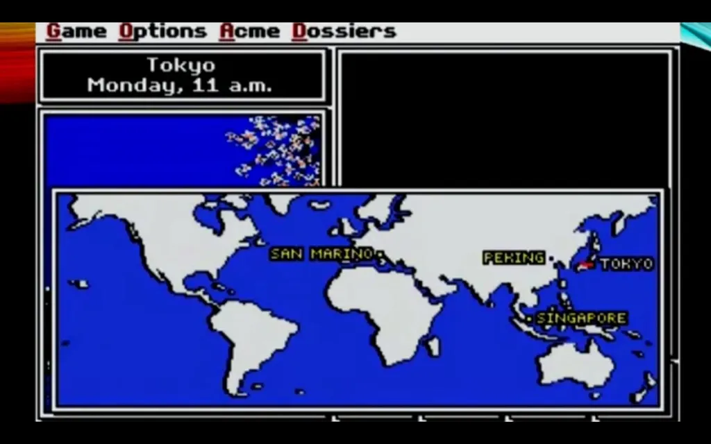
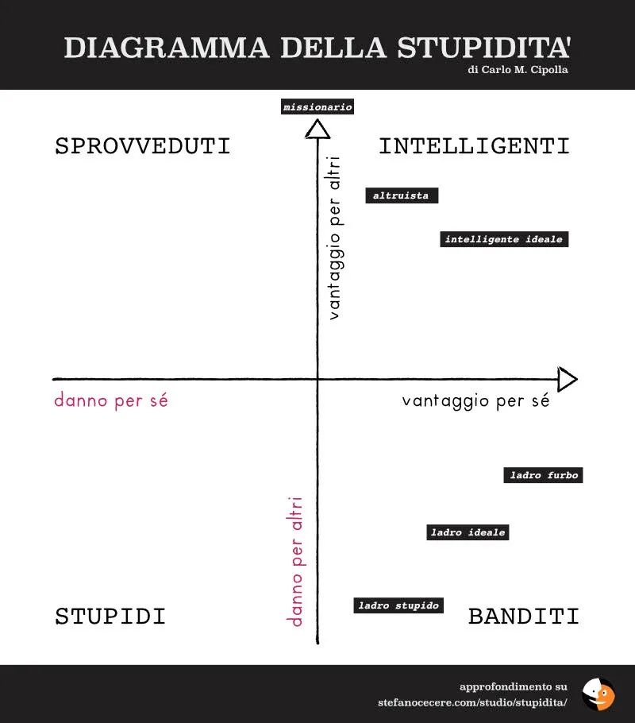
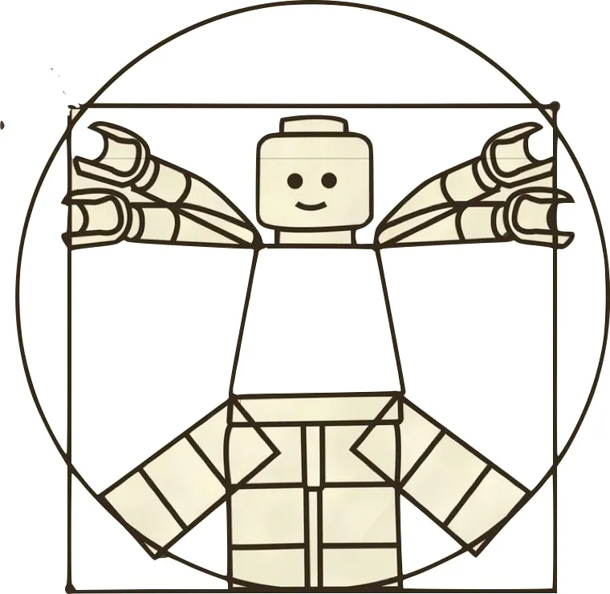
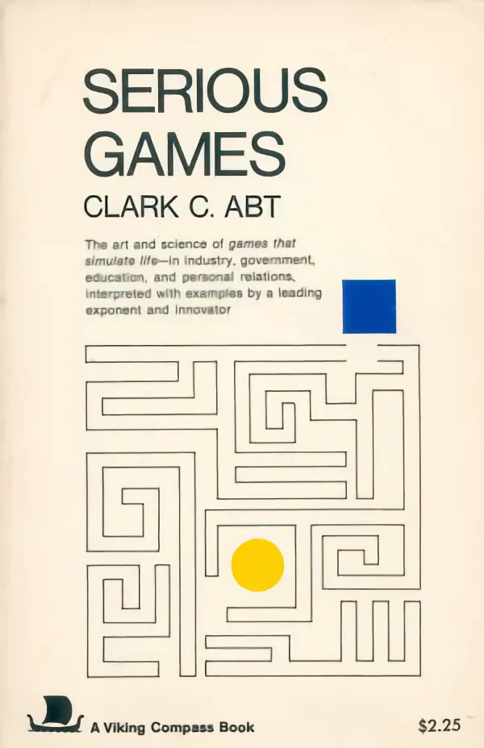
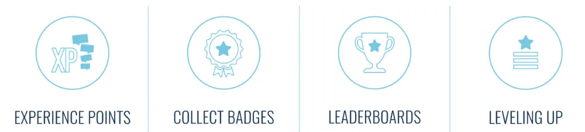
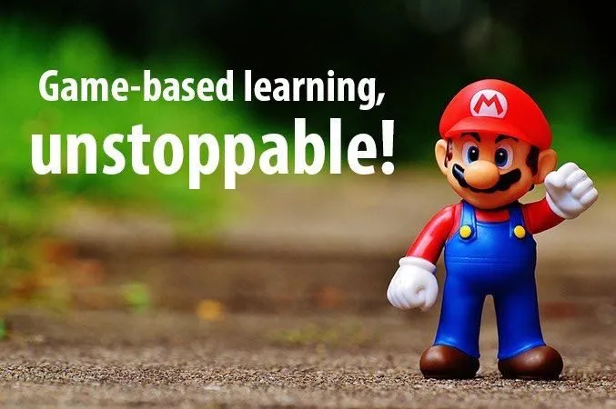
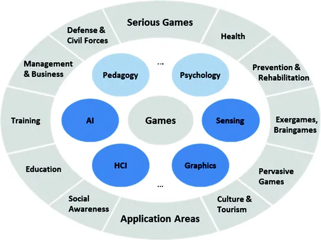

# Oltre l'Entertainment

> The only source of knowledge is experience.
> *Albert Einstein*

## Where in the world is Carmen Sandiego?
Nel 1985 veniva pubblicato questo videogioco [link](https://en.wikipedia.org/wiki/Where_in_the_World_Is_Carmen_Sandiego%3F_(1985_video_game))

Perché inizio con questa citazione "storica"? perché si scoprì che molti giocatori americani non sapevano individuare le più importanti capitali e nazioni nel mondo. Questo videogioco ha contribuito significativamente, e senza volerlo, alla conoscenza geografica del mondo.

## Cosa è l’Entertainment

> L'**intrattenimento** è un'azione o un evento che ha come scopo quello di catturare l'interesse di uno spettatore o di un pubblico, oppure, in senso più ampio, qualunque attività capace di suscitare gioia o divertimento in chi la pratica
 
## Perché andare *oltre* l’Entertainment?

- nel puro Entertainment c'è fortissima concorrenza in crescita.
- molte opportunità di lavoro
- possibilità di avere un impatto positivo nel mondo
- nuove nicchie tecnologiche o di contenuto da esplorare
- è possibile e può dare grandi soddisfazioni.
- può permettere uno sviluppo intelligente

### Diagramma della stupidità

### IKIGAI
Parola e concetto giapponese.
Il diagramma dovrebbe essere abbastanza auto-esplicativo:

## Media e impatto sociale
I media hanno sempre avuto un impatto sulla società.
Dai racconti mitologici ai testi sacri, dall'enciclopedia ai giornali.

**Conoscenza, Educazione e Libertà** sono sempre andate insieme, e con l'esplosione delle ICT (Information Communication Technologies) la nostra società è basata sull'Informazione e sopratutto sull'attenzione, con tempi di assimilazione sempre più brevi.

Per questo un medium fondato sul coinvolgimento e sull'autoadattamento alle caratteristiche del fruitore è particolarmente potente e può agevolare **un impatto sociale positivo**.

## Virtù dei Videogiochi
Una super sintesi di cosa sono e loro virtù

### Medium Multimediali & Multidisciplinari

### Immersività

> Parlami e dimentico, insegnami e potrei ricordare, coinvolgimi e imparerò (Benjamin Franklin)

**Immersione** è la caratteristica della mente umana che deforma lo spazio tempo interno.

Si vive un'esperienza dentro un gioco, finché non si rompe a causa di:
- distrazione esterna
- errore o bug
- quando si riflette su quanto sta accadendo

L'immersività permette:
- esperienza di scenari reali in **ambienti protetti** e a basso rischio dove **poter fare errori**
- coinvolgimento in complicate situazioni morali ed etiche

### Interattività

E' la virtù principale permessa dalla CPU (la componente pre-programmata / automatica) che differenzia il videogioco dai giochi non digitali.

- esperienze non-lineari

### Feedback loop

Il feedback automatizzato / programmato sul giocatore permette di 
- migliorare le capacità di pensiero critico e di lettura e insegnano nuove capacità tecniche.
- i meccanismi di gratificazione possono aiutare a superare i momenti di difficoltà
- favorire un apprendimento individuale e personalizzato

### Player centric
Tutto è pensato, confezionato e valutato intorno al giocatore e alle sue azioni.
Creato prima ed elaborato in tempo reale.
Si può considerare il videogioco un *medium umanista*.

### Strutturano un'esperienze

Da elementi destrutturati

un buon game designer porta ad un'esperienza.

> ci interessa far vivere esperienze formative o con effetti oltre il puro divertimento

### Cosa fanno e cosa portano
- sono una forma di divertimento -> _piacere_
- sono una forma di gioco -> _coinvolgimento_
- hanno regole -> _struttura_
- hanno obiettivi -> _motivazione_
- sono interattivi -> _azioni_
- si adattano -> _flow_
- danno risultati e feedback -> _apprendimento_
- hanno una vincita ->  _gratificazione_ dell'ego
- hanno conflitti/antagonisti/sfide -> _adrenalina_
- richiedono capacità di problem solving -> sviluppa _creatività_
- hanno interazioni tra pari -> _gruppi sociali_
- hanno personaggi e storie -> _emozioni_

## Cosa fare oltre l'Entertainment?

### Games for Good

### Simulazioni
Sperimentazione / Ricerca

### Serious Games

Giochi progettati per obiettivi che non sia il puro intrattenimento.
L'intrattenimento può essere comunque un effetto complementare, laterale, dell'esperienza di gioco, ma l'obiettivo è attivare un qualche cambiamento nella comprensione, nell'attitudine o nel comportamento del giocatore.

Per il momento consideriamo *SINONIMI* i termini
- Impact Game / Social Impact Game
- Serious Game
- Applied Game
- Game with a Purpose

NB: il Game Based Learning è un caso specifico di serious game, dove l'obiettivo principale è imparare, la comprensione di un contenuto educativo.

#### Caratteristiche dei Serious Games

Alcune caratteristiche di base sono:

- Avere degli **obiettivi (goal)** molto ben chiari, definiti e misurabili
- Mostrare ai giocatori un problema / sfida ben identificabile
- Usare le dinamiche di gioco o le tecnologie dei giochi
- Fornire ai giocatori del feedback positivo/negativo rispetto alla progressione verso la sfida del gioco e il raggiungimento degli obiettivi.

### Gamification
Il termine gamification significa “trasformare in gioco qualcosa che non è un gioco. E’ un termine abbastanza generico sotto il quale si inseriscono elementi dei giochi nei sistemi non-gioco per migliorare la User Experience (UX) e l’engagement. 

In particolare si usano i concetti e/o elementi dei giochi per “giochificare” applicazioni esistenti,  tipo:
- Punti
- Badges
- Trofei
- Leader Boards
- Streaks
- Levels

## GBL: Game Based Learning

Il Game Based Learning invece è un approccio che usa dei giochi completi, e non solo alcune meccaniche, per ottenere dei risultati predefiniti.
Possono essere giochi specificatamente progettati oppure giochi esistenti adatti a rinforzare qualche concetto particolare.

## Una classificazione

Per individuare il tipo di videogioco, possiamo usare la tassonomia G/P/S:

- **G**ameplay
- **P**urpose
- **S**cope

### Game Play
Al di là del “genere”, ci interessa sopratutto: come è giocato?

**Play based** (paiada)
Senza obiettivi (goals) e regole ben definite, non valuta la performace del giocatore, anche se il giocatore stesso può definire i propri obiettivi.

**Game based** (ludus)
Regole e obiettivi ben definiti.

### Purpose (finalità)
**1. Diffondere un **messaggio****
- Educativo
- Informativo
- Persuasivo
- Soggettivo

**2. **Allenamento****
- Mentale
- Fisico

**3. **Data Exchange****
Raccogliere dati e informazioni dai giocatori o invitarli a condividerli.

### Scope
**Mercati**
- *Entertainment*
- Advertising e Marketing
- Ambiente ed Ecologia
- Arte
- Cultura e Musei
- Educazione
- Industria e Corporate
- Informazione e Media
- Militare e Difesa
- Politica e Pianificazione
- Psicologia e Benessere
- Sanità
- Società e Comportamento
- Ricerca Scientifica
- Umanitario e Caricatevole

**Pubblico**
- Pubblico generico
- Professionisti
- Studenti

### Combinazioni:
- **Video Game**: game-based + entertainment  
- **Video Toy**: play-based + entertainment  
- **Impact Game**: game-based + !entertainment  
- **Impact Play**: play-based + !entertainment  

## Interesse
Molto spesso si sta bene quando stanno bene anche gli altri.
Viceversa si sta male quando stanno male gli altri.
Il mondo sociale è interconnesso e il nostro benessere è relazionato.

Che siano conoscenza, salute, indipendenza, libertà, felicità, tutti i temi vissuti dall’uomo sono condivisi e soprattutto si migliorano con lo sviluppo personale, dall'interno, non dall'esterno.

In quest'ottica i videogiochi sono degli strumenti di sviluppo personale molto utili dal punto di vista **sociale** e **politico** e **spirituale**.

Inoltre c’è crescente preoccupazione e interesse del “mercato”, quindi toccare determinate questioni ci apre automaticamente nuovi sbocchi.

Un esempio semplice: se invento un gioco divertente che aiuta a risolvere il problema dell’Alzheimer, o a mantenere la calma nelle situazioni difficili o migliorare i consumi energetici della mia città, la cosa forse potrebbe interessare molte più persone che non sapevano che ci si potesse divertire anche lì.
(cit [Freud's Bones](https://www.kickstarter.com/projects/fortunaimperatore/freuds-bones-an-indie-videogame-on-sigmund-freud))

> Si tratta di esplorare l’INVENTIVA APPLICATA a migliorare il mondo

#### I problemi che abbiamo e con i giochi aiutare a risolverli
Anziché fare un gioco divertente fine a se stesso, andiamo a prendere un **tema**, un **target**, ne identifichiamo un **problema** e attraverso un game play e una finalità adeguata, creiamo uno strumento che lo tratta.

Il prossimo prototipo, la prossima jam, il prossimo esercizio potrebbe essere qualcosa di potenzialmente utile a qualcuno

Non deve essere necessariamente un progetto “serio” nel senso di accademico, con validità scientifica, 

Ricordarci appunto che non c’è solo l’Entertainment per l’Entertainment, l’*ars gratia artis*.

## Chi sono io? Perché sono qui?

## ✍️ 🟧 RIPONDERE
