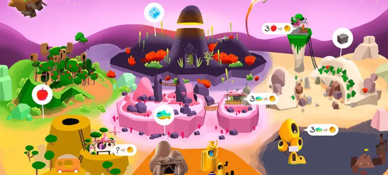

# Case studies

- Vetrine / Concorsi
- Game Based Learning
- Serious Games
- Aziende

## Vetrine / Concorsi

### Unity for Humanity
<https://unity.com/humanity>

👉🏼 https://youtu.be/r5T4ftMYRS8

[Unity for Humanity 2023 Winners](https://blog.unity.com/news/meet-the-2023-unity-for-humanity-grant-winners)

[Unity for Humanity 2022 Winners](https://blog.unity.com/news/announcing-our-2022-unity-for-humanity-grant-winners)

### Games 4 Change
[Featured Games](https://www.gamesforchange.org/games/)

## Giochi educativi / DGBL

### Antura & the Letters

The educational goal of the game is to help players to acquire the basics of Arabic literacy, including Arabic letters, reading comprehension, and some vocabulary. But the game also has a social well-being objective to support flow, engagement, and motivation

> **Curricular connections**: Language learning; Arabic literacy; social and emotional learning 
> **Possible skills taught**: Recognizing letters (shapes, names, phonemes); syllables and word reading; vocabulary

website: [antura.org](https://www.antura.org)

### Dragon Box

Through playing with the digital manipulatives in *DragonBox games*, students deeply understand the mathematical concepts through active engagement, all while learning at their own pace.  Each of our games are based around “digital manipulatives”.  These digital manipulatives were designed to be used as a teaching tool, along with classroom instruction and discussion.  
Website: [dragonbox.com](https://dragonbox.com/)

### Dumb Ways to Die

Per imparare a conoscere ed evitare le situazioni pericolose nella vita (dal non infilare una forchetta nel tostapane al non stuzzicare un animale. 
70 milioni di giocatori per questo gioco promosso dalle Ferrovie di Melbourne, Victoria, Australia.

Website: [dumbwaystodie.com](http://www.dumbwaystodie.com)

### SimCityEDU
Una suite evoluta dal celebre SimCity, fatta per insegnanti e studenti, per conoscere, analizzare e risolvere i complessi problemi del nostro ambiente, con dati reali

https://www.commonsense.org/education/game/simcityedu-pollution-challenge

### iCivics

Organizzazione no-profit che si dedica all’educazione civica attraverso risorse e strumenti di insegnamento interattivi e coinvolgenti. 
L’obiettivo è quello di sviluppare strumenti educativi per far sì che gli studenti possano diventare cittadini partecipi e informati. 

Website: [icivics.org](https://www.icivics.org)

### Other titles
- [Ludwig](http://www.playludwig.com) - educational game for physics
- [80 Days](https://www.inklestudios.com/80days/) - adaptive educational game for geography
- [Roma Nova](https://www.irit.fr/~David.Panzoli/romanova.html) - teaching history with brain interfaces
- [Bionigma](https://www.gcc.tu-darmstadt.de) - science game for protein exploration
- [Meister Cody](https://www.meistercody.com) - educational game for dyscalculia
- [Orwell: Keeping an Eye on You](https://www.osmoticstudios.com/orwell-keeping-an-eye-on-you/) - learn personal information data management

## Salute
I giochi per la salute (Games for Health) sono un grande mondo per diverse tematiche

- Prevenzione
- Riabilitazione
- Esercizi Fisici
- Cognitive Training
- Training Medico

C'è molto interesse e hype per diversi motivi
1) il sistema globale sanitario deve sviluppare nuovi concetti e strumenti per gestire i cambi demografici
2) sta aumentando la vita sedentaria e l'inattività fisica
3) i costi crescenti del settore sanitario

Ci possono essere giochi molto mirati (tipo giochi per l'Autismo) o di massa (più di intrattenimento tipo Wii Fit)

Giochi tipo Re-Mission (www.re-mission.net) incoraggiano i giovani pazienti malati di cancro a combattere il loro male e seguire in modo più preciso le terapie. Ha dimostrato sua efficacia.

### Games for Health Showcase

- 🎥 <https://www.youtube.com/watch?v=8pIFskqIpgk>
- 🎥<https://www.youtube.com/watch?v=ath966NqZ7g>

### The Game that can give you 10 extra years of life

Game designer Jane McGonigal firmly believes that video games are not just about mashing buttons and getting to the next level. In fact, during her talk at TEDGlobal 2012, McGonigal gave several surprising statistics: that online gaming can be more effective than pharmaceuticals in treating **clinical depression** and that just 30 minutes a day is correlated with significant **increases in happiness**.

https://blog.ted.com/10-online-games-with-a-social-purpose/

📽 #VIDEO [The game that can give you 10 extra years of life](https://www.ted.com/talks/jane_mcgonigal_the_game_that_can_give_you_10_extra_years_of_life)
<iframe width="937" height="527" src="https://www.youtube.com/embed/lfBpsV1Hwqs" title="The game that can give you 10 extra years of life | Jane McGonigal" frameborder="0" allow="accelerometer; autoplay; clipboard-write; encrypted-media; gyroscope; picture-in-picture" allowfullscreen></iframe>

### Some titles
- [Re-Mission](https://hopelab.org/case-study/re-mission/) - help young cancer patients with treatment compliance
- [Zombie Run](https://zombiesrungame.com) - Run in the Real World. Become a Hero in Another.
- [Play Forward](https://www.play2prevent.org/our-games/playforward-elm-city-stories/) - HIV prevention
- Respir Games (asthma therapy)
- BalanceFit (balance, coordination and strength training)
- [NEUROvitalis](https://www.headapp.com/en/neurovitalis-en/) - personalized cognitive training
- KickAss (autism game for adolescents)
- [Zirkus Empathica](https://www.zirkus-empathico.de/) - autism game for children
- [SPARX](https://www.sparx.org.nz/home) - mental health game for youths & adolescents

## Empatia

> Capacità di porsi in maniera immediata nello stato d'animo o nella situazione di un'altra persona.

### This War of Mine

Non impersoni il classico soldato impegnato in combattimento, ma un gruppo di civili che cercano di sopravvivere all'assedio della città, con mancanza di medicinali, cibo e pericolo di incursioni.
This War of Mine è un gioco di sopravvivenza di guerra che differisce dalla maggior parte dei videogiochi a tema bellico concentrandosi sull'esperienza civile della guerra piuttosto che sul combattimento in prima linea. I personaggi devono prendere decisioni difficili per sopravvivere ai pericoli quotidiani. Ci sono vari finali per ogni personaggio, a seconda delle decisioni prese nel gioco.

Website: [thiswarofmine.com](http://www.thiswarofmine.com)

### Papers, Please

**Papers, Please** è un "Dystopian Document Thriller" per giocatore singolo in cui il giocatore entra nel ruolo di un ispettore dell'immigrazione nel paese immaginario di Arstotzka nell'anno 1982. Mentre il giocatore si trova sulla soglia tra due diversi paesi, una prospettiva unica di immigrazione e sicurezza delle frontiere scaturisce dal banale compito di ispezionare i documenti. Su un secondo livello, il giocatore deve simultaneamente provvedere alla propria famiglia utilizzando lo stipendio guadagnato dal lavoro, che paga in base a quante persone sono state processate in un giorno. Bilanciare la sicurezza dei confini con i bisogni della famiglia è unicamente umano, creando una giustapposizione nuova e interessante.
Website: [papersplea.se](https://www.papersplea.se/)

### Bounden

**Bounden** è un gioco di ballo per smartphone che permette ai giocatori di usare il proprio corpo. Due persone tengono le estremità opposte di uno smartphone, quindi si muovono insieme per mantenere un cursore sopra la palla. Quello che inizia come un nuovo modo di interagire con il gioco incoraggia lentamente i due giocatori a muoversi insieme in modo creativo mentre completano ogni livello.

website: [playbounden.com](http://playbounden.com)

## Etica

> L'arte e la scienza del comportamento e della valutare il bene e il male, il giusto e l'ingiusto.

### PeaceMaker

Il giocatore è invitato a trovare una soluzione nonviolenta al conflitto Israele/Palestina, impersonificando di volta in volta le due opposte fazioni. 

Website [peacemakergame.com](http://peacemakergame.com)

### Phone Story

Phone Story è un gioco mobile che tenta di provocare una riflessione critica sulla propria piattaforma tecnologica. Sotto la superficie dei nostri gadget elettronici, dietro la sua interfaccia lucida, si nasconde il prodotto di una catena di approvvigionamento inquietante che si estende in tutto il mondo. Phone Story rappresenta questo processo con quattro giochi educativi che rendono il giocatore simbolicamente complice dell'estrazione del coltan in Congo, della manodopera esternalizzata in Cina, dell'e-waste in Pakistan e del consumismo dei gadget in Occidente.
http://phonestory.org

### Unmanned

La maggior parte dei videogiochi sparatutto fa sembrare la guerra piena di azione e affascinante. Unmanned mira a dipingere un ritratto molto più realistico, proiettando i giocatori nei panni di un soldato alle prese con noia e sogni traumatici, oltre ai doveri militari.
http://unmanned.molleindustria.org

### Data Dealer

🎥 https://youtu.be/x2eCAgQ1DTo

Data Dealer is an online game about collecting and selling personal data - full of irony and gleeful sarcasm. It's a browser/serious/edu/impact game about digital culture and surveillance and aims to raise awareness about online privacy in a new and fun way.

https://datadealer.com

### Half the Sky Movement

Un'avventura / simulazione che può far conoscere e aiutare la realtà della donne e delle ragazze nel mondo, raccogliendo donazioni reali. 
Il gioco crea relazioni tra persone che hanno condiviso le stesse situazioni e permettono un confronto positivo.

http://www.halftheskymovement.org

### Fate of the World

Un gioco di strategia che mette il futuro del mondo nelle tue mani: come darai risposte ai problemi del riscaldamento globale, della crescita della popolazione, delle risorse naturali e dalla scomparsa di specie animali? i prossimi 200 anni sono nelle tue mani.

https://www.soothsayergames.com

## Games for good
Chiamati anche **Games for good**, hanno come pilastro il trattare temi di rilevanza sociale pubblica, quali
- Politica e Storia
- Religione
- Conflitti
- Epidemie
- Sexism e razzismo
- Clima
- Energia

Solitamente sono finanziati dal settore pubblico o fondazioni.
In alcuni casi la grande industria per motivi di immagine.
Come i giochi educativi, anche qui i giocatori imparano qualcosa rilevante le questioni sociali giocando. Come nei giochi per la salute, alcuni videogiochi persuasivi sono stati validati.

### Chef Adventure
Il giocatore interpreta un giovane cuoco che, in cerca di fortuna, viaggia lungo un’onirica strada di campagna. Il gioco è realizzato all’interno del progetto Cittadinanza Consapevole, percorso educativo Benessere. Nel gioco vengono trattati i temi della filiera, del consumo e della solidarietà.
https://youtu.be/t67SMz7yJsE

**World Without Oil**  
Also a McGonigal creation, players in this game are dropped into a world where oil resources have been tapped and where they must get creative to survive the massive global shortage. The best part of the game? It teaches easy ways to use less oil in the real world—habits that players report keeping up when they aren’t playing.  
[website](http://www.worldwithoutoil.org)

**FoldIt**  
An online protein folding game, FoldIt allows its quarter million players to help with scientific research by stabilizing strings of amino acids. Think of it like biological Tetris — FoldIt makes a competition out of biological pattern recognition, leading to innovative solutions to problems that have frustrated scientific communities for years.  
[website](http://fold.it/portal)

**WAY**   
Communicating across languages and cultures isn’t easy. But in this online game, two anonymous players — culled from different locations around the globe — must learn how to speak to each other as they navigate obstacles. Developed by CoCo & Co, this game took top honors at this year’s Games for Change Awards.  
[website](http://www.makeourway.com/)

**Budget Hero**    
Think you could balance the national budget? Then you’ll want to play this game from American Public Media, which lets players see what happens to the national deficit when they increase funding to programs or opt to make difficult cuts. “Every member of Congress should be required to play this game,” said one of its creators.  
[website](http://www.marketplace.org/topics/economy/budget-hero)

**Pain Squad**  
Children and teenagers with cancer are often asked to keep pain diaries — paperwork that is not only boring but focuses their attention on their discomfort. The iOS app Pain Squad makes the whole process fun and interactive — while also helping doctors provide better treatments for young patients.  
[website](http://www.campaignpage.ca/sickkidsapp/)

**Spent**  
When your bank account is in the black, it’s easy to think that anyone could pull themselves out of poverty by their boot straps. But in this online game, players are charged with looking for work while surviving on $1000 a month — highlighting that poverty and unemployment are systematic and not just the result of character flaws.  
[playspent.org](http://playspent.org/)

**Evoke**  
Created by the World Bank Institute in conjunction with McGonigal, this game is a 10-week crash course in social innovation, giving players challenges from “food security” to “urban resilience,” and encouraging them to become a think tank on local challenges.  
[www.urgentevoke.com](http://www.urgentevoke.com)

## Formazione e Simulazione
Ad oggi il settore più grande ed economicamente più rilevante.

- AI, Robotica
- Replicabilità, Prevenzione
- Previsioni, Futuro
- VR, AR

Target sia professionale che pubblico.

- Immersive Simulation for Field Operator Training
https://www.youtube.com/watch?v=rJULyO9E2vE
- Combat Medic Trainer 3D Simulation Video Game
https://www.youtube.com/watch?v=1wQBUhqt7N0

• **Simulazione in sala operatoria: la isterectomia laparoscopica**  
• **XVR Simulation**  
• **SKILLATO® Adventure**

Some titles:
- [Democracy](https://positech.co.uk/democracy/) - political strategy game
- [Flight Simulator](https://www.flightsimulator.com)
- [Lost Earth 2307](https://www.iosb.fraunhofer.de/en/projects-and-products/lost-earth-2307.html) - image interpretation, military
- [Ship Simulator](https://www.shipsim.com) - Maritime Search and Rescue
- [SchaVIS](https://www.youtube.com/watch?v=xMvV7oOJozw) - flooding simulation and prevention
- [Sharkworld](https://www.xmediaworks.nl/en/portfolio-items/sharkworld-a-project-management-game/) - project management training
- [Houthoff Buruma](https://annex.fandom.com/wiki/Houthoff_Buruma_The_Game) - recruitment and assessment

## Architettura
**Build better cities**
https://www.ted.com/talks/karoliina_korppoo_how_a_video_game_might_help_us_build_better_cities/

📽 #VIDEO [Build better cities with games](https://www.ted.com/talks/karoliina_korppoo_how_a_video_game_might_help_us_build_better_cities/)
<iframe width="937" height="527" src="https://www.youtube.com/embed/qYUmI5kGsYk" title="How a video game might help us build better cities | Karoliina Korppoo" frameborder="0" allow="accelerometer; autoplay; clipboard-write; encrypted-media; gyroscope; picture-in-picture" allowfullscreen></iframe>

## Cultura e Arte
Il nostro patrimonio artistico e culturale è immenso
Abbiamo la fortuna di vivere a Firenze, Toscana, Italia
Questa cosa ci mette (potenzialmente) in prima linea, di fatto si sta svegliando un'industria videoludica culturale fiorentina.

Abbiamo capolavori in ogni tipo di arte: letteratura, architettura, scultura, pittorica, urbanistica, musica.

### IVIPRO - Italian Videogame Program
Turismo videoludico, un’opportunità per il territorio
<https://ivipro.it/it/home/>

### Autography
Il progetto Autography è un progetto particolare, da classificare come “applicazione persuasiva”. Si tratta di un’applicazione e di un insieme di iniziative mirate alla prevenzione del vandalismo sulle opere d’arte, in particolare i graffiti7. L’applicazione consente di creare graffiti digitali sulle superfici tradizionalmente usate per la firme e tag; il disegno realizzato viene poi inviato a una redazione che lo approva per la pubblicazione online. Tutti i graffiti sono disponibili qui: https://autography.operaduomo.firenze.it. 

Autography è una applicazione che vuole trasformare il vandalismo contro i monumenti nel “mondo reale” in testimonianza e ricordo nel “mondo digitale”: i graffiti creati con Autography non saranno cancellati con un restauro, ma entreranno a far parte dell’archivio storico dell’Opera di Santa Maria del Fiore, in un catalogo cartaceo stampato annualmente. Un fatto notevole è che l’installazione dell’applicazione nel complesso monumentale della basilica e campanile di piazza del Duomo a Firenze ha comportato la sparizione del fenomeno della graffitazione e l’applicazione viene utilizzata con grande entusiasmo dai visitatori, che generano centinaia di graffiti ogni giorno. All’installazione in loco sono seguite una lunga serie di iniziative cross mediali che hanno rinforzato l’efficacia e la diffusione della soluzione adottata. Anche questo progetto ha riscosso notevole successo sia concreto sia mediatico.

### Pervasive Gaming, Cultural Heritage and Tourism
Giochi che attraverso l’uso delle nuove tecnologie mobile e weareable, combinano geolocalizzazione, audio, camera, accelerometro e bio sensori

La AR per le esplorazioni culturali

### Why i brought PacMan to MoMa
In her TED Talk, Paola Antonelli explains her decision to acquire 14 video games for MoMA’s permanent collection.

- https://www.ted.com/talks/paola_antonelli_why_i_brought_pacman_to_moma
- https://blog.ted.com/paola-antonelli-on-acquiring-games-for-moma/

## Gamifications
Some example of good use of Gamification
- [10 social products](https://yukaichou.com/gamification-examples/top-10-gamification-examples-human-race/)
- [10 Educational Apps](https://yukaichou.com/gamification-examples/top-10-education-gamification-examples/)

### The Fresh Heads
<https://www.lidl.it/the-fresh-heads>