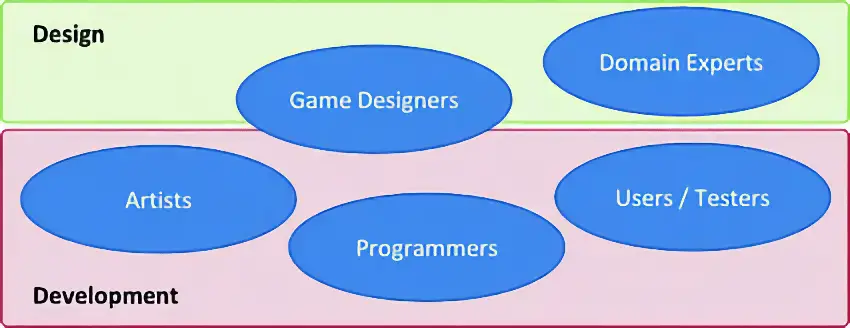
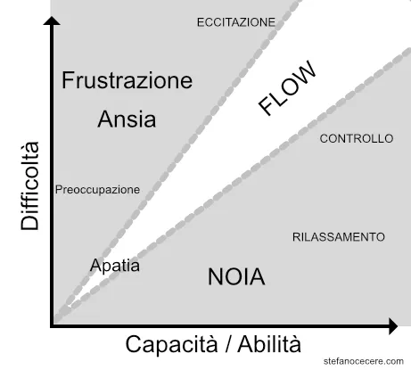

# Design

Ci interessa imparare a creare:
> giochi o esperienze ludiche con un effetto positivo intenzionale e misurabile

## Motivazione Instrinseca
Ogni gioco è un'esperienza progettata per altri giocatori.

Ogni esperienza che progettiamo e sviluppiamo ha necessariamente le nostre caratteristiche mentali, la nostra *firma*.

Un'esperienza è il risultato della combinazione di materiali, immaginazione, narrativa, meccaniche, tecnologia, estetica. E' il risultato dell'interazione umana con il mondo intorno.

Affinchè un'esperienza sia significativa per qualcun altro, deve esprimere un valore, presentare qualcosa di importante che ecciti, sorprenda, confronti qualcosa dentro la mente degli altri.

Dewey suggerisce che le esperienze nascono dall'interazione di due principi: continuità ed interazione.

**Continuità**: l'impatto di una esperienza dipende sia dalle esperienze precedenti che dalla qualità delle seguenti.

**Interazione**: il giocatore è parte attiva.

attraverso l'esperienza i giocatori hanno l'opportunità di osservare, sperimentare e riflettere sulle proprie azioni

## Esperienze coinvolgenti

Se cerchiamo di ricordare quali sono state le attività che ci hanno coinvolto di più e che ci hanno aiutato ad imparare, converremmo che ci hanno fatto partecipare, investigare, sperimentare, risolvere problemi, essere curiosi, prendere decisioni ed essere creativi.

La cultura personale è fondamentale per vivere un'esperienza, e tutti noi abbiamo diverse culture.

## Progettazione
Alcuni punti e passi su come iniziare:

### Purpouse
Cosa voglio ottenere?

#### Tematiche e Obiettivi
Le Nazioni Unite hanno definito lo Sviluppo Sostenibile quello che è richiesto oggi ma senza compromettere le generazioni future.

> Domanda: che tipo di esperienza vorresti far vivere al tuo giocatore? C'è qualche valore particolare che ti interessa promuovere?

### Audience
ricordiamoci che spesso non siamo noi il target!
trovare un focus group per discutere il progetto

### Metodologia e genere
- Simulazione
- GBL
- Gamification
- XR

e quindi che genere di gioco?

### Il "driver"
- focalizzarsi più sulle meccaniche che sul tema
- tema e meccaniche sono separate
- il tema attrae all'inizio, ma l'engagement è nelle meccaniche

### ROE (Return on Engagement)

### Domain Expert
che aiuti ad allineare i goal didattici ai livelli di gioco

### Factbook
E' importante bassarsi sui fatti, non sulle opinioni.
Cerchiamo di vedere il mondo per quello che è e non per quello che pensiamo o crediamo che sia.
Fare riferimento ai dati, possibilmente Open Data.
Vedi [libro](https://www.amazon.it/Factfulness-ragioni-capiamo-mondo-pensiamo/dp/8817099635)

### Sviluppo Iterativo
**Iterative Development**: The framework proposes an iterative and incremental approach to game design and development, consisting of three main phases: concept design, game design, and game development.

**Interdisciplinary Teamwork**: The framework suggests an interdisciplinary approach in which all team members, not just the designers, participate in every aspect of the development process and learn from each others field of expertise

## Caratteristiche di un buon gioco
- sfide continue
	- short term goals
	- sfide calibrate sul giocatore
	- conoscere i giocatori e le loro motivazioni
	- calibrare le sfide a specifici obiettivi didattici
- interessante sviluppo della storia
- flessibilità nell'ottenere risultati con effetti multipli
	- incoraggiare la collaborazione
	- permettere di scegliere il proprio path
- rewards utili, immediati e consistenti
	- rewards per incoraggiare
	- badges e achievements
	- sblocchi progressivi di features, livelli e strumenti
- uniscono il divertimento all'imparare
	- la fun deve essere una metrica!
	- non replicare il realismo, siamo in simulazione
	- un gioco non è per tutti, focalizziamo
	- esagerare le reazioni, non è la vita vera, altrimenti è una simulazione

## Flow

## Sfide & Difficulty

- non devono essere banali
- necessitano uno sforzo ragionabile e misurabile per essere risolti
- devono essere adattate alle capacità e interessi del giocatore, perché non tutti imparano allo stesso modo né hanno gli stessi interessi.
- devono dare la sensazione di progressione
- presentarle in diversi livelli e modalità, una componente alla volta.
- anche se generati dinamicamente, devono avere una coerenza di meccanica e di risoluzione
- devono essere presentati chiaramente
- devono permettere al giocatore di sperimentare liberamente
- potrebbero offrire opzioni e soluzioni alternative
- bisogna calibrare bene la crescita di difficoltà
- i buoni puzzles hanno un senso nel contesto del gioco
- la challenge è sia nel gameplay che nell'imparare
- dare tempi di riflessione e pause nel tempo
- ogni successo porta ad un livello successivo
- niente va per linee rette, curve.
- play test è fondamentale

## Personalizzazione e Adattamento
ability to make appropriate responses to changed or changing circumstances

- Procedural and adaptive level and content generation
- Adaptive behavior of agents
- Adaptive and interactive storytelling
- Guidance, hinting
- Motivational interventions
- Adaptive presentation
- Adaptive curriculum sequencing

## Framework

## Design Learning Experiences

### Learner Engagement
La cosa più importante è la _Learner Engagement_: vogliamo che il giocatore sia motivato, che sia felice, di imparare.

### Imparare
Cosa vuole dire *imparare*?

Imparare è un **processo** di acquisizione e ricostruzione di conoscenze che ci portano ad un cambiamento interiore, cambiamento in conoscenza, capacità, valori, comportamento, consapevolezza.

E' un processo **personale**

E' un'attività continuativa e quotidiana

Non c'è un solo modo di imparare

> Cosa è l'**educazione**?   
> L'arte di facilitare l'apprendimento.

Le tre vie per imparare:
1. **formale**
in un ambiente strutturato con obiettivi didattici e procedure per far imparare gli studenti

2. **informale**
ambiente non organizzato, si impara dall'ambiente diffuso, affrontando le varie situazioni

3. **non-formale**
situazioni didattiche non ordinarie, organizzate con obiettivi didattici. Varie metodologie costruite sull'interesse dello studente.

I videogiochi presentano tutte e tre le forme.

### Come si sviluppa
1. si sviluppa quando c’è coinvolgimento nel risolvere problemi *reali* del mondo
2. quando quello che si conosce diventa la base (*foundation*) per nuove conoscenze
3. quando si dimostra l’efficacia delle nuove conoscenze allo studente
4. quando le nuove conoscenze sono applicate dallo studente
5. quando le nuove conoscenze vengono integrate nel mondo dello studente

### motivazioni per imparare

motivazione **instrinseca**

motivazione **estrinseca**

i videogiochi possono essere esperienze motivanti sia instrinseche che estrinseche

### Forme di conoscenza

> La Conoscenza è Potere (Francis Bacon)

Riuscireste a vivere bene senza conoscenza?

1. Conoscenza **Cognitiva**, fatti, pattern, concetti che ci aiutano a sviluppare capacità intellettuali
3. Conoscenza **Affettiva** o Intelligenza Emotiva, come ci comportiamo con gli altri e gestiamo i **sentimenti**
5. Conoscenza Psicomotoria, movimento e coordinazione
  
## GBL

### Principi
- Un **ambiente sicuro** da esplorare e in cui **commettere errori**
- Imparare attraverso il divertimento
- Apprendimento contestualizzato, orientato all'obiettivo anziché astratto
- Apprendimento esperienziale: imparare facendo
- Motivazione intrinseca: il gioco è volontario e autonomo
- Responsabilità e feedback senza interruzioni
- Contenuti appropriati ad Età e cultura 

### Meccanismi
- Un'ambientazione immaginaria o reale
- Livelli di difficoltà progressivi e sfide adeguate
- Feedback immediato e costruttivo
- Un ambito sociale che permette alle persone di condividere esperienze e costruire legami
- Obiettivi, regole, risultati misurabili e ricompense chiari e realizzabili

### Come si impara

### DGBL approach

- introduction to videogame (+ tutor: tech + expectations)
- gameplay / experience (autonomo)
- game results / scores (autonomo)
- debrief: reflection / analysis (+ tutor)
- forming abstract concepts + real world application

### Assessment
Using games for assessment is more than games scores.  
Assessment happens around a game more often than it happens inside the game, and teachers/coaches must still design and provide authentic, useful assessment tasks for students.

### Opzioni di Sviluppo

- Use entertainment/commercial games (Assassin's Creed / Civilization)
- Modify entertainment games (Kerbal Space Academy)
- Use virtual worlds (Minecraft)
- Use educational games (MinecraftEdu)
- Create games (Antura)

### Modello di gioco

### Objectives of learning analytics

### GBL challenges
**Curriculum**: identify how a certain game can connect to the curriculum. 

**Game related**: identify the accuracy and appropriateness of the content of the game. Irrelevant or distracting content from the game that could not be removed.

**Attitudes**: persuading all stakeholders and non-players about the educational value of the game.

**Educators and Teachers support**: make them aware of how to use games more effectively in education.

**Assessment**: Traditional assessments do not often align with GBL, so new models and approaches must be considered.

**Developers** encourage and support game developers in the creation of better educational games
[91_glossario](91_glossario.md)