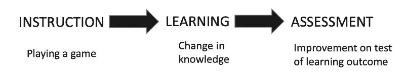

# Design per apprendere
Appunti per progettare un'esperienza didattica

## Framework

## Design Learning Experiences

### Learner Engagement
La cosa più importante è la _Learner Engagement_: vogliamo che il giocatore sia motivato, che sia felice, di imparare.

### Imparare
Cosa vuole dire _imparare_?

Imparare è un **processo** di acquisizione e ricostruzione di conoscenze che ci portano ad un cambiamento interiore, cambiamento in conoscenza, capacità, valori, comportamento, consapevolezza.

E' un processo **personale**

E' un'attività continuativa e quotidiana

Non c'è un solo modo di imparare

> Cosa è l'**educazione**?   
> L'arte di facilitare l'apprendimento.

Le tre vie per imparare:

1. **formale**
in un ambiente strutturato con obiettivi didattici e procedure per far imparare gli studenti

1. **informale**
ambiente non organizzato, si impara dall'ambiente diffuso, affrontando le varie situazioni

1. **non-formale**
situazioni didattiche non ordinarie, organizzate con obiettivi didattici. Varie metodologie costruite sull'interesse dello studente.

I videogiochi presentano tutte e tre le forme.

### Come si sviluppa

1. si sviluppa quando c’è coinvolgimento nel risolvere problemi *reali* del mondo
2. quando quello che si conosce diventa la base (*foundation*) per nuove conoscenze
3. quando si dimostra l’efficacia delle nuove conoscenze allo studente
4. quando le nuove conoscenze sono applicate dallo studente
5. quando le nuove conoscenze vengono integrate nel mondo dello studente

### Motivazioni per imparare

motivazione **instrinseca**

motivazione **estrinseca**

i videogiochi possono essere esperienze motivanti sia instrinseche che estrinseche

### Forme di conoscenza

> La Conoscenza è Potere (Francis Bacon)

Riuscireste a vivere bene senza conoscenza?

1. Conoscenza **Cognitiva**, fatti, pattern, concetti che ci aiutano a sviluppare capacità intellettuali
2. Conoscenza **Affettiva** o Intelligenza Emotiva, come ci comportiamo con gli altri e gestiamo i **sentimenti**
3. Conoscenza Psicomotoria, movimento e coordinazione
  
## GBL

### Principi

- Un **ambiente sicuro** da esplorare e in cui **commettere errori**
- Imparare attraverso il divertimento
- Apprendimento contestualizzato, orientato all'obiettivo anziché astratto
- Apprendimento esperienziale: imparare facendo
- Motivazione intrinseca: il gioco è volontario e autonomo
- Responsabilità e feedback senza interruzioni
- Contenuti appropriati ad Età e cultura 

### Meccanismi

- Un'ambientazione immaginaria o reale
- Livelli di difficoltà progressivi e sfide adeguate
- Feedback immediato e costruttivo
- Un ambito sociale che permette alle persone di condividere esperienze e costruire legami
- Obiettivi, regole, risultati misurabili e ricompense chiari e realizzabili

### Come si impara

### DGBL approach

- introduction to videogame (+ tutor: tech + expectations)
- gameplay / experience (autonomo)
- game results / scores (autonomo)
- debrief: reflection / analysis (+ tutor)
- forming abstract concepts + real world application

### Assessment
Using games for assessment is more than games scores.  
Assessment happens around a game more often than it happens inside the game, and teachers/coaches must still design and provide authentic, useful assessment tasks for students.

### Opzioni di Sviluppo

- Use entertainment/commercial games (Assassin's Creed / Civilization)
- Modify entertainment games (Kerbal Space Academy)
- Use virtual worlds (Minecraft)
- Use educational games (MinecraftEdu)
- Create games (Antura)

### Modello di gioco

### Objectives of learning analytics

### GBL challenges
**Curriculum**: identify how a certain game can connect to the curriculum. 

**Game related**: identify the accuracy and appropriateness of the content of the game. Irrelevant or distracting content from the game that could not be removed.

**Attitudes**: persuading all stakeholders and non-players about the educational value of the game.

**Educators and Teachers support**: make them aware of how to use games more effectively in education.

**Assessment**: Traditional assessments do not often align with GBL, so new models and approaches must be considered.

**Developers** encourage and support game developers in the creation of better educational games
[91_glossario](91_glossario.md)
