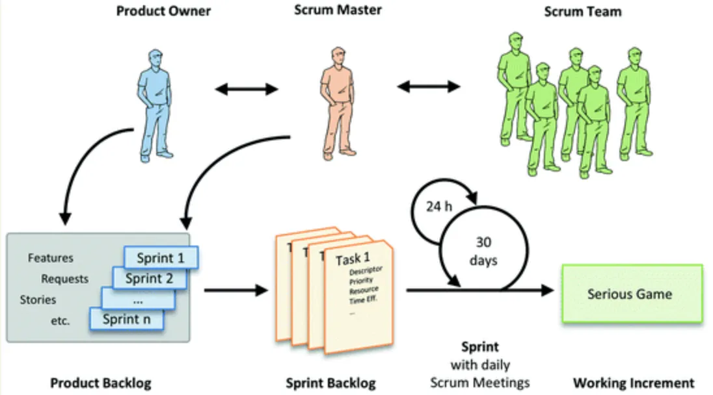
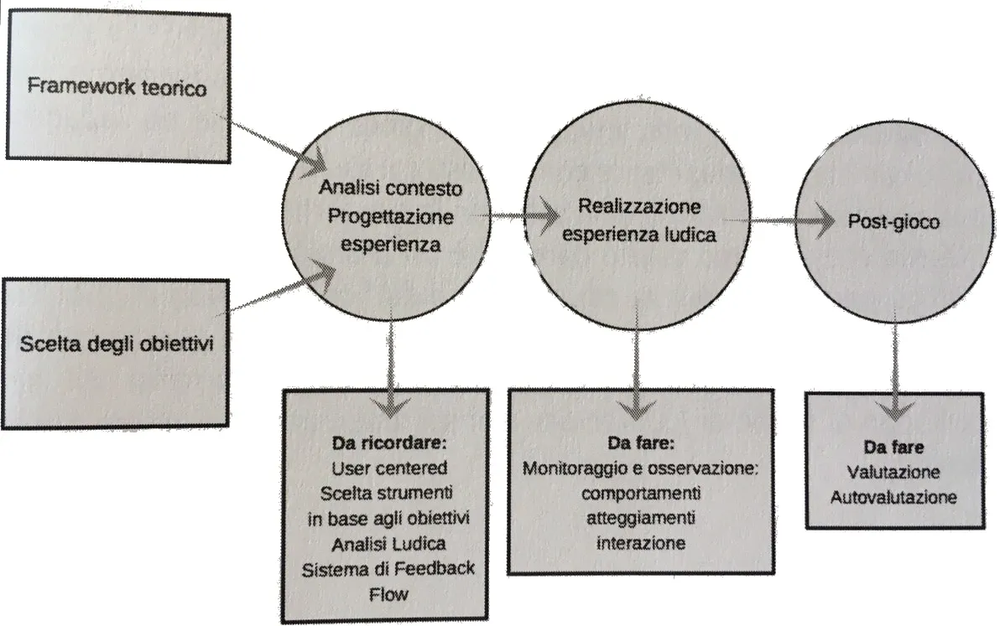
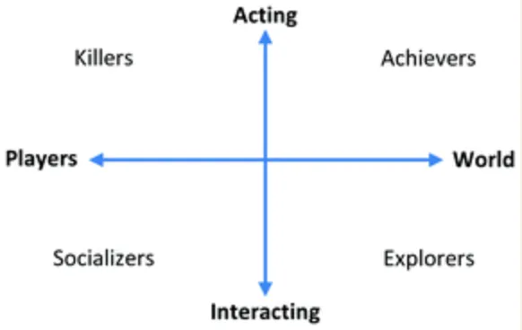
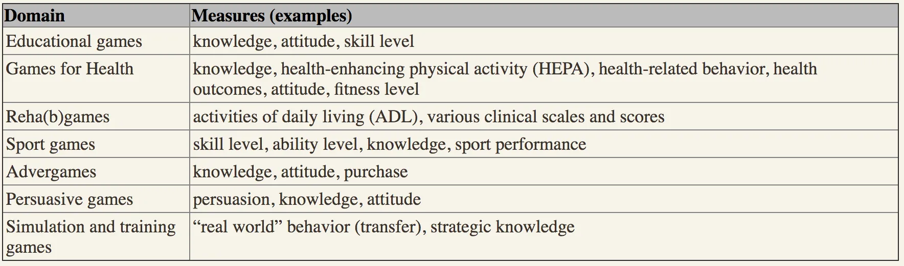
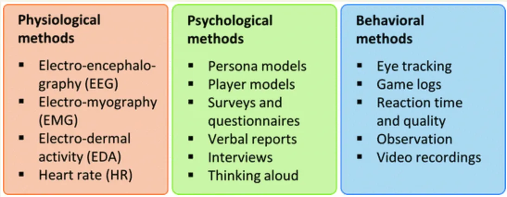
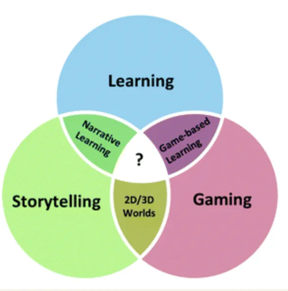
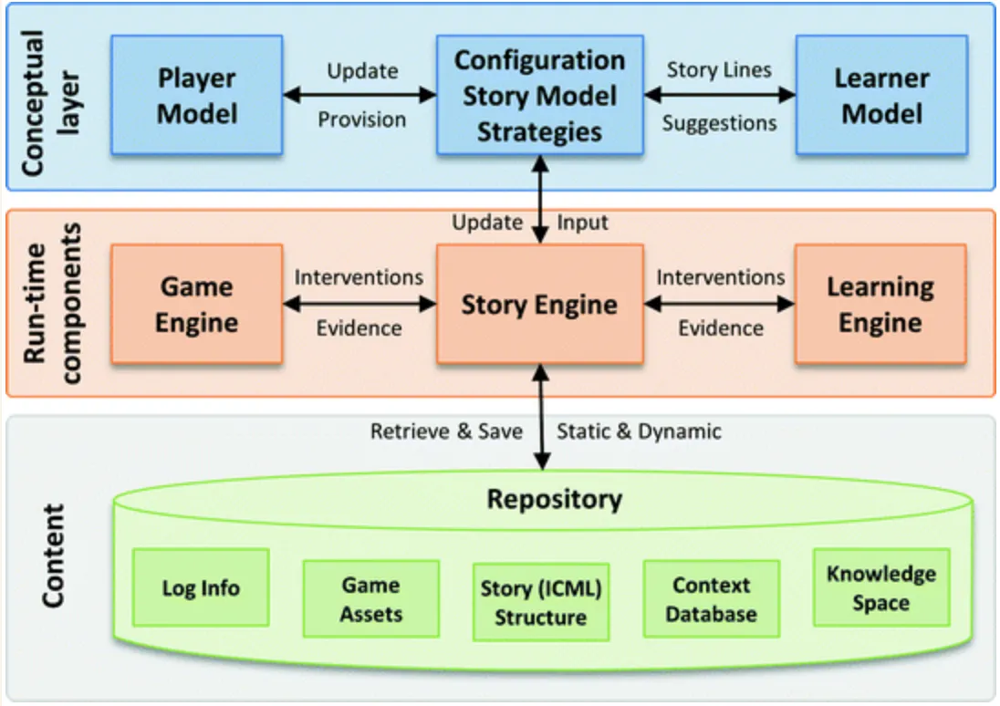
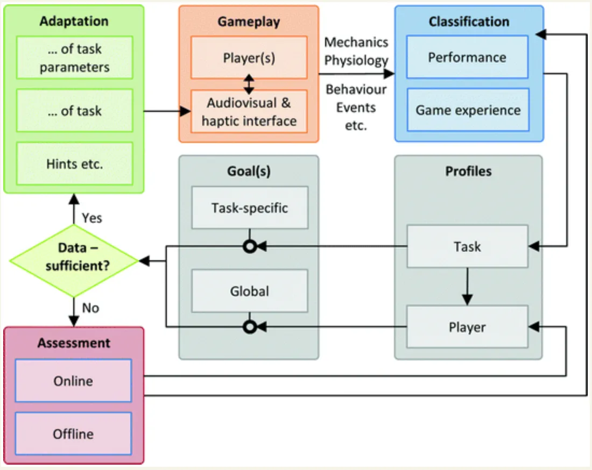
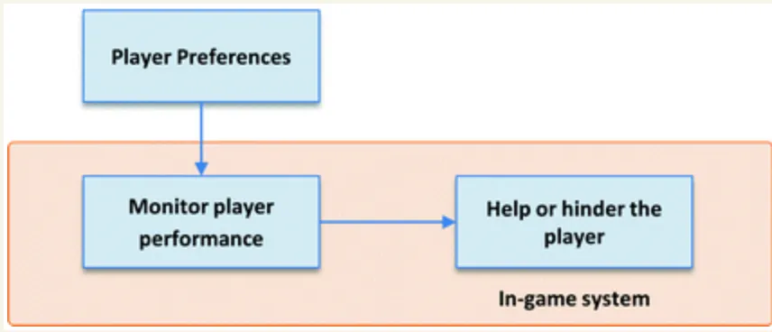
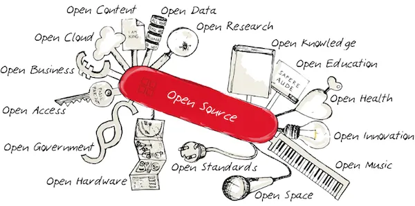

# Development

## Focus
**Avere sempre ben chiaro il focus del progetto** aiuta Designers, developers, artisti. Accelera lo sviluppo, da direzione all'arte, migliora la possibilità di test.

## Assiomi da sfatare
Due luoghi comuni errati sullo sviluppo dei videogiochi sono

1) che i giochi semplici sono semplici da produrre 
2) dalla complessità tecnica di un gioco emerge la sua bellezza. 

Il rapporto tra qualità di un gioco, percezione di immediatezza da parte del giocatore, sviluppo e aspetti tecnici del gioco è estremamente complesso e non vi sono regole generalizzabili in merito.

## Prototipare
È la regola nr. 1

La creazione di un prototipo dall’idea di gioco porterà probabilmente a modificare anche radicalmente l’idea originaria. Il punto è che raffinare l’idea di gioco prima della creazione delle componenti multimediali più costose può ridurre fortemente i costi dell’operazione complessiva. Può inoltre chiarire i punti che necessiteranno più effort, e quindi contribuirà a chiarire i rapporti di produzione e con questi l’armonia nel gruppo di produzione.

## Architettura e moduli
- Impostare subito l’architettura di base, con placeholders prefabs e componenti definitivi.
- Permettere d altri di contribuire
- Permettere modifiche di game design in tempo reale
- profilo del giocatore (game skills, curriculum e psicologico)
- logging
- adattamento della difficoltà e delle challenges
- analisi dei dati

## Strumenti collaborativi

### Source Control
Git

### AGILE
agile software development methods means that the development process does not follow a previously laid out, rigid plan; instead, it is flexible to adjust to changing requirements and software specifications.
Cicli settimanali, fast feedback, impostazione progetto

### SCRUM
most software projects are far too complex to rely on the perfect plan

## Framework di Sviluppo

## Player Modeling
Per avere un impatto, può essere molto utili creare un modello del giocatore

### Cosa possiamo misurare?

- Game metrics behavior assessment: Logging of every action the player takes while playing, for future analysis.
- Player modeling: AI-based models that react to player behavior and adapt the player experience accordingly.
- Psychophysiological player testing: Controlled measures of gameplay experience with the use of physical sensors to assess user reactions.
- Eye tracking: Measurement of eye fixation and attention focus to infer details of cognitive and attentional processes.
- Persona modelling: Constructed player models.
- Qualitative interviews and questionnaires: Surveys to assess the players perception of various gameplay experience dimensions.

### Player Analytics
- loyalty
- quanto gioca
- cosa fanno durante il gioco? perché?
- interagiscono con altri giocatori? come?
- ottengono i risultati didattici?
- c'è persistenza di quello che imparano?
- cosa altro dobbiamo sapere dei giocatori?

## Adaptive Storytelling

vedi <http://www.storytec.de/index.php?id=22&L=1>

## Adattamento del gioco

## Tecnologie
Alcune tecnologie e metodologie sono particolarmente interessanti

### XR: AR / VR / MR
- immersività ed empatia
- nuove frontiere
Leggere il percorso dedicato alla [XR](../xr/index.md)

### A.I.
- Customized/tailored content
- Player profile

Leggere il percorso dedicato alle [Game AI](../ai/index.md).

### Open Source
(collaborazione, visibilità, reciprocità, velocità, future)
molti frameworks e soluzioni esistenti.

Leggere il percorso dedicato al [Open Source e Sviluppo Distribuito](../ci/index.md)

### Cloud Services
- analytics
- remote config
- feedback

### IOT
interfacciamento con devices esterni (wearables, iOT): new data, nicchie, sperimentazioni, fondi

### Social aware / ethical providers
(compagni di valori e visione)

<https://gamindo.com>

### DevOps
piattaforma di sviluppo, tests, velocità e accessibilità

## Template scheda gioco
- Titolo
- Scopo del gioco
- Audience / Public
- Genere (tags)
- Descrizione
- Numero giocatori
- Età consigliata
- Controllers
- Ambiente: fisico o digitale? 
- Tempo / durata
- Punteggi: ci sono modalità di vincita e se si come?
- Ruoli: quali e quanti ruoli sono presenti nel gioco e quali identità deve impersonare il giocatore?
- Relazioni: che interazioni sono richieste? (collaborativa, cooperativa, ambivalente)
- Profilo dei giocatori: analisi del contesto, abilità, socio/cultura, comportamento dei giocatori
- Emozioni: quali emozioni può suscitare il gioco?
- Motivazioni: quali sono le motivazioni che esprimono i giocatori giocando?
- Conoscenze / competenze: quali può sviluppare il gioco
- Platform(s)
- Prezzo
- Expected launch date

## Case study: Antura planning
Antura Screen by Screen - [Google Doc](https://docs.google.com/presentation/d/1hc5Sjzq6cg_Y-FHgIK819KzfHWOG0KF9jhPh6Klf4Ww/edit#slide=id.g24c0825d9f_0_52)
