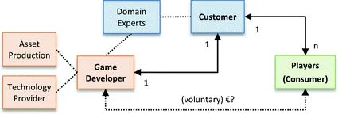

# Business e Marketing

## Tipologie di business
Innanzitutto chiariamo due macro destinatari del nostro lavoro:

1. B2C (Business to Consumer)
2. B2B (Business to Business)

## Cosa vendiamo

- videogiochi
- componenti (assets, librerie, tool)
- servizi (in-game o produttivi)
- consulenza

## Analisi di mercato
- Per chi stiamo sviluppando?
- Quanto è ampio il gruppo target e il potenziale di vendita?
- Che tipo di atteggiamenti e convinzioni ha il gruppo target?
- Chi sono i nostri concorrenti e quali sono i loro principali punti di forza?
- Con quali mezzi possiamo comunicare al meglio il nostro prodotto al gruppo target?

## Chi ci paga?
Nel caso del puro entertainment le entrate derivano dalla vendita dei giochi, in ogni caso possiamo prevedere queste fonti:

- Distributori (piattaforme online)
- Publisher
- Utenti finali
- Imprese private
- Fondazioni private e pubbliche
- Organizzazioni Non Goverative (ONG) e No Profit
- Università
- Governi

## Modalità di vendita
- gratuito (sviluppo pre-finanziato)
- gratuito (in-app purchases)
- gratuito (advertising)
- pagamento (one shot)
- subscription / abbonamento
- donationware
- offerta libera
- Patreon / supporters
- Kickstarter / crowdfunding

## Diversi modello di Business

Modello **classico**  

Modello **applied**  

## Temi legali
Etnia, Gender, Data Protection e Privacy

## Team
Imparare a lavorare in gruppo è la cosa più difficile ma anche la più importante.

Servono:  
- comunicazione diretta e nonviolenta
- obiettivi chiari 
- bisogni espliciti
- volontà di imparare e migliorarsi
- non praticare il giudizio
- consapevolezza dei propri limiti

## Lavorare
- Dipendente
- Libero Professionista
- Startup

## Farsi trovare
E' importante avere una presenza web con i propri temi, interessi e capacità.  Definire in modo semplice e conciso la propria "tag cloud" e la propria mission può agevolare sensibilmente l'opportunità di essere trovati e coinvolti in determinati progetti.

> Tranquilli, ti troviamo noi

## Networking e Social Media
- Imparare in pubblico
- entrare in forum e gruppi tematici
- rimanere in collegamento con persone che stanno nella stessa area di attività e interesse
