# AR - Realtà Aumentata
[Keynote reel](https://www.youtube.com/watch?v=vhEtAAtsOG4)

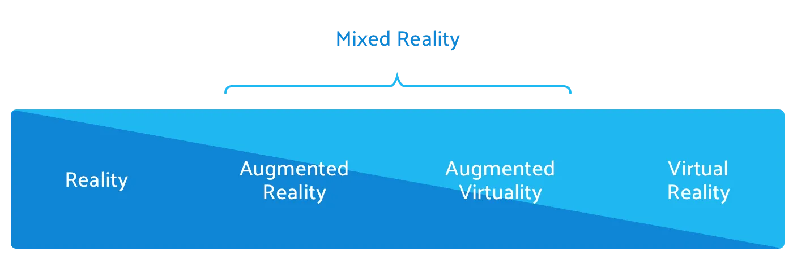

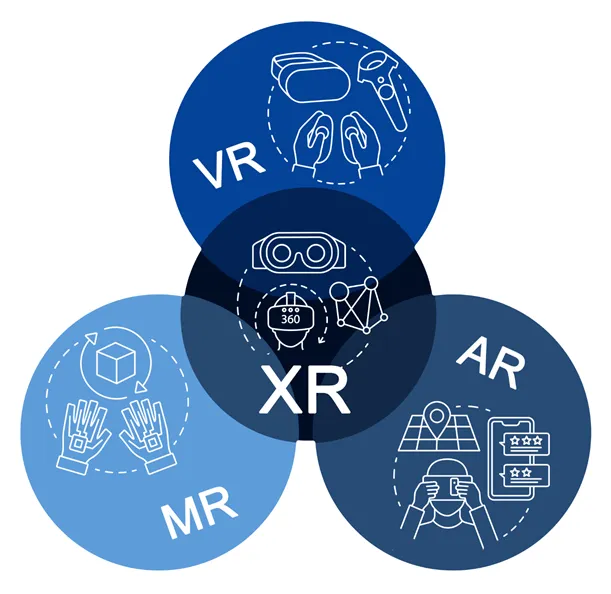

## Cosa è la Realtà Aumentata?
La realtà aumentata è la sovrapposizione di uno o più livelli informativi (elementi virtuali e multimediali, dati geolocalizzati, ecc.) all'esperienza reale di tutti i giorni

un po' di storia:
<https://medium.com/deemaze-software/augmented-reality-a-simple-technical-introduction-83d5e77206b9>

video: <https://youtu.be/XLP4YTpUpBI?t=269>

intro: <https://unity.com/solutions/ar-and-vr-games>

## Ambiti (mercati)

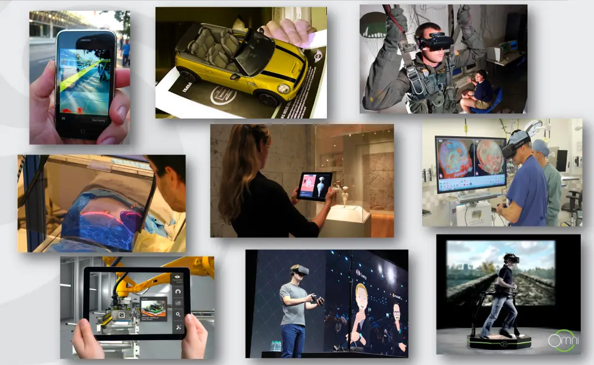

- Entertainment
  - <https://www.tekrevol.com/blogs/22-best-augmented-reality-games/>
  - entertainment per adulti
- Education
  - <https://www.youtube.com/watch?v=Zy9mVWHvaos>
- Social
- Disabilities
  <https://arpost.co/2022/02/09/7-benefits-ar-vr-for-people-with-disability/>
- Cultural
  - [architetture storiche](https://www.youtube.com/watch?v=ZdWeYBBtxZA)  
  - <https://www.youtube.com/watch?v=052ArpkI1c8>
- Medical
  - <http://www.awalkthroughdementia.org/>
  - <https://blog.unity.com/manufacturing/mixed-reality-surgical-training-with-the-virtamed-laparos-simulator>
- Military Training / Defence
  - [carro armato AR](https://youtu.be/vh1SV1F2AxI)
  - [soldier training](https://youtu.be/NND7Hk5fYdI)
- Engineering Design
<https://hololens.reality.news/news/nasa-integrates-microsoft-hololens-into-regular-maintenance-operations-international-space-station-0384870/>
- Robotics and Telerobotics
  - [digital twins](https://www.youtube.com/watch?v=N0JDVaK--ZE) 
- Manufacturing, Maintenance, Repair
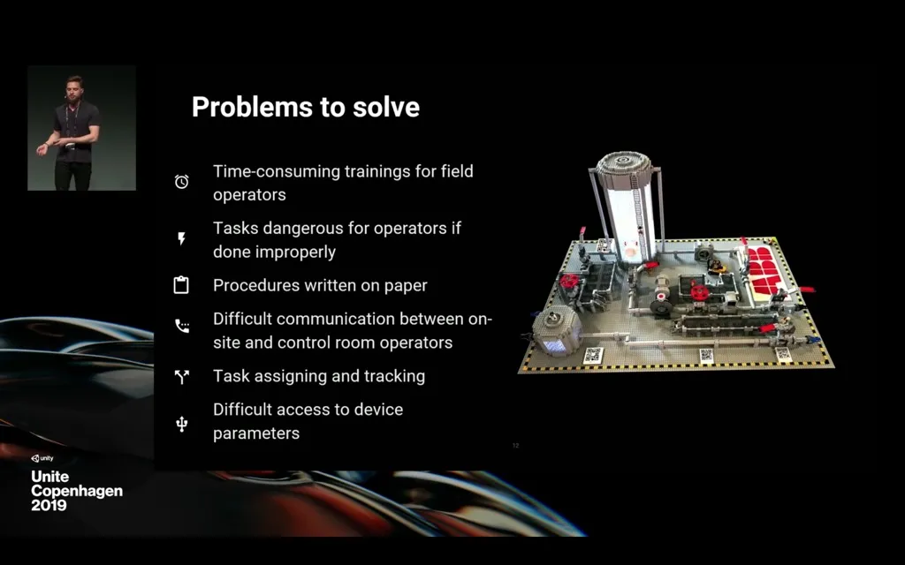

  - [best-practices-for-bringing-ar-applications-to-the-field](https://blogs.unity3d.com/2020/02/28/best-practices-for-bringing-ar-applications-to-the-field)
- Consumer Design
- Sports
  - [AR in Tokyo Olympiads](https://mobile-ar.reality.news/news/new-york-times-revives-its-ar-storytelling-instagram-with-tokyo-olympics-experiences-0384822/)
- Marketing
  - [BIglietto visita](https://blog.unity.com/technology/looking-to-the-future-of-mixed-reality-part-ii)
- Art
  - [Billie Eilish Beat Saber](https://youtu.be/1jKBywegGcI)
  - [Art lectures in AR](https://github.com/golanlevin/lectures/tree/master/lecture_augmented_reality)
- Film
  - [AR in broadcasting television](https://youtu.be/s8lb3JCNqcc) 
  - Unite Berlin Keynote: XR & Films <https://youtu.be/3omw9dLkrR8?t=1136>

## Come funziona

Per sovrapporre un elemento "virtuale" all’ambiente reale si deve:

1. Identificare dove verrà visualizzato
2. Orientarlo correttamente nella scena
3. Integrarlo più possibile con l’ambiente
4. Fornire un’interazione (se necessaria)

Servono competenze in diversi ambiti:

### Visione Artificiale
E’ l’insieme dei processi che mirano a costruire una descrizione del mondo a partire da immagini. Ha lo scopo di emulare la visione umana attraverso:

- L’acquisizione
- L’elaborazione al computer
- La comprensione delle immagini

### Interazione uomo-macchina (HCI)
L’interazione uomo-macchina (HCI) è una disciplina che riguarda la progettazione, la valutazione e l’implementazione di sistemi informatici interattivi per l’uso umano. Comprende aspetti di diversi ambiti fra cui:

- Informatica
- Intelligenza artificiale
- Visione artificiale
- Psicologia
- Design

Concetti fondamentali:

- Usabilità
- Interazione
- Interfacce adatte allo scopo

#### HCI: Riconoscimento gesti
Riconoscimento e dell’interpretazione dei gesti di un utente.  
Ad ogni gesto o sequenza di gesti corrisponde una specifica azione che verrà
eseguita dal computer (es. zoom, rotazione, click, ecc.)

I gesti diventano quindi un controller alternativo, utile per comandare un computer o un dispositivo a distanza, specialmente in casi in cui è consigliabile evitare il contatto diretto (es. medicina)

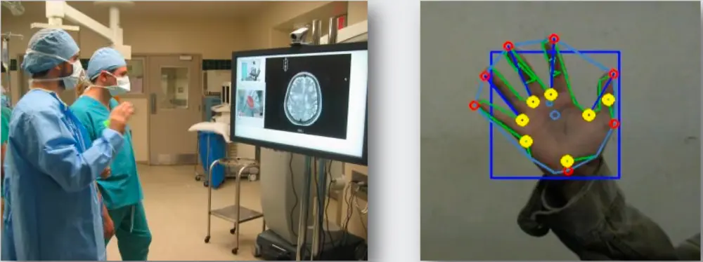

### AR: con o senza marker
**Con marker**

- Si usa un riferimento noto per sapere dove visualizzare l’oggetto
- Problemi dovuti ad occlusioni e “distorsioni”

**Senza marker**

- Risolve il problema delle occlusioni
- Richiede tecniche di visione più complesse per capire dove visualizzare l’oggetto

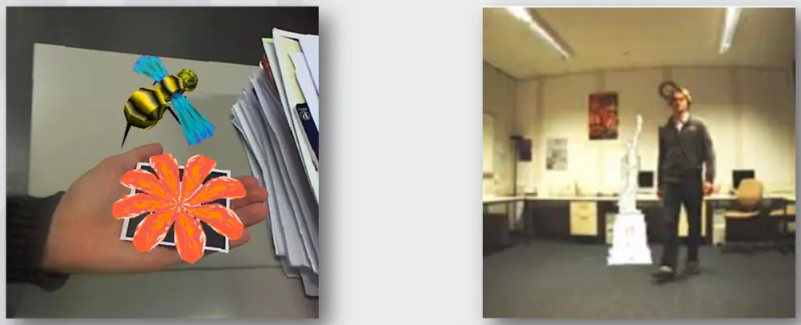

### AR: debole o forte
AR “debole”

- Tracciamento non necessariamente accurato
- Parziale integrazione con l’ambiente
- Interazione limitata
- Smartphone o PC

AR “forte”

- Tracciamento accurato
- Ottima integrazione con l’ambiente ➢ Interazione naturale
- HMD

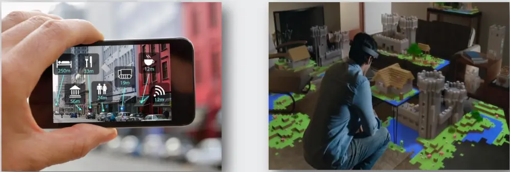

### camera, gyroscope, accelerometer, motion

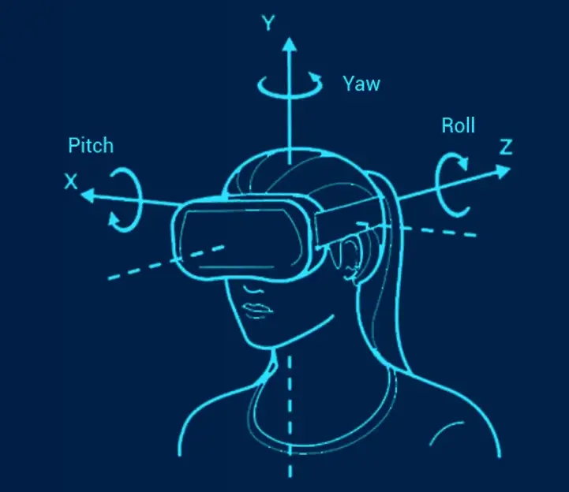
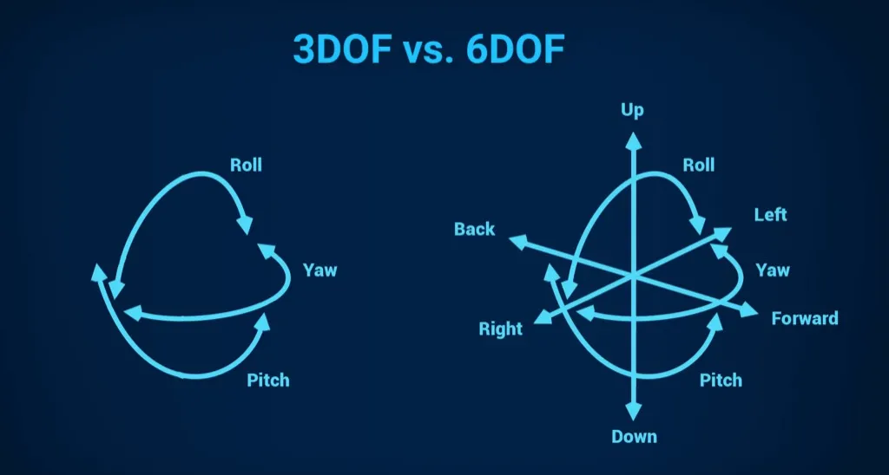
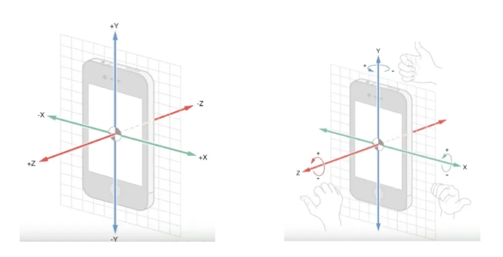
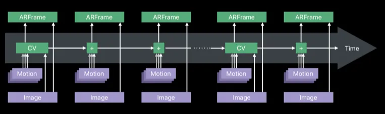

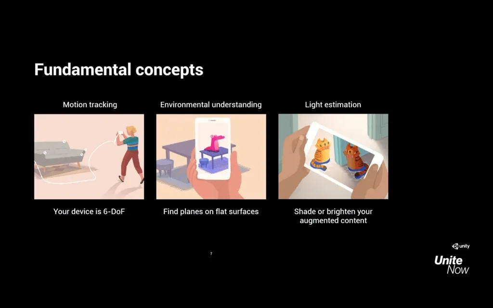

## Features
### multiplatform mobile
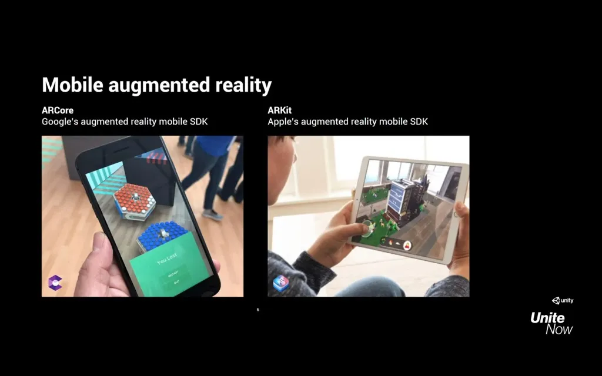

### Device tracking
track the device's position and orientation in physical space.

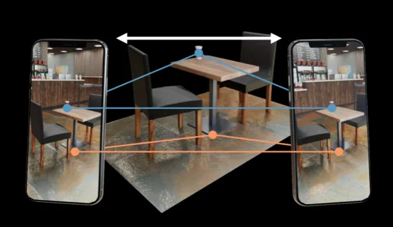

### Plane detection
detect horizontal and vertical surfaces
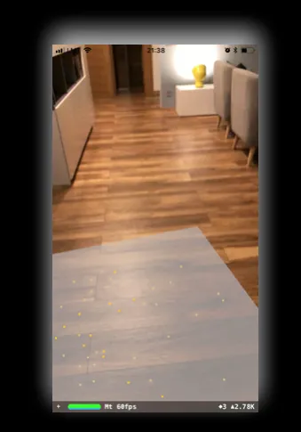

### Point clouds, also known as feature points.
Anchor: an arbitrary position and orientation that the device tracks.
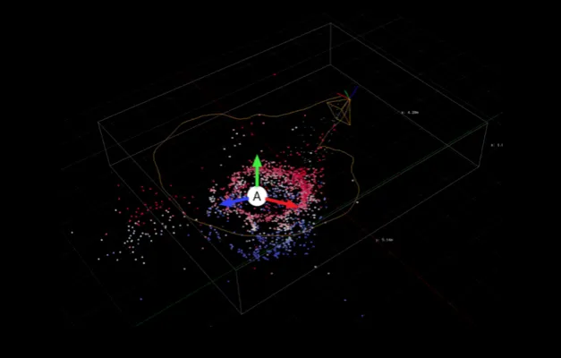

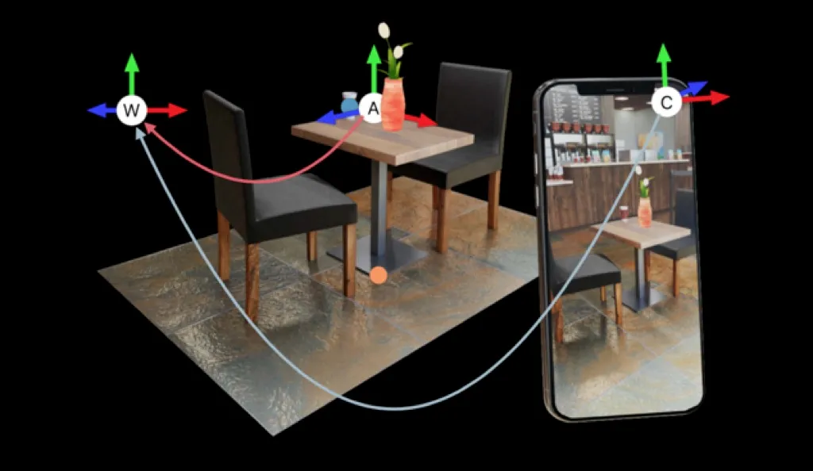

### Light estimation
estimates for average color temperature and brightness in physical space.

### Environment probe
a means for generating a cube map to represent a particular area of the physical environment.

### Face tracking
detect and track human faces.

### 2D image tracking
detect and track 2D images.

<https://www.youtube.com/watch?v=ZhHExAxyVow>

### 3D object tracking
detect 3D objects.

<https://www.youtube.com/watch?v=wrYYN3a6XZo>

### Meshing
generate triangle meshes that correspond to the physical space
Lidar Scene reconstruction

- <https://www.youtube.com/watch?v=53giwaqQMMU>

### Body tracking
2D and 3D representations of humans recognized in physical space

### Collaborative participants
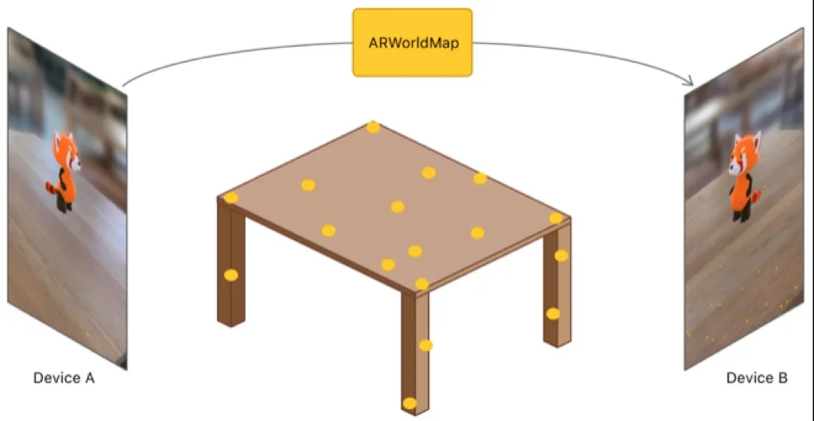
track the position and orientation of other devices in a shared AR experience
<https://www.youtube.com/watch?v=IO4-KCLg6OA>

### Human segmentation
determines a stencil texture and depth map of humans detected in the camera image

### Raycast
queries physical surroundings for detected planes and feature points

### Pass-through video
optimized rendering of mobile camera image onto touch screen as the background for AR content

### Session management
manipulation of the platform-level configuration automatically when AR Features are enable or disabled

### Occlusion
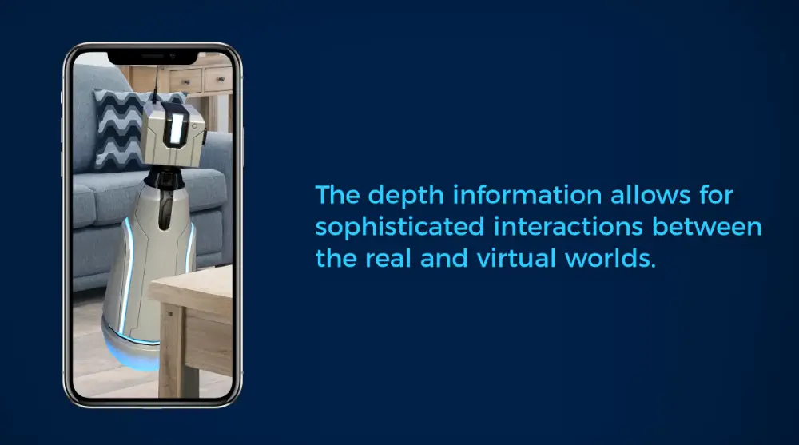

allows for occlusion of virtual content by detected environmental depth (environment occlusion) or by detected human depth (human occlusion)

- <https://blogs.unity3d.com/2020/06/25/blend-virtual-content-and-the-real-world-with-unitys-ar-foundation-now-supporting-the-arcore-depth-api/>
- <https://www.youtube.com/watch?v=KwuHOBaX8ns>

### Portals
<https://www.youtube.com/watch?v=nMUYwPognsw>
<https://www.youtube.com/watch?v=VjZ-TAsJCeE>

## AR Foundation
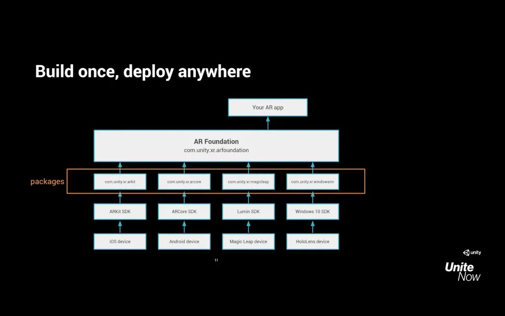
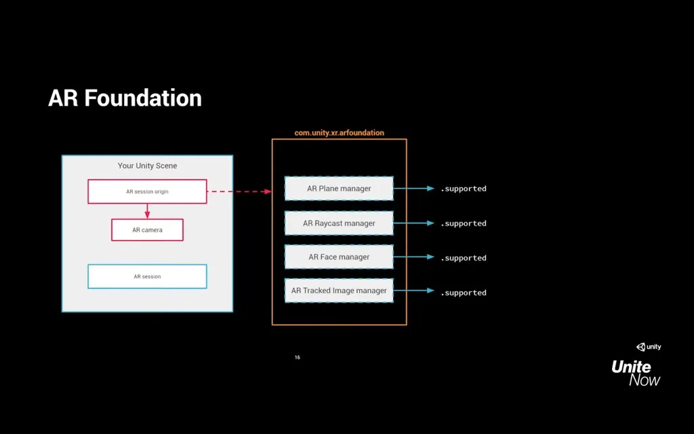

- Unity XR Interaction Toolkit: <https://youtu.be/MIoGBoC1txM?t=759>
- Manuale <https://docs.unity3d.com/Manual/com.unity.xr.arfoundation.html>

## Esempi

- <https://www.youtube.com/watch?v=QTy1a__4xb0&t=15s>
- Marketing and games ([Pizza Hut Pac-Man](https://www.8thwall.com/toolofnorthamerica/pizza-hut-pacman))
- Provide additional information ([business cards](https://www.youtube.com/watch?v=xBYDmauqdaw), [medical demos](https://www.youtube.com/watch?v=1nZpX9BQEfo))
- Art (ArtVive [demo](https://youtu.be/3yc3tjyAdv0)
- Utility (Inkhunter [demo](https://www.youtube.com/watch?v=p_Q7eA-C6X0&t=19s)

