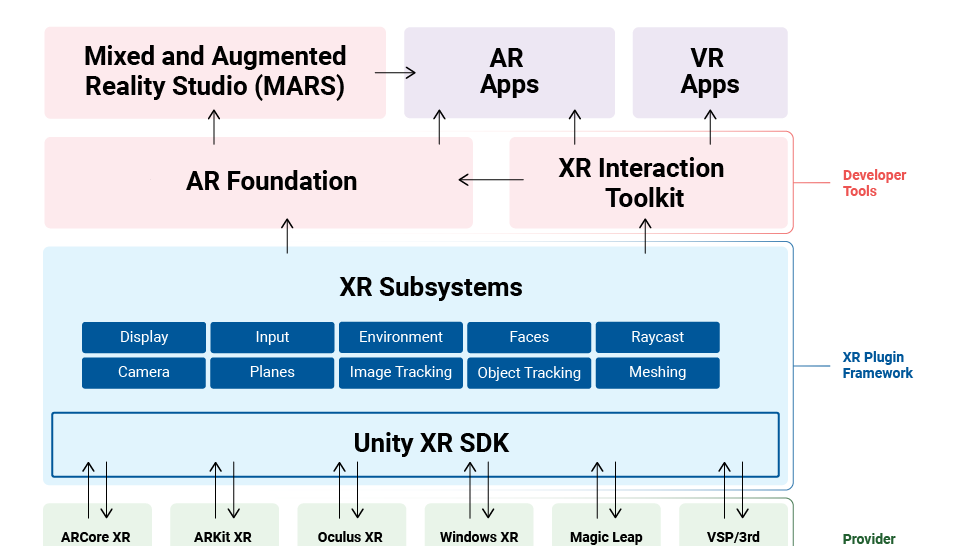
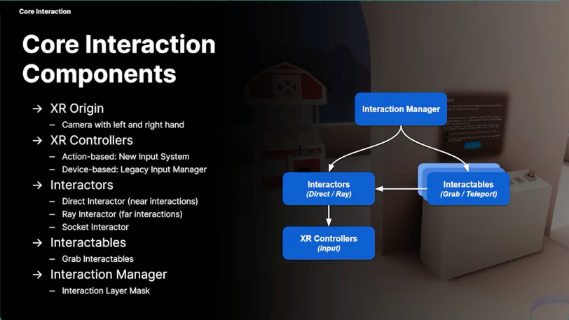
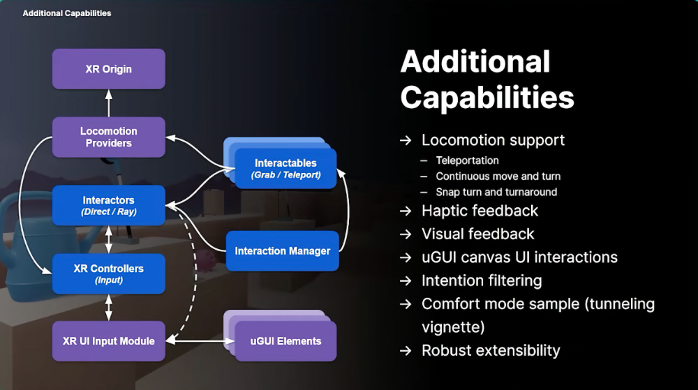

# Unity & VR

<https://unity3d.com/unity/features/multiplatform/vr-ar>
<https://unity.com/unity/features/vr>

## XR Interaction Toolkit

Un'architettura per 

- ARKit
- ARCore
- Microsoft HoloLens
- Magic Leap
- Oculus
- Windows Mixed Reality
- PlayStation VR

webminar: <https://www.youtube.com/watch?v=MIoGBoC1txM>

- <https://blogs.unity3d.com/2019/12/17/xr-interaction-toolkit-preview-package-is-here/>
- <https://github.com/Unity-Technologies/XR-Interaction-Toolkit-Examples/tree/master/VR>

#### OpenXR:

- <https://forum.unity.com/threads/unity-support-for-openxr-in-preview.1023613/>
- <https://docs.unity3d.com/Packages/com.unity.xr.openxr@1.0/manual/index.html>

#### Mixed Reality Toolkit (MRTK)

- https://learn.microsoft.com/en-us/windows/mixed-reality/mrtk-unity/mrtk3-overview/
- https://github.com/microsoft/MixedRealityToolkit-Unity
