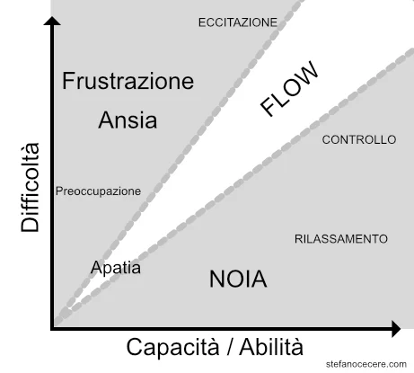
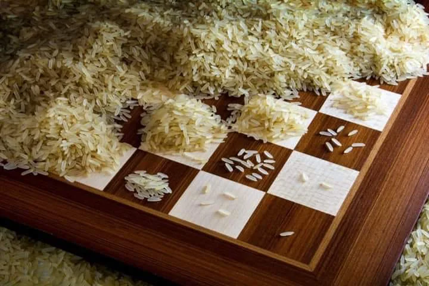
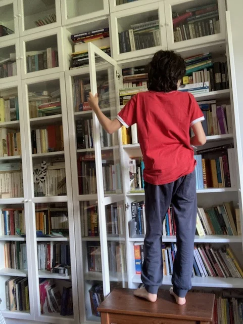

# Game Design, ovvero creare giochi

> TODO #TODO/vignetta  
> - che fai?
> - sto facendo un gioco
> - sempre a giocare eh
> - si, ma il gioco lo sto inventando e costruendo

Capire come si progetta un gioco è interessante e sopratutto utile per i giocatori (e i genitori). Un po' come per chi guida un'automobile è utile sapere quelle tre cose di meccanica per capire quale è il proprio mezzo ideale, come sceglierlo, o come non farsi fregare dalla pubblicità! o cosa fare in caso di problemi per non buttare via il tutto e comparare il nuovo modello.

Faremo giusto accenno perché il Game Design and Game Development sono Arti molto ampi, ma estremamente divertenti e perché no potrebbero essere le professioni del futuro.
E' solo un bene che ragazzi possano continuare ad inventare i propri giochi, incoraggiamoli e giochiamo le loro idee con loro.
Non solo il giocare è un indole innata in tutti noi, ma anche il creare giochi è una delle attività più creative che ci sia.

## Il giocatore al centro
Quando si progetta un gioco bisogna mettere il giocatore al centro. Si sta di fatto progettando **un'esperienza che vivranno altri** esseri umani che non siamo noi.
E' ben diverso che fare una cosa per sé, oppure da altre attività autoriali come lo scrivere o il suonare che uno può fare anche solo per se stessi, per godersi l'ebbrezza estatica creativa ad esempio.
Avere un minimo di familiarità con la psicologia, oltre ad un buon bagaglio culturale da elaborare con arte e tecnologia, è una necessità per un buon progettista di giochi.

## Errori
Non sono rari errori di progettazione e sviluppo che gli autori non trovano perché non è facile non pensare ad una cosa che si sa. Questo giochino rende molto l'idea:

> ESPERIMENTO: Ora devi entrare in mare senza bagnarti il gomito. Ma senza pensare al gomito.

Ricordiamoci che oltre ai bugs (errori di produzione, malfunzionamenti tecnici o di stampa), possono esserci quindi proprio errori di progettazione, che troviamo quando un gioco è troppo difficile o incomprensibile.

## Componenti
> "Il mio lavoro è un gioco.
> Un gioco molto serio." M.C. Escher

Vediamo alcuni elementi alla base del creare giochi.

### Il Flow

- perchè se il gioco è troppo facile, ti annoi
- e se è troppo difficile?
- dopo un po' non ti piace più
- infatti i giochi migliori sono quando è difficile ma non troppo
- però considera che più tu giochi, più tu vivi, più tu studi e ti eserciti, più diventi bravo
- e allora il gioco deve diventare sempre più difficile?
- esatto. in qualche modo tu dovresti stare in quello che nel mondo del Game Design si chiama il FLOW: una zona proporzionata tra le tue capacità e la difficoltà della situazione
- ma è il gioco che lo decide
- no, è chi progetta il gioco, il game designer, che lo pensa e lo determina.. così come un insegnante o un genitore, ti fanno partire dal semplice, e ti aiutano a crescere, presentandoti sempre più dettagli e sfide più complesse. ovviamente in funzione della tua crescita

### Diagrammi di flusso
Come strutturo una procedura?
Riesco a mettere su carta con grande precisione tutto quello che si può fare, collegando tutte le scelte e i casi?

### Sistemi complessi
> basta un battito di farfalla in Giappone per creare un uragano in Sud America

Questa celebre immagine rende bene l'idea, vero?

Quando gli elementi in gioco sono tanti e collegati tra di loro in vari modi, con relazioni di dipendenza o di mutua interazione, abbiamo un sistema complesso.
La scienza dei sistemi complessi è molto affascinante, quanto attuale!

### Alberi di scelte
> Se ti fermi a riposare, domani avrai piena forza e lucidità ma poche risorse
> Se invece passi la notte a studiare e cercare munizioni, domani sarai stanco ma più dotato.

Cosa deciderà il giocatore? Lui farà le sue valutazioni più o meno razionali, ma chi progetta il gioco deve prevedere ogni possibilità di scelta. Per ogni ramo di libertà che mette a disposizione del giocatore, deve garantire un gioco interessante, possibilmente senza arrivare a dire "eh no, hai scelto di dormire, scelta sbagliata, Game Over".

Oppure per proseguire in una strada bisogna aver prima averne percorse altre, con una intricata rete di dipendenze "se hai fatto questo allora puoi fare quello, se hai fatto quell'altro allora puoi fare codesto" etc... una alberatura di possibilità e scelte che deve essere ben equilibrata e soprattutto testata.

### Probabilità e Statistica
Dove c'è di mezzo il caso, lì il game designer vede possibilità più o meno probabili, e senza un buon esame di Probabilità e Statistica si rischia di creare sistemi squilibrati.
Ad esempio se creo un mazzo di carte: come distribuisco le carte più potenti o le combinazioni di carte vincenti?
Se devo creare una serie di incontri sempre più coinvolgenti, difficili ma non impossibili, come distribuisco i vari punti forza e ferita?

### Insegnanti di Matematica

Se alcune basi di statistica sono essenziali, più in generale un buon progettista di giochi deve avere una buona dimestichezza con la matematica tutta. Quando progettiamo un gioco per bambini la cui tattica vincente è saper fare un po' di conto per calcolare la mossa migliore, noi dobbiamo essere i primi ad aver pensato a quel meccanismo matematico, e con un po' di pedagogia capire se un bambino di tot anni può maneggiare tali dati.
Se creiamo un gioco con n parametri, devo sapere che se ne metto n+1 il gioco mi diventa impossibile perché le combinazioni aumentano in modo esponenziale.
Ma ancora di più: oltre a maneggiare la matematica, noi diventiamo degli *insegnanti di matematica* perché se il giocatore deve affinare le sue capacità matematiche per vincere, noi dobbiamo aiutarlo a migliorarle, creando un gameplay e situazioni adatti.

### Bilanciamento e Difficoltà
E' la parte più difficile, mantenere il giocatore nello stato di "flow" ovvero di divertimento senza cadere nella noia né nel salire nel troppo difficile.
Perché la difficoltà deve essere progressiva, per rendere il coinvolgimento sempre vivo.

### Rigiocabilità
Il gioco sarà bello da rigiocare?
Quale sarà stata l'esperienza che mi farà venire voglia di ripeterla? E' nel gioco in sé o nel contorno (tipo stare insieme a 7 amici a inventarsi insulti?)
Se è un gioco narrativo è ovvio che magari non avrò voglia di rigiocarlo perché so già la storia.. 

### Gradi di libertà
Quante possibilità di azioni ha il giocatore? E' facile intuire che più sono numerose più può diventare difficile decidere e sopratutto prevedere il corso del gioco.
La cosa può diventare un inconveniente sia per il giocatore (troppa libertà spesso blocca il ragionamento e induce all'affidarsi al caso) che per il game designer che non potendo testare ogni situazione potrebbe lasciare dei "buchi" nel gioco.

### Intelligenza Artificiale
C'è un aspetto estremamente interessante nello studiare l'Intelligenza Artificiale: per svilupparla bisogna migliorare la conoscenza di noi stessi, di come pensiamo, di come funzioniamo. Sono questioni che vanno ben al di là della semplice neurologia, perché si tratta di capire quale sia la vera grande caratteristica di un Essere Umano e cosa ci differenzia da un computer che si avvicinerà e presto ci sorpasserà nella maggior parte delle attività intellettuali.  
Per gli interessati rimandiamo il discorso ad un prossimo libro ad hoc. Qui, per i progettisti di giochi, interessa come creare dei validi avversari per i nostri giocatori. Che siano delle regole scritte per un gioco da tavola o un algoritmo procedurale software o, entrando nella nuova frontiera, un sistema in Machine Learning che impara da tutti i dati disponibili, costruire una A.I. è affascinante e implica sempre una riflessione su se stessi.

## Le motivazioni di un giocatore
Un sociologo aveva sintetizzato queste quattro motivazione per mettersi in gioco.

### La competizione
> Agon = competizione. Ora capiamo l'origine della parola Agonistica e perché ci piace sfidare gli altri!

Sfidare gli altri con una o più delle proprie virtù (forza, intelligenza, memoria, velocità, intuizione) e comprovare la propria maestria.
Con la competizione nasce la **tensione**.
Il risultato è il compiacimento e un eventuale senso di superiorità nei confronti dello sconfitto.. fino alla prossima partita :)

### Il caso
>*Alea iacta est : il dato è tratto.. in latino Alea era il Dado da gioco!*. 

L'Alea è l'opposto di Agon, ed è il massimo abbandono al caso, alla Sorte, al Destino.
Qui il giocatore non decide, e se è razionale si affiderà alla Statistica e Probabilità, se invece ha altre credenze, pregherà quello che crede possa intervenire nella sua vita in cambio di offerte, rituali o promesse.
Anche qui il rischio crea una forte tensione, a volte anche un flusso di adrenalina. e se il gioco è veloce c'è voglia di rigiocarlo.
Ma la casualità può essere un ottimo modo per creare scenari sempre nuovi e originali e permettere al giocatore di esplorare lo sconosciuto, addentrarsi  nel mondo dell'imprevedibile

### La Simulazione
> Come ti sei mimetizzato bene dentro quel personaggio!

Giocare inpersonificando un personaggio o un ruolo specifico. Permette all'immaginazione e alla creatività di fluire con la storia, la fantasia.
Il giocatore deve però accettare di sospendere la propria personalità e credenze, ed entrare nel ruolo di quel personaggio.

### La Vertigine
> WOOOOOOOOOWA

*Ilinx* dal greco vortice, vertigine, turbine, nel senso di alterare la percezione sperimentando forti emozioni (paura, estasi) creando un senso di eccitazione e divertimento. Ad esempio andare sulle montagne russe, roteare fino a cadere, 
Crea disorientamento, ansia, adrenalina e paura.  
I videogiochi sono particolarmente adatti a ricreare queste situazioni

## Estetica
> se è bello è più bello

Bella grafica, componenti di buon materiale, cura dei dettagli, l'impaginazione delle regole, la semplicità di capire cosa fare. L'estetica può essere bene il 50% dell'esperienza di un gioco. Se poi l'estetica è bel collegata ad uno scenario, ad un *lore* (ambientazione culturale e storica), il coinvolgimento sarà maggiore. Provate a giocare a scacchi con una piccola scacchiera di plastichina, oppure una con dei pezzi in legno.

## E' un giocatore *razionale*?
Una della grandi questioni nella Teoria dei Giochi è se un giocatore giocherà o no seguendo la razionalità. Ovvero con la migliore scelta in base a tutte le informazioni disponibili e alle più alte probabilità di successo. Ma si è visto nella pratica, che siano videogiochi o altri giochi, gli esseri umani riescono sempre a sorprendere.  
È anche uno delle grandi illusioni di chi progetta sistemi economici o politici il presumere gli gi esseri umani si comportino tutti, o grande maggioranza, in modo razionale. Quindi sappiamolo e prevediamo tutto.

## Divertimento e Coinvolgimento
> giochi con me a questo gioco noioso?

Se non è divertente, non c'è coinvolgimento, non c'è partita.
Ci possono essere mille tecniche e artifizi per rendere un gioco bello, l'esperienza completa e senza problemi di giocabilità. Ma alla fine quello che conta è se un giocatore avrà mai voglia di giocarlo il nostro gioco. E sopratutto *rigiocarlo* o consigliarlo agli amici. Qui entriamo nel mondo del divertimento e del coinvolgimento, che sono arti non codificabili esattamente e che non lo saranno mai, perché collegate all'ambiente sociale, alle mode, alla sensibilità e alla cultura del momento storico.  

## Studiare

Ah. Se poi i vostri figli vorranno fare il Game Designer di lavoro... sappiate (ma non ditelo subito) che c'è da studiare. e tanto. È un'arte così multidisciplinare che oltre alle questioni tecniche e tecnologiche è fondamentale una minima infarinatura di psicologia, pedagogia, biologia, comunicazione, filosofia, estetica, semiotica, politica, letteratura e tutto quant'altro possa servire per concepire e capire un'esperienza umana. Non deve spaventare tutto questo, anzi, potrebbe essere un valido stimolo per aprire un po' di libri e curiosare ovunque.

## Come iniziare
> Inizia a guardare le cose con l'intenzione di capire come le hanno fatte.

***Premessa**: queste considerazioni valgono sia per i videogiochi che per i giochi da tavolo o i fumetti o qualsiasi altra cosa.*

La prima regola è **osservare con attenzione**.  
Non semplicemente guardare e divertirsi, ma proprio osservare ogni particolare e domandarsi: perché c'è? come l'hanno creato? è un accessorio o essenziale? Come lo farei io?

La seconda regola è: ogni cosa è stata creata da esseri umani e se l'hanno fatto loro **posso farlo anche io**, è solo questione di studio, esercizio, impegno e non arrendersi alle difficoltà.

La terza regola è: **non farsi troppe aspettative**. Tutti sono perfettamente in grado di creare il proprio gioco. magari non sarà un gioco di successo, oppure non verrà mai pubblicato e rimarrà una delle tante pagine di un diario personale, ma chi lo sa. Tutti hanno iniziato da zero. Se poi arriva la passione e la fortuna, chissà.

La quarta regola è: **non temere il giudizio degli altri**.
Richiederlo si e farne tesoro, ma non bloccarsi perchè qualcuno ti dice che non sei capace o il tuo gioco è banale. Il mondo è pieno tra l'altro di giochi semplici, banali, ma finiti e pubblicati.

La quinta regola è: **condividere le proprie creazioni**.
Partecipando ad eventi pubblici, game jams, concorsi, o segnalando la propria creazione tra gli amici e i gruppi dedicati. Renderlo open source (ovvero con il sorgente aperto) è un buon modo per farsi conoscere.

La sesta, e forse la più importante, è **trovarsi almeno un compagno di viaggio**, qualcuno con lo stesso interesse, con cui parlare, scambiarsi opinioni. Non necessariamente si lavorerà allo stesso progetto, però non essere soli è importante. Questo compagno di viaggio potrebbe anche essere un parente.. un fratellone, il papà, uno zio, basta che dia un minimo supporto e sia disponibile ad osservare.
