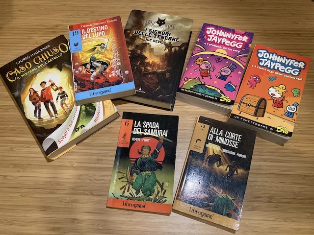

# Libri Gioco

> Papà io vado a pagina 27 a fare colazione. Tu vuoi andare sulla poltrona a lavorare?, pagina 42!

LibriGame, Storie a Bivi, Libri Avventura, Scegli la tua storia... sono molte le denominazioni di questo tipo di libri che permettono al lettore di interagire con le sue pagine. È una categoria che ci piace inserire perché

1. amiamo i libri
2. amiamo i giochi
3. permettono di sperimentare nuove forme di lettura
4. sono coinvolgenti

Come con i giochi da tavolo, negli ultimi anni si è rinnovato l'interesse per questi libri diventati famosi negli anni '80. Qui elenchiamo giusto alcune tipologie e poi ne accenneremo qualcuno, ma andate in libreria o online a curiosare.

## Tipologie

### Narrativi
Qui la storia è la parte predominante e la scelta del lettore ne determina il corso. Alcuni sono brevissimo ,altri molto lunghi, con storie proseguono su decine di volumi (vedi Lupo Solitario).

### Enigmi
Per avanzare nel libri bisogna risolvere enigmi di vario tipo, un po' come le Escape Rooms. Qui la storia è spesso più lineare, perché l'interazione sta nel risolvere le pagine bloccanti.

### Visuali
Perfetti per i bambini che non sanno ancora leggere, la navigazione è guidata da frecce o icone.

### Di ruolo
Prima di iniziare a leggere si crea una scheda personaggio con tanto di caratteristiche e inventario. Nella storia verranno trovati oggetti e usate le proprie abilità e conoscenze, spesso tirando i dadi, per valutare i risvolti e cambiare pagina.

### Cooperativi
Non ci crederete ma esistono, e sono anche notevoli, dei libri gioco da leggere in 2, 3 o anche 4. Ognuno con il suo libro "sincronizzato" con gli altri.

## Leggerlo insieme
I paragrafi in media sono molto corti, e ben si prestano ad essere letti insieme e poi porsi la domanda: cosa facciamo ora? 
Un genitore potrebbe leggerlo come una favola (ricordiamoci che Gianni Rodari fu uno dei primi )

## Come sceglierlo
In base all'età del destinatario, dei suoi gusti in termini di scenario, e a seconda di chi deve leggerlo.
Conviene partire con quelli corti e semplici.

## Create un vostro Libro Gioco!
Nel capitolo Laboratori e Progetti  parliamo di un nostro laboratorio per far creare delle semplici storie a bivi ai bambini: sono esercizi creativi molto interessanti e facili. provate!

> Curiosità: sono tanti gli autori classici che si sono cimentati con l'interazione del lettore.. da Jorge Luis Borges a Italo Calvino a Gianni Rodari.
