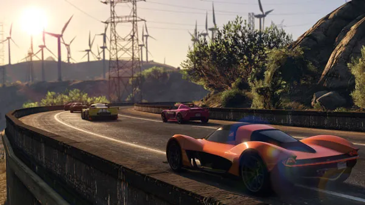
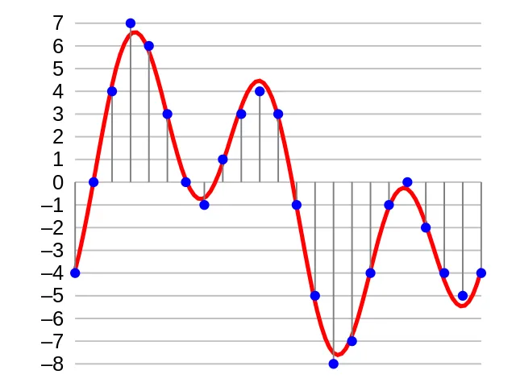
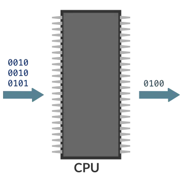

# Creare un videogioco
_arti, tecnologie, scienze, psicologia, economia, strumenti e idee per chi volesse guardare dietro lo schermo e provare a creare._

---

## Chi sono e perché

### Stefano Cecere
_Ludologo, Game Developer, Educatore_

- ho iniziato ad hackerare i computer a 10 anni, primo VG in seconda Liceo.
- Sviluppo videogiochi per l'impatto sociale positivo @ **[Videogames Without Borders](https://vgwb.org)**
- EdTech e Game Based Learning @ **[Future Education Modena](https://fem.digital)**
- Docente Game A.I. / XR / OpenSource / Giochi applicati @ **[TheSign Academy](https://thesign.academy)**

---

### Perché sono qui a parlare di VG?

1. perché mi piace condividere quello che so.
2. il digitale e l'interattività immersiva sono rivoluzionarie.
3. dopo il libro, la radio, il cinema, il videogioco è il medium del presente (e sempre più del futuro).

---

### Creatività multimediale

{: style="height:400px"}

I videogiochi sono medium multimediali e multidisciplinari.
Danno soddisfazione ad essere giocati, ma ancora di più ad essere creati.

---

### Economia e lavoro

Ci sono più di 3 miliardi di videogiocatori nel mondo.
Nel 2022 ci sono stati 203 miliardi di ricavi. E' un'industria in crescita costante. Anche in Italia crescono gli studi che producono, chi gioca (anche in modo professionale), le scuole che insegnano.

Potrebbe essere interessante lavorare con i videogiochi.

_GTA 5 è costato 137 milioni per svilupparlo, e altri 128 per commercializzarlo._

---

### Ikigai
L'invito è sapere che esiste una strada che porta all'Ikigai, concetto giapponese che rappresenta:

---

## Il Digitale

Non si può parlare di videogiochi se prima non diciamo due parole sul mondo digitale.

**Digit** = cifra, numero
**Digitale** è tutto ciò che viene rappresentato e gestito in modo numerico.

---

### Codice Binario

Usiamo i numeri binari, a base 2, con i **Bit** che possono essere intesi come interruttori spenti o accesi, dal valore 0 o 1.

E' facile costruire qualsiasi numero decimale con una sequenza di bit.

### Informatica
E' scienza dell'informazione.  
Della Codifica, elaborazione, immagazinamento, decodifica dell'informazione convertita in numeri.

_Ogni_ tipo di informazione può essere codificata in numeri:

- testo

- colori
- immagini

- immagini in movimento
- oggetti tridimensionali
- suoni

- miscele di testi, immagini e suoni in movimento
- procedure logiche
- tutto ciò che è misurabile e riconducibile ad un numero (temperatura, pressione, forze...)

### CPU

Il "cuore" che elabora i dati digitali è la CPU (Central Processing Unit).

Riceve dati in ingresso, li elabora seguendo delle istruzioni date, li memorizza o li restituisce.

---

### Codice

---

### Input / Output

---

## Cosa è un videogioco

gioco -> analogico o digitale?

--- 

### Hardware e Software

---

### Immersività

> Parlami e dimentico, insegnami e potrei ricordare, coinvolgimi e imparerò (Benjamin Franklin)

**Immersione** è la caratteristica della mente umana che deforma lo spazio tempo interno e permette:

- esperienza di scenari reali in **ambienti protetti** e a basso rischio dove **poter fare errori**
- coinvolgimento in complicate situazioni morali ed etiche

---

### Interattività
{: style="height:400px"}
E' la virtù principale permessa dalla CPU (la componente pre-programmata / automatica) che differenzia il videogioco dai giochi non digitali.

- esperienze non-lineari

---

### Feedback loop
{: style="height:400px"}

Il feedback automatizzato / programmato sul giocatore permette di 

- migliorare le capacità di pensiero critico e di lettura e insegnano nuove capacità tecniche.
- i meccanismi di gratificazione possono aiutare a superare i momenti di difficoltà
- favorire un apprendimento individuale e personalizzato

---

### Un medium umano-centrico

{: style="height:40%"}

Tutto è pensato, confezionato e valutato intorno al giocatore e alle sue azioni.
Creato prima ed elaborato in tempo reale.
Si può considerare il videogioco un *medium umanista*.

---

### Strutturano un'esperienze

Da elementi destrutturati
{: style="height:400px"}

un buon game designer porta ad un'esperienza.
{: style="height:400px"}

---

### Virtù dei videogiochi

- sono una forma di divertimento -> procurano _piacere_
- sono una forma di gioco -> generano _coinvolgimento_
- hanno regole -> hanno _struttura_
- hanno obiettivi -> stimolano la _motivazione_
- sono interattivi -> necessitano _azioni, scelte_
- si adattano -> innescano un _flow mentale_
- danno risultati e feedback -> c'è _apprendimento_
- hanno una vincita ->  procurano _gratificazione_
- hanno conflitti/antagonisti/sfide -> _adrenalina_
- richiedono capacità di problem solving -> sviluppano _creatività_
- hanno interazioni tra pari -> costruzione _gruppi sociali_
- hanno personaggi e storie -> procurano _emozioni_

---

### Il circuito

{: style="height:400px"}

Il giocatore, consideriamolo umano per il momento, è al _centro_ del circuito, come un agente senziente e intelligente che percepisce, elabora decisioni e le attua andando a modificare l'ambiente e ottenendo risultati e sensazioni, l'esperienza di gioco appunto.

A differenza dei giochi a "turni" (tipo gli scacchi) dove il tempo è sospeso tra una decisione e l'altra, quasi sempre i videogiochi si svolgono in tempo reale, ovvero si gioca immersi nel tempo con l'effetto di una maggiore e costante tensione, coinvolgimento intellettuale, emotivo e motorio. Il giocatore vive all'interno di un *flusso* non solo spaziale, ma anche temporale.

Questo circuito di interattività in tempo reale differenzia il medium videogioco da tutti gli altri medium "passivi", ovvero dove si è solo spettatori, o al massimo si interagisce parzialmente.

Ultimamente i videogiochi sono sviluppati per rendere l'esperienza ludica il più  coinvolgente possibile, anche adattando i contenuti di gioco (difficoltà, ambientazioni, elementi grafici e sonori, comportamento dei personaggi, addirittura la storia) in funzione della diversità fisica, culturale, psicologica, delle capacità e delle scelte del giocatore.

Per _cucire_ al meglio le esperienze intorno ai giocatori, come fossero dei sarti multimediali, i creatori di videogiochi sono sempre più attenti alla psicologia, alla sociologia, alla filosofia e alla fisiologia umana.

---

### Piattaforme
Oggi esistono molte configurazioni hardware per videogiocare

#### Computer
fisso o portatile. si sta seduti a casa. tastiera e mouse, controllers.

#### Mobile
Smartphone o Tablet. In viaggio. Touch.

#### Console
Massimo rapporto qualità/prezzo. Dedicate al gioco. Titoli AAA.

#### VR / AR / XR
Nuova frontiera

#### Altro
- wearable
- audio only
- robot

## Come si crea

Si parte da un'idea di esperienza che si vuole far vivere al giocatore, con tanto di sfide e difficoltà da superare, storia, ambientazione, personaggi.  
Che tipo di azioni dovraà compiere il giocatore? (meccaniche del gioco / gameplay)

### Game Designer

- Sviluppare la trama, i retroscena dei personaggi e i dialoghi
- Sviluppo del gameplay, delle regole e del sistema di punteggio
- Determinazione del livello di difficoltà
- Ambienti di costruzione, sporgenze, ostacoli e oggetti
- Livello e design del mondo
- Programmazione/scripting
- Montaggio digitale

#### Storia
#### Difficoltà
#### Obiettivi

### Arte
il 75%/90% del budget di produzione va nell'arte

#### concept artists
#### animators
#### 3D modelers
#### FX artists
#### Musicisti
#### Audio

### Programmazione
Tutta la tecnologia digitale, la logica, l'interfacciamento tra hardware e software.

- Creazione di un motore di base personalizzato per il gioco
- Funzioni di scripting, eventi, interazioni
- Creazione di fisica (ad es. differenze di gravità in un gioco ambientato nello spazio)
- Sviluppo e modifica di render grafici 3D
- Simulare l'intelligenza artificiale negli avversari
- Aggiunta di effetti sonori, musica e voci fuori campo
- Implementare la logica e la meccanica del gioco
- Creazione dell'interfaccia utente
- Scrivere codice specifico per tastiera, mouse o joystick
- Consentire ai giocatori di competere o cooperare tramite LAN o Internet
- Sviluppo di strumenti personalizzati
- Porting del codice tra piattaforme
- Implementazione di algoritmi, gestione dei requisiti di memoria e problemi di memorizzazione nella cache
- Identificare e correggere i bug

### Produzione
- Controllo qualità
- scrittura
- attori
- traduzioni

## Categorie e casi studio

### Azione

#### Assassin's Creed 2

<https://www.youtube.com/watch?v=AzEEwKcuEng>

### Arcade
I giochi Arcade sono quei giochi, nati negli anni ’80, con meccaniche e caratteristiche semplici. Lo scopo principale dei giochi arcade, visto anche che nascono per le sale giochi, è quello di cercare di superare e superarsi con punteggi sempre più alti.
Tramite questo tipo di videogiochi il giocatore aumenta la destrezza oculo-motoria e velocizza l’individualizzazione di strategie per poter superare il punteggio stabilito. Ad oggi il genere degli arcade, vista la quasi totale scomparsa delle sale giochi, ha ancora vita nei giochi per smartphone. Tra gli esempi più noti del genere abbiamo il sempreverde Pac-Man e Space Invaders.

### Audio game
Giochi sviluppati soprautto per i non-vedenti, ma interessanti e godibili da tutti.
E' qui che si sviluppato e trovano le più avanzate tecnologie di spazialità.
Anche una narrativa solo audio è molto interessante per stimolare l'immaginazione, avvicinandoci al libro.

### Avventura
Il videogiocatore, in questo genere, si ritrova libero di esplorare aree di gioco sempre nuove, panorami sempre diversi risultando libero di interagire con i vari scenari e personaggi secondari. Il genere nasce con i giochi in stile platform. L’identificazione con il protagonista dal punto cognitivo ed emotivo e il senso di presenza sono delle colonne portanti di questi giochi. Gli esempi più chiari sono Super Mario, Crash Bandicoot.

### Avventura Platform / Puzzle 

#### Portal

### Casual
Giochi di breve durata, spesso giocati su smartphone e tablet durante gli spostamenti o negli intermezzi della vita quotidiana.

### Educativi
Nel mondo della scuola e dell'educazione in generale, si è scoperto quanto i videogiochi possano essere utilissimi per determinati scopi didattici, a volte molto più coinvolgenti e immediati delle tecniche normali. Che siano esperienze in Realtà Virtuale o Aumentata per esplorare l'astronomia o la meccanica, o giochi strategici per rivivere la Storia, giochi che ti fanno imparare lingue straniere o risolvere problemi scientifici, la EdTech (così si chiama in gergo l'uso delle nuove tecnologie per fini educativi) è già tra noi.

### ExerGame
Quando l'interazione con il gioco è con il movimento fisico, dal semplice camminare (*PokemonGO*) al correre perché inseguiti da zombies virtuali (*Zombie Run*), dal fare addominali e flessioni per combattere un mostro (*Ring Fit Adventure*) al ballare in coreografia perfetta (*Just Dance*).

### FPS / Sparatutto
I giochi in prima persona (First Person Shooter) o terza persona.
Di solito sono giochi violenti: da soli o in team si combattono gli avversari impiegando armi da fuoco. Spesso l'ambiente circostante è visto dalla prospettiva del proprio personaggio di gioco.

### Gestionali / Manageriali
Si deve gestire una città, un mondo, una squadra di calcio, uno studio di videogiochi, una fabbrica, un Governo!, una ditta edile.. oggi qualsiasi cosa necessiti un manager nel mondo reale, ha la sua controparte nel mondo videoludico, e spesso con dettagli e procedure talmente precise, che i videogiochi non solo formano i nuovi Manager, ma vengono usati per migliorarsi, formare giovani leve, e simulare scenari alternativi. Davvero: ci sono scuole di business che usano i videogiochi anche per decidere chi assumere e chi no.
Ma il "management" potrebbe essere anche solo il giardino di casa o il proprio allevamento di draghi pollo, il principio è lo stesso: imparo a gestire sistemi complessi, facendo crescere qualcosa di mio, in un ambiente simulato, sicuro e divertendomi.

### Musicali
Due sono le componenti estetiche fondamentali per un gioco: la grafica e la musica.
E qualche videogioco ha fatto della musica la componente principale, facendo giocare direttamente con la propria colonna sonora, con canzoni e con i suoni.

### Puzzle
#### Monument Valley

### Ricerca scientifica
Può un giocatore contribuire alla ricerca contro il cancro? E non donando soldi come ormai ci siamo abituati, ma semplicemente cercando di risolvere dei livelli di un gioco? Ebbene sì. Alcuni giochi sono stati creati apposta per presentare a milioni di giocatori problemi la cui soluzione i computer non riescono a trovare, ma che l'Intelligenza Collettiva umana può e ce la fa!

### RPG
Gli RPG (Role-Playing Game) sono un genere videoludico basato principalmente sul fantasy e che vede la sua origine tramite i classici GDR (Dungeons and Dragons). In questo genere di giochi il giocatore prende il controllo di un personaggio e lo potenzia fino a raggiungere il livello massimo disponibile modificando a piacimento i vari parametri. Riguardo al genere bisogna fare una distinzione tra il JRPG (di stampo giapponese) e l’RPG occidentale. Le differenze riguardano solo le tematiche. Inizialmente il genere prevedeva battaglie a turni ma questo stile è stato via via abbandonato per delle dinamiche più action. Tra gli esempi abbiamo la saga di *Final Fantasy* e di *Dragon Quest*.

### Sandbox
#### Minecraft

### Simulazioni
I videogiochi di simulazione cercano di simulare il più possibile la vita reale. Sono utilizzati anche da piloti per esercitarsi nell’uso di alcuni mezzi di trasporto. Lo scopo principale è quello di permettere al giocatore di fare cose che nella vita reale non potrebbe fare (come pilotare un aereo, fare gare clandestine con le macchine, essere una capra!) 

### Sportivi
Tutti nella vita abbiamo giocato ad un videogioco sportivo, chi per passione, chi per divertimento con gli amici ma una partita a FIFA o a PES (ma anche ad NBA, o gli altri sport) l’abbiamo fatta. Lo scopo è quello di simulare l’esperienza reale della gestione della squadra e quindi di utilizzare e creare le strategie adatte per vincere.

### Strategia 
Se i Giochi da Tavolo sviluppano un senso della strategia a turni sequenziali, ovvero decido la mia mossa in previsione di quella dei miei prossimi avversari e delle mie prossime mosse, il videogioco permette una ricerca di strategia in Tempo Reale, ovvero mentre tutti gli altri giocatori e avversari stanno giocando le loro mosse.
Il tipo di gioco si chiama appunto RTS (Real Time Strategy).
E il bello è che possiamo giocare tanto contro altri giocatori online, tanto contro le Intelligenze Artificiali più brave al mondo.
Come con i giochi manageriali, anche quelli che richiedono una forte strategia sviluppano molto la capacità di analisi e di previsione a futuro in funzione dello situazione attuale e alla storia precedente.

## Idee e strumenti per iniziare

### Consigli

- segnatevi i videogiochi che vi piacciono di più, e iniziate a studiarli, ovvero domandatevi: come lo avranno realizzato? andate a cercare dei video che lo spiegano.
- tenete sempre a portata di mano un quadernino dove registrare le idee che vi vengono in mente su giochi che vi piacerebbe creare.
- guardate qualche video di persone che creano videogiochi (ad esempio [Brackeys](https://www.youtube.com/@Brackeys))
- provate a creare qualcosa partendo da modelli già fatti e modificateli / hackerateli (io ho iniziato così)

Ecco alcuni strumenti con cui iniziare:

### Super Mario Maker 2
Per la Nintendo Switch. Semplicissimo creare livelli platform.
Level Design.

### Portal 2 editor
Creare un livello di Portal è un'esperienza a 360 gradi.

### Twine
Per creare storie interattive. Gratuito.
<https://twinery.org/>

### Scratch
Molto semplice, "visuale", è indicato per il bambini ma può essere un primo passo per tutti i neofiti.
<https://scratch.mit.edu/>

### Code.org
Un vero e proprio ambiente per imparare a programmare videogiochi. anche in Italiano. gratuito. online.
<https://code.org/>

### MakeCode Arcade
Una versione evoluta di Code.org, per programmare giochi più complessi (multiplayer, avventure, da giocare poi su hardware dedicato)
<https://arcade.makecode.com/>

### Unity
Strumento estremamante professionale, ma molto accessibile, e gratuito per creare giochi anche grande qualità (la metà dei videogiochi del mondo è creata con Unity). Ha moltissime risorse per imparare, e una serie di progetti di esempio da studiare (microgames).
<https://learn.unity.com/project/start-learning-1>

## Approfondimenti

Nel mio sito [2042ed.org](https://2042ed.org/) ci sono diverse risorse per approfondire il mondo dei giochi e dei videogiochi, sia da giocatori che da sviluppatori.

### Scuole
Se questo mondo ti piace e ti interessa, ti invito a contattarmi e provare a valutare delle scuole di sviluppo videogiochi, magari andando agli open day.

tipo [TheSign Academy](https://thesign.academy/) venerdì 5 maggio (scuola dove insegno io), [Università di Firenze](https://www.unifi.it/index.php?module=ofform2&mode=1&cmd=3&AA=2022&afId=598918) inizia ad avere esami di Game Design.

### Articoli

- <https://www.wikihow.it/Creare-un-Videogioco> (da cui sono tratte alcune immagini di questa pagina)

### Libri

