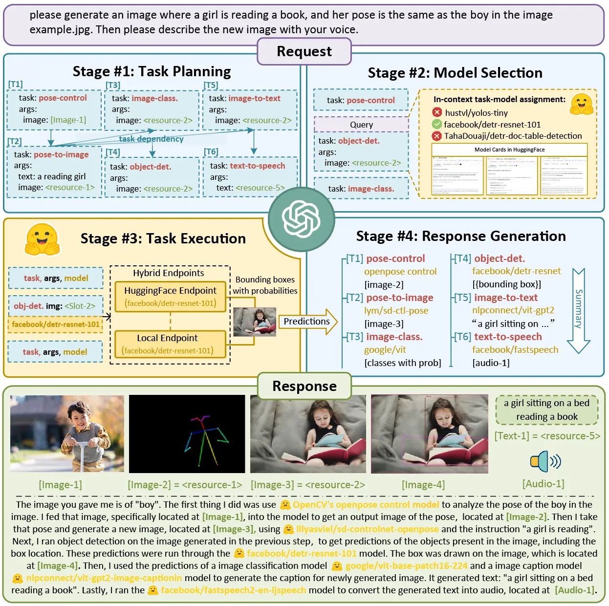

# Possono gli androidi creare una pecora?
*Un'introduzione all'AI creativa*

> **Durata**: 15 min  
> **Pubblico**: tutti  
> **Interesse**:  
> - cosa c'è alla base della capacità creativa delle AI?
> - cosa possono creare oggi (maggio 2023) le AI?

## Introduzione
Un aspetto particolarmente interessante, e per qualcuno utile, dell'Intelligenza Artificiale è la sua capacità di creare contenuti. Tecnicamente si chiama *Generative AI*.
Per andare oltre l'effetto meraviglia e comprenderne le potenzialità, i limiti ed eventuali preoccupazioni, è bene fare un accenno alla teoria e alla tecnologia che le da fondamenta. Dobbiamo studiare un po' :)

> Oggi è più un problema di immaginazione e curiosità, che non di tecnologia e risorse.

Iniziamo ponendoci una domanda: **Cosa è una pecora?**

## L'idea, ovvero il modello

Nella nostra mente potremmo  iniziare ad elencare tutte le caratteristiche che conosciamo di una pecora, costruendo un **modello simbolico**:

- animale
- mammifero
- 4 zampe
- peloso
- medie dimensioni
- ...

TODO img

Oppure potremmo fare vedere 200 foto di animali, con il relativo nome, e dire: impara dalle foto con scritto "Pecora" tutto quello che puoi. memorizzane le caratteristiche.. i "patterns" che vedi. Questo è il **modello supervisionato**

TODO img

Oppure posso dirti: ecco tutta la conoscenza umana, testi e immagini. Vedi tu di trovare tutto quello che puoi sulla parola "pecora". Questo è il **modello GPT**

TODO img

## Machine Learning

Il Machine Learning è un sottoinsieme dell'Intelligenza Artificiale, che si preoccupa di *come le macchine possano imparare da sole*, per la precisione Insegnare alle macchine a riconoscere dei **pattern** nei **dati** e fare **previsioni** e prendere buone **decisioni** a partire da essi.

Non entreremo nei dettagli ma serve conoscere 3 cose:

- come impara (training)
- come funziona (rete neurale)
- cosa può fare (output e modelli)

## Come impara? Training
analizzando grandi quantità di dati, usando questi metodi:

### Supervised learning

### Unsupervised Learning

### Semi-Supervised Learning

### Reinforced Learning 
Ottimo lavoro!

Impara a tentativi, aggiornato dal feedback e premi o penalità

Caso speciale: RLHF: reinforcement learning with human feedback

### Imitation Learning

### Deep Learning

## Come funziona? Rete Neurale

La Rete Neurale Artificiale si ispira alla struttura del nostro cervello, ed è composta da una rete di neuroni connessi tra loro che elaborano le informazioni in ingresso e restituiscono una risposta.

Il nostro cervello ha circa 85 miliardi di neuroni che comunicano tra loro attraverso segnali elettrici e chimici (sinapsi), segnali che seguono milioni ci connessioni accendendo diverse sequenze di neuroni. Ma il cervello è in grado di modificare le proprie connessioni (plasticità) 

### Captcha

### Big Data

https://books.google.com/

## Cosa può fare?

### Predizione
Uber: predice il traffico
Ambito medico: anticipare problemi di salute, potenziali tumori

### Classificazione

Analisi del "**sentimento**"

### Natural Language Processing
Comprendere il linguaggio umano

### Creazione
- GAN
- Diffusione

## Cosa creano?

Ci sono già centinaia di strumenti disponibili, ogni settimana ne esce qualcuno. Rimandiamo a questo sito: [Generative AI Landscape](https://ai-collection.org/) o  [AI Tools Club](https://www.aitoolsclub.com)

### Testo

- Chatbot: agenti di conversazione guidati dall'intelligenza artificiale per il cliente assistenza, domande frequenti e altro ancora.
- Creazione di contenuti: generazione di articoli, post sui social media, o scrittura creativa.
- Traduzione: conversione di testo tra lingue mentre preservando il significato.
- Riassunti: condensare un testo lungo in uno più breve, riassunti digeribili.
- Gestione della conoscenza: organizzazione, recupero, e analizzare le informazioni da grandi volumi di dati di testo.
- Quiz e Corsi
- Programmi di fitness
- Programmi di viaggi
- Ricette

Esempi:

- [ChatGPT – 4.0](https://openai.com/product/gpt-4) by OpenAI (con [i plugin](https://www.marktechpost.com/2023/05/21/how-to-use-third-party-plugins-in-chatgpt-80-plugins-just-added-by-chatgpt-for-public/) fa praticamente tutti)
- [Bing Chat](https://www.bing.com/chat) by Microsoft
- [Bard](https://bard.google.com) - by Google

### Documenti

#### Knowledge Management
- https://www.notion.so/

#### Presentazioni

[TOME](https://tome.app/)
generative storytelling

- https://www.beautiful.ai/
- https://slidesgpt.com/

#### Materiale didattico
https://aidemia.co

#### Contenuti social
[Jasper](https://www.jasper.ai/)
crea contenuti social

### Immagini

- Arte: creazione di opere d'arte uniche, generate dall'intelligenza artificiale o assistenza artisti con ispirazione visiva.
- Design: generazione di loghi, idee prodotto, siti web
- Gioco: produzione di risorse di gioco, trame o personaggi
- Sintesi testo-immagine: generazione di immagini fotorealistiche da descrizioni di testo o input di bassa qualità, aiutando a visualizzazione o prototipazione.
- Pubblicità e media: creazione di contenuti visivi su misura basato su suggerimenti testuali per campagne di marketing, social media e scopi di intrattenimento.

Esempi:  
[Midjourney](https://midjourney.com/)

[DALL-E](https://openai.com/product/dall-e-2)

Adobe Firefly

### Video

- Entertainment: film, programmi TV e pubblicità, riducendo costi e tempi di produzione.
- Realtà Virtuale (VR) e Realtà Aumentata (AR):  ambienti realistici e personaggi
- Istruzione e formazione: simulazione di scenari realistici per scopi formativi ed educativi, viaggi didattici, simulazioni mediche o esercitazioni di sicurezza.
- Pubblicità: video personalizzati per indirizzare dati demografici specifici o preferenze individuali, aumentando l'efficacia e il coinvolgimento degli annunci.

Esempi:  
[Runway ML](https://runwayml.com)
dai creatori di Stable Diffusione, [Gen-2](https://research.runwayml.com/gen2)

#### Avatar
- videochiamate
- videogiochi
- viaggi didattici / storici
- metaverso

Esempi:
- [Synthesia](https://www.synthesia.io) Avatars (125), Voices (120), Video Templates ([mio esempio](https://share.synthesia.io/3ce08f85-4ee2-4bc1-a0e8-560458bdea8d))
- [Rephrase](https://www.rephrase.ai) Text-to-video
- [Deepswap](https://www.deepswap.ai) swap faces in video

vedi https://www.youtube.com/watch?v=9D5ulvdg0jM

#### Deep Fake video
- https://youtu.be/cQ54GDm1eL0?t=32
- https://deepfakesweb.com/

### Voce

- Sintesi vocale (TTS): conversione del testo scritto in parlato parole, assistente per utenti ipovedenti
- Assistenti virtuali: migliorare l'esperienza dell'utente (Siri, Alexa o Google Assistant).
- Audiolibri
- Clonazione vocale: creazione di voci personalizzate da utilizzare nelle animazioni, giochi o applicazioni personalizzate.

Esempi: 
- VALL-E analizza 3 secondi della tua voce e poi potrà dire qualsiasi cosa

### Musica

[MusicLM](https://google-research.github.io): crea musica a partire da una descrizione testuale

[SoundDraw](https://soundraw.io)
[example](https://soundraw.io/edit_music?length=10&tempo=normal,high,low&mood=Elegant)

- https://aiva.ai/ composizione di colonne sonore

### Modelli 3D
- Videogiochi: creare personaggi, paesaggi e ambienti realistici
- Architettura e design del prodotto:  modelli 3D di città, edifici, prodotti e prototipi.
- Applicazioni mediche: modelli 3D dell'anatomia umana per la ricerca, l'istruzione e la pianificazione chirurgica. anche per creare impianti e protesi personalizzati per i pazienti.

Esempi:

**Blender + StabilityAI**

- [Artomatix](https://rb.gy/fhsj7) : ArtEngine in Unity
- [Skyboxes](https://skybox.blockadelabs.com/)

### Videogames
i videogiochi sono i medium più complessi e multimediali, in tempo reale e interattivi

**Flight Simulator**  
con [https://blackshark.ai/](https://blackshark.ai/) hanno ricostruito in 3D tutta la Terra.

[Nyric by Lovelace Studio](https://lovelacestudio.com/)
GENERATIVE AI PLATFORM FOR VR

- https://ludo.ai/
- [AI Dungeon](https://aidungeon.io/)

### Task (azioni)
Project JARVIS. un assistente personale in grado di creare sequenze di comandi selezionando e integrando diversi sistemi.
https://github.com/microsoft/JARVIS

- Bardeen https://www.bardeen.ai/ Automatizzazione di procedure online

### Codice di programmazione

[GitHub Copilot](https://github.com/features/copilot)
Il tuo assistente alla programmazione: scrivi cosa vuoi che faccia e lui scrive il codice, praticamente in ogni linguaggio.

[Debuild](https://debuild.app) - crea un'app web completa in pochi secondi

### Scienza

AlphaFold e Mata AI hanno costruito dei modelli da 15 miliardi di parametri per l'analisi e il sequenziamento della proteine. Migliorando ed accelerando i processi fino a 60 volte. Impatto sulla medicina, chimica, energie rinnovabili. ([fonte](https://www.science.org/doi/10.1126/science.ade2574))

## Sintesi

> L'ultimo decennio è stato definito da User Generated Content (UGC). Il prossimo sarà costruito su AI Generated Content (AIGC)

Attenzione ai "gorilla nell'algoritmo":

## Glossario
AI - Artificial Intelligence
AGI - Artificial General Intelligence
LLM - [Large Language Model](https://en.wikipedia.org/wiki/Large_language_model)
GPT - Generative Pre-trained Transformer
NLP - [Natural Language Processing](https://en.wikipedia.org/wiki/Natural_language_processing)
PaLM - Pathways Language Model

## Risorse

- [Awesome Generative AI](https://github.com/steven2358/awesome-generative-ai)
