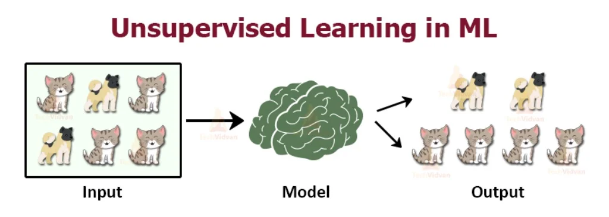
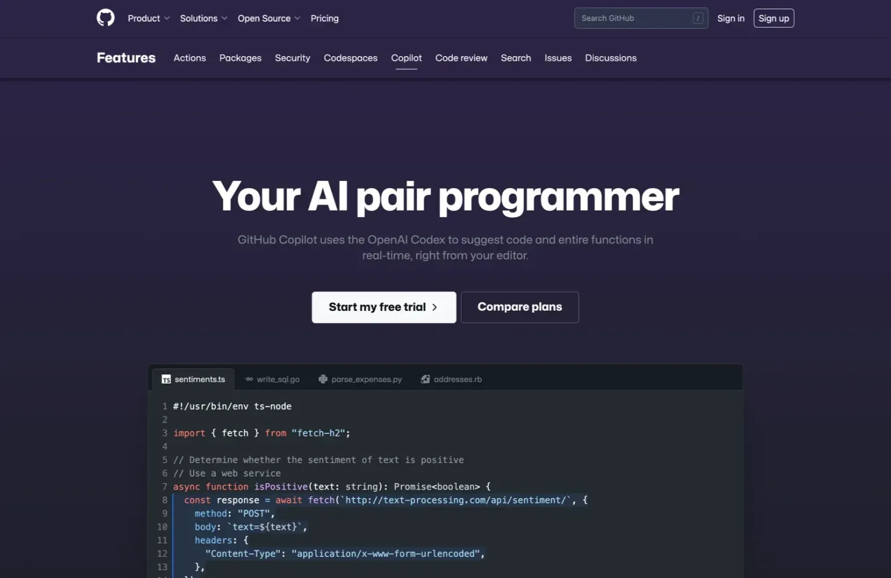
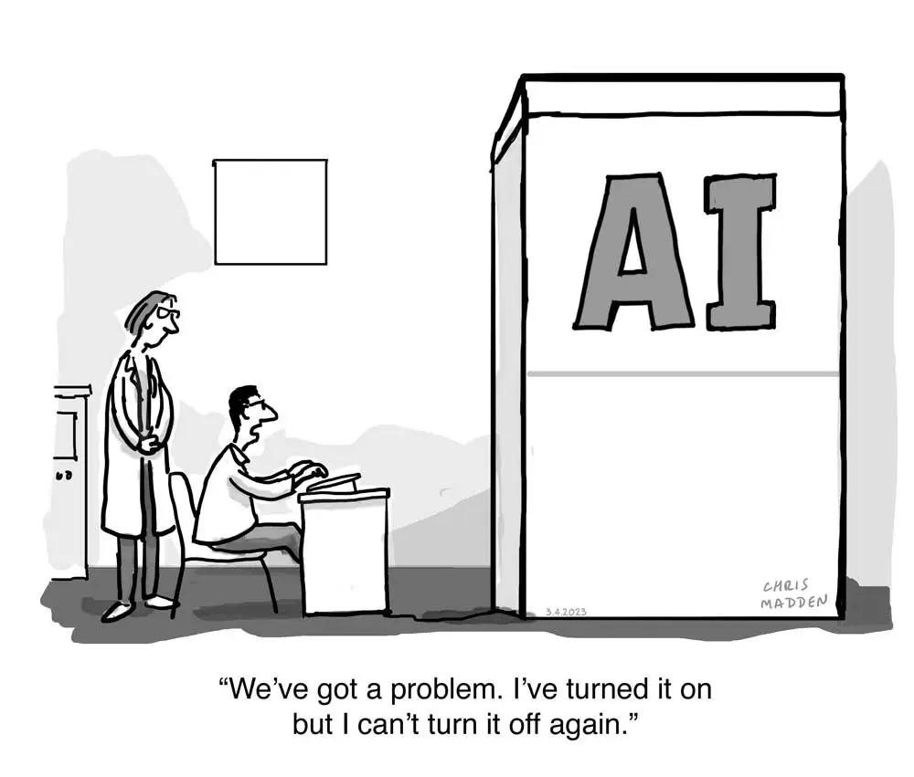

# Gli androidi sanno disegnare una pecora?
_Un'introduzione alla AI creativa_

> **Durata**: 15 min  
> **Pubblico**: tutti  
> **Interesse**:  
> - cosa c'è alla base della capacità creativa delle AI?  
> - cosa possono creare oggi (maggio 2023) le AI?

!!! question "QUIZ"

    Il titolo cela due opere del XX secolo. Quali?

## Introduzione
Un aspetto particolarmente interessante, per qualcuno utile, per altri "disruptive" (ovvero che sta cambiando radicalmente la nostra società) dell'Intelligenza Artificiale è la sua capacità di creare nuovi contenuti. Tecnicamente si chiama _Generative AI_, o **GenAI**.  
Per comprenderne le potenzialità, i limiti ed eventuali preoccupazioni, è bene fare un accenno alla teoria e alla tecnologia che la sottende. _Dobbiamo studiare un po'_ :)

Iniziamo con una domanda: **Cosa è una pecora?**

{: style="height:300px"}

## Come costruire il modello

Nella nostra mente potremmo iniziare ad elencare tutte le caratteristiche che conosciamo di una pecora, costruendo un **modello simbolico**. Fossimo dei programmatori scriveremmo:

- genere: animale
- classe: mammifero
- arti: 4
- superficie: pelosa
- colore: chiaro
- peso: medio
- dimensioni: medie
- ... e così via altre variabili che riteniamo utili alla classificazione

Oppure potremmo osservare centinaia di foto di animali, con il relativo nome, e dire: deduciamo e memorizziamo le caratteristiche comuni, i "patterns" che vediamo nelle foto etichettate con "Pecora". Questo è il **modello supervisionato**.

Oppure possiamo dire: ecco tutta la conoscenza umana, testi e immagini. Vediamo di trovare tutto quello che possiamo associare alla parola "pecora". Questo è il **modello non supervisionato**.

_Spoiler: un misto delle tre sarà il **il modello GPT**._

## Machine Learning


Il Machine Learning è un sottoinsieme dell'Intelligenza Artificiale, che si preoccupa di **come le macchine possano imparare da sole**, per la precisione come possano riconoscere dei **pattern** nei **dati** e fare **previsioni** e prendere buone **decisioni** a partire da essi.

Non entreremo ora nei dettagli tecnici ma è importante sapere:

- come funziona? (rete neurale)
- come impara? (training)
- cosa può fare? (output)

## Come funziona?

{: style="height:400px"}

### Rete Neurale Artificiale (ANN)
La Rete Neurale Artificiale si ispira alla struttura del nostro cervello, ed è composta da una rete di neuroni connessi tra loro che elaborano le informazioni in ingresso e restituiscono una risposta.

{: style="height:300px"}

Il nostro cervello ha circa 85 miliardi di neuroni che comunicano tra loro attraverso segnali elettrici e chimici (sinapsi), segnali che seguono milioni ci connessioni accendendo diverse sequenze di neuroni. Ma il cervello è in grado di modificare le proprie connessioni (plasticità).

La versione artificiale parte dalla simulazione di un singolo neurone:


e li connette con una serie di livelli (layers) verticali. C'è un primo livello di Input, dove entrano i dati, i segnali. Tutta una serie di n (potenzialmente tanti. tantissimi) livelli intermedi "nascosti", ed infine un livello di neuroni in uscita (output). Ogni Neurone ed ogni connessione tra neuroni ha dei parametri che determina come i segnali si muovono e si trasformano.

In input potremmo avere un testo, un'immagine, i parametri di velocità della propria auto, tutto quello che vedo intorno a me.


## Come impara?
La configurazione della Rete Neurale, ovvero la definizione di tutti i parametri, i pesi, dei nodi e delle connessioni, si chiama **Training** ed avviene analizzando grandi quantità di dati con diverse tecniche e metodi:

### Supervised learning


La rete sa cosa le viene dato in input, e aggiorna il suo modello per avvicinarsi il più possibile alle risposte più corrette, con meno errori. Quando l'errore medio sarà inferiore ad una soglia che decidiamo noi, il modello sarà pronto per essere usato.

#### Captcha

  
{: style="height:300px"}

Sapete cosa abbiamo fatto negli ultimi 20 anni, rispondendo prima alla lettura di parole dei libri, poi numeri civici, poi insegne, targhe e poi semafori, idranti e tutto quanto?

{: style="height:300px"}

### Unsupervised Learning


Il modello non supervisionato cerca di trovare caratteristiche comuni nei dati in ingresso. correlazioni, raggruppamenti. Non sa bene cosa significhino, però ad esempio potrebbe scoprire che alcune immagini sono diverse da altre (tipo cani e gatti), che dopo un "ciao" spesso segue un "come stai?", che una appartamento le cui coordinate sono centrali rispetto alla città, ha un costo per mq più alto, e così via.

### Semi-Supervised Learning


Questo è un misto tra il Supervised e l'Unsupervised.

#### Big Data

Sebbene la teoria informatica avesse diversi decenni, tutto il Machine Learning ha iniziato a funzionare bene a partire dal 2010, dopo la grandissima disponibilità di dati digitalizzati e potenza di calcolo.


[book](https://books.google.com/)

### Reinforced Learning
> Ottimo lavoro!


Impara a tentativi, aggiornato dal feedback e premi o penalità.
Prendiamo due "agenti" ovvero un'entità dotata di sensori e attuatori e lo mettiamo in un ambiente e diciamo: voi squadra rossa dovete acchiappare la squadra blu per vincere. Voi blu non dovete farvi prendere da quelli rossi per vincere. Pronti?

👉🏼 video [Multi-Agent Hide and Seek](https://youtu.be/kopoLzvh5jY?t=5)

Caso speciale: **RLHF** (reinforcement learning with human feedback) dove gli umani danni indicatori di bontà della risposta.

### Imitation Learning

{: style="height:400px"}

l'AI osserva e memorizza il comportamento umano, ne deduce i pattern e lo memorizza nelle ANN.


### Deep Learning


Si mettono diversi livelli di reti neurali, specializzate magari per analizzare diverse caratteristiche di un'immagine, per poi essere combinate.


La velocità di ricerca e scoperta di nuove soluzioni è impressionante.

## Cosa può fare?

### Predizione

- Uber: predice il traffico  
- Ambito medico: anticipare problemi di salute, potenziali tumori

### Classificazione


Analisi del "**sentimento**"  


### Creazione: Generative AI


In pratica il modello di Deep Learning generativo:

- crea nuovi dati simili a quelli su cui si è allenato.
- conosce la distribuzione dei dati e quanto un dato esempio è simile
- predice la prossima parola in una frase.

#### Immagini

Le tecniche più usate sono la

- **GAN** (Generative Adversial Network)  
Dove un modello crea degli esempi di immagini e un discriminatore vede se riesce a capire se sono reali o no


- **Diffusion**


#### testo

Il Natural Language Processing permette di comprendere il linguaggio umano.  
Large Language Models, sempre più grandi.

| LLM                                                         | Year   | By     | Size        |
| ----------------------------------------------------------- | ------ | ------ | ----------- |
| [BERT](https://en.wikipedia.org/wiki/BERT_(language_model)) | 2018   | Google | 340 million |
| [GPT-2](https://en.wikipedia.org/wiki/GPT-2)                | 2019   | OpenAI | 1.5 billion |
| [GPT-3](https://en.wikipedia.org/wiki/GPT-3)                | 2020   | OpenAI | 175 billion |
| [PaLM](https://en.wikipedia.org/wiki/PaLM)                  | 2022   | Google | 540 billion |
| [LLaMA](https://en.wikipedia.org/wiki/LLaMA "LLaMA")        | 2023.2 | Meta   | 65 billion  |
| [GPT-4](https://en.wikipedia.org/wiki/GPT-4)                | 2023.3 | OpenAI | 1 trillion  |
| [PaLM 2](https://en.wikipedia.org/wiki/PaLM "PaLM")         | 2023.5 | Google | 340 billion            |

## Cosa creano?


**Contesti applicativi**  


Ci sono già centinaia di strumenti disponibili, ogni settimana ne esce qualcuno. Rimandiamo a questo sito: [Generative AI Landscape](https://ai-collection.org/) o  [AI Tools Club](https://www.aitoolsclub.com)

### Testo

- Chatbot: agenti di conversazione guidati dall'intelligenza artificiale per il cliente assistenza, domande frequenti e altro ancora.
- Creazione di contenuti: generazione di articoli, post sui social media, o scrittura creativa.
- Traduzione: conversione di testo tra lingue mentre preservando il significato.
- Riassunti: condensare un testo lungo in uno più breve, riassunti digeribili.
- Gestione della conoscenza: organizzazione, recupero, e analizzare le informazioni da grandi volumi di dati di testo.
- Quiz e Corsi
- Programmi di fitness
- Programmi di viaggi
- Ricette

Esempi:

[ChatGPT – 4.0](https://openai.com/product/gpt-4)  
by OpenAI (con [i plugin](https://www.marktechpost.com/2023/05/21/how-to-use-third-party-plugins-in-chatgpt-80-plugins-just-added-by-chatgpt-for-public/) fa praticamente tutto). Ha superato tutti i test di ammissione alle università americane senza un training preliminare.

**Creatività**  
può generare, modificare e iterare con gli utenti su attività di scrittura creativa e tecnica, come comporre canzoni, scrivere sceneggiature o apprendere lo stile di scrittura di un utente.

**Multimodale**  
accetta immagini come input e genera didascalie, classificazioni e analisi.

**Input**  
Accetta fino a 32k token, ovvero circa 43.000 parole (circa la metà di 120 pagine di un libro)

**Output**  
è in grado di gestire oltre 25.000 parole di testo (circa 60 pagine di un libro)

  
👉🏼 [prompt examples](https://github.com/f/awesome-chatgpt-prompts/)

Alternative equivalenti:  
- [Bing Chat](https://www.bing.com/chat) by Microsoft
- [Bard](https://bard.google.com) - by Google

#### Knowledge Management
- [Notion](https://www.notion.so/)

#### Presentazioni

[TOME](https://tome.app/)  
generative storytelling


- [Beautiful AI](https://www.beautiful.ai/)
- [SlideGPT](https://slidesgpt.com/)

#### Materiale didattico
[Aidemia](https://aidemia.co)


#### Contenuti social
[Jasper](https://www.jasper.ai/)  
crea contenuti social


### Immagini

- Arte: creazione di opere d'arte uniche, generate dall'intelligenza artificiale o assistenza artisti con ispirazione visiva.
- Design: generazione di loghi, idee prodotto, siti web
- Gioco: produzione di risorse di gioco, trame o personaggi
- Sintesi testo-immagine: generazione di immagini fotorealistiche da descrizioni di testo o input di bassa qualità, aiutando a visualizzazione o prototipazione.
- Pubblicità e media: creazione di contenuti visivi su misura basato su suggerimenti testuali per campagne di marketing, social media e scopi di intrattenimento.

Esempi:  
[Midjourney](https://midjourney.com/)


[DALL-E](https://openai.com/product/dall-e-2)


Adobe Firefly

### Video

- Entertainment: film, programmi TV e pubblicità, riducendo costi e tempi di produzione.
- Realtà Virtuale (VR) e Realtà Aumentata (AR):  ambienti realistici e personaggi
- Istruzione e formazione: simulazione di scenari realistici per scopi formativi ed educativi, viaggi didattici, simulazioni mediche o esercitazioni di sicurezza.
- Pubblicità: video personalizzati per indirizzare dati demografici specifici o preferenze individuali, aumentando l'efficacia e il coinvolgimento degli annunci.

Esempi:  
[Runway ML](https://runwayml.com)  
dai creatori di Stable Diffusione, 


vedi esempio 👉🏼[Gen-1](https://research.runwayml.com/gen1)


vedi esempio 👉🏼 [Gen-2](https://research.runwayml.com/gen2)

#### Avatar

- videochiamate
- videogiochi
- viaggi didattici / storici
- metaverso

Esempi:

- [Synthesia](https://www.synthesia.io) Avatars (125), Voices (120), Video Templates ([mio esempio](https://share.synthesia.io/3ce08f85-4ee2-4bc1-a0e8-560458bdea8d))
- [Rephrase](https://www.rephrase.ai) Text-to-video
- [Deepswap](https://www.deepswap.ai) swap faces in video

{: style="height:400px"}

{: style="height:400px"}  
vedi [video MegaPortraits](https://www.youtube.com/watch?v=9D5ulvdg0jM)

#### Deep Fake video
- 👉🏼 [video Obama](https://youtu.be/cQ54GDm1eL0?t=32)
- [deepfakesweb](https://deepfakesweb.com/)

### Voce

- Sintesi vocale (TTS): conversione del testo scritto in parlato parole, assistente per utenti ipovedenti
- Assistenti virtuali: migliorare l'esperienza dell'utente (Siri, Alexa o Google Assistant).
- Audiolibri
- Clonazione vocale: creazione di voci personalizzate da utilizzare nelle animazioni, giochi o applicazioni personalizzate.

Esempi:  
**VALL-E** 
analizza 3 secondi della tua voce e poi potrà dire qualsiasi cosa

[SuperTone AI](https://supertone.ai/)  
👉🏼 [ascoltiamo una demo](https://supertone.ai/) di Freddie Mercury che canta in coreano.  


### Musica


[MusicLM](https://google-research.github.io)  
crea musica a partire da una descrizione testuale  

👉🏼 esempio di MuseNet[A Little Bach AI Music](https://www.youtube.com/watch?v=jMe9X9rJjyE)

[SoundDraw](https://soundraw.io)  
👉🏼 [example](https://soundraw.io/edit_music?length=10&tempo=normal,high,low&mood=Elegant)


[AIVA](https://aiva.ai/)  
composizione di colonne sonore

### Modelli 3D

- Videogiochi: creare personaggi, paesaggi e ambienti realistici
- Architettura e design del prodotto:  modelli 3D di città, edifici, prodotti e prototipi.
- Applicazioni mediche: modelli 3D dell'anatomia umana per la ricerca, l'istruzione e la pianificazione chirurgica. anche per creare impianti e protesi personalizzati per i pazienti.

Esempi:

**Blender + StabilityAI**

genera automaticamente i materiali e le textures

- [Artomatix](https://rb.gy/fhsj7) : ArtEngine in Unity
- [Skyboxes](https://skybox.blockadelabs.com/)

### Videogames
i videogiochi sono i medium più complessi e multimediali, in tempo reale e interattivi

**Flight Simulator**  
con [https://blackshark.ai/](https://blackshark.ai/) hanno ricostruito in 3D tutta la Terra.


**[Nyric by Lovelace Studio](https://lovelacestudio.com/)**  
GENERATIVE AI PLATFORM FOR VR


**Agenti / Giocatori (Unity ML-Agents)**  


!!! LABORATORIO

    [GameLab_AI_Unity](https://github.com/StefanoCecere/GameLab_AI_Unity/)

Altri esempi:  

- [ludo.ai](https://ludo.ai/)
- [AI Dungeon](https://aidungeon.io/)

### Task (azioni)
**Project JARVIS**.  
un assistente personale in grado di creare sequenze di comandi selezionando e integrando diversi sistemi.  
[github.com/microsoft/JARVIS](https://github.com/microsoft/JARVIS)

{: style="height:400px"}

Altri esempi:  
- [Bardeen](https://www.bardeen.ai) Automatizzazione di procedure online

### Codice di programmazione

[GitHub Copilot](https://github.com/features/copilot)  
Il tuo assistente alla programmazione: scrivi cosa vuoi che faccia e lui scrive il codice, praticamente in ogni linguaggio.

{: style="height:400px"}

[Debuild](https://debuild.app)  
crea un'app web completa in pochi secondi
{: style="height:400px"}

### Scienza
{: style="height:400px"}

AlphaFold e Meta AI hanno costruito dei modelli da 15 miliardi di parametri per l'analisi e il sequenziamento della proteine. Migliorando ed accelerando i processi fino a 60 volte. Impatto sulla medicina, chimica, energie rinnovabili. ([fonte](https://www.science.org/doi/10.1126/science.ade2574))

### Robot autonomi

👉🏼 [Vedi come imparano a giocare a calcio](https://youtu.be/efw8xuex4uI?t=13) con il Reinforced Learning

## Conclusione

> L'ultimo decennio è stato definito da User Generated Content (UGC). Il prossimo sarà costruito su AI Generated Content (AIGC)

{: style="height:400px"}

{: style="height:400px"}

Attenzione ai "gorilla nell'algoritmo":
{: style="height:400px"}

> Gli output della GenAI sono il frutto dell'elaborazione della produzione della nostra umanità, magari riconnesso in modo originale e imprevedibile

> Oggi è più un problema di immaginazione e curiosità, che non di tecnologia e risorse.  
> Dobbiamo imparare a descrivere bene quello che vogliamo...
> e fare attenzione a quello che desideriamo.

Se vuoi continuare a saperne di più, puoi iscriverti alla mia **newsletter** [2042](https://2042.substack.com/) o esplorare tutti i link e materiali di questo sito.

## Appendici

### Goat Simulator


si, il gioco che simula una capra (non una pecora ma ok) l'hanno fatto ed è un successo!  
[vedi qui](https://www.goatsimulator3.com/)

### Siti

- [Awesome Generative AI](https://github.com/steven2358/awesome-generative-ai)

### Glossario
**AI** - Artificial Intelligence  
**AGI** - Artificial General Intelligence  
**LLM** - [Large Language Model](https://en.wikipedia.org/wiki/Large_language_model)  
**GPT** - Generative Pre-trained Transformer  
**NLP** - [Natural Language Processing](https://en.wikipedia.org/wiki/Natural_language_processing)  
**PaLM** - Pathways Language Model  

### ChatGPT esempi

👉🏼 [su chat.openai.com](https://chat.openai.com/?model=gpt-4)

#### Comporre musica
```
> can you compose a music like Bach and write it in ABC music format ?
> can you add a second voice?
> can you add a bass line?
> and if you were Mozart?
```

--- 

**Soluzione al quiz iniziale**
Do Androids dream of Electric Sheep? e Il Piccolo Principe
