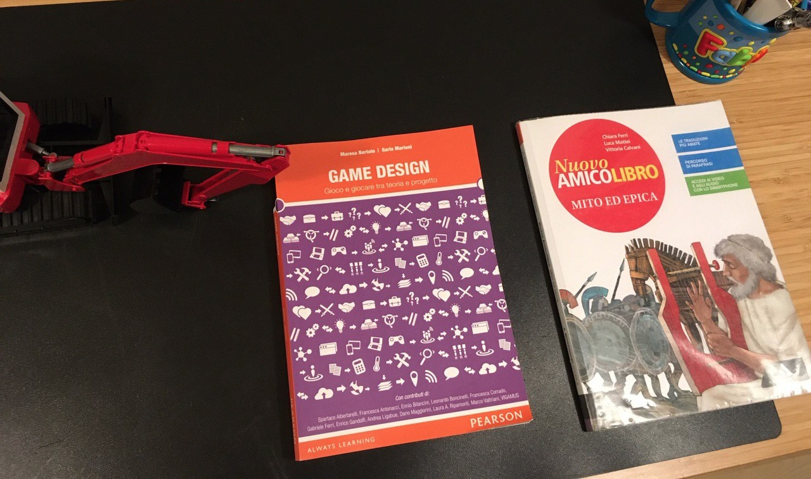

- oggi abbiamo iniziato a fare filosofia con una prof che viene ogni due settimane
- ahh bellooo.. cosa avete fatto?
- ognuno ha pensato ad una domanda
- tipo?
- tipo cosa c'era prima dell'inizio dell'Universo?
- buona
- e cosa c'è dopo la morte?
- ottima
- poi ci ha chiesto cosa è per noi la filosofia
- e cosa hai detto?
- che è il porsi delle domande
- ricorsiva. magnifica. più che le risposte, è importante porsi le domande. ti è piaciuto?
- si
- lo sai che proprio stamani pensavo che le mie parole chiave sono: giochi e filosofia. ovvero porsi le domande e cercare la conoscenza con i giochi
- bello
- vedo che hai quel libro sulla tua scrivania.. che ci fai?
- ho iniziato a leggerlo.. solo la prima pagina per ora
- bene. ti stai preparando per la Global Game Jam?
- si
- hai studiato anche epica?
- si
- chissà.. magari le tre cose.. filosofia, epica e giochi possono miscelarsi in un tutt’uno!
- 
