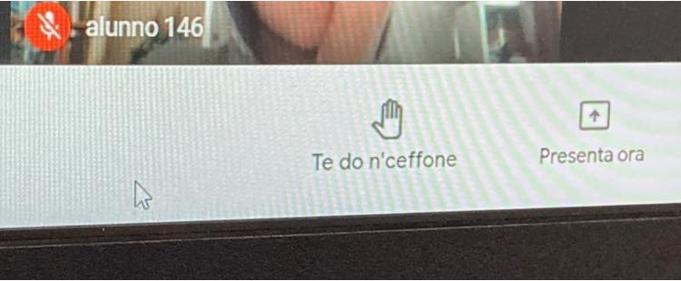

- papà guarda il google meet oggi dice le parolacce
- ?!??!!
- anziché l’alzata di mano. e guarda i nomi dei miei compagni
- ma... come è possibile?!?
- ahahahha ho scoperto come modificare il codice html della pagina... guarda si fa cosí
- ... mi... sprizzano le lacrime dai tergicristalli .. BRAVO e hai fatto tutto da solo?
- si
- il prossimo passo è capire quanto tutto sia hackerabile e come riconoscere realtà e fake
e così quatto quatto mi avvio a non servirgli più. ora che ha imparato ad essere curioso e hackerare la realtà in autonomia. 
niente è più gratificante! 

ADDON: noi ai tempi si scarabocchiava su un foglio durante le lezioni. ora hanno sotto mano una pagina web e ... scarabocchiano quella!

ADDON 2: 
la mamma chiede a Fabio: ma come hai fatto?
- semplicissimo... stavo per alzare la mano e ho sbagliato tasto del mouse.. col tasto destro è uscito il menù con varie opzioni tra cui "ispeziona" .. l'ho seguito e mi ha aperto il codice html della pagina.. da lì ho spippolato un po' e visto che puoi cambiare qualsiasi cosa!
