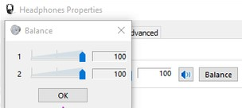

- papà, ma perchè sento il suono venire quasi tutto da sinistra?
- uhmm strano.. sei sicuro che questo portatile abbia due altoparlati?
- si, prima funzionava...
- fammi vedere.. cerchiamo le opzioni per l'audio
(passano 5 minuti a trovare il pannellino nascostissimo sul bilanciamento stereo)
boh sono tutti e due al massimo in teoria è giusto
- ma si sente tutto a sx.
- fammi provare alla vecchia bestemmia microsoft
- cioè?
- lascia stare... sposto i cursori e li reimposto a 100, magari visualizza 100 ma internamente è impostato ad un altro valore
...
- FUNZIONA!
- hai capito?
- cosa?
- che ho appena risolto ogni mio possibile ipotesi di passare ad un PC Windows?
- ma perché tu devi avere un Mac e io un Windows?
- perché io ho sofferto 40 anni su queste cose.. se oggi ci capisco è perché mi sono rotto mille nottate a risolvere problemi.. e mi merito la pace dei sensi e dedicarmi solo alla pura creatività senza rotture di palle con queste UI antidiluviane
- e io?
- tu sei giovane e devi mangiare assurdità e bugs per almeno 10 anni
- okkkey
