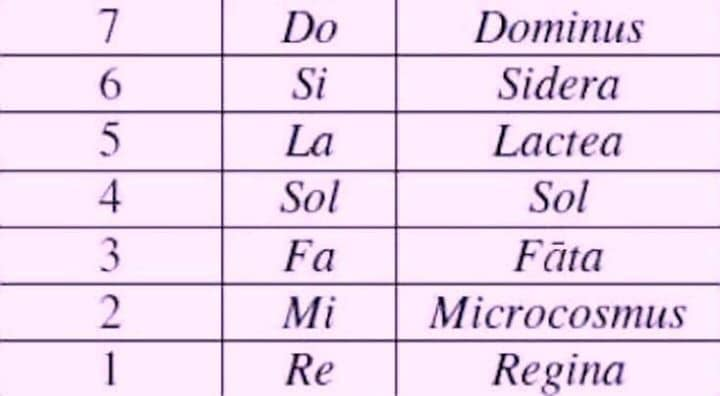

- papà, cosa suoni?
- è il Nessun Dorma, di Puccini... mi sembra la musica migliore per questa giornata politicamente intensa... ti piace?
- uh. si.
- senti che potenza armonica con questa semplice melodia che scala e chiude con un Re potentissimo
- ahah il Re potentissimo... ma perché il Re si chiama Re?
- ahh grandissima domanda. anch’io ho studiato musica dalle elementari. ma solo dopo molti anni, benedetto il Latino al Liceo, scoprii il significato dei nomi latini delle sette note musicali
- DO, RE, MI, FA, SOL, LA, SI, DO
- partiamo dalla settimana nota, dal Settimo Cielo (perché le 7 note sono collegate con le sfere celesti... ma ne parleremo in altra occasione) dove ci sta DIO: il DOMINUS. per gli amici DO
- ahah
- tu ridi. poi scendiamo di un grado. nel sesto cielo, sesto grado della scala celeste, ci sono le STELLE: le SIDERA
- SI
- già (da cui la Siderurgia! perché una volta i metalli preziosi erano caduti dalle stelle...)
- e il LA?
- la nostra GALASSIA.. che si chiama?
- Via Lattea.
- e qui LA da LACTEA. tu colazioni in LA ahaha. scendiamo al quinto cielo chi troviamo la nostra Stella..
- il SOLE... SOL
- questo era facile 🙂
- FA?
- considera che una volta, ma anche oggi, molta gente collega il proprio destino alle stelle e ai pianeti.. avrai sentito parlare di Carta del Cielo, l’Astrologia, l’arte di sondare il FATO, collegato al sistema solare
- Fa. wow! e il MI?
- scendendo dal Macrocosmo arriviamo al nostro Cielo più vicino, la Terra, il nostro pianeta, il Microcosmo: MI
- dove c'è il Re...
- e no. il RE sta per REGINA COELI, la Regina del Cielo come si chiamava la Luna, che ci gira intorno.
Ecco ora sai l’antica origine dei nomi delle Note Musicali. come vedi c’è tanta storia, tanta filosofia, tanta immaginazione, tanta ricerca dietro alle cose più semplici.
- ma non ce lo spiegano a scuola
- ma l’importante è farsi le domande. su tutto.
- come i filosofi!
- proprio come i filosofi. ora canti con me all’alba vinceró?
- no

ADDENDUM STORICO SCIENTIFICO
questa origine dei nomi delle note non è musicologicamente corretta. non si riferisce all'inno di Guido D’Arezzo del 1300:
"Ut (poi Do) queant laxis  
Resonare fibris  
Mira gestorum  
Famuli tuorum  
Solve polluti  
Labii reatum,  
Sancte Iohannes"

ma io ricordo più questa versione, probabilmente una rielaborazione successiva, che mi è rimasta impressa per la sua dimensione più "astrale" mentre da adolescente studiavo qua e là
