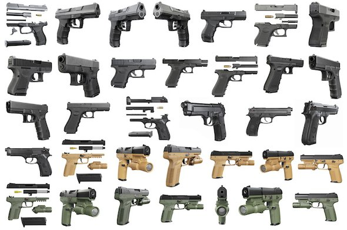

- papà ma é vero che un ragazzo ha ucciso 50 persone col fucile come a Fortnite?
- che le abbia uccise, si é vero. Ma Fortnite non c’entra niente.
- e perché lo ha fatto?
- sistema nervoso debole
- uh?
- quando uno non é in grado di affrontare il mondo, non lo comprende e non riesce a gestire le proprie emozioni. Siamo abituati a misurare, allenare e curare i corpi, ma pochissima attenzione é data allo sviluppo della propria psiche.
- ma a scuola facciamo i lavoratori con le emozioni per imparare a conoscerle e gestirle
- ecco quelle lezioni secondo me sono le più importanti. Pian piano stanno arrivando in tutte le scuole, ma é ancora una cosa sperimentale e secondaria.
- ok

<https://blogs.scientificamerican.com/observations/why-are-white-men-stockpiling-guns/>
