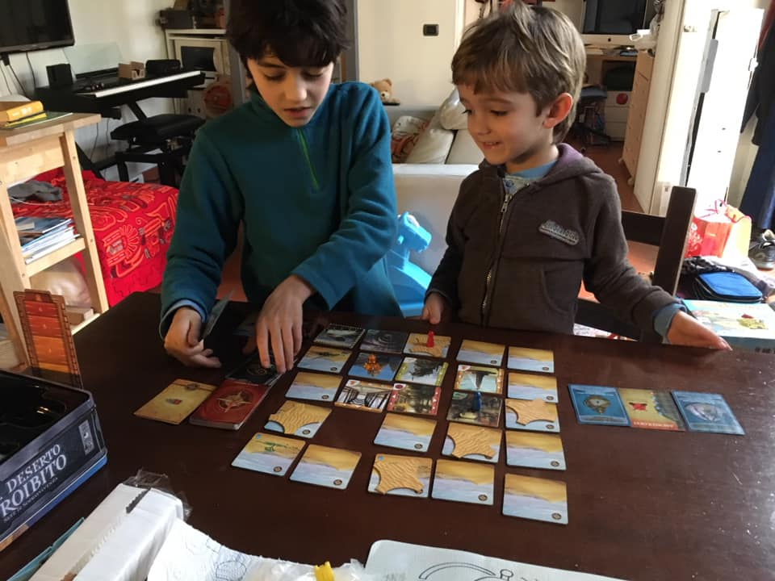

- allora noi si gioca insieme. ma nel senso che io e te non siamo nemici e vince il più bravo. dobbiamo collaborare per uscire tutti dal deserto prima che ci sommerga la sabbia o moriamo di sete
- costruendo l’astronave?
- esatto. i pezzi dell’astronave sono sparsi sotto le dune di sabbia. non sappiamo dove siano! dobbiamo cercarli
- ok
- tu cerchi in quella zona e io in questa ok?
- ok!
- se trovi dell’acqua poi possiamo condividerla. perché se uno di noi muore di sete, perdiamo tutti.

4 cose:
1) spiegare come funziona una cosa è il modo migliore per capirla meglio, e sviluppa la capacità di esprimersi
2) capire che si può essere alleati, o almeno che è necessario collaborare, per uscire da una situazione complessa, e che se uno perde perdono tutti, è una grande comprensione
3) trattare questi temi con un gioco, che ti tiene incollato anche con la bellezza e il design, divertendosi, è molto meglio che non ... cosa?
4) il gioco permette di sperimentare. ti lascia agire e fare scelte. di fare errori e reiterare i metodi di analisi delle scelte migliori. a differenza di un video o un libro. è questo aspetto di interazione giocatore/sistema uno dei punti di forza dei giochi come strumenti per imparare qualcosa.
