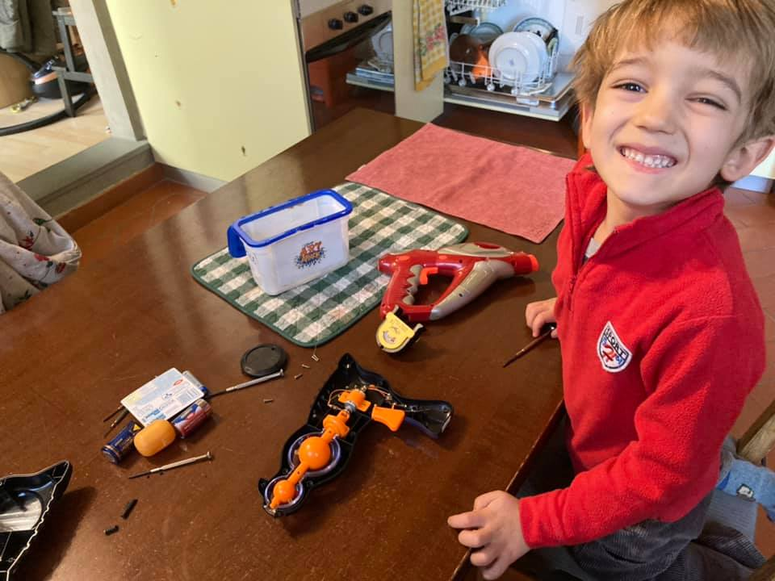

- ripariamo la pistola laser
- già. non vanno più le lucine... si sarà staccato un filo 
- ecco qui i cacciaviti. io intanto uso il termometro delle pile 
....
- aperta! guarda quello è il motore, e quella è la molla del grilletto. è fondamentale perché se no non torna indietro 
- cosa vuol dire “fondamentale”?
- che è importante, alla base di tutto, come le fondamenta di un palazzo
- fondamentale
- ecco trovato il problema: vedi li?
- ahh ecco. ora funziona!
- si! bravissimi. ora rimontiamola.
- avvito io. da che parte si gira?
- chiudi come gira l’orologio. 
- fatto
 - è bello aprire e riparare le cose, vero?
- vero!

🟥 questo giocattolo è con noi da moltissimi anni e sarà costato pochi euro. ma il valore di averlo potuto aprire ed aggiustare è stata una lezione dal valore incommensurabile
