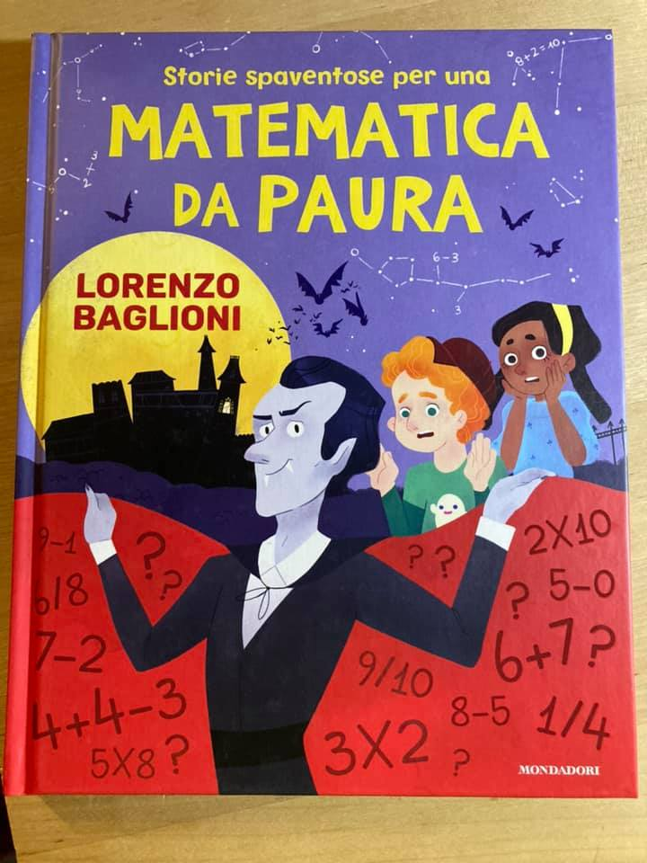

- papà lo sai che 3 + 2 fa 5, e che 5 + 5 fa 10?
- nooo l’avete fatto a scuola?
- no ho contato con le dita 🙌
- bella la matematica eh
- si, e so contare anche fino a 100
- allora sai cosa ... ti faccio un regalo: stasera la mamma anziché le solite storie della buonanotte ti leggerà delle storie nuove. ricche di numeri paurosi!

