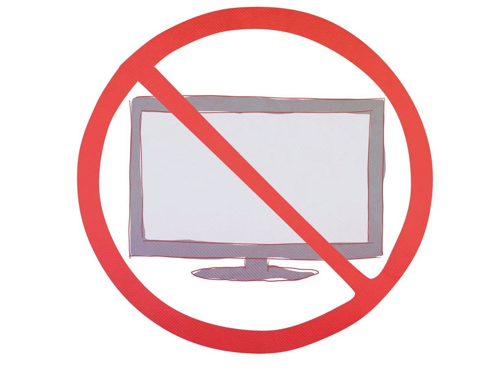

- papà, oggi a scuola abbiamo letto che guardare la televisione fa molto male ai bambini sotto i tre anni
- !!!
- forse per questo motivo Bruno ogni tanto è birbone
- e quindi cosa dovremmo fare?
- propongo di non guardare più la televisione per 30 giorni e vediamo se migliora
- e come facciamo?
- tu nascondi la Fire (l'aggeggio che usiamo per vedere Netflix) e io nascondo la chiavetta con i cartoni
- dici che ce la faremo?
- per me si. fino al 21 aprile.
- ok, proviamoci. tiriamo fuori tutti i giochi in scatola e i libri da studiare!
