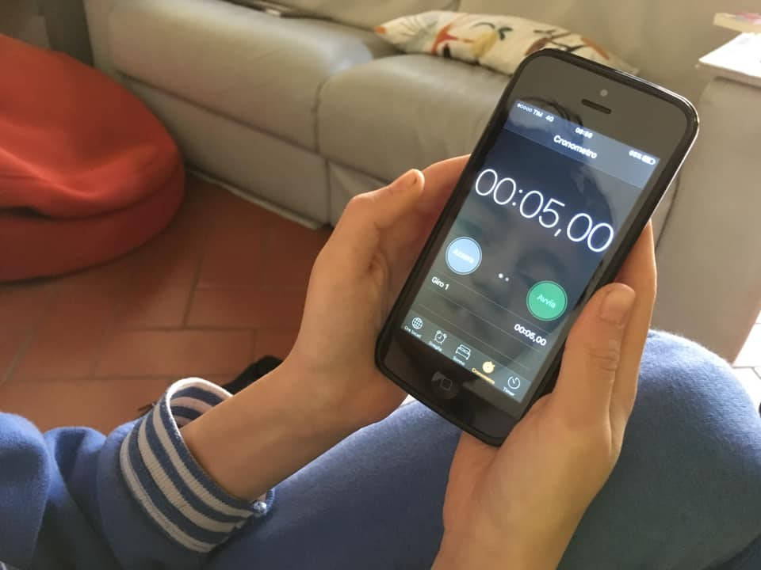

- che fai col cellulare?
- ho guardato le previsioni del tempo e ora guardo il cronometro...
- FACCIAMO UN GIOCO
- col cronometro?
- si. dimmi un numero tra 3 e 10.
- 5
- la gara è chi si avvicina di più al 5.
- ahhhh bello... 4:95!!
- (dopo un po’ di prove) CINQUE PRECISO!
- anche io!
- ora proviamo con i lap. dobbiamo cliccare TUTTI i secondi fino a 10
- ora con il cronometro rotondo
- 5!
- ahh ho inventato quello di velocità: ho fatto 0.12
- cioè?
- devo cliccare due volte velocissimo
- 0.13!!

e così andiamo avanti per mezz’ora.
un gioco divertentissimo e facile. e ovviamente utile per prendere dimestichezza con il riflessi, il ritmo e la misura del tempo in genere
