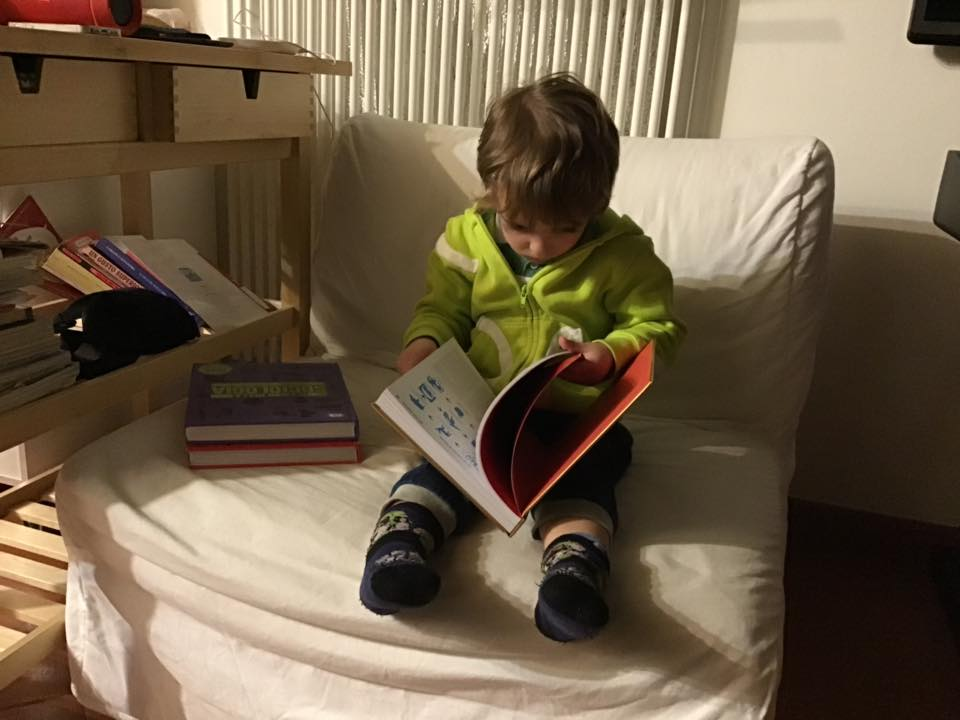

- papà... giochi a nascondino con me e Bruno?2
- sto cucinando... gioco con voi ok ma ad una nuova versione del nascondino: IL NASCONDINO AL CONTRARIO
- noi due cerchiamo te?
- no, voi dovete cercare di non trovarmi.. il primo che mi vede perde. Io sto qui... ok?
- troppo difficile
- eheheh é come il non pensare all’elefante vero?
- cioè ... tu ci sei ma vinciamo se non ti vediamo
- interessante eh... un po’ come il wei wu wei
- weeeeiiii
- é cinese.. significa “agire senza agire”
- Bruno... mi sa che il papà non gioca a nascondino con noi
- ahahah dai é ora di cena ed é praticamente pronto.. sapete una cosa? Mi avete fatto capire la cosa più bella del fare il papá...
- la paella?
- no. Il far si che voi facciate cose belle, senza chiedervelo, e tantomeno imporvelo. É la soddisfazione più grande, per me
- ah
- tipo oggi a prender Bruno, l’ho trovato in classe che leggeva un libro. L’altra sera pure, ha preso il librone rosso e si é messo sul divano a leggerlo. Ovviamente ha influito che la mamma tutte le sere legge insieme un libro.. non é la reincarnazione di Tolkien... in qualche modo a noi tutti, genitori, insegnanti, tutti, fa piacere che un bambino legga... ma non é imponendoglielo che lui lo fa volentieri, o sbaglio?
- vero... tu ci imponi cose che non vogliamo fare di solito.
- e figurati se a me piace comandare! É l’ultima cosa che vorrei fare nella vita... mi piacerebbe che tutti fossero degli agenti sensibili e intelligenti, possibilmente empatici e in grado di agire per il proprio bene e per il bene collettivo in autonomia, senza obblighi esterni.
- in pratica non vorresti fare nulla!
- eheheh si la mia massima aspirazione é il Fannullone Assoluto. L’Eterno Divano, il Papà Non Comandante Wu Wei!
- ahaha per me é pronta la paella.
- si tutti a tavola!
- hai comandato!
- noooooooooo
