# GOAP
**Goal-Oriented Action Planner**

> Play it in [GameLab_AI_Unity Project](https://github.com/StefanoCecere/GameLab_AI_Unity) `/GOAP` sub-project

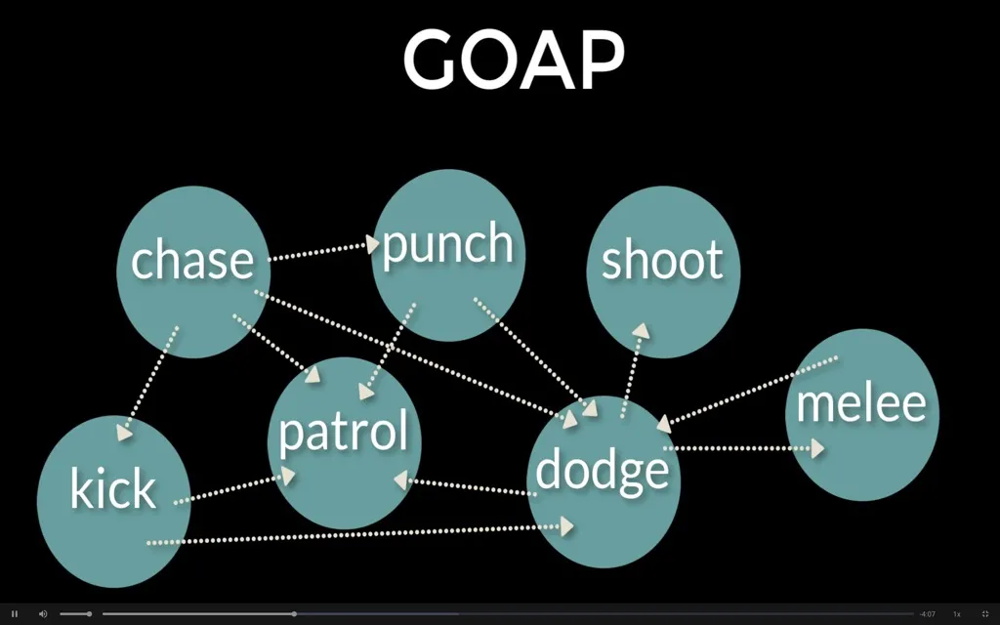

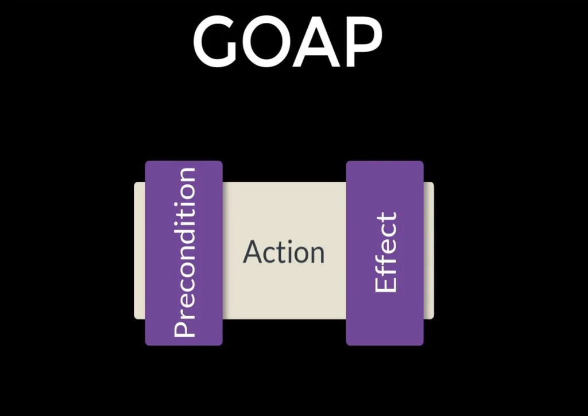

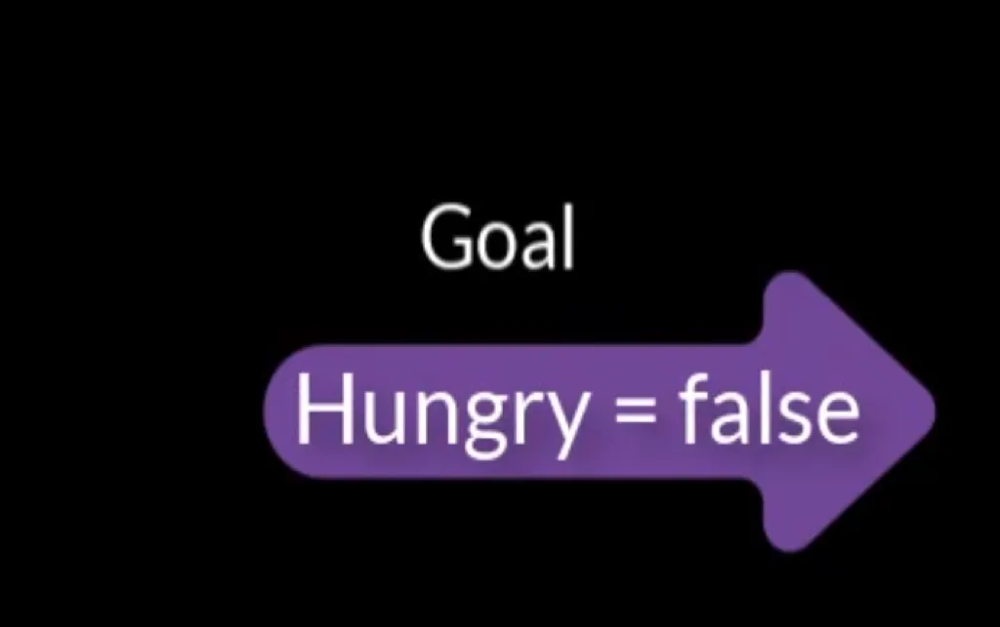

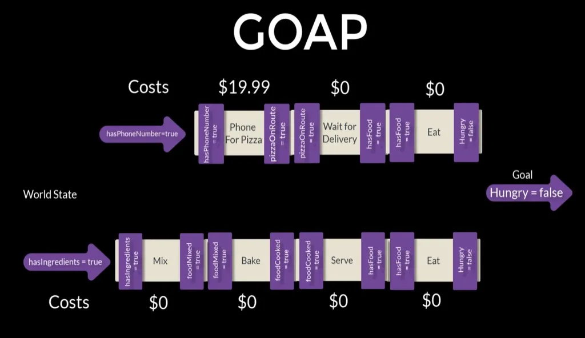

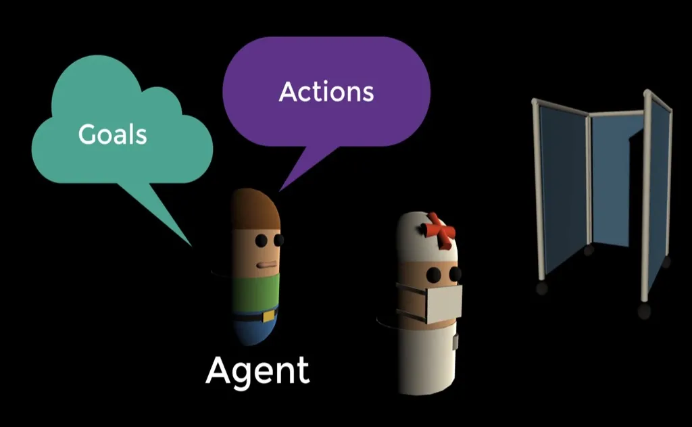

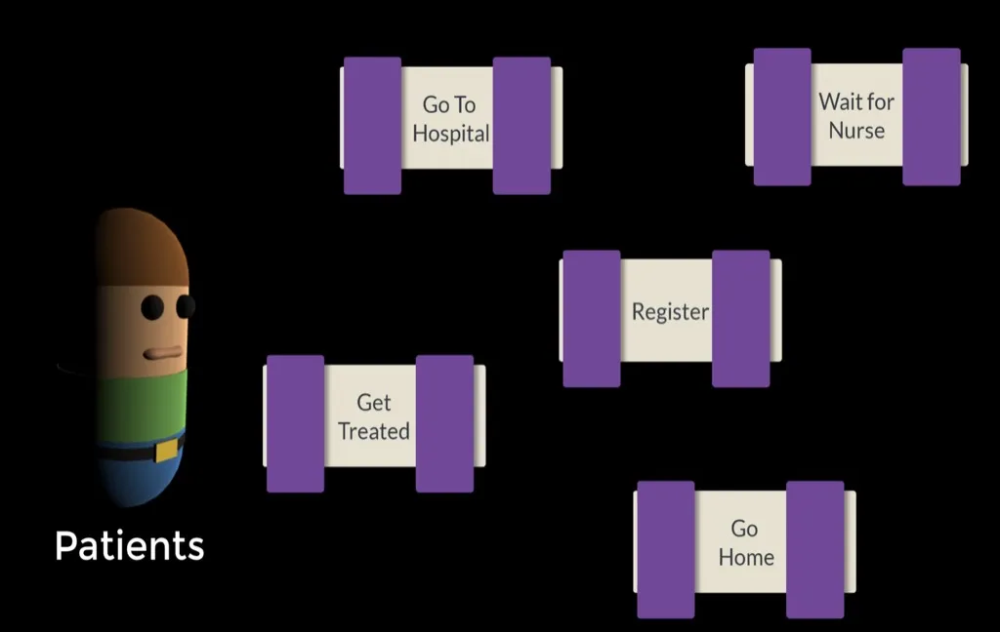
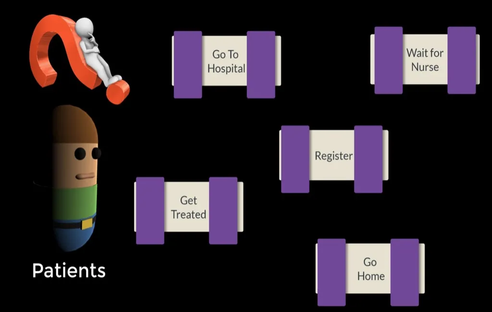
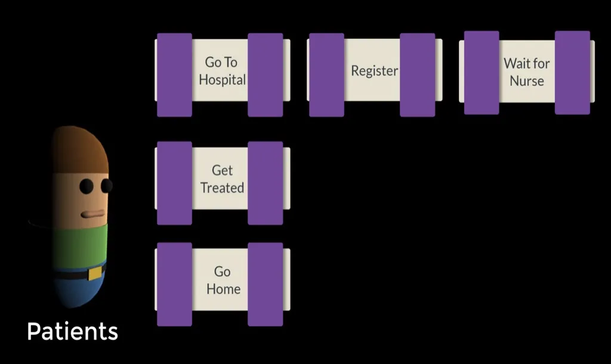
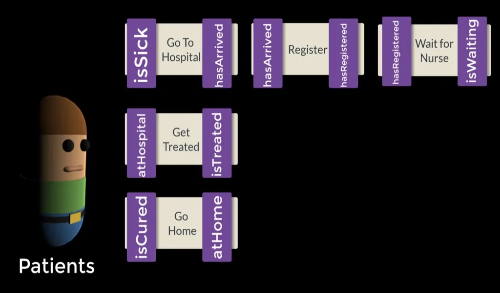
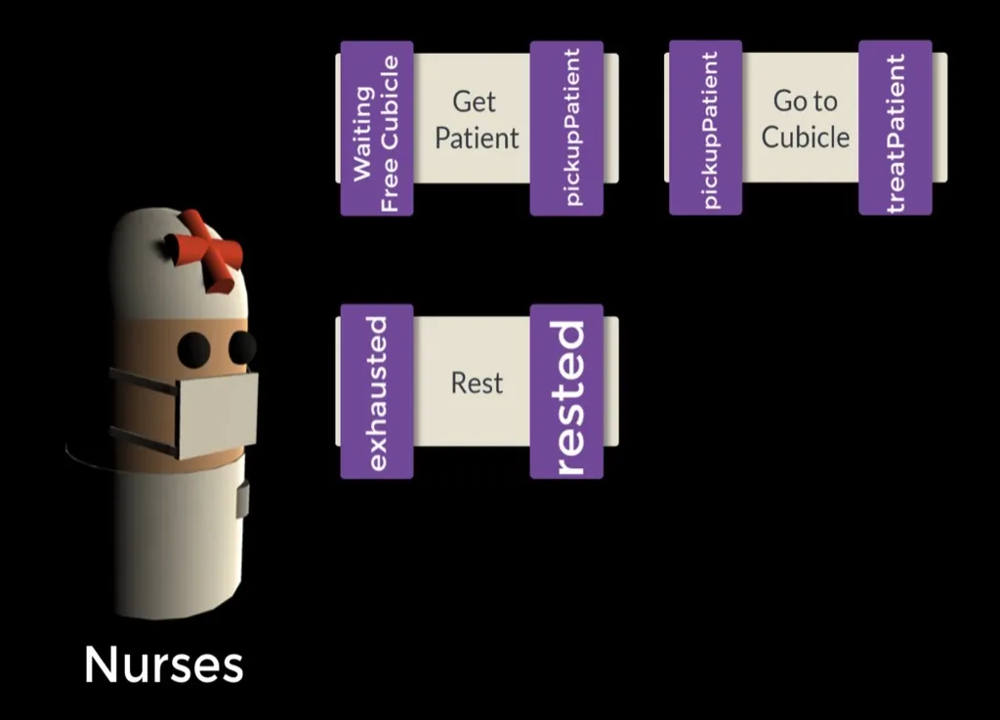

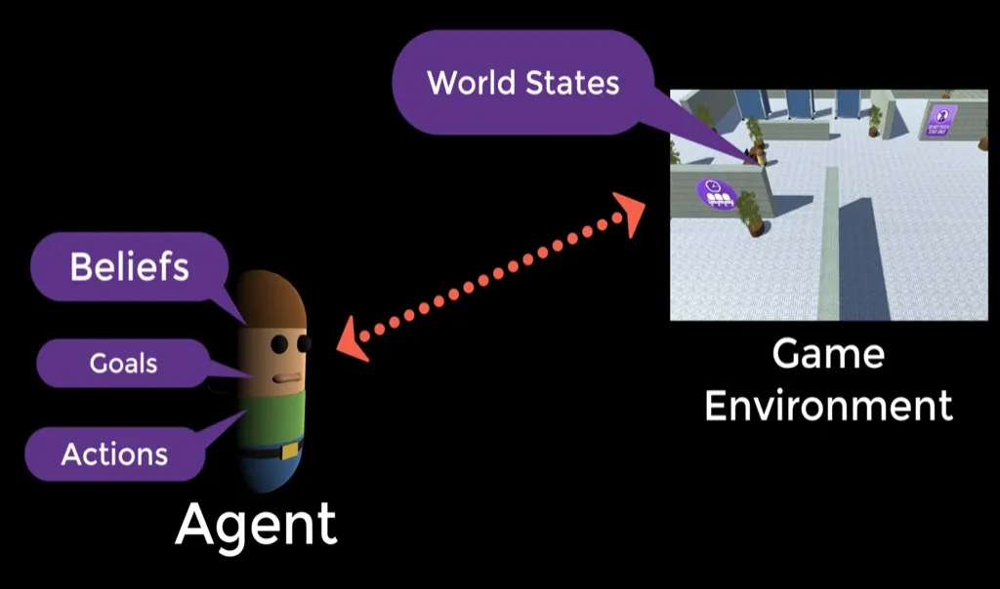

## **Resources**

- [Unity asset SGOAP](https://assetstore.unity.com/packages/tools/ai/s-goap-ai-solution-167167)
- [Unity Learn](https://learn.unity.com/project/goal-driven-behaviour)
- [Udemy course](https://www.udemy.com/course/ai_with_goap/)
- [Unity Labs Behavioral AI Research (2017)](https://www.youtube.com/watch?v=78nhJNPS0vA)

**UNITY AI PLanner** (obsolete)

- [ai.planner docs](https://docs.unity3d.com/Packages/com.unity.ai.planner@0.3/manual/index.html)  
- [ai.planner samples](https://github.com/Unity-Technologies/ai-planner-samples)  
- [ai.planner video](https://www.youtube.com/watch?v=ZdN8dDa0ff4)  
