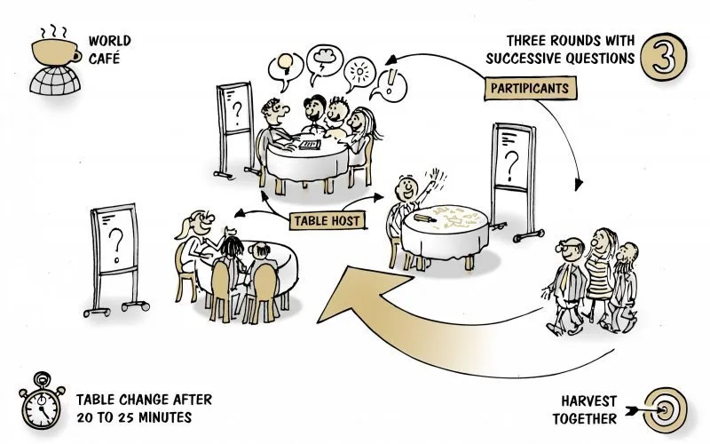

# World Café / Café de la Paz
> un metodo per intavolare conversazioni informali vivaci e costruttive su temi importanti.

Viene ricreata l'ambientazione intima e accogliente di un caffè, con tavolini rotondi adatti ad ospitare ognuno dalle 4 alle 6 persone. I tavolini sono disposti in modo libero in una stanza e sono dotati di materiali per annotare, disegnare, scrivere, in altre parole, per fissare le idee.

L'intero processo può durare da un'ora e mezza a 4 ore. I partecipanti, che devono essere come minimo 12 (fino a raggiungere anche un numero di diverse centinaia), discutono i temi in piccoli gruppi, seduti intorno ai diversi tavoli, per sessioni consecutive. Ogni 20-30 minuti, ad intervalli regolari, i partecipanti ruotano da un tavolo all'altro costituendo così nuovi gruppi.

Presso ogni tavolo rimane un facilitatore, o, per usare la terminologia propria di questa tecnica, un "padrone di casa", i cui compiti sono:

- sollecitare l'intervento di tutti i partecipanti
- registrare la discussione
- sintetizzare la discussione al gruppo successivo in modo da favorire la contaminazione e lo scambio di idee tra un gruppo e l'altro
- presentare eventualmente quanto emerso dai vari gruppi durante la sessione conclusiva

Il processo si conclude con una sessione plenaria in cui agli interventi di restituzione dei facilitatori si aggiungono i commenti dei singoli partecipanti a proposito delle scoperte fatte.

In un World Cafè può essere proposta una sola domanda per stimolare la discussione, oppure una serie di stimoli posti in una successione temporale in modo da permettere ai gruppi di compiere un'ampia esplorazione delle tematiche. Risulta dunque cruciale la scelta delle domande. Queste dovrebbero essere quanto più semplici e chiare, in grado di innescare il dibattito, invitare all'approfondimento e alla ricerca, aprire nuove possibilità e focalizzare l'attenzione su ciò che è utile.

Vantaggi della tecnica:

- E' versatile in quanto può essere proposta da sola, o all'interno di convegni, workshop ed eventi formativi
- Permette di condividere conoscenze e sviluppare idee innovative
- Allarga il processo di dialogo a gruppi di persone anche numerosi
- Oltre allo scambio di idee permette di approfondire le relazioni

Limiti:

-   Necessita di spazi e attrezzature adattate allo scopo
-   Può arrivare a impegnare un elevato numero di facilitatori.

## Principi guida

1. Chiarire il contesto
2. Creare un ambiente di lavoro ospitale
3. Formulare domande importanti
4. Incoraggiare il contributo di tutti
5. Collegare i diversi punti di vista
6. Ascoltare per cogliere intuizioni e riflessioni profonde
7. Raccogliere e condividere i risultati

## Approfondimenti
<https://theworldcafe.com>
